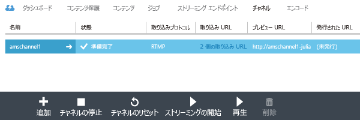
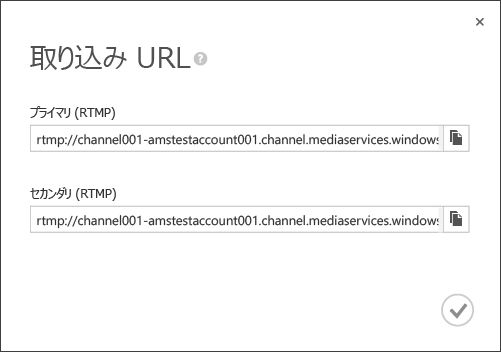
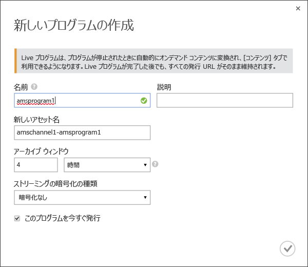
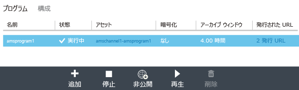
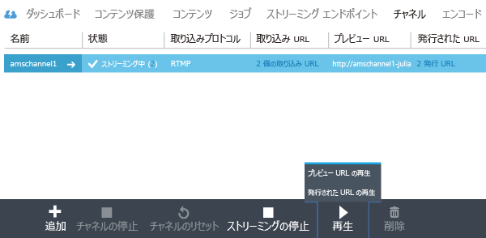
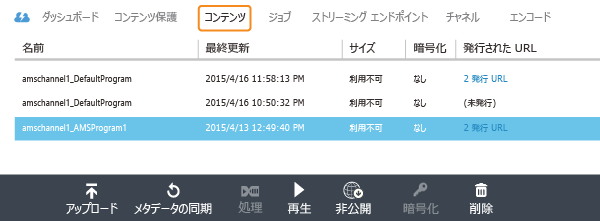

<properties 
	pageTitle="Azure クラシック ポータルを利用し、シングル ビットレートからマルチ ビットレート ストリーミングへの Live Encoding を実行するチャネルを作成する" 
	description="このチュートリアルでは、Azure クラシック ポータルを利用し、シングル ビットレートのライブ ストリームを受信してマルチ ビットレート ストリームにエンコードするチャネルを作成する手順について説明します。" 
	services="media-services" 
	documentationCenter="" 
	authors="juliako,anilmur" 
	manager="dwrede" 
	editor=""/>

<tags 
	ms.service="media-services" 
	ms.workload="media" 
	ms.tgt_pltfrm="na" 
	ms.devlang="na" 
	ms.topic="article" 
	ms.date="02/03/2016"
	ms.author="juliako"/>

#Azure クラシック ポータルを利用し、シングル ビットレートからマルチ ビットレート ストリーミングへのライブ エンコーディングを実行するチャネルを作成する

> [AZURE.SELECTOR]
- [Portal](media-services-portal-creating-live-encoder-enabled-channel.md)
- [.NET](media-services-dotnet-creating-live-encoder-enabled-channel.md)
- [REST API](https://msdn.microsoft.com/library/azure/dn783458.aspx)

このチュートリアルでは、シングル ビットレートのライブ ストリームを受信してマルチ ビットレート ストリームにエンコードする**チャネル**を作成する手順について説明します。

>[AZURE.NOTE]ライブ エンコードが有効になっているチャネルに関連する概念的な情報については、「[シングル ビットレートからアダプティブ ビットレート ストリームへのライブ エンコードを実行するチャネルの作成](media-services-manage-live-encoder-enabled-channels.md)」を参照してください。

##一般的なライブ ストリーミング シナリオ

以下に、一般的なライブ ストリーミング アプリケーションを作成する場合に関係する標準的な手順を示します。

>[AZURE.NOTE] 現在、ライブ イベントの最大推奨時間は 8 時間です。チャネルを長時間実行する必要がある場合は、amslived@microsoft.com にお問い合わせください。

1. ビデオ カメラをコンピューターに接続します。オンプレミスのライブ エンコーダーを起動して構成します。このエンコーダーはシングル ビットレート ストリームを RTMP、スムーズ ストリーミング、RTP (MPEG-TS) のいずれかで出力できます。詳しくは、「[Azure Media Services RTMP サポートおよびライブ エンコーダー](http://go.microsoft.com/fwlink/?LinkId=532824)」をご覧ください。
	
	この手順は、チャネルを作成した後でも実行できます。

1. チャネルを作成し、起動します。

1. チャネルの取り込み URL を取得します。

	取り込み URL は、ライブ エンコーダーがチャネルにストリームを送信する際に使用されます。
1. チャネルのプレビュー URL を取得します。 

	この URL を使用して、チャネルがライブ ストリームを正常に受信できることを確認します。

3. プログラムを作成します (その際、資産も作成します)。
1. プログラムを公開します (関連付けられた資産の OnDemand ロケーターも作成します)。  

	コンテンツをストリームするストリーミング エンドポイントに少なくとも 1 つのストリーミング予約ユニットがあることを確認します。
1. ストリーミングとアーカイブの開始を準備するときにプログラムを開始します。
2. 必要に応じて、ライブ エンコーダーは、広告の開始を信号通知できます。広告が出力ストリームに挿入されます。
1. イベントのストリーミングとアーカイブを停止するときにプログラムを停止します。
1. プログラムを削除し、資産を削除 (オプション) します。   

##このチュートリアルの内容

このチュートリアルでは、Azure クラシック ポータルを使用して、次のタスクを実行します。

2.  ストリーミング エンドポイントを構成します。
3.  ライブ エンコードを実行できるチャネルを作成します。
1.  ライブ エンコーダーに提供する取り込み URL を取得します。ライブ エンコーダーはこの URL を使用して、ストリームをチャネルに取り込みます。
1.  プログラム (および資産) の作成
1.  資産の公開、およびストリーミング URL の取得  
1.  コンテンツの再生 
2.  クリーンアップしています

##前提条件
チュートリアルを完了するには次のものが必要です。

- このチュートリアルを完了するには、Azure アカウントが必要です。アカウントがない場合は、無料試用版のアカウントを数分で作成することができます。詳細については、[Azure の無料試用版サイト](azure.microsoft.com)を参照してください。
- Media Services アカウント。Media Services アカウントを作成するには、「[アカウントの作成](media-services-create-account.md)」を参照してください。
- シングル ビットレートのライブ ストリームを送信できる Web カメラとエンコーダー。

##ストリーミング エンドポイントの構成 (ポータル使用)

クライアントに対するアダプティブ ビットレート ストリーミング配信は、Azure Media Services の代表的な用途の 1 つです。アダプティブ ビットレート ストリーミングでは、現在のネットワーク帯域幅、CPU 使用率などの条件に基づいてビデオが表示されるため、高低のビットレート ストリームの切り替えをクライアント側で行うことができます。Media Services でサポートされるアダプティブ ビットレート ストリーミング テクノロジは、HTTP ライブ ストリーミング (HLS)、スムーズ ストリーミング、MPEG DASH、HDS (Adobe PrimeTime/Access のライセンスが必要) です。

ライブ ストリーミングを使用する場合、オンプレミスのライブ エンコーダー (この例では Wirecast) が、マルチ ビットレートのライブ ストリームをチャネルに取り込みます。ストリームがユーザーによって要求されると、Media Services は動的パッケージ化機能を使用して、ソース ストリームを要求されたアダプティブ ビットレート ストリーム (HLS、DASH、またはスムーズ) に再パッケージ化します。

動的パッケージ化機能を活用するには、コンテンツの配信元となる**ストリーミング エンドポイント**のストリーミング ユニットを 1 つ以上取得する必要があります。

ストリーミング占有ユニットの数を変更するには、以下の手順を実行します。

1. [Azure クラシック ポータル](https://manage.windowsazure.com/)で、**[Media Services]** をクリックします。次に、メディア サービスの名前をクリックします。

2. [ストリーミング エンドポイント] ページを選択します。次に、変更するストリーミング エンドポイントをクリックします。

3. ストリーミング ユニットの数を指定するには、[スケール] タブをクリックし、**[占有容量]** スライダーを動かします。

	![[スケール] ページ](./media/media-services-portal-creating-live-encoder-enabled-channel/media-services-origin-scale.png)

4. [保存] ボタンを押して、変更を保存します。

	新しいユニットの割り当ては完了するまでに約 20 分かかります。

	 
	>[AZURE.NOTE] 現在のところ、ストリーミング ユニットの数を正の値からゼロに戻すと、ストリーミングが最大 1 時間無効になります。
	>
	> コストの計算時には、24 時間の期間内に指定されたユニットの最大数が使用されます。価格設定の詳細については、「[Media Services の価格](http://go.microsoft.com/fwlink/?LinkId=275107)」を参照してください。

 
##チャネルの作成

1.	[Azure クラシック ポータル](http://manage.windowsazure.com/)で、[Media Services] をクリックし、目的の Media Services アカウント名をクリックします。
2.	[チャネル] ページを選択します。
3.	[追加+] を選択し、新しいチャネルを追加します。

エンコードの種類として [**標準**] を選択します。この種類の場合、ライブ エンコードが有効なチャネルが作成されます。つまり、受信シングル ビットレート ストリームはチャネルに送信され、指定のライブ エンコーダー設定によってマルチ ビットレート ストリームにエンコードされます。詳しくは、「[シングル ビットレートからマルチ ビットレート ストリームへのライブ エンコードを実行するチャネルを作成する](media-services-manage-live-encoder-enabled-channels.md)」をご覧ください。

![standard0][standard0]

エンコードの種類 [**標準**] で有効な取り込みプロトコル オプションは、次のとおりです。

- シングル ビットレート Fragmented MP4 (スムーズ ストリーミング)
- シングル ビットレート RTMP
- RTP (MPEG-TS): MPEG-2 Transport Stream over RTP。

各プロトコルの詳しい説明については、「[シングル ビットレートからマルチ ビットレート ストリームへのライブ エンコードを実行するチャネルを作成する](media-services-manage-live-encoder-enabled-channels.md)」をご覧ください。

![standard1][standard1]

チャネルやチャネルに関連付けられたプログラムの実行中は、入力プロトコルを変更できません。別のプロトコルが必要な場合は、入力プロトコルごとに別のチャネルを作成します。

[**広告の構成 (Advertising Configuration)**] ページで、Ad マーカーの信号ソースを指定できます。ポータルを使用する場合に選択できるのは [API] のみです。これは、チャネル内のライブ エンコーダーが Ad マーカー API を非同期的にリッスンすることを示します。ポータルを使用する場合、選択できるのは [API] のみです。

詳しくは、「[シングル ビットレートからマルチ ビットレート ストリームへのライブ エンコードを実行するチャネルを作成する](media-services-manage-live-encoder-enabled-channels.md)」をご覧ください。

![standard2][standard2]

[**プリセット エンコード (Encoding Preset)**] ページで、システム プリセットを選択できます。現時点で選択可能なシステム プリセットは、**既定 720p** のみです。

![standard3][standard3]

[**チャネルの作成 (Channel Creation)**] ページで、このチャネルにビデオを発行できる IP アドレスを定義できます。許可された IP アドレスは、1 つの IP アドレス (例: '10.0.0.1')、IP アドレスと CIDR のサブネットを使用した IP 範囲 (例: ‘10.0.0.1/22’)、または IP アドレスとピリオド区切りのサブネット マスクを使用した IP 範囲 (例: ‘10.0.0.1(255.255.252.0)’) のいずれかの形式で指定できます。

IP アドレスが指定されておらず、規則の定義もない場合は、どの IP アドレスも許可されません。すべての IP アドレスを許可するには、規則を作成し、0.0.0.0/0 に設定します。

![standard4][standard4]

>[AZURE.NOTE] 現時点では、チャネルの開始に最大 30 分ほどかかる場合があります。チャネルのリセットには最大 5 分かかります。

チャネルを作成すると、[**エンコーダー**] タブが選択可能になり、このタブにチャネル構成が表示されます。また、広告とスレートも管理できます。

![standard5][standard5]

詳しくは、「[シングル ビットレートからマルチ ビットレート ストリームへのライブ エンコードを実行するチャネルを作成する](media-services-manage-live-encoder-enabled-channels.md)」をご覧ください。

##取り込み URL の取得

チャネルが作成されると、ライブ エンコーダーに提供する取り込み URL を取得できます。エンコーダーは、これらの URL を使用して、ライブ ストリームを入力します。

##プログラムの作成と管理

###概要

チャネルは、ライブ ストリームのセグメントの発行と保存を管理できるプログラムに関連付けられています。プログラムはチャネルによって管理されます。チャネルとプログラムの関係は、従来のメディアとよく似ています。チャネルが絶えずコンテンツのストリームを配信するのに対し、プログラムは、そのチャネル上で決まった時間に生じるイベントです。

プログラムの**アーカイブ ウィンドウ**の長さを設定することで、録画されたコンテンツの保持時間を指定できます。この値は、最小 5 分から最大 25 時間までの範囲で設定できます。クライアントが現在のライブ位置からさかのぼって検索できる最長時間も、Archive Window (アーカイブ ウィンドウ)の長さによって決まります。プログラムの放送は、指定された期間継続しますが、ArchiveWindowLength を過ぎたコンテンツは絶えず破棄されていきます。さらに、このプロパティの値によって、クライアント マニフェストが肥大した場合の最大サイズも決まります。

各プログラムは資産に関連付けられています。プログラムを公開するには、関連付けられた資産の OnDemand ロケーターを作成する必要があります。このロケーターを作成すると、ストリーミング URL を構築してクライアントに提供できます。

チャネルは、最大 3 つの同時実行プログラムをサポートするため、同じ受信ストリームのアーカイブを複数作成できます。これにより、1 つのイベントのさまざまな部分を必要に応じて発行したりアーカイブしたりできます。たとえば、ビジネス要件によって 1 つのプログラムの 6 時間分をアーカイブする一方、最後の 10 分間のみをブロードキャストする場合があります。これを実現するには、2 つの同時実行プログラムを作成する必要があります。1 つのプログラムは 6 時間分のイベントをアーカイブするように設定しますが、プログラムは発行されません。もう 1 つのプログラムは 10 分間のアーカイブを行うように設定します。このプログラムは発行されます。

新しいイベントには既存のプログラムを再使用できません。代わりに、「ライブ ストリーミング アプリケーションのプログラミング」セクションにあるように、各イベントで新しいプログラムを作成し、起動します。

ストリーミングとアーカイブの開始を準備するときにプログラムを開始します。イベントのストリーミングとアーカイブを停止するときにプログラムを停止します。

アーカイブ済みコンテンツを削除するには、プログラムを停止して削除し、次に関連付けられた資産を削除します。プログラムが資産を使用している場合は資産を削除できません。まずプログラムを削除する必要があります。

プログラムを停止して削除した後も、資産を削除していなければアーカイブ済みコンテンツをオンデマンドでのビデオとしてストリームできます。

アーカイブ済みコンテンツを保持したいが、ストリーミングには使用したくない場合は、ストリーミング ロケーターを削除します。

###プログラムの作成/開始/停止

ストリームがチャネルに流れ始めると、資産、プログラム、およびストリーミング ロケーターを作成することにより、ストリーミング イベントを開始できます。これにより、ストリームがアーカイブされ、ストリーミング エンドポイントを介して視聴者がストリームを使用できるようになります。

イベントを開始するには、次の 2 つの方法があります。

1. [**チャネル**] ページで、[**追加**] をクリックし、新しいプログラムを追加します。

	プログラム名、資産名、アーカイブ ウィンドウ、および暗号化オプションを指定します。
	
	
	
	[**このプログラムを今すぐ発行**] をオンにしたままにすると、URL の発行プログラムが作成されます。
	
	プログラムをストリーミングする準備ができたら、いつでも [**開始**] をクリックできます。

	プログラムを開始すると、[再生] をクリックして、コンテンツの再生を開始できます。

	

2. この方法の代わりに、ショートカットを使用して、[**チャネル**] ページの [**ストリーミングの開始**] ボタンをクリックすることもできます。これにより、資産、プログラム、およびストリーミング ロケーターが作成されます。

	プログラム名は「DefaultProgram」となり、アーカイブ ウィンドウは 1 時間に設定されます。

	[チャネル] ページから、発行されたプログラムを再生できます。

	

[**チャネル**] ページで [**ストリーミングの停止**] をクリックすると、既定のプログラムが停止し、削除されます。資産は保持されており、[**コンテンツ**] ページから発行もしくは発行の取り消しができます。

[**コンテンツ**] ページに切り替えると、プログラム用に作成したアセットが表示されます。

##コンテンツの再生

コンテンツをストリーミングするために使用する URL をユーザーに提供するには、ロケーターを作成することにより、前のセクションで説明した方法で最初に資産を「発行」する必要があります (ポータルを使用して資産を発行すると、ロケーターが作成されます)。資産に含まれているファイルには、ロケーターを通じてアクセスできます。

コンテンツの再生に使用するストリーミング プロトコルによっては、チャネルまたはプログラムの [**URL の発行**] リンクから取得する URL の変更が必要になる場合があります。

動的パッケージ化機能により、ライブ ストリームは指定されたプロトコルにパッケージ化されます。

既定で、ストリーミング URL には次の形式があり、スムーズ ストリーミング資産の再生に使用できます。

	{streaming endpoint name-media services account name}.streaming.mediaservices.windows.net/{locator ID}/{filename}.ism/Manifest

HLS ストリーミング URL を作成するには、(format=m3u8-aapl) を URL に追加します。

	{streaming endpoint name-media services account name}.streaming.mediaservices.windows.net/{locator ID}/{filename}.ism/Manifest(format=m3u8-aapl)

MPEG DASH ストリーミング URL を作成するには、(format=mpd-time-csf) を URL に追加します。

	{streaming endpoint name-media services account name}.streaming.mediaservices.windows.net/{locator ID}/{filename}.ism/Manifest(format=mpd-time-csf)

コンテンツの配信に関する詳細は、「[コンテンツを配信する](media-services-deliver-content-overview.md)」を参照してください。

[AMS Player](http://amsplayer.azurewebsites.net/azuremediaplayer.html) を使用してスムーズ ストリームを再生することも、iOS および Android デバイスを使用して HLS バージョン 3 を再生することもできます。

##クリーンアップ

ストリーミング イベントが完了し、以前にプロビジョニングされたリソースをクリーンアップする場合は、次の手順に従います。

- エンコーダーからのストリームのプッシュを停止します。
- チャネルを停止します。チャネルが停止すると、いかなる課金も発生しません。もう一度開始する必要がある場合、取り込み URL は同一になるため、エンコーダーを再構成する必要はありません。
- ライブ イベントのアーカイブをオンデマンド ストリームとして提供し続けるのでない限り、ストリーミング エンドポイントを停止できます。チャネルが停止状態の場合は、いかなる課金も発生しません。
  

##考慮事項

- 現在、ライブ イベントの最大推奨時間は 8 時間です。チャネルを長時間実行する必要がある場合は、amslived@microsoft.com にお問い合わせください。
- コンテンツをストリームするストリーミング エンドポイントに少なくとも 1 つのストリーミング予約ユニットがあることを確認します。

##Media Services のラーニング パス

[AZURE.INCLUDE [media-services-learning-paths-include](../../includes/media-services-learning-paths-include.md)]

##フィードバックの提供

[AZURE.INCLUDE [media-services-user-voice-include](../../includes/media-services-user-voice-include.md)]

[standard0]: ./media/media-services-portal-creating-live-encoder-enabled-channel/media-services-create-channel-standard0.png
[standard1]: ./media/media-services-portal-creating-live-encoder-enabled-channel/media-services-create-channel-standard1.png
[standard2]: ./media/media-services-portal-creating-live-encoder-enabled-channel/media-services-create-channel-standard2.png
[standard3]: ./media/media-services-portal-creating-live-encoder-enabled-channel/media-services-create-channel-standard3.png
[standard4]: ./media/media-services-portal-creating-live-encoder-enabled-channel/media-services-create-channel-standard4.png
[standard5]: ./media/media-services-portal-creating-live-encoder-enabled-channel/media-services-create-channel-standard_encode.png

<!---HONumber=AcomDC_0211_2016-->