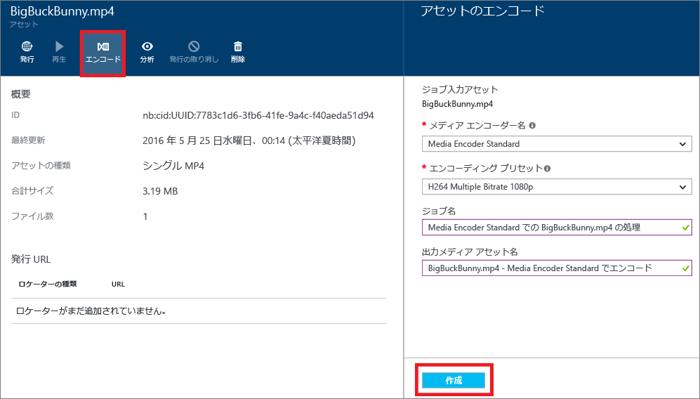

# Azure ポータルで Media Encoder Standard を使用した資産のエンコード
> [!NOTE]
> このチュートリアルを完了するには、Azure アカウントが必要です。 詳細については、 [Azure の無料試用版サイト](https://azure.microsoft.com/pricing/free-trial/)を参照してください。 
> 
> 

クライアントに対するアダプティブ ビットレート ストリーミング配信は、Azure Media Services の代表的な用途の&1; つです。 Media Services でサポートされるアダプティブ ビットレート ストリーミング テクノロジは、HTTP ライブ ストリーミング (HLS)、Smooth Streaming、および MPEG DASH です。 アダプティブ ビットレート ストリーミング用にビデオを準備するには、ソース ビデオをマルチビットレートのファイルにエンコードする必要があります。 ビデオのエンコードには **Media Encoder Standard** エンコーダーを使用する必要があります。  

また、Media Services にはダイナミック パッケージ機能があり、マルチビットレート MP4 でエンコードされたコンテンツを、MPEG DASH、HLS、Smooth Streaming のストリーミング形式でそのまま配信できます。つまり、これらのストリーミング形式に再度パッケージ化する必要がありません。 動的パッケージ化機能を使用した場合、保存と課金の対象となるのは、単一のストレージ形式のファイルのみです。Media Services がクライアントからの要求に応じて適切な応答を構築して返します。

ダイナミック パッケージを活用するには、ソース ファイルを一連のマルチビットレート MP4 ファイルにエンコードする必要があります (エンコードの手順はこのセクションで後ほど説明します)。

メディア処理をスケール調整する場合は、 [こちら](media-services-portal-scale-media-processing.md) のトピックをご覧ください。

## Azure ポータルでのエンコード
ここでは、Media Encoder Standard でコンテンツをエンコードする手順について説明します。

1. [Azure Portal](https://portal.azure.com/) で Azure Media Services アカウントを選択します。
2. **[設定]** ウィンドウで、**[資産]** を選択します。  
3. **[資産]** ウィンドウで、エンコードする資産を選択します。
4. **[エンコード]** ボタンをクリックします。
5. **[資産のエンコード]** ウィンドウで、"Media Encoder Standard" プロセッサとプリセットを選択します。 たとえば、入力ビデオの解像度が 1920 x 1080 ピクセルであるとわかっている場合は、"H264 Multiple Bitrate 1080p" のプリセットを使用できます。 プリセットについて詳しくは、[こちら](media-services-mes-presets-overview.md)の記事をご覧ください。重要なのは、入力ビデオに最適なプリセットを選択することです。 低解像度 (640 x 360) のビデオの場合は、既定の "H264 Multiple Bitrate 1080p" のプリセットは使用しないでください。
   
   出力資産とジョブの名前を編集するオプションを利用すると、効率よく管理を行えます。
   
   
6. **[作成]**をクリックします。

## 次のステップ
[こちら](media-services-portal-check-job-progress.md) の記事で説明するように、Azure ポータルを使用してエンコード ジョブの進行状況を監視できます。  

## Media Services のラーニング パス
[!INCLUDE [media-services-learning-paths-include](../../includes/media-services-learning-paths-include.md)]

## フィードバックの提供
[!INCLUDE [media-services-user-voice-include](../../includes/media-services-user-voice-include.md)]

