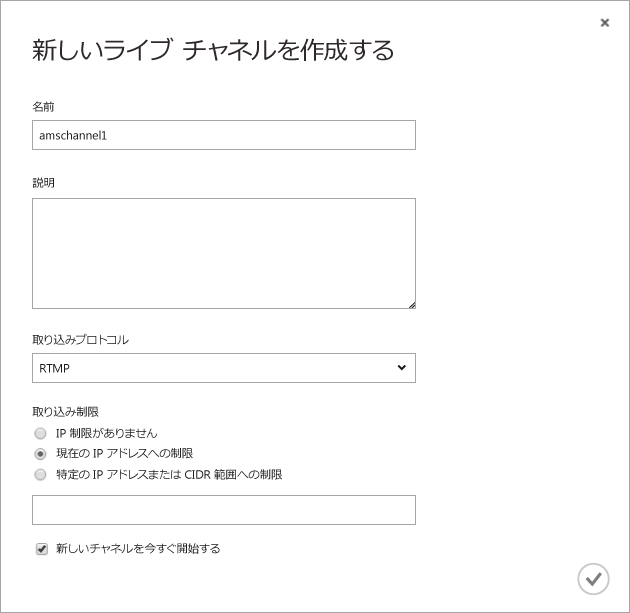
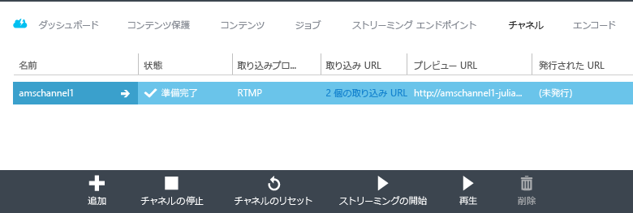
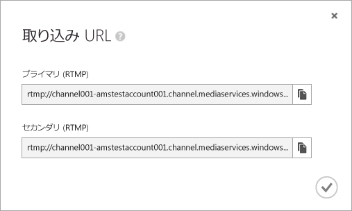
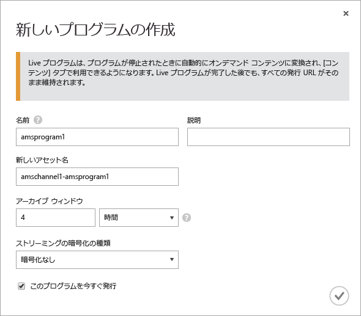
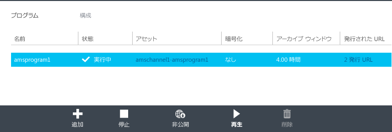
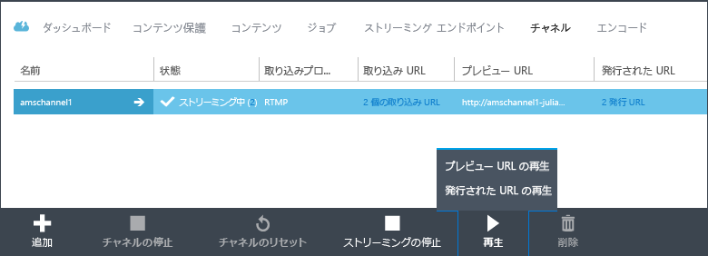
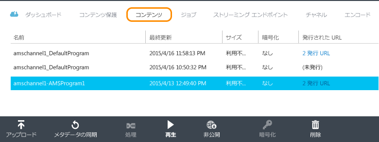

<properties
	pageTitle="Azure クラシック ポータルを使用してオンプレミスのエンコーダーからマルチ ビットレートのライブ ストリームを受信するチャネルを作成する | Microsoft Azure"
	description="このチュートリアルでは、チャネルがオンプレミスのライブ エンコーダーからマルチ ビットレートのライブ ストリームを受信する基本的な Media Services のライブ ストリーミング アプリケーションを実装する手順について説明します。"
	services="media-services"
	documentationCenter=""
	authors="Juliako,cenkdin"
	manager="erikre"
	editor=""/>

<tags
	ms.service="media-services"
	ms.workload="media"
	ms.tgt_pltfrm="na"
	ms.devlang="ne"
	ms.topic="article"
	ms.date="06/22/2016" 
	ms.author="juliako"/>

# Azure クラシック ポータルを使用してオンプレミスのエンコーダーからマルチ ビットレートのライブ ストリームを受信するチャネルを作成する

[AZURE.INCLUDE [media-services-selector-manage-channels](../../includes/media-services-selector-manage-channels.md)]

このチュートリアルでは、チャネルがオンプレミスのライブ エンコーダーからマルチ ビットレートのライブ ストリームを受信する基本的な Media Services のライブ ストリーミング アプリケーションを実装する手順について説明します。チャネルと関連コンポーネントの操作に関する詳細は、「[オンプレミスのエンコーダーからマルチ ビットレート ライブ ストリームを受信するチャネルを操作する](media-services-live-streaming-with-onprem-encoders.md)」を参照してください。

このチュートリアルでは、Azure クラシック ポータルを使用して、次のタスクを実行します。

2.  ストリーミング エンドポイントを構成します。
3.  チャネルを作成します。
1.  ライブ エンコーダーを作成し、チャネルにライブ ストリームを取り込みます (この手順で Wirecast を使用します)。
1.  プログラム (およびアセット) を作成します。
1.  アセットを公開し、ストリーミング URL を取得します。
1.  コンテンツの再生
2.  クリーンアップします。

## 前提条件
チュートリアルを完了するには次のものが必要です。

- このチュートリアルを完了するには、Azure アカウントが必要です。詳細については、[Azure の無料試用版サイト](/pricing/free-trial/?WT.mc_id=A261C142F)を参照してください。
- Media Services アカウント。Media Services アカウントを作成するには、「[アカウントの作成](media-services-create-account.md)」を参照してください。
- マルチ ビットレートのライブ ストリームを送信できる Web カメラとエンコーダー。

## Azure クラシック ポータルを使用したストリーミング エンドポイントの構成

クライアントに対するアダプティブ ビットレート ストリーミング配信は、Azure Media Services の代表的な用途の 1 つです。アダプティブ ビットレート ストリーミングでは、現在のネットワーク帯域幅、CPU 使用率などの条件に基づいてビデオが表示されるため、高低のビットレート ストリームの切り替えをクライアント側で行うことができます。Media Services でサポートされるアダプティブ ビットレート ストリーミング テクノロジは、HTTP ライブ ストリーミング (HLS)、スムーズ ストリーミング、MPEG DASH、HDS (Adobe PrimeTime/Access のライセンスが必要) です。

ライブ ストリーミングを使用する場合、オンプレミスのライブ エンコーダー (この例では Wirecast) が、マルチ ビットレートのライブ ストリームをチャネルに取り込みます。ストリームがユーザーによって要求されると、Media Services は動的パッケージ化機能を使用して、ソース ストリームを要求されたアダプティブ ビットレート ストリーム (HLS、DASH、またはスムーズ) に再パッケージ化します。

動的パッケージ化機能を活用するには、コンテンツの配信元となる*ストリーミング エンドポイント*のストリーミング ユニットを 1 つ以上取得する必要があります。

ストリーミング占有ユニットの数を変更するには、以下の手順を実行します。

1. [Azure クラシック ポータル](https://manage.windowsazure.com/)で、**[Media Services]** をクリックします。次に、メディア サービスの名前をクリックします。

2. [**ストリーミング エンドポイント**] ページを選択します。次に、変更するストリーミング エンドポイントをクリックします。

3. ストリーミング ユニットの数を指定するには、**[スケール]** タブを選択し、占有容量スライダーを動かします。

![[スケール] ページ](./media/media-services-portal-get-started-with-live/media-services-origin-scale.png)

4. **[保存]** をクリックして、変更を保存します。

新しいユニットの割り当ては完了するまでに約 20 分かかります。

>[AZURE.NOTE] 現在のところ、ストリーミング ユニットの数を正の値からゼロに戻すと、ストリーミングが最大 1 時間無効になります。
>
> コストの計算時には、24 時間の期間内に指定されたユニットの最大数が使用されます。料金設定の詳細については、「[Media Services の価格](http://go.microsoft.com/fwlink/?LinkId=275107)」を参照してください。

## チャネルの作成

Azure クラシック ポータルで、**[チャネル]** ページを選択します。次に、**[新規]** をクリックします。**[新しいライブ チャネルを作成する]** ページで、チャネルの名前を入力します。

ページの右下隅にあるチェック マークをクリックして、更新を保存します。

数分でチャネルが作成され開始します。

## 取り込み URL の取得

チャネルが作成されると、ライブ エンコーダーに提供する取り込み URL を取得できます。エンコーダーは、これらの URL を使用して、ライブ ストリームを入力します。

取り込み URL に関する詳細は、「[オンプレミスのエンコーダーを使用して、マルチ ビットレートのライブ ストリームをチャネルに送信する](media-services-live-streaming-with-onprem-encoders.md)」を参照してください。

## ライブ エンコーダーの構成、およびライブ ストリームの取り込み

>[AZURE.NOTE] この手順には、前の手順に記載されているチャネルの取り込み URL が必要です。

Wirecast の構成方法、およびストリームの取り込み開始方法に関する詳細は、「[Wirecast の構成](https://azure.microsoft.com/blog/2014/09/18/azure-media-services-rtmp-support-and-live-encoders/)」を参照してください。

>[AZURE.NOTE] 何らかの理由でエンコーダーを停止してから再起動する必要がある場合、最初に Azure クラシック ポータルの **[リセット]** コマンドをクリックしてチャネルをリセットする必要があります。

## プログラムの作成と管理

### 概要

チャネルは、ライブ ストリームのセグメントの発行と保存を管理できるプログラムに関連付けられています。プログラムはチャネルによって管理されます。チャネルとプログラムの関係は、従来のメディアとよく似ています。チャネルが絶えずコンテンツのストリームを配信するのに対し、プログラムは、そのチャネル上で決まった時間に生じるイベントです。

プログラムの**アーカイブ ウィンドウ**の長さを設定することで、録画されたコンテンツの保持時間を指定できます。この値は、最小 5 分から最大 25 時間までの範囲で設定できます。クライアントが現在のライブ位置からさかのぼって検索できる最長時間も、Archive Window (アーカイブ ウィンドウ)の長さによって決まります。プログラムの放送は、指定された期間継続しますが、ArchiveWindowLength を過ぎたコンテンツは絶えず破棄されていきます。さらに、このプロパティの値によって、クライアント マニフェストが肥大した場合の最大サイズも決まります。

各プログラムはアセットに関連付けられています。プログラムを公開するには、関連付けられたアセットの OnDemand ロケーターを作成する必要があります。このロケーターを作成すると、ストリーミング URL を構築してクライアントに提供できます。

チャネルは、最大 3 つの同時実行プログラムをサポートするため、同じ受信ストリームのアーカイブを複数作成できます。これにより、1 つのイベントのさまざまな部分を必要に応じて発行したりアーカイブしたりできます。たとえば、ビジネス要件によって 1 つのプログラムの 6 時間分をアーカイブする一方、最後の 10 分間のみをブロードキャストする場合があります。これを実現するには、2 つの同時実行プログラムを作成する必要があります。1 つのプログラムは 6 時間分のイベントをアーカイブするように設定しますが、プログラムは発行されません。もう 1 つのプログラムは 10 分間のアーカイブを行うように設定します。このプログラムは発行されます。

新しいイベントには既存のプログラムを再使用できません。代わりに、イベントごとに新しいプログラムを作成し、起動します。

ストリーミングとアーカイブの開始を準備するときにプログラムを開始します。イベントのストリーミングとアーカイブを停止するときにプログラムを停止します。

アーカイブ済みコンテンツを削除するには、プログラムを停止して削除し、次に関連付けられた資産を削除します。プログラムが資産を使用している場合は資産を削除できません。まずプログラムを削除する必要があります。

プログラムを停止して削除した後も、資産を削除していなければアーカイブ済みコンテンツをオンデマンドでのビデオとしてストリームできます。

アーカイブ済みコンテンツを保持したいが、ストリーミングには使用したくない場合は、ストリーミング ロケーターを削除します。

### プログラムの作成、開始、および停止

ストリームがチャネルに流れ始めると、アセット、プログラム、およびストリーミング ロケーターを作成することにより、ストリーミング イベントを開始できます。これにより、ストリームがアーカイブされ、ストリーミング エンドポイントを介して視聴者がストリームを使用できるようになります。

イベントを開始するには、次の 2 つの方法があります。

1. **[チャネル]** ページで、**[追加]** をクリックし、新しいプログラムを追加します。

**[新しいプログラムを作成する]** ページで、プログラム名、アセット名、アーカイブ ウィンドウ、および暗号化オプションを指定します。

**[このプログラムを今すぐ発行]** をオンにすると、発行 URL が作成されます。

プログラムをストリーミングする準備ができたら、いつでも **[開始]** をクリックできます。

プログラムを開始すると、**[再生]** をクリックして、コンテンツの再生を開始できます。

2. この方法の代わりに、ショートカットを使用して、**[チャネル]** ページの **[ストリーミングの開始]** ボタンをクリックすることもできます。これにより、アセット、プログラム、およびストリーミング ロケーターが作成されます。

プログラム名は「DefaultProgram」となり、アーカイブ ウィンドウは 1 時間に設定されます。

**[チャネル]** ページから、発行されたプログラムを再生できます。

**[チャネル]** ページで **[ストリーミングの停止]** をクリックすると、既定のプログラムが停止し、削除されます。アセットは保持されており、[**コンテンツ**] ページから発行もしくは発行の取り消しができます。

[**コンテンツ**] ページに切り替えると、プログラム用に作成したアセットが表示されます。

## コンテンツの再生

コンテンツをストリーミングするために使用できる URL をユーザーに提供するには、ロケーターを作成することにより、前のセクションで説明した方法で最初にアセットを*発行*する必要があります (Azure クラシック ポータルを使用してアセットを発行すると、ロケーターが作成されます)。資産に含まれているファイルには、ロケーターを通じてアクセスできます。

コンテンツの再生に使用するストリーミング プロトコルによっては、チャネルまたはプログラムの [**URL の発行**] リンクから取得する URL の変更が必要になる場合があります。

動的パッケージ化機能により、ライブ ストリームは指定されたプロトコルにパッケージ化されます。

既定で、ストリーミング URL には次の形式があり、スムーズ ストリーミング アセットの再生に使用できます。

{ストリーミング エンドポイント名-Media Services アカウント名}.streaming.mediaservices.windows.net/{ロケーター ID}/{ファイル名}.ism/Manifest

HLS ストリーミング URL を作成するには、(format=m3u8-aapl) を URL に追加します。

{ストリーミング エンドポイント名-Media Services アカウント名}.streaming.mediaservices.windows.net/{ロケーター ID}/{ファイル名}.ism/Manifest(format=m3u8-aapl)

MPEG DASH ストリーミング URL を作成するには、(format=mpd-time-csf) を URL に追加します。

{ストリーミング エンドポイント名-Media Services アカウント名}.streaming.mediaservices.windows.net/{ロケーター ID}/{ファイル名}.ism/Manifest(format=mpd-time-csf)

コンテンツの配信に関する詳細は、「[コンテンツを配信する](media-services-deliver-content-overview.md)」を参照してください。

[AMS Player](http://amsplayer.azurewebsites.net/azuremediaplayer.html) を使用してスムーズ ストリームを再生することも、iOS および Android デバイスを使用して HLS バージョン 3 を再生することもできます。

## クリーンアップ

ストリーミング イベントが完了し、以前にプロビジョニングされたリソースをクリーンアップする場合は、次の手順を使用します。

- エンコーダーからのストリームのプッシュを停止します。
- チャネルを停止します。チャネルが停止すると、いかなる課金も発生しません。もう一度開始する必要がある場合、取り込み URL は同一になるため、エンコーダーを再構成する必要はありません。
- ライブ イベントのアーカイブをオンデマンド ストリームとして提供し続けるのでない限り、ストリーミング エンドポイントを停止できます。チャネルが停止状態の場合は、いかなる課金も発生しません。

##次のステップ: Media Services のラーニング パス

[AZURE.INCLUDE [media-services-learning-paths-include](../../includes/media-services-learning-paths-include.md)]

##フィードバックの提供

[AZURE.INCLUDE [media-services-user-voice-include](../../includes/media-services-user-voice-include.md)]

### 他の情報をお探しですか。

このトピックに必要な情報が含まれていないか、不足しているか、あるいはニーズを満たしていない場合は、以下の Disqus スレッドを使用してフィードバックをお送りください。

## その他のリソース
- [Microsoft Azure クラシック ポータルを使用したライブ ストリーミングの開始](https://azure.microsoft.com/blog/getting-started-with-live-streaming-using-the-azure-management-portal/)

<!-- URLs. -->
[Azure Classic Portal]: http://manage.windowsazure.com/

<!-- Images -->

<!---HONumber=AcomDC_0629_2016-->