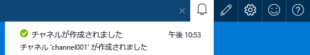
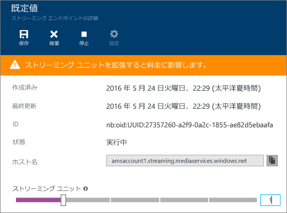
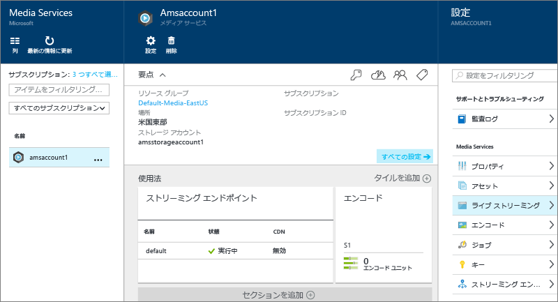
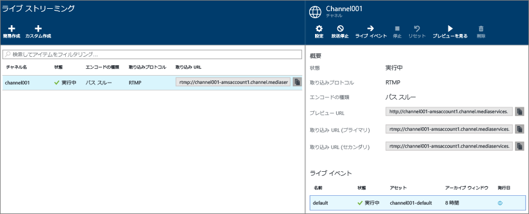
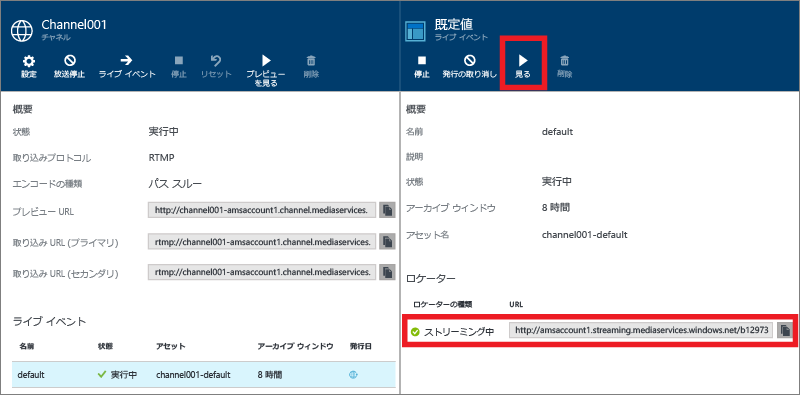
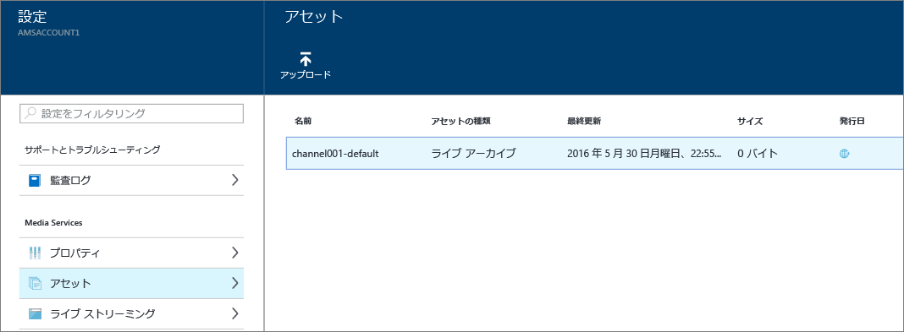

<properties 
	pageTitle="Azure ポータルを使用してオンプレミス エンコーダーでライブ ストリーミングを実行する方法 | Microsoft Azure" 
	description="このチュートリアルでは、パススルー配信用に構成されたチャネルを作成する手順を紹介します。" 
	services="media-services" 
	documentationCenter="" 
	authors="juliako" 
	manager="erikre" 
	editor=""/>

<tags 
	ms.service="media-services" 
	ms.workload="media" 
	ms.tgt_pltfrm="na" 
	ms.devlang="na" 
	ms.topic="get-started-article"
	ms.date="06/22/2016" 
	ms.author="juliako"/>

#Azure ポータルを使用してオンプレミス エンコーダーでライブ ストリーミングを実行する方法

このチュートリアルでは、Azure ポータルを使用して、パススルー配信用に構成された**チャネル**を作成する手順を紹介します。

Azure ポータルの Azure Media Services は現在、プレビュー版です。

##前提条件

チュートリアルを完了するには次のものが必要です。

- Azure アカウント。詳細については、[Azure の無料試用版サイト](https://azure.microsoft.com/pricing/free-trial/)を参照してください。
- Media Services アカウント。Media Services アカウントを作成するには、「[Media Services アカウントの作成方法](media-services-create-account.md)」を参照してください。
- Web カメラ。たとえば、 [Telestream Wirecast エンコーダー](http://www.telestream.net/wirecast/overview.htm)。

次の記事の確認を強くお勧めします。

- [Azure Media Services RTMP サポートおよびライブ エンコーダー](https://azure.microsoft.com/blog/2014/09/18/azure-media-services-rtmp-support-and-live-encoders/)
- [Azure Media Services を使用したライブ ストリーミングの概要](media-services-manage-channels-overview.md)
- [オンプレミスのエンコーダーからマルチ ビットレートのライブ ストリームを受信するチャネルを操作する](media-services-live-streaming-with-onprem-encoders.md)

##一般的なライブ ストリーミング シナリオ

次の手順では、パススルー配信用に構成されたチャネルを使用する、一般的なライブ ストリーミング アプリケーションの作成に関連するタスクについて説明します。このチュートリアルでは、パススルー チャネルとライブ イベントを作成、管理する方法について説明します。

1. ビデオ カメラをコンピューターに接続します。マルチビットレート RTMP またはフラグメント化 MP4 ストリームを出力するオンプレミスのライブ エンコーダーを起動して構成します。詳しくは、「[Azure Media Services RTMP サポートおよびライブ エンコーダー](http://go.microsoft.com/fwlink/?LinkId=532824)」をご覧ください。
	
	この手順は、チャネルを作成した後でも実行できます。

1. パススルー チャネルを作成し、開始します。
1. チャネルの取り込み URL を取得します。

	取り込み URL は、ライブ エンコーダーがチャネルにストリームを送信する際に使用されます。
1. チャネルのプレビュー URL を取得します。

	この URL を使用して、チャネルがライブ ストリームを正常に受信できることを確認します。

3. ライブ イベントまたはライブ プログラムを作成します。

	Azure ポータルを使用する場合、ライブ イベントを作成すると資産も作成されます。
	  
	>[AZURE.NOTE]コンテンツをストリームするストリーミング エンドポイントに少なくとも 1 つのストリーミング予約ユニットがあることを確認します。
1. ストリーミングとアーカイブを開始する準備ができたら、イベントまたはプログラムを開始します。
2. 必要に応じて、ライブ エンコーダーは、広告の開始を信号通知できます。広告が出力ストリームに挿入されます。
1. イベントのストリーミングとアーカイブを停止するには、任意のタイミングでイベントまたはプログラムを停止します。
1. イベントまたはプログラムを削除し、必要に応じて資産も削除します。

>[AZURE.IMPORTANT] オンプレミスのエンコーダーとパススルー チャネルを使用したライブ ストリーミングに関する概念と考慮事項については、「[オンプレミスのエンコーダーからマルチ ビットレートのライブ ストリームを受信するチャネルを操作する](media-services-live-streaming-with-onprem-encoders.md)」を参照してください。

##通知とエラーを表示するには

Azure ポータルからの通知とエラーを表示するには、通知アイコンをクリックします。

##ストリーミング エンドポイントの構成 

Media Services には動的パッケージ化機能があり、マルチビットレート MP4 でエンコードされたコンテンツを、MPEG DASH、HLS、スムーズ ストリーミング、HDS のストリーミング形式でそのまま配信することができます。つまり、これらのストリーミング形式に再度パッケージ化する必要がありません。動的パッケージ化機能を使用した場合、保存と課金の対象となるのは、単一のストレージ形式のファイルのみです。Media Services がクライアントからの要求に応じて適切な応答を構築して返します。

動的パッケージ化機能を活用するには、コンテンツの配信元となるストリーミング エンドポイントのストリーミング ユニットを 1 つ以上取得する必要があります。

ストリーミング予約ユニットを作成したり、数を変更したりするには、以下の手順を実行します。

1. **[設定]** ウィンドウで **[ストリーミング エンドポイント]** をクリックします。

2. 既定のストリーミング エンドポイントをクリックします。

	**[DEFAULT STREAMING ENDPOINT DETAILS (既定のストリーミング エンドポイントの詳細)]** ウィンドウが表示されます。

3. ストリーミング ユニットの数を指定するには、**[ストリーミング ユニット]** のスライダーを動かします。

	

4. **[保存]** をクリックして、変更を保存します。

	>[AZURE.NOTE]新しいユニットの割り当てが完了するまでに最大 20 分かかる場合があります。
	
##パススルー チャネルとイベントの作成と開始

チャネルは、ライブ ストリームのセグメントの発行と保存を管理できるイベントまたはプログラムに関連付けられています。イベントはチャネルによって管理されます。
	
プログラムの**アーカイブ ウィンドウ**の長さを設定することで、録画されたコンテンツの保持時間を指定できます。この値は、最小 5 分から最大 25 時間までの範囲で設定できます。クライアントが現在のライブ位置からさかのぼって検索できる最長時間も、Archive Window (アーカイブ ウィンドウ)の長さによって決まります。イベントは、指定された時間の長さまでは放送できますが、アーカイブ ウィンドウの長さを過ぎたコンテンツは絶えず破棄されていきます。さらに、このプロパティの値によって、クライアント マニフェストが肥大した場合の最大サイズも決まります。

各イベントは資産に関連付けられています。イベントを発行するには、関連付けられた資産の OnDemand ロケーターを作成する必要があります。このロケーターを作成すると、ストリーミング URL を構築してクライアントに提供できます。

チャネルは、最大 3 つの同時実行イベントをサポートするので、同じ受信ストリームのアーカイブを複数作成できます。これにより、1 つのイベントのさまざまな部分を必要に応じて発行したりアーカイブしたりできます。たとえば、ビジネス要件によって 1 つのプログラムの 6 時間分をアーカイブする一方、最後の 10 分間のみをブロードキャストする場合があります。これを実現するには、2 つの同時実行プログラムを作成する必要があります。1 つのプログラムは 6 時間分のイベントをアーカイブするように設定しますが、プログラムは発行されません。もう 1 つのプログラムは 10 分間のアーカイブを行うように設定します。このプログラムは発行されます。

既存のライブ イベントの再利用はしないでください。代わりに、イベントごとに新しいイベントを作成し、開始します。

ストリーミングとアーカイブを開始する準備ができたら、イベントを開始します。イベントのストリーミングとアーカイブを停止するときにプログラムを停止します。

アーカイブ済みコンテンツを削除するには、イベントを停止して削除したうえで、関連付けられた資産を削除します。イベントが資産を使用している場合は資産を削除できません。まずイベントを削除する必要があります。

イベントを停止して削除した後も、資産を削除していなければ、アーカイブ済みコンテンツをオンデマンドでのビデオとしてストリーミングできます。

アーカイブ済みコンテンツを保持したいが、ストリーミングには使用したくない場合は、ストリーミング ロケーターを削除します。

###ポータルを使用してチャネルを作成するには 

このセクションでは、**簡易作成**オプションを使用してパススルー チャネルを作成する方法について説明します。

パススルー チャネルの詳細については、「[オンプレミスのエンコーダーからマルチ ビットレートのライブ ストリームを受信するチャネルを操作する](media-services-live-streaming-with-onprem-encoders.md)」を参照してください。

1. **[設定]** ウィンドウで、**[Live streaming (ライブ ストリーミング)]**をクリックします。

	
	
	**[Live streaming (ライブ ストリーミング)]** ウィンドウが表示されます。

3. **[簡易作成]** をクリックして、RTMP 取り込みプロトコルを備えたパススルー チャネルを作成します。

	**[CREATE A NEW CHANNEL (新しいチャネルの作成)]** ウィンドウが表示されます。
4. 新しいチャネルに名前を付け、**[作成]** をクリックします。

	これで、RTMP 取り込みプロトコルを備えたパススルー チャネルが作成されます。

	このチャネルでは、既定のライブ イベントまたはライブ プログラムの追加、開始、発行も行われます。このイベントは、アーカイブ ウィンドウが 8 時間に設定されています。

	さらにイベントを追加するには、**[ライブ イベント]** ボタンをクリックします。

##取り込み URL の取得

チャネルが作成されると、ライブ エンコーダーに提供する取り込み URL を取得できます。エンコーダーは、これらの URL を使用して、ライブ ストリームを入力します。

##イベントを視聴する

イベントを視聴するには、Azure ポータルで **[Watch (視聴)]** をクリックするか、ストリーミング URL をコピーして任意のプレーヤーを使用します。
 

ライブ イベントは、停止すると自動的にオンデマンド コンテンツに変換されます。

##クリーンアップ

パススルー チャネルの詳細については、「[オンプレミスのエンコーダーからマルチ ビットレートのライブ ストリームを受信するチャネルを操作する](media-services-live-streaming-with-onprem-encoders.md)」を参照してください。

- チャネルを停止できるのは、チャネルのすべてのイベントまたはプログラムが停止している場合のみです。チャネルが停止すると、いかなる課金も発生しません。もう一度開始する必要がある場合、取り込み URL は同一になるため、エンコーダーを再構成する必要はありません。
- チャネルを削除できるのは、チャネルのすべてのライブ イベントが削除されている場合のみです。

##アーカイブ済みコンテンツを視聴する

イベントを停止して削除した後も、資産を削除していなければ、アーカイブ済みコンテンツをオンデマンドでのビデオとしてストリーミングできます。イベントが資産を使用している場合は資産を削除できません。まずイベントを削除する必要があります。

資産を管理するには、**[設定]** を選択し、**[資産]** をクリックします。

##Media Services のラーニング パス

[AZURE.INCLUDE [media-services-learning-paths-include](../../includes/media-services-learning-paths-include.md)]

##フィードバックの提供

[AZURE.INCLUDE [media-services-user-voice-include](../../includes/media-services-user-voice-include.md)]

<!---HONumber=AcomDC_0629_2016-->