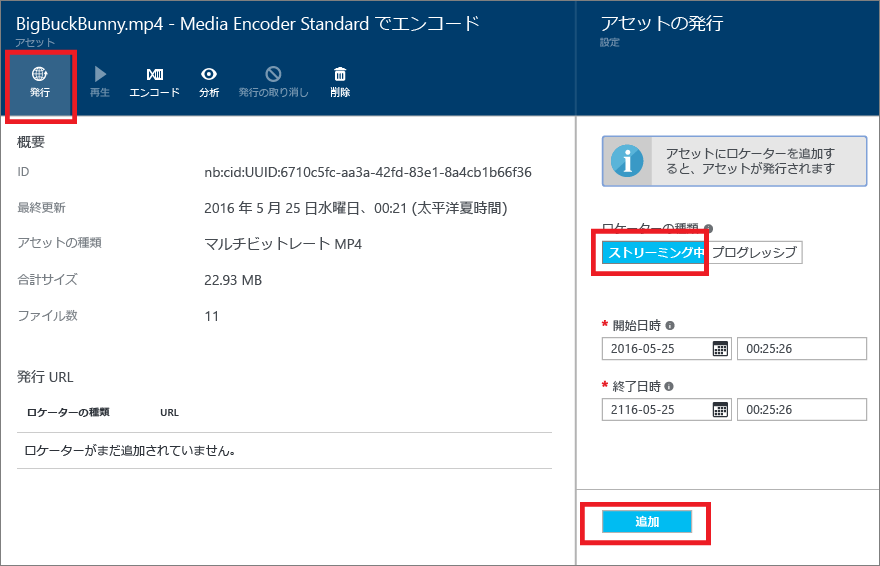
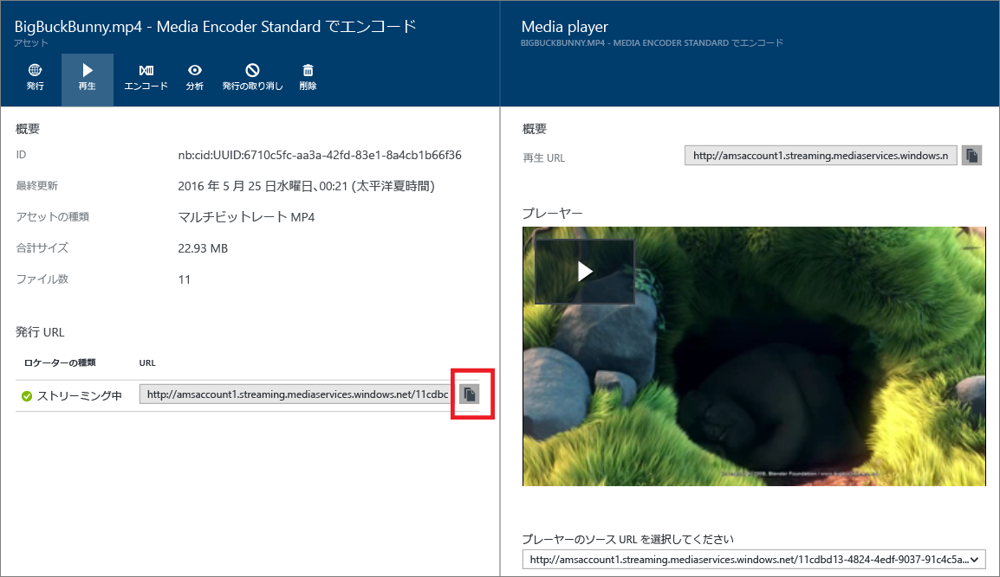

# Azure ポータルを使用したコンテンツの発行
> [!div class="op_single_selector"]
> * [ポータル](media-services-portal-publish.md)
> * [.NET](media-services-deliver-streaming-content.md)
> * [REST ()](media-services-rest-deliver-streaming-content.md)
> 
> 

## Overview
> [!NOTE]
> このチュートリアルを完了するには、Azure アカウントが必要です。詳細については、[Azure の無料試用版サイト](https://azure.microsoft.com/pricing/free-trial/)を参照してください。
> 
> 

ストリーミングかダウンロードに使用できる URL を提供するには、まず、ロケーターを作成して資産を "発行" する必要があります。資産に含まれているファイルには、ロケーターを通じてアクセスできます。Media Services では、2 種類のロケーターがサポートされています。

* ストリーミング (OnDemandOrigin) ロケーター。アダプティブ ストリーミング (MPEG DASH、HLS、スムーズ ストリーミングなどでのストリーミング) に使用します。ストリーミング ロケーターを作成する場合、資産に .ism ファイルが含まれている必要があります。
* プログレッシブ (SAS) ロケーター。プログレッシブ ダウンロードを使用してビデオを配信する場合に使用します。

ストリーミング URL には次の形式があり、スムーズ ストリーミング資産の再生に使用できます。

    {streaming endpoint name-media services account name}.streaming.mediaservices.windows.net/{locator ID}/{filename}.ism/Manifest

HLS ストリーミング URL を作成するには、(format=m3u8-aapl) を URL に追加します。

    {streaming endpoint name-media services account name}.streaming.mediaservices.windows.net/{locator ID}/{filename}.ism/Manifest(format=m3u8-aapl)

MPEG DASH ストリーミング URL を作成するには、(format=mpd-time-csf) を URL に追加します。

    {streaming endpoint name-media services account name}.streaming.mediaservices.windows.net/{locator ID}/{filename}.ism/Manifest(format=mpd-time-csf)

SAS URL には次の形式があります。

    {blob container name}/{asset name}/{file name}/{SAS signature}

詳細については、[コンテンツ配信の概要](media-services-deliver-content-overview.md)に関する記事を参照してください。

> [!NOTE]
> 2015 年 3 月より前にポータルを使用してロケーターを作成した場合、有効期限が 2 年のロケーターが作成されています。
> 
> 

ロケーターの有効期限を更新するには、[REST](http://msdn.microsoft.com/library/azure/hh974308.aspx#update_a_locator) API または [.NET](http://go.microsoft.com/fwlink/?LinkID=533259) API を使用します。SAS ロケーターの有効期限を更新すると、URL が変更されることにご注意ください。

### ポータルを使用して資産を発行するには
ポータルを使用して資産を発行するには、次の操作を行います。

1. [Azure ポータル](https://portal.azure.com/)にログインします。
2. **[設定]**、**[資産]** の順にクリックします。
3. 発行する資産を選択します。
4. **[発行]** ボタンをクリックします。
5. ロケーターの種類を選択します。
6. **[追加]** をクリックします。
   
    

URL が **[発行された URL]** の一覧に追加されます。

## ポータルでコンテンツを再生する
ビデオは、Azure ポータルにあるコンテンツ プレーヤーを使用してテストできます。

目的のビデオをクリックし、**[再生]** ボタンをクリックします。

いくつかの考慮事項が適用されます。

* ビデオが発行されたことを確認します。
* この**メディア プレイヤー**は既定のストリーミング エンドポイントから再生を行います。既定以外のストリーミング エンドポイントから再生する場合は、URL をクリックしてコピーし、別のプレーヤーを使用します。([Azure Media Services プレーヤーなど](http://amsplayer.azurewebsites.net/azuremediaplayer.html))。
* ストリーミング元となるストリーミング エンドポイントが実行されている必要があります。
* ストリーミング エンドポイントからストリーミングするには、1 つ以上のストリーミング ユニットを追加する必要があります。詳細については、[こちらの](media-services-portal-scale-streaming-endpoints.md)トピックを参照してください。

## 次のステップ
Media Services のラーニング パスを確認します。

[!INCLUDE [media-services-learning-paths-include](../../includes/media-services-learning-paths-include.md)]

## フィードバックの提供
[!INCLUDE [media-services-user-voice-include](../../includes/media-services-user-voice-include.md)]

<!---HONumber=AcomDC_0831_2016-->