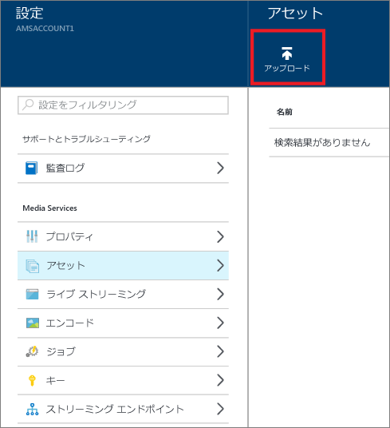

# Azure Portal を使用した Media Services アカウントへのファイルのアップロード
> [!div class="op_single_selector"]
> * [ポータル](media-services-portal-upload-files.md)
> * [.NET](media-services-dotnet-upload-files.md)
> * [REST ()](media-services-rest-upload-files.md)
> 
> [!NOTE]
> このチュートリアルを完了するには、Azure アカウントが必要です。 詳細については、 [Azure の無料試用版サイト](https://azure.microsoft.com/pricing/free-trial/)を参照してください。 
> 

Media Services で、デジタル ファイルを資産にアップロードします。 資産には、ビデオ、オーディオ、画像、サムネイル コレクション、テキスト トラック、字幕ファイル (各ファイルのメタデータを含む) を追加できます。ファイルをアップロードすると、クラウドにコンテンツが安全に保存され、処理したりストリーミングしたりできるようになります。

## ファイルのアップロード

>[!NOTE]
>Media Services での処理についてサポートされている最大ファイル サイズには制限があります。 ファイル サイズの制限の詳細については、[こちら](media-services-quotas-and-limitations.md)のトピックを参照してください。
>

1. [Azure Portal](https://portal.azure.com/) で Azure Media Services アカウントを選択します。
2. **[設定]** ブレードで **[資産]** をクリックします。
   
    
3. **[アップロード]** ボタンをクリックします。
   
    **[Upload a video asset (ビデオ資産をアップロード)]** ウィンドウが表示されます。
   
   > [!NOTE]
   > ファイル サイズの制限はありません。
   > 
   > 
4. コンピューターで目的のビデオを参照して選択し、[OK] をクリックします。  
   
    アップロードが開始され、ファイル名の下に進行状況が表示されます。  

アップロードが完了すると、 **[資産]** ウィンドウの一覧に新しい資産が表示されます。 

## 次のステップ
これで、アップロードした資産をエンコードできます。 詳細については、 [資産のエンコード](media-services-portal-encode.md)に関するページをご覧ください。

また、Azure Functions を使用すると、構成したコンテナーに到着するファイルに基づいてエンコード ジョブをトリガーすることもできます。 詳細については、[このサンプル](https://azure.microsoft.com/resources/samples/media-services-dotnet-functions-integration/ )を参照してください。

## Media Services のラーニング パス
[!INCLUDE [media-services-learning-paths-include](../../includes/media-services-learning-paths-include.md)]

## フィードバックの提供
[!INCLUDE [media-services-user-voice-include](../../includes/media-services-user-voice-include.md)]

<!--HONumber=Feb17_HO2-->

