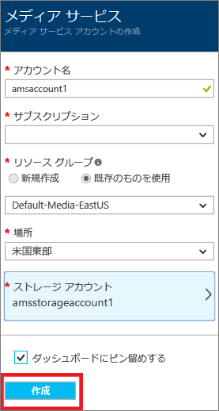
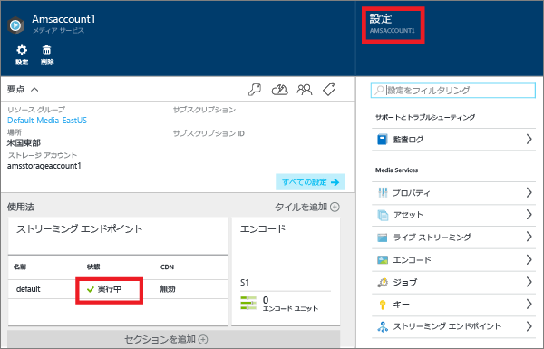
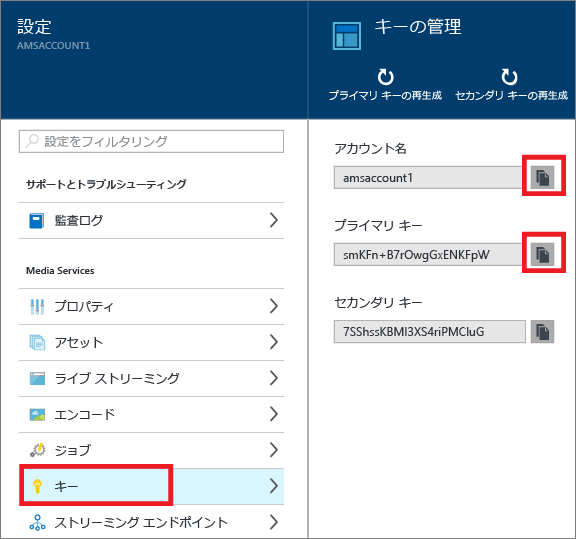
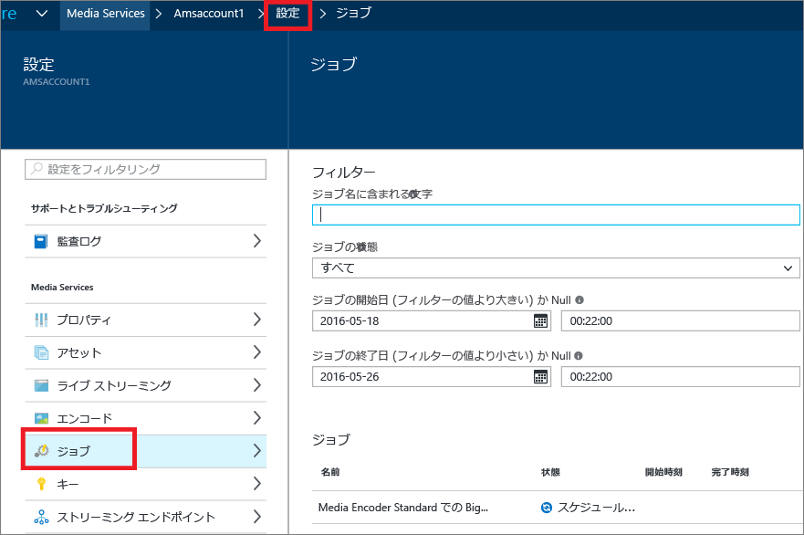

# Azure ポータルを使用したオンデマンド コンテンツ配信の概要
[!INCLUDE [media-services-selector-get-started](../../includes/media-services-selector-get-started.md)]

このチュートリアルでは、Azure Media Services (AMS) アプリケーションと Azure ポータルを使用した基本的なビデオ オン デマンド (VoD) コンテンツ配信サービスの実装手順を紹介します。

> [!NOTE]
> このチュートリアルを完了するには、Azure アカウントが必要です。 詳細については、 [Azure の無料試用版サイト](https://azure.microsoft.com/pricing/free-trial/)を参照してください。 
> 
> 

このチュートリアルに含まれるタスクは次のとおりです。

1. Azure Media Services アカウントを作成する
2. ストリーミング エンドポイントを構成する
3. ビデオ ファイルをアップロードする
4. 一連のアダプティブ ビットレート MP4 ファイルにソース ファイルをエンコードします。
5. 資産を発行してストリーミング URL とプログレッシブ ダウンロード URL を取得する  
6. コンテンツの再生

## Azure Media Services アカウントの作成
このセクションでは、AMS アカウントを作成する方法について説明します。

1. [Azure ポータル](https://portal.azure.com/)にログインします。
2. **[+新規]** > **[Web + モバイル]** > **[Media Services]** の順にクリックします。
   
    
3. **[CREATE MEDIA SERVICES ACCOUNT (Media Services アカウントの作成)]** に必要な値を入力します。
   
    
   
   1. **[アカウント名]** に新しい AMS アカウントの名前を入力します。 Media Services アカウント名に使用できる文字は、小文字または数字のみで、空白を含めることはできません。長さは 3 ～ 24 文字です。
   2. [サブスクリプション] ボックスで、アクセス権のある別の Azure サブスクリプションを選択します。
   3. **[リソース グループ]**ボックスで、新規または既存のリソースを選択します。  リソース グループとは、ライフサイクル、アクセス許可、ポリシーを共有するリソースの集まりです。 [こちら](../azure-resource-manager/resource-group-overview.md#resource-groups)をご覧ください。
   4. **[場所]** ボックスで、この Media Services アカウントのメディアとメタデータのレコードを保存するリージョンを選択します。 このリージョンでメディアの処理とストリーミングが行われます。 ドロップダウン リストのボックスには、利用可能な Media Services リージョンのみが表示されます。 
   5. **[ストレージ アカウント]**ボックスで、Media Services アカウントのメディア コンテンツの BLOB ストレージとなるストレージ アカウントを選択します。 Media Services アカウントと同じリージョンにある既存のストレージ アカウントを選択することも、ストレージ アカウントを作成することもできます。 新しいストレージ アカウントは同じリージョンに作成されます。 ストレージ アカウントの命名規則は、Media Services アカウントと同じです。
      
       ストレージの詳細については、 [こちら](../storage/storage-introduction.md)を参照してください。
   6. **[ダッシュボードにピン留めする]** チェック ボックスをオンにして、アカウントのデプロイの進行状況を確認します。
4. フォームの下部にある **[作成]** をクリックします。
   
    アカウントの作成に成功すると、ステータスが **[実行中]**に変化します。 
   
    
   
    AMS アカウントを管理するには (ビデオのアップロード、資産のエンコード、ジョブの進行の監視など)、 **[設定]** ウィンドウを使用します。

## Manage Keys
Media Services アカウントにプログラムからアクセスするには、アカウント名とプライマリ キーの情報が必要です。

1. Azure ポータルで、自分のアカウントを選択します。 
   
    **[設定]** ウィンドウが右側に表示されます。 
2. **[設定]** ウィンドウで、**[キー]** を選択します。 
   
    **[キーの管理]** ウィンドウに、アカウント名、プライマリ キー、セカンダリ キーが表示されます。 
3. コピー ボタンをクリックして値をコピーします。
   
    

## ストリーミング エンドポイントの構成
クライアントに対するアダプティブ ビットレート ストリーミングでのビデオ配信は、Azure Media Services の代表的な用途の 1 つです。 Media Services でサポートされるアダプティブ ビットレート ストリーミング テクノロジは、HTTP ライブ ストリーミング (HLS)、Smooth Streaming、および MPEG DASH です。

Media Services にはダイナミック パッケージ機能があり、アダプティブ ビットレート MP4 でエンコードされたコンテンツを、Media Services でサポートされるストリーミング形式 (MPEG DASH、HLS、Smooth Streaming) でそのまますぐに配信することができます。つまり、事前にパッケージされたこれらのストリーミング形式のバージョンを保存しておく必要がありません。

動的パッケージ化機能を利用するには、次の作業が必要となります。

* メザニン (ソース) ファイルを一連のアダプティブ ビットレート MP4 ファイルにエンコードする (エンコードの手順は、このチュートリアルで後ほど説明します)。  
* コンテンツ配信元となる " *ストリーミング エンドポイント* " のストリーミング ユニットを少なくとも 1 つ作成する。 以下の手順で、ストリーミング ユニットの数を変更する方法を示します。

ダイナミック パッケージを使用した場合、保存と課金の対象となるのは、単一のストレージ形式のファイルのみです。Media Services がクライアントからの要求に応じて適切な応答を構築して返します。

ストリーミング予約ユニットを作成したり、数を変更したりするには、以下の手順を実行します。

1. **[設定]** ウィンドウで **[ストリーミング エンドポイント]** をクリックします。 
2. 既定のストリーミング エンドポイントをクリックします。 
   
    **[DEFAULT STREAMING ENDPOINT DETAILS (既定のストリーミング エンドポイントの詳細)]** ウィンドウが表示されます。
3. ストリーミング ユニットの数を指定するには、 **[ストリーミング ユニット]** のスライダーを動かします。
   
    ![[ストリーミング ユニット]](./media/media-services-portal-vod-get-started/media-services-streaming-units.png)
4. **[保存]** をクリックして、変更を保存します。
   
   > [!NOTE]
   > 新しいユニットの割り当てが完了するまでに最大 20 分かかる場合があります。
   > 
   > 

## ファイルのアップロード
Azure Media Services を使用してビデオをストリーミングするには、ソース ビデオをアップロードし、複数のビットレートにエンコードして発行する必要があります。 このセクションで最初の手順を説明します。 

1. **[設定]** ウィンドウで、**[資産]** をクリックします。
   
    
2. **[アップロード]** ボタンをクリックします。
   
    **[Upload a video asset (ビデオ資産をアップロード)]** ウィンドウが表示されます。
   
   > [!NOTE]
   > ファイル サイズの制限はありません。
   > 
   > 
3. コンピューターで目的のビデオを参照して選択し、[OK] をクリックします。  
   
    アップロードが開始され、ファイル名の下に進行状況が表示されます。  

アップロードが完了すると、 **[資産]** ウィンドウの一覧に新しい資産が表示されます。 

## Encode assets
クライアントに対するアダプティブ ビットレート ストリーミング配信は、Azure Media Services の代表的な用途の 1 つです。 Media Services でサポートされるアダプティブ ビットレート ストリーミング テクノロジは、HTTP ライブ ストリーミング (HLS)、Smooth Streaming、および MPEG DASH です。 アダプティブ ビットレート ストリーミング用にビデオを準備するには、ソース ビデオをマルチビットレートのファイルにエンコードする必要があります。 ビデオのエンコードには **Media Encoder Standard** エンコーダーを使用する必要があります。  

また、Media Services にはダイナミック パッケージ機能があり、マルチビットレート MP4 でエンコードされたコンテンツを、MPEG DASH、HLS、Smooth Streaming のストリーミング形式でそのまま配信することができます。つまり、これらのストリーミング形式に再度パッケージ化する必要がありません。 ダイナミック パッケージを使用した場合、保存と課金の対象となるのは、単一のストレージ形式のファイルのみです。Media Services がクライアントからの要求に応じて適切な応答を構築して返します。

動的パッケージ化機能を利用するには、次の作業が必要となります。

* ソース ファイルを一連のマルチビットレート MP4 ファイルにエンコードする (エンコードの手順はこのセクションで後ほど説明します)。
* コンテンツ配信元となるストリーミング エンドポイントのストリーミング ユニットを少なくとも 1 つ取得する。 詳細については、「 [ストリーミング エンドポイントの構成](media-services-portal-vod-get-started.md#configure-streaming-endpoints)」セクションを参照してください。 

### ポータルを使用してエンコードするには
ここでは、Media Encoder Standard でコンテンツをエンコードする手順について説明します。

1. **[設定]** ウィンドウで、**[資産]** を選択します。  
2. **[資産]** ウィンドウで、エンコードする資産を選択します。
3. **[エンコード]** ボタンをクリックします。
4. **[資産のエンコード]** ウィンドウで、"Media Encoder Standard" プロセッサとプリセットを選択します。 たとえば、入力ビデオの解像度が 1920 x 1080 ピクセルであるとわかっている場合は、"H264 Multiple Bitrate 1080p" のプリセットを使用できます。 プリセットについて詳しくは、[こちら](https://msdn.microsoft.com/library/azure/mt269960.aspx)の記事をご覧ください。重要なのは、入力ビデオに最適なプリセットを選択することです。 低解像度 (640 x 360) のビデオの場合は、既定の "H264 Multiple Bitrate 1080p" のプリセットは使用しないでください。
   
   出力資産とジョブの名前を編集するオプションを利用すると、効率よく管理を行えます。
   
   
5. **[作成]**をクリックします。

### エンコード ジョブの進行状況の監視
エンコード ジョブの進行状況を監視するには、ページの上部にある **[設定]** をクリックし、**[ジョブ]** を選択します。

## コンテンツを発行する
ストリーミングかダウンロードに使用できる URL を提供するには、まず、ロケーターを作成して資産を "発行" する必要があります。 資産に含まれているファイルには、ロケーターを通じてアクセスできます。 Media Services では、2 種類のロケーターがサポートされています。 

* ストリーミング (OnDemandOrigin) ロケーター。アダプティブ ストリーミング (MPEG DASH、HLS、スムーズ ストリーミングなどでのストリーミング) に使用します。 ストリーミング ロケーターを作成する場合、資産に .ism ファイルが含まれている必要があります。 
* プログレッシブ (SAS) ロケーター。プログレッシブ ダウンロードを使用してビデオを配信する場合に使用します。

ストリーミング URL には次の形式があり、スムーズ ストリーミング資産の再生に使用できます。

    {streaming endpoint name-media services account name}.streaming.mediaservices.windows.net/{locator ID}/{filename}.ism/Manifest

HLS ストリーミング URL を作成するには、(format=m3u8-aapl) を URL に追加します。

    {streaming endpoint name-media services account name}.streaming.mediaservices.windows.net/{locator ID}/{filename}.ism/Manifest(format=m3u8-aapl)

MPEG DASH ストリーミング URL を作成するには、(format=mpd-time-csf) を URL に追加します。

    {streaming endpoint name-media services account name}.streaming.mediaservices.windows.net/{locator ID}/{filename}.ism/Manifest(format=mpd-time-csf)

SAS URL には次の形式があります。

    {blob container name}/{asset name}/{file name}/{SAS signature}

> [!NOTE]
> 2015 年 3 月より前にポータルを使用してロケーターを作成した場合、有効期限が 2 年のロケーターが作成されています。  
> 
> 

ロケーターの有効期限を更新するには、[REST](http://msdn.microsoft.com/library/azure/hh974308.aspx#update_a_locator) API または [.NET](http://go.microsoft.com/fwlink/?LinkID=533259) API を使用します。 SAS ロケーターの有効期限を更新すると、URL が変更されます。

### ポータルを使用して資産を発行するには
ポータルを使用して資産を発行するには、次の操作を行います。

1.  **[設定]** > **[資産]**を参照してください。
2. 発行する資産を選択します。
3. **[発行]** ボタンをクリックします。
4. ロケーターの種類を選択します。
5. **[追加]**をクリックします。
   
    ![[発行]](./media/media-services-portal-vod-get-started/media-services-publish1.png)

URL が **[発行された URL]**の一覧に追加されます。

## ポータルでコンテンツを再生する
ビデオは、Azure ポータルにあるコンテンツ プレーヤーを使用してテストできます。

目的のビデオをクリックし、 **[再生]** ボタンをクリックします。

![[発行]](./media/media-services-portal-vod-get-started/media-services-play.png)

いくつかの考慮事項が適用されます。

* ビデオが発行されたことを確認します。
* この **メディア プレイヤー** は既定のストリーミング エンドポイントから再生を行います。 既定以外のストリーミング エンドポイントから再生する場合は、URL をクリックしてコピーし、別のプレーヤーを使用します。 ( [Azure Media Services プレーヤーなど](http://amsplayer.azurewebsites.net/azuremediaplayer.html))。

## 次のステップ
Media Services のラーニング パスを確認します。

[!INCLUDE [media-services-learning-paths-include](../../includes/media-services-learning-paths-include.md)]

## フィードバックの提供
[!INCLUDE [media-services-user-voice-include](../../includes/media-services-user-voice-include.md)]

<!--HONumber=Dec16_HO2-->

