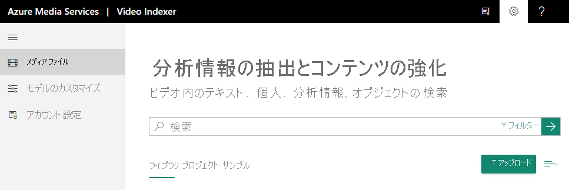

# クイック スタート:サインアップして最初のビデオをアップロードする方法

この入門クイック スタートでは、Video Indexer Web サイトにサインインする方法と、最初のビデオをアップロードする方法を示します。

Video Indexer アカウントを作成する場合、無料試用アカウント (一定分数の無料インデックス作成を利用可能) または有料オプション (クォータによる制限がありません) を選択できます。 無料試用アカウントで Video Indexer 使用すると、Web サイト ユーザーは最大 600 分間の無料インデックス作成、API ユーザーは最大 2,400 分間の無料インデックス作成を利用できます。 有料オプションでは、[ご使用の Azure サブスクリプションと Azure Media Services アカウントに接続される](connect-to-azure.md) Video Indexer アカウントを作成します。 Azure Media Services アカウント関連の料金と同様に、インデックス作成時間 (分単位) の料金がかかります。 

## Video Indexer にサインアップする

Video Indexer での開発を始めるには、[Video Indexer](https://www.videoindexer.com) Web サイトに移動してサインインします。

> [!NOTE]
> Video Indexer の使用を開始すると、保存されているデータおよびアップロードされたコンテンツはすべて、Microsoft で管理されるキーを使用して保存時に暗号化されます。

## Video Indexer Web サイトを使用してビデオをアップロードする

### Video Indexer でサポートされているファイル形式

Video Indexer で使用できるファイル形式の一覧については、「[入力コンテナー/ファイル形式](../latest/media-encoder-standard-formats.md#input-containerfile-formats)」を参照してください。

### ビデオをアップロードする

1. [Video Indexer](https://www.videoindexer.ai/) Web サイトにサインインします。
2. ビデオをアップロードするには、 **[アップロード]** ボタンまたはリンクを押します。

    > [!NOTE]
    > ビデオの名前は、80 文字以下にする必要があります。

    

    ビデオがアップロードされると、Video Indexer がビデオのインデックス作成と分析を開始します。

     

    Video Indexer が分析を完了すると、ビデオへのリンクとビデオの内容の簡単な説明を含んだ通知が表示されます。 たとえば、人物、トピックス、OCR などが表示されます。

## 関連項目

詳細については、[ビデオのアップロードとインデックス作成](upload-index-videos.md)に関するページを参照してください。

ビデオをアップロードしてインデックスを付けたら、[Video Indexer](video-indexer-view-edit.md) Web サイトまたは [Video Indexer 開発者ポータル](video-indexer-use-apis.md)を使用して、ビデオの分析情報を表示できます。 

[API の使用開始](video-indexer-use-apis.md)

## 次のステップ

詳しい紹介記事については、[概要ラボ](https://github.com/Azure-Samples/media-services-video-indexer/blob/master/IntroToVideoIndexer.md)を参照してください。 

ワークショップを終えるころには、ビデオやオーディオ コンテンツから抽出できる情報の種類についての理解が深まります。また、コンテンツ インテリジェンスに関連した好機を発見したり、Azure 上のビデオ AI を売り込んだり、Video Indexer に関するさまざまなシナリオをデモンストレーションしたりするための気運も高まることでしょう。

