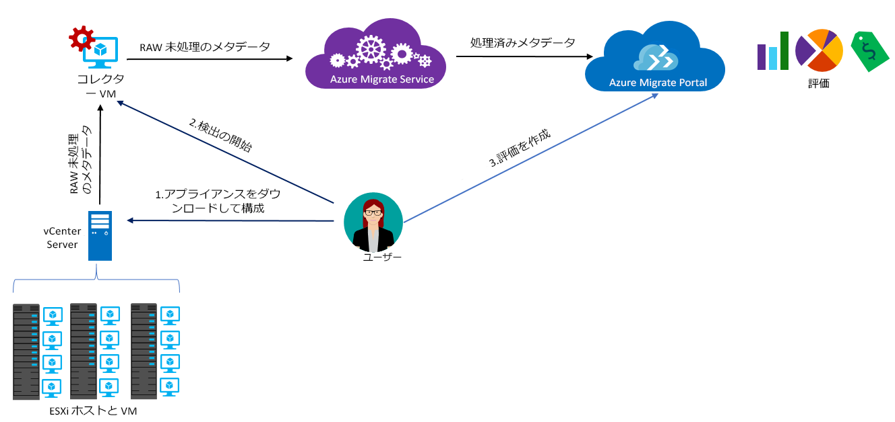

# Azure Migrate について

Azure Migrate サービスは、Azure への移行についてオンプレミスのワークロードを評価します。 このサービスで、オンプレミス マシンの移行の適合性と、パフォーマンスに基づくサイズを評価して、オンプレミスのマシンを Azure で実行するためのコストを見積もることができます。 リフトアンドシフトでの移行を検討している場合や移行の初期評価段階の場合、このサービスは適しています。 その評価後、[Azure Site Recovery](https://docs.microsoft.com/azure/site-recovery/site-recovery-overview) や [Azure Database Migration Service](https://docs.microsoft.com/azure/dms/dms-overview) などのサービスを使用して、Azure にマシンを移行することができます。

## Azure Migrate を使用する理由

Azure Migrate によって次のことが可能になります。

- **Azure 対応性の状態を評価する**:オンプレミスのマシンが Azure での実行に適しているかどうかを評価します。
- **推奨サイズを把握する**:オンプレミス VM のパフォーマンス履歴から、Azure VM の推奨サイズが得られます。
- **毎月のコストを見積もる**:オンプレミスのマシンを Azure で実行するためのコストを見積もります。  
- **高い信頼性で移行する**:オンプレミスのマシンの依存関係を視覚化して、同時に評価および移行するマシンのグループを作成します。

## 現時点での制限事項

- Azure VM への移行に関して、オンプレミスの VMware 仮想マシン (VM) だけを評価することができます。 VMware VM は、vCenter Server (バージョン 5.5、6.0、または 6.5) で管理する必要があります。
- Hyper-V 仮想マシンと物理サーバーを評価する必要がある場合、Hyper-V には [Azure Site Recovery Deployment Planner](https://aka.ms/asr-dp-hyperv-doc) を、物理マシンには Microsoft の [パートナーのツール](https://azure.microsoft.com/migration/partners/)を使用してください。
- 1 回の検出で最大 1,500 個の VM を検出でき、1 つのプロジェクトで最大 1,500 個の VM を検出できます。 さらに、一度に最大 1,500 個の VM を評価できます。
- より大規模な環境を検出する場合は、検出を分割して、複数のプロジェクトを作成できます。 [詳細情報](how-to-scale-assessment.md)。 Azure Migrate では、サブスクリプションあたり最大 20 個のプロジェクトをサポートしています。
- Azure Migrate の移行評価では、マネージド ディスクのみがサポートされます。
-  Azure Migrate プロジェクトは、次の地域でのみ作成できます。 ただし、他の Azure のターゲット場所について評価を作成できないという訳ではありません。
    **地理的な場所** | **保存場所**
    --- | ---
    Azure Government | 米国政府バージニア州
    ヨーロッパ | 北ヨーロッパまたは西ヨーロッパ
    米国 | 米国東部または米国中西部

    移行プロジェクトに関連付けられた地理的な場所は、オンプレミス環境から検出されたメタデータを保存するために使用されます。 メタデータは、移行プロジェクトに指定された地理的な場所に基づいたいずれかのリージョンに保存されます。 新しい Log Analytics ワークスペースを作成して依存関係の視覚化を使用する場合、ワークスペースはプロジェクトと同じリージョンに作成されます。
- 依存関係可視化機能は、Azure Government では使用できません。

## 支払い対象について

Azure Migrate の価格について、[詳しくはこちら](https://azure.microsoft.com/pricing/details/azure-migrate/)を参照してください。

## 評価の内容

評価の設定は、必要に応じてカスタマイズできます。 次の表は、評価のプロパティをまとめたものです。

**プロパティ** | **詳細**
--- | ---
**ターゲットの場所** | Azure 上の移行先となる場所。  現在、Azure Migrate は 33 個のリージョンを移行先としてサポートしています。 [リージョンを確認](https://azure.microsoft.com/global-infrastructure/services/)してください。 既定では、ターゲット リージョンが "米国西部 2" に設定されます。
**ストレージの種類** | 評価の一部であるすべての VM に割り当てるマネージド ディスクの種類。 サイズ設定基準が*オンプレミスのサイズ設定*の場合、ターゲット ディスクの種類を Premium ディスク (既定)、Studio SSD ディスク、または Studio HDD ディスクとして指定できます。 *パフォーマンスベースのサイズ設定*の場合は、上記のオプションと共に [自動] を選択するオプションもあり、VM のパフォーマンス データに基づいてディスクのサイズ設定の推奨が自動的に行われます。 たとえば、[単一インスタンスの VM で 99.9% の SLA](https://azure.microsoft.com/support/legal/sla/virtual-machines/v1_8/) を達成したい場合は、ストレージの種類を、評価対象のすべてのディスクが Premium マネージド ディスクとして推奨されることが保証される Premium マネージド ディスクとして指定してください。 Azure Migrate の移行評価では、マネージド ディスクのみがサポートされます。
**予約インスタンス** |  Azure に[予約インスタンス](https://azure.microsoft.com/pricing/reserved-vm-instances/)があるかどうか。 Azure Migrate はそれに応じてコストを見積もります。
**サイズ変更の設定基準** | サイズ設定は、オンプレミス VM (既定) の**パフォーマンス履歴**か、パフォーマンス履歴を考慮せずに**オンプレミス**に基づいて変更することができます。
**パフォーマンス履歴** | 既定では、オンプレミスのマシンのパフォーマンスが、過去 1 日のパフォーマンス履歴の 95% パーセンタイル値を使用して評価されます。
**快適性係数** | Azure Migrate では、評価時にバッファー (快適性係数) が考慮されます。 VM のマシン使用率データ (CPU、メモリ、ディスク、ネットワーク) に加えて、このバッファーが適用されます。 快適性係数は、季節ごとの使用量、短期間のパフォーマンス履歴、将来に使用量が増える可能性などの問題に相当します。   たとえば、使用率 20% の 10 コア VM の結果は、通常 2 コア VM になります。 一方、快適性係数を 2.0x とした場合は、結果が 4 コア VM になります。 既定の快適性設定は 1.3x です。
**VM シリーズ** | サイズ見積もりに使用する VM シリーズ。 たとえば、Azure で A シリーズ VM に移行する予定がない運用環境がある場合は、リストまたはシリーズから A シリーズを除外することができます。 サイズ変更は、選択したシリーズに基づいてのみ実行されます。   
**通貨** | 請求通貨です。 既定値は、米ドルです。
**割引率 (%)** | Azure オファーに適用される任意のサブスクリプション固有の割引です。 既定の設定は 0% です。
**VM のアップタイム** | VM が Azure 上で 24 時間 365 日稼働するわけではない場合は、Azure 上で稼働する期間 (1 か月あたりの日数と １ 日あたりの時間数) を指定できます。それに応じてコストの見積もりが行われます。 既定値は、1 か月あたり 31 日、1 日あたり 24 時間です。
**Azure オファー** | 登録されている [Azure プラン](https://azure.microsoft.com/support/legal/offer-details/)。 Azure Migrate はそれに応じてコストを見積もります。
**Azure ハイブリッド特典** | ソフトウェア アシュアランスがあり、[Azure ハイブリッド特典](https://azure.microsoft.com/pricing/hybrid-use-benefit/)を利用してコストの割引を受ける資格があるかどうか。

## Azure Migrate のしくみ

1.  Azure Migrate プロジェクトを作成します。
2.  Azure Migrate は、コレクター アプライアンスと呼ばれるオンプレミス VM を使用して、オンプレミスのマシンに関する情報を検出します。 このアプライアンスを作成するには、Open Virtualization Appliance (.ova) 形式のセットアップ ファイルをダウンロードし、それをオンプレミスの vCenter Server 上の VM としてインポートします。
3. vCenter Server から VM に接続します。接続の過程で、その新しいパスワードを指定します。
4. VM でコレクターを実行して検出を開始します。
5. コレクターが、VMware PowerCLI のコマンドレットを使用して VM のメタデータを収集します。 検出はエージェントレスであり、VMware ホストまたは VM には何もインストールされません。 収集されるメタデータには、VM 情報 (コア、メモリ、ディスク、ディスク サイズ、ネットワーク アダプター) が含まれています。 また、CPU とメモリの使用率、ディスク IOPS、ディスクのスループット (MBps)、ネットワーク出力 (MBps) など、VM のパフォーマンス データも収集されます。
5.  このメタデータが Azure Migrate プロジェクトにプッシュされます。 それを Azure Portal で確認することができます。
6.  評価の目的で、検出された VM をグループにまとめます。 たとえば、同じアプリケーションを実行する VM をグループにまとめます。 より正確なグループ分けのために、特定のマシンまたはグループ内のすべてのマシンの依存関係を表示し、グループを絞り込むことができます。
7.  グループの定義後、その評価を作成します。
8.  評価が完了したら、それをポータルで表示することも、Excel 形式でダウンロードすることもできます。

  

## ポート要件とは

次の表は、Azure Migrate の通信に必要なポートをまとめたものです。

コンポーネント | 通信先 |  詳細
--- | --- |---
コレクター  | Azure Migrate サービス | コレクターは、SSL ポート 443 経由でサービスに接続します。
コレクター | vCenter Server | 既定では、コレクターはポート 443 で vCenter Server に接続します。 他のポートでサーバーがリッスンしている場合、それをコレクター VM で送信ポートとして構成する必要があります。
オンプレミス VM | Log Analytics ワークスペース | [TCP 443] | [Microsoft Monitoring Agent (MMA)](../log-analytics/log-analytics-windows-agent.md) は TCP ポート 443 を使用して Log Analytics に接続します。 MMA エージェントを必要とする依存関係の視覚化機能を使用している場合のみ、このポートが必要になります。

## 評価後の流れ

オンプレミスのマシンを評価したら、いくつかのツールを使用して移行を実行できます。

- **Azure Site Recovery**:Azure Site Recovery を使用して Azure に移行することができます。 そのためには、ストレージ アカウントや仮想ネットワークなど、必要な [Azure コンポーネントを準備](../site-recovery/tutorial-prepare-azure.md)します。 オンプレミスで、[VMware 環境を準備](../site-recovery/vmware-azure-tutorial-prepare-on-premises.md)します。 すべての準備が整ったら、Azure へのレプリケーションを設定して有効にし、VM を移行します。 [詳細情報](../site-recovery/vmware-azure-tutorial.md)。
- **Azure Database Migration**:オンプレミスのマシンで SQL Server、MySQL、Oracle などのデータベースを実行している場合は、[Azure Database Migration Service](../dms/dms-overview.md) を使用して Azure に移行することができます。

## 次の手順

- オンプレミスの VMware VM に関する評価を[チュートリアルに従って](tutorial-assessment-vmware.md)作成します。
- Azure Migrate について[よく寄せられる質問を確認](resources-faq.md)します。
