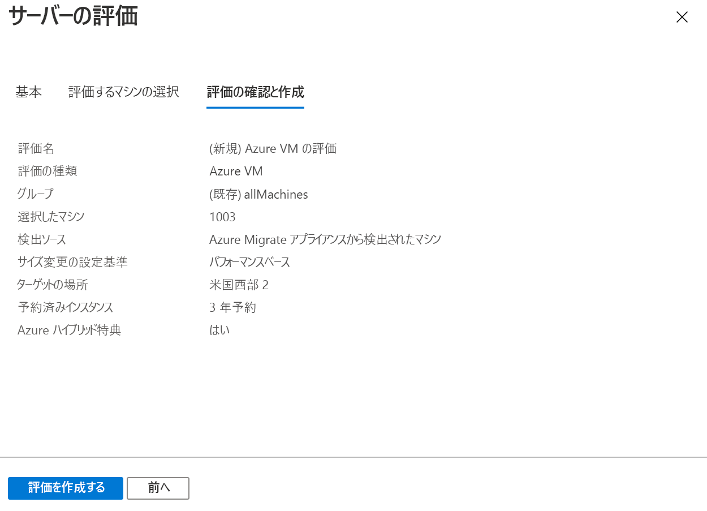

# <a name="assess-vmware-vms-with-azure-migrate-server-assessment"></a>Azure Migrate: Server Assessment を使用して VMware VM を評価する

この記事では、オンプレミスの VMware VM を評価する方法について説明します。使用するのは、Azure Migrate: Server Assessment ツールです。

[Azure Migrate](migrate-services-overview.md) では、アプリ、インフラストラクチャ、およびワークロードを検出、評価、および Microsoft Azure に移行するために役立つツールのハブが提供されます。 このハブには、Azure Migrate ツールと、サードパーティ製の独立系ソフトウェア ベンダー (ISV) オファリングが含まれています。


これはシリーズの 2 番目のチュートリアルであり、VMware VM を評価して Azure に移行する方法を示しています。 このチュートリアルでは、以下の内容を学習します。
> [!div class="checklist"]
> * Azure Migrate プロジェクトを設定する。
> * VM を評価するためにオンプレミスで実行される Azure Migrate アプライアンスを設定する。
> * オンプレミス VM の継続的な検出を開始する。 アプライアンスでは、検出された VM の構成データとパフォーマンス データが Azure に送信されます。
> * 検出された VM をグループ化し、VM グループを評価する。
> * 評価を確認する。


> [!NOTE]
> チュートリアルでは、概念実証をすばやく設定できるように、シナリオの最も簡単なデプロイ パスを示します。 チュートリアルではできるだけ既定のオプションを使用しており、使用可能な設定とパスをすべて示しているわけではありません。 詳細な手順については、ハウツー記事を参照してください。

Azure サブスクリプションをお持ちでない場合は、開始する前に [無料アカウント](https://azure.microsoft.com/pricing/free-trial/) を作成してください。


## <a name="prerequisites"></a>前提条件

- このシリーズの最初のチュートリアルを[完了](tutorial-prepare-vmware.md)します。 そうしないと、このチュートリアルの手順はうまくいきません。
- 最初のチュートリアルでは、以下のことを行ったはずです。
    - Azure Migrate の [Azure アクセス許可を設定](tutorial-prepare-vmware.md#prepare-azure)する。
    - 評価用に [VMware を準備する](tutorial-prepare-vmware.md#prepare-for-vmware-vm-assessment)。 VMware の設定を確認する必要があります。OVA テンプレートで VMware VM を作成するためのアクセス許可を持っている必要があります。 また、VM 検出用にアカウントが設定されている必要があります。 必要なポートを使用できる必要があり、Azure にアクセスするために必要な URL がわかっている必要があります。


## <a name="set-up-an-azure-migrate-project"></a>Azure Migrate プロジェクトを設定する

次のように、新しい Azure Migrate プロジェクトを設定します。

1. Azure portal の **[すべてのサービス]** で、**Azure Migrate** を検索します。
2. **[サービス]** で **[Azure Migrate]** を選択します。
3. **[概要]** の **[サーバーの検出、評価、移行]** で、 **[サーバーの評価と移行]** をクリックします。

    

4. **[作業の開始]** で、 **[ツールの追加]** をクリックします。
5. **[移行プロジェクト]** で、Azure サブスクリプションを選択し、リソース グループがない場合は作成します。     
6. **[プロジェクトの詳細]** で、プロジェクト名と、プロジェクトを作成したい地理的な場所を指定します。 アジア、ヨーロッパ、英国、および米国がサポートされています。

    - プロジェクトの地理的な場所は、オンプレミスの VM から収集されたメタデータを格納するためにのみ使用されます。
    - 移行を実行するときは、任意のターゲット リージョンを選択できます。

    


7. **[次へ]** をクリックします。
8. **[評価ツールの選択]** で、次を選択します: **[Azure Migrate: Server Assessment]**  >  **[次へ]** 。

    

9. **[移行ツールの選択]** で、 **[今は移行ツールの追加をスキップします]**  >  **[次へ]** の順に選択します。
10. **[ツールの確認と追加]** で設定を確認し、 **[ツールの追加]** をクリックします。
11. Azure Migrate プロジェクトがデプロイされるまで数分待ちます。 プロジェクトのページが表示されます。 プロジェクトが表示されない場合は、Azure Migrate ダッシュボードの **[サーバー]** からアクセスできます。


## <a name="set-up-the-appliance-vm"></a>アプライアンスの VM を設定する

Azure Migrate: Server Assessment では、軽量の VMware VM アプライアンスが実行されます。

- このアプライアンスでは、VM の検出が実行されて、VM のメタデータとパフォーマンス データが Azure Migrate Server Assessment に送信されます。
- アプライアンスを設定するには:
    - OVA テンプレート ファイルをダウンロードし、それを vCenter Server にインポートします。
    - アプライアンスを作成し、Azure Migrate Server Assessment に接続できることを確認します。
    - アプライアンスを初めて構成し、Azure Migrate プロジェクトに登録します。
- 1 つの Azure Migrate プロジェクトに対して、複数のアプライアンスを設定できます。 すべてのアプライアンスで、最大 35,000 個の VM の検出がサポートされます。 アプライアンスごとに最大で 10,000 台のサーバーを検出できます。

### <a name="download-the-ova-template"></a>OVA テンプレートをダウンロードする

1. **[移行の目標]**  >  **[サーバー]**  >  **[Azure Migrate: Server Assessment]** で、 **[Discover]\(検出\)** をクリックします。
2. **[マシンの検出]**  >  **[マシンは仮想化されていますか?]** で、 **[はい。VMware vSphere Hypervisor を使用します]** をクリックします。
3. **[ダウンロード]** をクリックして、.OVA テンプレート ファイルをダウンロードします。

    


### <a name="verify-security"></a>セキュリティを確認する

.OVA ファイルをデプロイする前に、それが安全であることを確認します。

1. ファイルをダウンロードしたマシンで、管理者用のコマンド ウィンドウを開きます。
2. 次のコマンドを実行して、OVA のハッシュを生成します。
    - ```C:\>CertUtil -HashFile <file_location> [Hashing Algorithm]```
    - 使用例: ```C:\>CertUtil -HashFile C:\AzureMigrate\AzureMigrate.ova SHA256```
3. バージョン 1.19.06.27 の場合、生成されたハッシュは次の値と一致する必要があります。 

  **アルゴリズム** | **ハッシュ値**
  --- | ---
  MD5 | 605d208ac5f4173383f616913441144e
  SHA256 | 447d16bd55f20f945164a1189381ef6e98475b573d6d1c694f3e5c172cfc30d4


### <a name="create-the-appliance-vm"></a>アプライアンスの VM を作成する

ダウンロードしたファイルをインポートし、VM を作成します。

1. vSphere Client コンソールで、 **[File]\(ファイル\)**  >  **[Deploy OVF Template]\(OVF テンプレートのデプロイ\)** の順にクリックします。

    

2. [Deploy OVF Template]\(OVF テンプレートのデプロイ\) ウィザードで **[Source]\(ソース\)** を選択し、OVA ファイルの場所を指定します。
3. **[名前]** と **[場所]** で、VM のフレンドリ名を指定します。 VM がホストされるインベントリ オブジェクトを選択します。
5. **[Host/Cluster]\(ホスト/クラスター\)** で、VM が実行されるホストまたはクラスターを指定します。
6. **[ストレージ]** で、VM の保存先を指定します。
7. **[Disk Format]\(ディスク フォーマット\)** で、ディスクの種類とサイズを指定します。
8. **[ネットワーク マッピング]** で、VM の接続先となるネットワークを指定します。 そのネットワークには、Azure Migrate Server Assessment にメタデータを送信するためのインターネット接続が必要です。
9. 設定を再確認したら、 **[Finish]\(完了\)** をクリックします。


### <a name="verify-appliance-access-to-azure"></a>アプライアンスによる Azure へのアクセスを確認する

アプライアンス VM が [Azure URL](migrate-support-matrix-vmware.md#assessment-url-access-requirements) に接続できることを確認します。


### <a name="configure-the-appliance"></a>アプライアンスを構成する

次の手順に従って、アプライアンスを設定します。

1. vSphere Client コンソールで、[VM] を右クリックして **[Open Console]\(コンソールを開く\)** を選択します。
2. アプライアンスの言語、タイム ゾーン、およびパスワードを指定します。
3. VM に接続できる任意のマシン上でブラウザーを開き、アプライアンスの Web アプリの URL を開きます (**https://<*アプライアンス名または IP アドレス*>: 44368**)。

   または、アプリ ショートカットをクリックして、アプライアンス デスクトップからアプリを開くこともできます。
4. Web アプリの **[前提条件のセットアップ]** で、以下を実行します。
    - **[ライセンス]** : ライセンス条項に同意し、サード パーティの情報を確認します。
    - **[接続]** : VM がインターネットにアクセスできることが、アプリによってチェックされます。 VM でプロキシを使用する場合:
        - **[プロキシの設定]** をクリックし、 http://ProxyIPAddress または http://ProxyFQDN の形式で、プロキシ アドレスとリスニング ポートを指定します。
        - プロキシで認証が必要な場合は、資格情報を指定します。
        - サポートされるのは HTTP プロキシのみです。
    - **[時刻同期]** : 検出が正常に機能するには、アプライアンス上の時刻がインターネットの時刻と同期している必要があります。
    - **[更新プログラムのインストール]** : アプライアンスでは、最新の更新プログラムがインストールされることが保証されます。
    - **[Install VDDK]\(VDDK のインストール\)** : アプライアンスでは、VMWare vSphere Virtual Disk Development Kit (VDDK) がインストールされていることが確認されます。
        - Azure Migrate: Server Migration では、Azure への移行の間に VDDK を使用してマシンがレプリケートされます。
        - VMware から VDDK 6.7 をダウンロードし、ダウンロードした zip コンテンツをアプライアンス上の指定された場所に抽出します。

### <a name="register-the-appliance-with-azure-migrate"></a>Azure Migrate にアプライアンスを登録する

1. **[ログイン]** をクリックします。 表示されない場合は、ブラウザーでポップアップ ブロックを無効にしてあることを確認します。
2. 新しいタブで、自分の Azure 資格情報を使用してサインインします。
    - 自分のユーザー名とパスワードを使用してサインインします。
    - PIN を使用したサインインはサポートされていません。
3. 正常にサインインしたら、Web アプリに戻ります。
2. Azure Migrate プロジェクトが作成されたサブスクリプションを選択した後、プロジェクトを選択します。
3. アプライアンスの名前を指定します。 名前は、14 文字以下の英数字にする必要があります。
4. **[登録]** をクリックします。


## <a name="start-continuous-discovery"></a>継続的な検出を開始する

次に、アプライアンスから vCenter Server に接続し、VM の検出を開始します。

1. **[vCenter Server の詳細を指定する]** で、vCenter Server の名前 (FQDN) または IP アドレスを指定します。 既定のポートをそのまま使用することも、vCenter Server がリッスンするカスタム ポートを指定することもできます。
2. **[ユーザー名]** と **[パスワード]** で、アプライアンスによる vCenter Server の VM の検出に使用される読み取り専用の資格情報を指定します。 [検出に必要なアクセス許可](migrate-support-matrix-vmware.md#assessment-vcenter-server-permissions)がアカウントにあることを確認します。 必要に応じて、vCenter アカウントへのアクセスを制限することで、検出のスコープを絞り込むことができます。検出のスコープ設定について詳しくは、[こちら](tutorial-assess-vmware.md#scoping-discovery)をご覧ください。
3. **[接続の検証]** をクリックし、アプライアンスが vCenter Server に接続できることを確認します。
4. 接続が確立された後、 **[保存して検出を開始]** をクリックします。

これで、検出が開始されます。 検出された VM のメタデータがポータルに表示されるまでに、約 15 分かかります。

### <a name="scoping-discovery"></a>検出のスコープ設定

検出に使用する vCenter アカウントのアクセスを制限することで、検出のスコープを設定できます。 vCenter Server のデータセンター、クラスター、クラスターのフォルダー、ホスト、ホストのフォルダー、または個々の VM に、スコープを設定できます。 

> [!NOTE]
> 現在は、vCenter アカウントに vCenter VM フォルダー レベルのアクセス権を付与した場合、Server Assessment で VM を検出することはできません。 VM フォルダーで検出のスコープを指定する場合は、vCenter アカウントに VM レベルで読み取り専用アクセス権を割り当てることにより実現できます。  これを行う手順は以下のとおりです。
>
> 1. 検出のスコープを設定する VM フォルダー内のすべての VM に対して、読み取り専用アクセス許可を割り当てます。 
> 2. VM がホストされているすべての親オブジェクトに、読み取り専用アクセス権を付与します。 データ センターに至るまでの階層にあるすべての親オブジェクト、すなわち、ホスト、ホストのフォルダー、クラスター、クラスターのフォルダーが含まれます。 すべての子オブジェクトに権限を広める必要はありません。
> 3. 検出に資格情報を使用します。*コレクション スコープ*にはデータセンターを選択します。 RBAC の設定により、対応する vCenter ユーザーにテナント固有の VM のみのアクセス許可が与えられます。
>
> ホストとクラスターのフォルダーはサポートされていることに注意してください。

### <a name="verify-vms-in-the-portal"></a>ポータル内での VM の特定

検出の後で、VM が Azure portal に表示されることを確認できます。

1. Azure Migrate ダッシュボードを開きます。
2. **[Azure Migrate - サーバー]**  >  **[Azure Migrate: Server Assessment]** ページで、 **[検出済みサーバー]** の数を表示するアイコンをクリックします。

## <a name="set-up-an-assessment"></a>評価を設定する

Azure Migrate: Server Assessment を使用して作成できる評価には、2 つの種類があります。

**評価** | **詳細** | **データ**
--- | --- | ---
**パフォーマンスベース** | 収集されたパフォーマンス データに基づく評価 | **推奨される VM サイズ**: CPU とメモリの使用率データに基づきます。<br/><br/> **推奨されるディスクの種類 (Standard または Premium マネージド ディスク)** : オンプレミス ディスクの IOPS とスループットに基づきます。
**オンプレミス** | オンプレミスのサイズ設定に基づく評価。 | **推奨される VM サイズ**: オンプレミスの VM サイズに基づきます<br/><br> **推奨されるディスクの種類**: 評価用に選択するストレージの種類の設定に基づきます。


### <a name="run-an-assessment"></a>評価を実行する

評価を実行するには次のようにします。

1. 評価を作成するための[ベスト プラクティス](best-practices-assessment.md)を確認します。
2. **[サーバー]** タブの **[Azure Migrate: Server Assessment]** タイルで、 **[評価]** をクリックします。

    

2. **[サーバーの評価]** で、評価の名前を指定します。
3. **[すべて表示]** をクリックして、評価のプロパティを確認します。

    

3. **[グループを選択または作成します]** で **[新規作成]** を選択し、グループ名を指定します。 グループで、評価のために 1 つ以上の VM をまとめます。
4. **[グループにマシンを追加します]** で、グループに追加する VM を選択します。
5. **[評価を作成します]** をクリックして、グループを作成し、評価を実行します。

    

6. 評価が作成されたら、それを表示します (**サーバー** > **Azure Migrate: Server Assessment** > **評価**)。
7. **[評価のエクスポート]** をクリックし、Excel ファイルとしてダウンロードします。


## <a name="review-an-assessment"></a>評価を確認する

評価には以下が記述されています。

- **Azure 対応性**: VM が Azure への移行に適しているかどうか。
- **月間コスト見積もり**: Azure で VM を実行するためのコンピューティングとストレージの月間推定コスト。
- **月間ストレージ コスト見積もり**: 移行後のディスク ストレージの推定コスト。

### <a name="view-an-assessment"></a>評価を表示する

1. **[移行の目標]**  >   **[サーバー]** で、 **[評価]** を **[Azure Migrate: Server Assessment]** でクリックします。
2. **[評価]** で、評価をクリックして開きます。

    

### <a name="review-azure-readiness"></a>Azure 対応性の確認

1. **[Azure 対応性]** で、VM が Azure への移行の準備ができているかどうかを確認します。
2. VM の状態を確認します。
    - **[Azure に対応]** : Azure Migrate によって、評価内の VM の VM サイズとコスト見積もりが推奨されます。
    - **[条件付きで対応]** : 問題と推奨される修復方法が示されます。
    - **[Azure に未対応]** : 問題と推奨される修復方法が示されます。
    - **[Readiness 不明]** : データの可用性の問題により、Azure Migrate が対応性を評価できない場合に使用されます。

2. **[Azure 対応性]** の状態をクリックします。 VM 対応性の詳細を表示し、ドリルダウンして、コンピューティング、ストレージ、ネットワークの設定など、VM の詳細を表示できます。


### <a name="review-cost-details"></a>コスト詳細の確認

このビューには、Azure で VM を実行する際のコンピューティングおよびストレージの推定コストが表示されます。

1. 月間のコンピューティングおよびストレージのコストを確認します。 コストは、評価されるグループ内のすべての VM について集計されます。

    - コストの見積もりは、マシンの推奨サイズ、およびそのディスクとプロパティに基づいています。
    - コンピューティングとストレージの月間推定コストが表示されます。
    - コストの見積もりは、IaaS VM としてのオンプレミス VM の実行に対するものです。 Azure Migrate Server Assessment では、PaaS または SaaS のコストは考慮されません。

2. 月間ストレージ コストの見積もりを確認できます。 このビューには、評価されたグループの集計されたストレージ コストが、ストレージ ディスクの種類ごとに分けて表示されます。
3. ドリルダウンして、特定の VM の詳細を見ることができます。


### <a name="review-confidence-rating"></a>信頼度レーティングを確認する

パフォーマンスベースの評価を実行すると、評価に信頼度レーティングが割り当てられます。


- 1 つ星 (最低) から 5 つ星 (最高) までの評価が与えられます。
- 信頼度レーティングは、評価による推奨サイズの信頼性を判断する目安となります。
- 信頼度レーティングは、評価の計算に必要なデータ ポイントの可用性に基づいています。

評価の信頼度レーティングは、次のとおりです。

**データ ポイントの可用性** | **信頼度レーティング**
--- | ---
0% - 20% | 1 つ星
21% - 40% | 2 つ星
41% - 60% | 3 つ星
61% - 80% | 4 つ星
81% - 100% | 5 つ星

評価レーティングのベスト プラクティスについて、[さらに学習](best-practices-assessment.md#best-practices-for-confidence-ratings)してください。


## <a name="next-steps"></a>次の手順

このチュートリアルでは、次のことを行いました。

> [!div class="checklist"]
> * Azure Migrate アプライアンスを設定する
> * 評価を作成して確認する

このシリーズの 3 番目のチュートリアルに進み、Azure Migrate Server Migration を使用して VMware VM を Azure に移行する方法について学習します。

> [!div class="nextstepaction"]
> [VMware VM を移行する](./tutorial-migrate-vmware.md)
