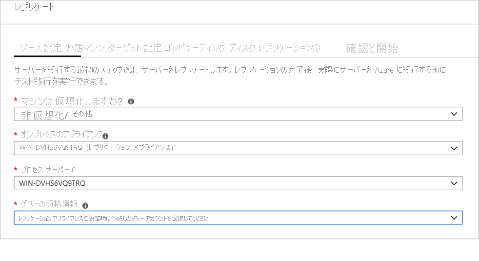
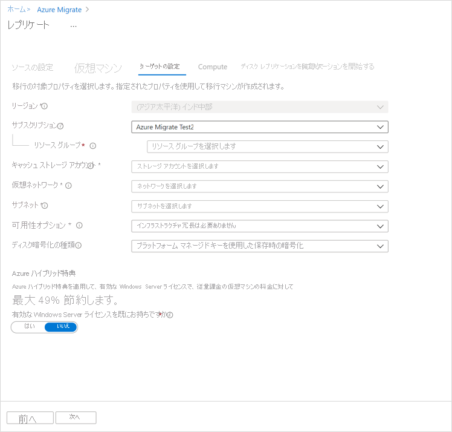

# <a name="migrate-machines-as-physical-servers-to-azure"></a>マシンを物理サーバーとして Azure に移行する

この記事では、Azure Migrate Server Migration ツールを使用して、マシンを物理サーバーとして Azure に移行する方法について説明します。 マシンを物理サーバーとして扱うことによって移行することは、さまざまなシナリオで役立ちます。

- オンプレミスの物理サーバーを移行する。
- Xen、KVM などのプラットフォームで仮想化された VM を移行する。
- Hyper-V または VMware VM を移行する (なんらかの理由で、[Hyper-V](tutorial-migrate-hyper-v.md) の標準移行プロセスや [VMware ](server-migrate-overview.md) 移行を使用できない場合)。
- プライベート クラウドで実行されている VM を移行する。
- アマゾン ウェブ サービス (AWS) や Google Cloud Platform (GCP) などのパブリック クラウドで実行されている VM を移行する。


[Azure Migrate](migrate-services-overview.md) では、オンプレミスのアプリとワークロード、およびクラウド VM インスタンスの検出、評価、および Azure への移行を追跡するための中央ハブが提供されます。 このハブには、評価および移行のための Azure Migrate ツールのほか、サードパーティの独立系ソフトウェア ベンダー (ISV) のオファリングが用意されています。


このチュートリアルでは、以下の内容を学習します。
> [!div class="checklist"]
> * Azure Migrate Server Migration ツールを使用して、移行用に Azure を準備します。
> * 移行したいマシンの要件を確認し、マシンの検出と Azure への移行に使用される Azure Migrate レプリケーション アプライアンス用のマシンを準備します。
> * Azure Migrate ハブに Azure Migrate Server Migration ツールを追加します。
> * レプリケーション アプライアンスを設定します。
> * 移行したいマシンにモビリティ サービスをインストールします。
> * レプリケーションを有効にします。
> * すべてが想定どおりに動作していることを確認するためにテスト移行を実行します。
> * Azure への完全な移行を実行します。

> [!NOTE]
> チュートリアルでは、概念実証をすばやく設定できるように、シナリオの最も簡単なデプロイ パスを示します。 チュートリアルではできるだけ既定のオプションを使用しており、使用可能な設定とパスをすべて示しているわけではありません。 詳細な手順については、Azure Migrate のハウツーを参照してください。

Azure サブスクリプションをお持ちでない場合は、開始する前に [無料アカウント](https://azure.microsoft.com/pricing/free-trial/) を作成してください。


## <a name="prerequisites"></a>前提条件

このチュートリアルを始める前に、次の準備が必要です。

1. 移行のアーキテクチャを[確認](migrate-architecture.md)します。
2. ご自分の Azure アカウントに仮想マシンの共同作成者ロールが割り当てられ、以下を行うためのアクセス許可を持っていることを確認します。

    - 選択したリソース グループ内に VM を作成する。
    - 選択した仮想ネットワーク内に VM を作成する。
    - Azure マネージド ディスクに書き込む。 

3. [Azure ネットワークをセットアップ](../virtual-network/manage-virtual-network.md#create-a-virtual-network)します。 Azure にレプリケートすると、Azure VM が作成され、移行の設定時に指定した Azure ネットワークに参加させられます。


## <a name="prepare-azure"></a>Azure を準備する

Azure Migrate Server Migration を使用して移行する前に、Azure のアクセス許可を設定します。

- **プロジェクトを作成する**: ご自分の Azure アカウントには、Azure Migrate プロジェクトを作成するためのアクセス許可が必要です。 

### <a name="assign-permissions-to-create-project"></a>プロジェクトを作成するためのアクセス許可を割り当てる

1. Azure portal でサブスクリプションを開き、 **[アクセス制御 (IAM)]** を選択します。
2. **[アクセスの確認]** で関連するアカウントを探し、それをクリックしてアクセス許可を表示します。
3. **共同作成者**または**所有者**のアクセス許可を持っている必要があります。
    - 無料の Azure アカウントを作成したばかりであれば、自分のサブスクリプションの所有者になっています。
    - サブスクリプションの所有者でない場合は、所有者と協力してロールを割り当てます。

## <a name="prepare-for-migration"></a>移行を準備する

### <a name="check-machine-requirements-for-migration"></a>移行のためのマシン要件の確認

マシンが Azure に移行するための要件を満たしていることを確認します。 

> [!NOTE]
> Azure Migrate Server Migration を使用したエージェントベース移行には、Azure Site Recovery サービスのエージェント ベースのディザスター リカバリー機能と同じレプリケーション アーキテクチャが使用されており、そこで用いられている一部のコンポーネントは、同じコード ベースを共有しています。 一部の要件は、Site Recovery のドキュメントにリンクされている場合があります。

1. 物理サーバーの要件を[確認](migrate-support-matrix-physical-migration.md#physical-server-requirements)します。
2. VM 設定を確認します。 Azure にレプリケートするオンプレミスのマシンは、[Azure VM の要件](migrate-support-matrix-physical-migration.md#azure-vm-requirements)に準拠している必要があります。


### <a name="prepare-a-machine-for-the-replication-appliance"></a>レプリケーション アプライアンス用のマシンの準備

Azure Migrate Server Migration では、レプリケーション アプライアンスを使用してマシンを Azure にレプリケートします。 レプリケーション アプライアンスは、次のコンポーネントを実行します。

- **構成サーバー**: 構成サーバーは、オンプレミスと Azure の間の通信を調整し、データのレプリケーションを管理します。
- **プロセス サーバー**:プロセス サーバーはレプリケーション ゲートウェイとして機能します。 レプリケーション データを受信し、それをキャッシュ、圧縮、暗号化によって最適化して、Azure のキャッシュ ストレージ アカウントに送信します。 

開始する前に、レプリケーション アプライアンスをホストするように Windows Server 2016 マシンを準備する必要があります。 このマシンは、[これらの要件](migrate-replication-appliance.md)に準拠している必要があります。 保護対象のソース マシンにはアプライアンスをインストールしないでください。


## <a name="add-the-azure-migrate-server-migration-tool"></a>Azure Migrate Server Migration ツールを追加する

Azure Migrate プロジェクトを設定し、それに Azure Migrate Server Migration ツールを追加します。

1. Azure portal の **[すべてのサービス]** で、**Azure Migrate** を検索します。
2. **[サービス]** で **[Azure Migrate]** を選択します。
3. **[概要]** で **[サーバーの評価と移行]** をクリックします。
4. **[サーバーの検出、評価、移行]** で、 **[サーバーの評価と移行]** をクリックします。

    

5. **[サーバーの検出、評価、移行]** で、 **[ツールの追加]** をクリックします。
6. **[移行プロジェクト]** で、自分の Azure サブスクリプションを選択し、リソース グループがない場合は作成します。
7. **[プロジェクトの詳細]** で、プロジェクト名と、プロジェクトを作成したい地域を指定し、 **[次へ]** をクリックします。

    

    Azure Migrate プロジェクトは、これらのいずれの地域でも作成できます。

    **地理的な場所** | **リージョン**
    --- | ---
    アジア | 東南アジア
    ヨーロッパ | 北ヨーロッパまたは西ヨーロッパ
    United States | 米国東部または米国中西部

    プロジェクトのために指定した地理的な場所は、オンプレミスの VM から収集されたメタデータを格納するためにのみ使用されます。 実際の移行では、任意のターゲット リージョンを選択できます。
8. **[評価ツールの選択]** で、 **[今は評価ツールの追加をスキップします]**  >  **[次へ]** の順に選択します。
9. **[移行ツールの選択]** で、次を選択します: **[Azure Migrate: Server Migration]**  >  **[次へ]** 。
10. **[ツールの確認と追加]** で設定を確認し、 **[ツールの追加]** をクリックします
11. ツールを追加すると、Azure Migrate プロジェクトの **[サーバー]**  >  **[移行ツール]** に表示されます。

## <a name="set-up-the-replication-appliance"></a>レプリケーション アプライアンスを設定する

移行の最初の手順は、レプリケーション アプライアンスを設定することです。 アプライアンスのインストーラー ファイルをダウンロードし、[自分が準備したマシン](#prepare-a-machine-for-the-replication-appliance)で実行します。 インストール後、アプライアンスは Azure Migrate Server Migration に登録します。


### <a name="download-the-replication-appliance-installer"></a>レプリケーション アプライアンス インストーラーのダウンロード

1. Azure Migrate プロジェクトの **[サーバー]** で、 **[Azure Migrate: Server Migration]** で、 **[検出]** をクリックします。

    

3. **[マシンの検出]**  >  **[マシンは仮想化されていますか?]** で、 **[非仮想化/その他]** をクリックします。
4. **[ターゲット リージョン]** で、マシンの移行先にする Azure リージョンを選択します。
5. **[移行先のリージョンが <リージョン名> であることを確認してください]** を選択します。
6. **[リソースの作成]** をクリックします。 これで、Azure Site Recovery コンテナーがバックグラウンドで作成されます。
    - Azure Migrate Server Migration を使用した移行を既に設定してある場合は、リソースが以前に設定されているため、ターゲット オプションを構成できません。
    - このボタンのクリック後は、このプロジェクトのターゲット リージョンを変更することはできません。
    - 後続のすべての移行は、このリージョンに対して行われます。

7. **[新しいレプリケーション アプライアンスをインストールしますか?]** で、 **[レプリケーション アプライアンスのインストール]** を選択します。
9. **[レプリケーション アプライアンス ソフトウェアをダウンロードしてインストールする]** で、アプライアンスのインストーラーと登録キーをダウンロードします。 このキーは、アプライアンスを登録するために必要です。 キーは、ダウンロード後 5 日間有効です。

    

10. アプライアンスの設定ファイルとキー ファイルを、アプライアンス用に作成した Windows Server 2016 マシンにコピーします。
11. 次の手順の説明に従って、レプリケーション アプライアンスの設定ファイルを実行します。 インストールが完了すると、アプライアンス構成ウィザードが自動的に起動します (アプライアンスのデスクトップに作成された cspsconfigtool ショートカットを使用して、ウィザードを手動で起動することもできます)。 ウィザードの [アカウントの管理] タブを使用して、モビリティ サービスのプッシュ インストールに使用するアカウントの詳細を追加します。 このチュートリアルでは、レプリケートされるマシンにモビリティ サービスを手動でインストールします。そのため、この手順でダミー アカウントを作成し、続行します。

12. アプライアンスが設定後に再起動されたら、 **[マシンの検出]** の **[構成サーバーの選択]** で新しいアプライアンスを選択し、 **[Finalize registration]\(登録の終了処理\)** をクリックします。 登録の終了処理では、レプリケーション アプライアンスを準備するための終了タスクがいくつか実行されます。

    

登録の終了処理後、検出されたマシンが Azure Migrate Server Migration に表示されるまでに、いくらか時間がかかることがあります。 VM が検出されると、 **[検出済みサーバー]** の数が増えます。


## <a name="install-the-mobility-service"></a>モビリティ サービスをインストールする

移行したいマシンにモビリティ サービス エージェントをインストールする必要があります。 エージェント インストーラーは、レプリケーション アプライアンス上で使用できます。 適切なインストーラーを見つけて、移行したい各マシンにエージェントをインストールします。 これを行うには、次の手順を実行します。

1. レプリケーション アプライアンスにサインインします。
2. **%ProgramData%\ASR\home\svsystems\pushinstallsvc\repository** に移動します。
3. マシンのオペレーティング システムとバージョンに合ったインストーラーを見つけます。 [サポートされているオペレーティング システム](https://docs.microsoft.com/azure/site-recovery/vmware-physical-azure-support-matrix#replicated-machines)を確認してください。 
4. 移行したいマシンにインストーラー ファイルをコピーします。
5. アプライアンスをデプロイしたときに生成されたパスフレーズを持っていることを確認します。
    - マシン上の一時テキスト ファイルにファイルを格納します。
    - レプリケーション アプライアンスのパスフレーズを取得できます。 現在のパスフレーズを表示するには、コマンド ラインで **C:\ProgramData\ASR\home\svsystems\bin\genpassphrase.exe -v** を実行します。
    - パスフレーズを再生成しないでください。 そうすると接続が切断され、レプリケーション アプライアンスを再登録しなければならなくなります。


### <a name="install-on-windows"></a>Windows へのインストール

1. 次のように、マシン上のローカル フォルダー (C:\Temp など) にインストーラー ファイルの内容を展開します。

    ```
    ren Microsoft-ASR_UA*Windows*release.exe MobilityServiceInstaller.exe
    MobilityServiceInstaller.exe /q /x:C:\Temp\Extracted
    cd C:\Temp\Extracted
    ```
2. モビリティ サービスのインストーラーを実行します。
    ```
   UnifiedAgent.exe /Role "MS" /Silent
    ```
3. レプリケーション アプライアンスにエージェントを登録します。
    ```
    cd C:\Program Files (x86)\Microsoft Azure Site Recovery\agent
    UnifiedAgentConfigurator.exe  /CSEndPoint <replication appliance IP address> /PassphraseFilePath <Passphrase File Path>
    ```

### <a name="install-on-linux"></a>Linux をインストールする

1. 次のように、マシン上のローカル フォルダー (/tmp/MobSvcInstaller など) にインストーラー tarball の内容を展開します。
    ```
    mkdir /tmp/MobSvcInstaller
    tar -C /tmp/MobSvcInstaller -xvf <Installer tarball>
    cd /tmp/MobSvcInstaller
    ```
2. インストーラー スクリプトを実行します。
    ```
    sudo ./install -r MS -q
    ```
3. レプリケーション アプライアンスにエージェントを登録します。
    ```
    /usr/local/ASR/Vx/bin/UnifiedAgentConfigurator.sh -i <replication appliance IP address> -P <Passphrase File Path>
    ```

## <a name="replicate-machines"></a>マシンをレプリケートする

今度は、移行の対象となるマシンを選択します。 

> [!NOTE]
> 最大 10 台のマシンをまとめてレプリケートできます。 レプリケートするマシンがそれより多い場合は、10 台をひとまとまりとして同時にレプリケートしてください。

1. Azure Migrate プロジェクトの **[サーバー]** の **[Azure Migrate: Server Migration]** で、 **[レプリケート]** をクリックします。

    

2. **[レプリケート]** で、 **[ソースの設定]**  >  **[マシンは仮想化されていますか?]** で、 **[非仮想化/その他]** を選択します。
3. **[オンプレミスのアプライアンス]** で、自分が設定した Azure Migrate アプライアンスの名前を選択します。
4. **[プロセス サーバー]** で、レプリケーション アプライアンスの名前を選択します。
6. **[ゲストの資格情報]** で、モビリティ サービスを手動でインストールするために使用されるダミー アカウントを指定します (プッシュ インストールは物理ではサポートされていません)。 その後、 **[次へ:仮想マシン]** をクリックします。

    

7. **[仮想マシン]** の **[評価から移行設定をインポートしますか?]** は、既定の設定である **[いいえ。移行設定を手動で指定します]** のままにしておきます。
8. 移行したい各 VM を確認します。 その後、 **[次へ:ターゲット設定]** をクリックします。

    


9. **[ターゲット設定]** で、サブスクリプションと、移行先となるターゲット リージョンを選択し、移行後に Azure VM が配置されるリソース グループを指定します。
10. **[仮想ネットワーク]** で、移行後に Azure VM の参加先となる Azure VNet およびサブネットを選択します。
11. **[Azure ハイブリッド特典]** で、

    - Azure ハイブリッド特典を適用しない場合は、 **[いいえ]** を選択します。 続けて、 **[次へ]** をクリックします。
    - アクティブなソフトウェア アシュアランスまたは Windows Server のサブスクリプションの対象となっている Windows Server マシンがあり、移行中のマシンにその特典を適用する場合は、 **[はい]** を選択します。 続けて、 **[次へ]** をクリックします。

    

12. **[コンピューティング]** で、VM の名前、サイズ、OS ディスクの種類、可用性セットを確認します。 VM は [Azure の要件](migrate-support-matrix-physical-migration.md#azure-vm-requirements)に準拠している必要があります。

    - **VM サイズ**: 既定では、Azure Migrate Server Migration によって、Azure サブスクリプション内の最も近似するサイズが選択されます。 または、 **[Azure VM サイズ]** でサイズを手動で選択します。 
    - **OS ディスク**:VM の OS (ブート) ディスクを指定します。 OS ディスクは、オペレーティング システムのブートローダーとインストーラーがあるディスクです。 
    - **可用性セット**:移行後に VM を Azure 可用性セットに配置する必要がある場合は、セットを指定します。 このセットは、移行用に指定するターゲット リソース グループ内に存在する必要があります。

    

13. **[ディスク]** で、VM ディスクを Azure にレプリケートするかどうかを指定し、Azure でのディスクの種類 (Standard SSD か HDD、または Premium マネージド ディスク) を選択します。 続けて、 **[次へ]** をクリックします。
    - レプリケーションからディスクを除外できます。
    - ディスクは除外すると、移行後に Azure VM 上に存在しなくなります。 

    


14. **[レプリケーションの確認と開始]** で、設定を確認し、 **[レプリケート]** をクリックして、サーバーの初期レプリケーションを開始します。

> [!NOTE]
> レプリケーションが開始される前であれば、 **[管理]**  >  **[マシンのレプリケート]** でレプリケーションの設定をいつでも更新できます。 レプリケーションの開始後は、設定を変更することができません。


## <a name="track-and-monitor"></a>追跡して監視する

- **[レプリケート]** をクリックすると、レプリケーションの開始ジョブが開始されます。 
- レプリケーションの開始ジョブが正常に終了すると、マシンで Azure への初期レプリケーションが開始されます。
- 初期レプリケーションが完了すると、差分レプリケーションが開始されます。 オンプレミスのディスクに対する増分変更は、Azure のレプリカ ディスクに定期的にレプリケートされます。


ジョブの状態は、ポータルの通知で追跡できます。

レプリケーションの状態を監視するには、**サーバーをレプリケートしています** をクリックします (**Azure Migrate: Server Migration** 内)。


## <a name="run-a-test-migration"></a>テスト移行を実行する


差分レプリケーションが開始されるとき、Azure への完全な移行を実行する前に、VM のテスト移行を実行できます。 各マシンで少なくとも 1 回は、移行前にこれを実行することを強くお勧めします。

- テスト移行を実行すると、移行が想定どおりに動作することが確認されます。オンプレミスのマシンに影響はなく、稼働状態が維持され、レプリケーションが続行されます。 
- テスト移行では、レプリケートされたデータを使用して Azure VM を作成することによって、移行がシミュレートされます (通常は、自分の Azure サブスクリプション内の非運用 VNet に移行されます)。
- レプリケートされたテスト Azure VM を使用して、移行を検証し、アプリのテストを実行して、完全な移行前に問題に対処することができます。

テスト移行を実行するには、次のようにします。


1. **[移行の目標]**  >  **[サーバー]**  >  **[Azure Migrate: Server Migration]** で、 **[移行されたサーバーをテストします]** をクリックします。

     

2. テストする VM を右クリックし、 **[テスト移行]** をクリックします。

    

3. **[テスト移行]** で、移行後に Azure VM が配置される Azure VNet を選択します。 非運用環境の VNet を使用することをお勧めします。
4. **テスト移行**ジョブが開始されます。 ポータルの通知でジョブを監視します。
5. 移行の完了後、Azure portal の **[仮想マシン]** で、移行された Azure VM を確認します。 マシン名には、サフィックス **-Test** が含まれています。
6. テストが完了したら、 **[マシンのレプリケート]** で Azure VM を右クリックし、 **[テスト移行をクリーンアップ]** をクリックします。

    


## <a name="migrate-vms"></a>VM の移行

テスト移行が想定どおりに動作することを確認したら、オンプレミスのマシンを移行できます。

1. Azure Migrate プロジェクトの **[サーバー]**  >  **[Azure Migrate: Server Migration]** で、 **[サーバーをレプリケートしています]** をクリックします。

    

2. **[マシンのレプリケート]** で VM を右クリックし、 **[移行]** を選択します。
3. **[移行]**  >  **[仮想マシンをシャットダウンし、データ損失のない計画された移行を実行しますか]** で、 **[はい]**  >  **[OK]** の順に選択します。
    - VM をシャットダウンしたくない場合は、 **[いいえ]** を選択します

    注:物理サーバーを移行する場合は、移行期間の一環としてアプリケーションを停止させ (アプリケーションが接続を受け付けないようにして)、移行を開始することをお勧めします (移行の完了前に残りの変更を同期できるように、サーバーは動作させ続けておく必要があります)。

4. VM に対して移行ジョブが開始されます。 Azure 通知でジョブを追跡します。
5. ジョブが完了したら、 **[仮想マシン]** ページで VM を表示して管理できます。

## <a name="complete-the-migration"></a>移行を完了する

1. 移行が完了したら、VM を右クリックして、 **[移行を停止する]** を選択します。 次の処理が実行されます。
    - オンプレミス マシンのレプリケーションを停止します。
    - Azure Migrate: Server Migration の **[サーバーをレプリケートしています]** のカウントからマシンを削除します。Server Migration に関するエラーのトラブルシューティングに役立つ情報を提供しています。
    - マシンのレプリケーション状態情報をクリーンアップします。
2. Azure VM の [Windows](https://docs.microsoft.com/azure/virtual-machines/extensions/agent-windows) または [Linux](https://docs.microsoft.com/azure/virtual-machines/extensions/agent-linux) エージェントを、移行されたマシンにインストールします。
3. データベース接続文字列、および Web サーバー構成の更新など、移行後のアプリの微調整を実行します。
4. Azure で現在実行されている移行後のアプリケーション上で、最終的なアプリケーションと移行の受け入れのテストを実行します。
5. 移行された Azure VM インスタンスにトラフィックを切り替えます。
6. ローカル VM インベントリからオンプレミスの VM を削除します。
7. ローカル バックアップからオンプレミスの VM を削除します。
8. Azure VM の新しい場所と IP アドレスを示すように内部ドキュメントを更新します。 

## <a name="post-migration-best-practices"></a>移行後のベスト プラクティス

- 復元性の向上:
    - Azure Backup サービスを使用して、Azure VM をバックアップすることで、データの安全性を保持します。 [詳細については、こちらを参照してください](../backup/quick-backup-vm-portal.md)。
    - Azure VM を Site Recovery のセカンダリ リージョンにレプリケートし、継続的にワークロードを実行して利用可能にします。 [詳細については、こちらを参照してください](../site-recovery/azure-to-azure-tutorial-enable-replication.md)。
- セキュリティの強化：
    - [Azure Security Center のジャスト イン タイム管理](https://docs.microsoft.com/azure/security-center/security-center-just-in-time)を利用して、インバウンド トラフィック アクセスをロックダウンして制限します。
    - [ネットワーク セキュリティ グループ](https://docs.microsoft.com/azure/virtual-network/security-overview)を使って、ネットワーク トラフィックを管理エンドポイントに制限します。
    - [Azure Disk Encryption](https://docs.microsoft.com/azure/security/azure-security-disk-encryption-overview) をデプロイして、ディスクをセキュリティ保護し、盗難や不正アクセスからデータを安全に保護します。
    - [IaaS リソースのセキュリティ保護](https://azure.microsoft.com/services/virtual-machines/secure-well-managed-iaas/)に関する詳細を読み、[Azure Security Center](https://azure.microsoft.com/services/security-center/) を確認してください。
- 監視と管理：
    - [Azure Cost Management](https://docs.microsoft.com/azure/cost-management/overview) をデプロイして、リソースの使用率と消費量を監視します。


## <a name="next-steps"></a>次のステップ

Azure クラウド導入フレームワークでの[クラウド移行の工程](https://docs.microsoft.com/azure/architecture/cloud-adoption/getting-started/migrate)を調査します。
