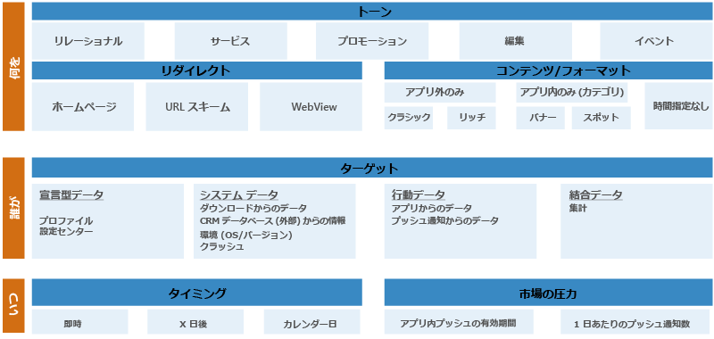
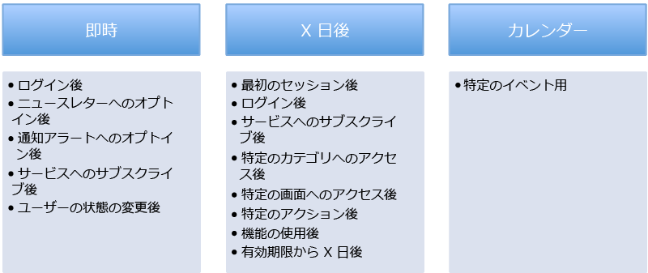

# Azure Mobile Engagement - 概要とベスト プラクティス
## 概要
**モバイル画面のスペースを巡る競争は激しさを増しています。** 2013 年に行われた調査によれば、平均的なモバイル デバイスには 27 個のアプリケーションがインストールされています。 ユーザーが日頃アプリに費やす月間の利用時間は 30 時間となっています。 その時間の大半約 20 時間は、ソーシャル ネットワークやゲームに費やされていました。 2014 年には、Android マーケットでユーザーに提供されているアプリケーション数は約 150 万個を突破しました。 Apple ストアで提供されているアプリの数も 120 万個に及びます。 今もなおモバイル アプリは増え続け、この急成長する市場で開発者は競争を繰り広げています。 

平均的なモバイル ユーザーは、興味の変化やアプリの利用体験に応じて何度もアプリのインストールとアンインストールを繰り返します。 アプリの成功を評価するためには、そのアプリをインストールしたユーザーの数だけでなく、もっと踏み込んだ情報を把握することが不可欠となってきました。 アプリがどの程度役立っているか、また、その使用傾向が変化しているかどうかを知ることが重要です。 以下の問いへの答えを見つける必要があります。

* アプリのユーザーが興味を失い始めているかどうか (アプリに飽きてきているかどうか)。 
* アプリをまったく使わなくなったユーザーの数はどのぐらいか。 
* アプリ内での購入は増加傾向か減少傾向か。
* アプリの問題や関心の薄れから、ユーザーがワークフローを最後まで終えていない可能性はないか。 
* 顧客ユーザー層に最新のコンテンツをプッシュしてアプリの利便性と存在意義を維持できているか。 
* その最新のコンテンツは全ユーザー共通か、それともアプリ内での行動に基づくユーザー セグメントに的を絞っているか。 

以上に挙げたのはほんの一例です。同様の問いに対する答えを探し当てることが、アプリを長く使ってもらい、売上を伸ばす秘訣です。 またそれが顧客ユーザー層を明確にし、維持することにもつながります。 

メディア関連のアプリは、ユーザーのリテンション (定着率) が最も大きくなる傾向があります。 その理由の一つは、絶えず最新のコンテンツをユーザーに届けていることです。 特定のユーザー セグメントに向けた効果的なプッシュ通知を早期に採用することが、アプリのリテンションを大きく左右する傾向があります。 

Azure Mobile Engagement プログラムは、アプリの使用に関する詳しい情報を収集して分析する手段を備えることによって、アプリの寿命と定着率を高めることができるように設計されています。 顧客ユーザー層を行動によって分類し、ターゲットを絞り込んだキャンペーンを作成して、特定のユーザー セグメントにプッシュ通知やアプリ内メッセージを配信することができます。 主要パフォーマンス指標 (KPI) は、アプリのさまざまな側面に関して、顧客ユーザーの積極性を評価する指標です。 Azure Mobile Engagement には、こうした KPI を調べるために必要な手法が用意されています。 モバイル アプリのエンゲージメント促進に必要なインフラストラクチャが備わっているため、投資利益率 (ROI) を効果的にアップさせることができます。 

Azure Mobile Engagement を最大限に活用するためにはまず、よく練られたエンゲージメント プランを立てる必要があります。 そのプランによって、顧客ユーザー層をセグメント化するために必要な粒度の細かいデータが得られます。 たとえば、ユーザーの行動やアプリの利用体験に基づくデータを得ることも可能です。 エンゲージメント プランを成功に導くためには、対象アプリで目指す目標の指標となる KPI を明確に定義することが大切です。 パフォーマンス指標をはっきりと定義しておけば、必要なロジックをアプリに埋め込むのは簡単です。きめの細かいデータを収集し、必要な KPI を分析して評価することができます。 このトピックは、エンゲージメント プランに使用する KPI を定義するうえでのベスト プラクティスを示したガイドとしてご利用ください。 

## ステップ 1: BET モデルに沿って KPI を定義する
KPI を正しく定義することは簡単ではありません。 異なる業界を対象に作成されたアプリは、仕様や目的もそれぞれ異なります。 どう作業を進めればよいかがわからず、つまずいてしまうこともあります。 それを避けるために、**ビジネス**、**エンゲージメント**、**テクニカル**の 3 つの主要カテゴリに目標と KPI を分類しましょう。 私たちはこれを **BET モデル**と呼んでいます。

優れた計画には得てして目標があり、そして BET モデルのカテゴリごとに成功の度合いを測る KPI が含まれています。

#### ビジネス KPI
ビジネスに関する KPI は、最も定義しやすい指標と考えられます。 モバイル アプリを企画した時点で既になんらかの形で定義済みかもしれません。 アプリの売上や ROI は一般に、これらの KPI によって測定することができます。 以下、パフォーマンス指標を定義するときに参考になると思われるビジネス KPI の例をいくつか挙げました。

* メディアのビジネス KPI
  * クリックされた広告の数
  * ユーザーごとのページ アクセス数
  * 現在のサブスクリプション数
* ゲームのビジネス KPI
  * アプリ内購入数
  * ユーザー 1 人あたりの平均収益 (ARPU)
  * セッションごとに費やされた時間
  * プレイ日数と現在のゲーム内レベル
* E コマースのビジネス KPI
  * アプリの使用日数
  * ユーザー 1 人あたりの平均収益 (ARPU)
  * 精算時におけるカート内の平均金額
  * 閲覧と購入が多い製品カテゴリ
* 銀行と保険のビジネス KPI
  * 口座数
  * アクティブ化された機能
  * 訪問されたオファー ページ
  * クリックまたはアクティブ化されたアラート       

#### エンゲージメント KPI
エンゲージメント KPI は、アプリに対するユーザーの愛着度を測るパフォーマンス指標です。 この部分の傾向を把握することで、アプリのリテンションを調べることができます。 以下、この種の KPI で使用されるパフォーマンス指標の例をいくつか挙げます。

* 過去 7 日間に使用したユーザー
* 過去 7 日間使用していないユーザーの数
* アプリを 30 日間使用しなかったユーザーの数  

この領域のインジケーターは、いくつかの外的要因に左右される場合があります。 たとえば、モバイル デバイスをユーザーが常時手にしているというのは、思い込みです。 そうである場合もありますが、そうでない場合もあるのです。 仕事明けや放課後にプレイする可能性の方が高いときは、ゲーム アプリが利用される頻度は、祝日の方が多いと考えられます。   

このカテゴリの KPI が明確に定義されていれば、アプリと利用者の関係を測定することができます。

#### テクニカル KPI
このカテゴリのパフォーマンス指標を利用すると、アプリが正しく動作しているかどうか (ハング、クラッシュしていないかどうか) を調べることができます。 これらのインジケーターによってアプリの正常性を評価し、アプリの利用を妨げる可能性のあるユーザビリティの問題を特定することができます。 このカテゴリに関して収集される情報には、マーケティング チームとの関連性が深いパフォーマンス情報が含まれている場合もあります。 IT 部門やサポート チームが、このデータをトラブルシューティングに利用すれば、未報告のバグを特定できる可能性もあります。 

以下に示したのは、テクニカル KPI の例です。

* 未処理の例外または処理済みの例外に関する情報とカウント 
* 前回のクラッシュのタイムスタンプ
* 最後にクリックされたボタンまたは最後に閲覧されたページ
* アプリのメモリ使用量
* アプリのフレーム レート
* アプリが実行されている OS バージョン
* アプリのバージョン

これらの KPI を定義することによってアプリのパフォーマンスを測定し、隠れたバグをピンポイントで突き止めることができます。 修正プログラムを利用者に配布するのにかかる時間も短縮されると考えられます。 それだけではありません。特定の問題に遭遇したユーザー セグメントを明らかにすることにもつながります。 その分類されたユーザー セグメントを基にキャンペーンを作成し、修正プログラムの公開やプロモーションの予定に関する通知を配信し、顧客満足度を回復させることができます。 

#### 演習 1: KPI ダッシュボードを作成する
マーケティング戦略を立てるときは、主な目標を KPI で示すことをお勧めします。 アプリとエンド ユーザーの行動をモニタリングするうえで必要な情報を収集できるよう、明確に定義されたデータ ポイントを KPI には使用してください。

以下の情報を含んだ KPI ダッシュボードを作成します。

1. 何をアプリの KPI とするか。
2. どのようなデータ ポイントで個々の KPI を表すか。
3. 対象アプリケーションのどこにそのデータがあるか (画面、設定、システムなど)。
4. この KPI に関してエンゲージメント シーケンスを実施できるか。

サンプルとガイダンスについては、[Media Playbook Template][Media Playbook link] の **KPI Builder** ワークシートをご覧ください。

## ステップ 2: エンゲージメント プログラム
好印象なモバイル エンゲージメント プログラムは、アプリの重要な構成要素と考えられます。 そのようなプログラムは必ず、ユーザーを歓迎するプログラムをアプリの使用が開始されたその日に提供しています。 このことがアプリに対するユーザーの愛着度と定着率に大きく貢献する傾向があります。 いくつかの調査によれば、ユーザーの大半は、アプリのインストール後、最初の数日で使用を中止しています。 ユーザーがアプリに関心を持っている間に、ユーザーの期待を満たす、あるいは期待を超えるよう努めることが大切です。 アプリの重要な価値と利点が、利用者に確実に伝わるようにしてください。 

モバイル デバイス ユーザーとの絆を早い段階で深めるうえで、プッシュ通知は最適なアプローチです。 しかし、プッシュ通知の対象ユーザーをセグメント化するときは、十分に注意しなければなりません。 通知を受け取ったユーザーに、スパムのように思われたり、おもしろくないという印象を一度与えてしまうと、取り返しが付かないこともあります。 ユーザーは数クリックでアプリケーションを削除することができるのです。そうなれば、二度と戻ってきてくれないかもしれません。 スパムのように無差別に送るのではなく、アプリ内の価値をユーザーひとりひとりに合わせて送る必要があります。

いったんユーザーに愛着心を持ってもらえれば、他の部分でもエンゲージメント プログラムで効果を得やすくなります。

たとえば、実際のユーザーにアプリを評価してもらうキャンペーンを設定したとします。 このユーザー セグメントは最も積極的にアプリを利用し、使用経験も豊富であることから、きわめて正確な評価を期待できます。 そこで高い評価が得られれば、マーケティングによらない自発的ダウンロードが一気に増え、新規ユーザー獲得のコストを削減することができます。

#### エンゲージメント シーケンス
グローバルなエンゲージメント プログラムには、さまざまなエンゲージメント シーケンスが含まれています。 シーケンスにはそれぞれ到達目標があります。

###### 長く使ってもらうためのプッシュ シーケンス
このプッシュ シーケンスは、アプリに対してユーザーが抱く愛着度の段階によって達成目標が異なります。 同じユーザーでも、使い始めの時期があり、使用頻度の低い時期と高い時期があります。 そのエンゲージメント ライフサイクルの段階ごとに、ドキュメントへのリンクやヒントという形で最新のコンテンツをユーザーに届けるようにしましょう。 

たとえば、新規ユーザーであれば、アプリの基本的な操作方法を必要としていると考えられます。あるいは、新規ユーザー向けのインセンティブも、アプリの初回起動時と同様、喜んでもらえるかもしれません。

*"ご利用ありがとうございます。1 か月間無料でご利用いただくには、ログインしてください。"*

###### 行動を促すためのプッシュ シーケンス
このプッシュ シーケンスのねらいは、アプリに関して収集された行動に基づいてユーザーの使用頻度を高めることです。  

たとえば、フットボール ゲーム アプリを頻繁に利用するユーザーには、次のようなプッシュ通知が効果的と考えられます。

*"フットボール ファンの John さん。ぜひ NFL セクションにログインしてください。スーパー ボールに無料でアクセスできます。"*

###### 注意を喚起するためのプッシュ シーケンス
ユーザーは、自分が興味を持っている分野に特化した情報を歓迎します。 注意を喚起するプッシュ シーケンスを使い、ユーザーがはっきりと興味を示した内容に応じてアラートを送れば、ユーザーとの絆を強めることができます。 アプリの中で自分の関心のある事柄を選択する機会があれば、ユーザーの興味の内容は明白です。 このように明確な意思表示に頼るだけでなく、ユーザーがアプリを操作する過程で収集されたデータに基づいて暗黙的に関心の内容を特定することもできます。

たとえば、E コマース アプリのユーザーが、特定ブランドのコーヒーを定期的に購入していれば、ビジネス KPI でその情報を入手することができます。 次のようなアラートを送れば、アプリに対するユーザーの愛着度を高めることができます。

*"こんにちは Wes さん。お気に入りのブランドのコーヒーが、2015 年 9 月の第 1 週に 25% オフでご購入いただけます。もしまだお気付きでなければと思いご連絡差し上げました。いつもお引き立ていただきありがとうございます。"*

###### 定着率を高めるためのプッシュ シーケンス
切れ目なくプッシュ通知キャンペーンを行い、日常的にアプリに触れる機会を作り出すことで、ユーザーの定着率を高めることが、このシーケンスのねらいです。 ユーザーがそのやり取りを楽しんでくれれば、アプリの定着率を高めることができます。 

たとえば、スポーツに関連したアプリのユーザーには、応援しているチームに応じて次のようなプッシュ通知を週 1 回送ります。

*"200 ポイント獲得のチャンスです。今週のトロント ブルージェイズ戦、ニューヨーク ヤンキースが勝つかどうか投票しましょう。"*

#### 3W アプローチ
各種のプッシュ シーケンスを使いこなせば、エンド ユーザーとの絆を深めることができます。 それでもなお、3W の観点から通知をパーソナライズすることは必要です。 つまり、プッシュ通知を行うたびに、だれ (Who) に何を (What) いつ (When) 送るかを考える必要があります。 この 3 つの問いに明確に答えることができるならば、アプリに対する愛着度を高めるという目的に沿った適切な通知であるといえます。

###### Who: メッセージの送り先となるユーザー セグメント
ユーザーへのプッシュ通知は、諸刃の剣になりかねないコミュニケーション手段です。 特定のユーザー セグメントに宛てて送ろうとしている通知の内容がきちんと厳選され、そのユーザー セグメントの関心を引く内容になっていることを確認してください。 相手の興味を無視した通知は、マイナスに作用する可能性がきわめて大きくなります。 そのような通知はスパムと見なされ、アプリそのものがアンインストールされかねません。 

通知の送信先となるユーザー セグメントは、技術面と行動面の具体的な基準を組み合わせて定義してください。 たとえば単純なケースであれば、次のような文章でユーザー セグメントを定義することができます。

"モバイル アプリケーションを 3 日前に初めて起動し、なおかつログイン ページに 2 回アクセスしたものの、実際にはログインしなかったすべてのユーザー"

このように文章で表現することによって、特定のシナリオに対応するために収集すべきデータを把握することができます。

###### What: 送信するメッセージ
**トーン**

ユーザーとの絆を深めるプロセスにおいては、対象ユーザーに合った適切なトーンを使用してください。 最終的にはそれがエンド ユーザーとのつながりを持ち、アプリに興味を持ってもらうための近道です。 

**リダイレクト**

プッシュ通知の用途は、ただアプリケーションを開くことだけではありません。 通知メッセージで番組のニュースや製品のプロモーションなどのコンテキストを提供する場合、その通知から、アプリケーション内の適切なコンテンツに直接ディープ リンクさせることができます。 このしくみを導入するためには、リダイレクトに対応するための URL スキームをアプリケーションに設ける必要があります。 これはエンゲージメント シーケンスに取り組んでいる方にとって、忘れてはならない重要なステップです。

リダイレクトは、他のシステムに対応させることもできます。 たとえば、アクション URL を使えば、以下に示したようなさまざまなシステムにエンド ユーザーをリダイレクトすることができます。

* Web サイト
* 電子メールのセットアップが済んでいるメールボックス
* SMS ボックス
* ダイヤル サービス
* アプリケーションの評価 (アプリケーション ストアに直接リダイレクト) 

こうして得たさまざまな機会を通じてエンド ユーザーとの絆を深め、パフォーマンスを高めるための自動ルールを作成することができます。

**形式/コンテンツ**

プッシュ通知には次のようにさまざまな形式があります。

1. **お知らせ** : さまざまなタイミングで (アプリの内外を問わずいつでも) 広告メッセージをユーザーに送信できます。
2. **アンケート** : エンド ユーザーに質問を投げかけることでユーザーからの情報を収集できます。 そのようにして収集した回答は、エンド ユーザーをターゲティングするための基準を作成する際に利用できます。
3. **データ プッシュ** : バイナリのデータ ファイルや base64 のデータ ファイルを送信してアプリを更新することができます。 必要な情報をデータ プッシュに格納してアプリケーションに送信することで、アプリの機能をパーソナライズすることができます。 データ プッシュに格納されたデータを処理する機能はアプリケーション側で実装する必要があります。
4. **タイル (Windows Phone のみ)** : Microsoft プッシュ通知サービス (MPNS) を使用して、XML データを含んだネイティブ プッシュ通知を送信することができます (SDK Version 0.9.0 以降でサポートされます。 タイルの最終的なペイロードは 32 キロバイト以下である必要があります)。 メッセージは、ボードのタイルに直接表示されます。
5. **Web ビュー** : Web ビューは、Web コンテンツを含んだポップアップです。 このポップアップは、エンドユーザーがプッシュ通知をクリックしたときに表示されます。 Web ビューでは、エンドユーザーとの対話を増やすことができます。

> [!NOTE]
> アプリの開発とプッシュ通知の送信に関するプラットフォーム (iOS、Android、Windows) ごとのガイドラインに、プッシュ通知として送信する内容が準拠していることを確認してください。
> 
> 

###### When: キャンペーンのタイミング
プッシュ通知を行うキャンペーンを立ち上げる時期として最もふさわしいのはいつでしょうか。 それは手動で行うのでしょうか、自動で行うのでしょうか。 また定期的に送信する必要はあるでしょうか。 ユーザーの心をしっかりとつかむためには適切な時期と頻度は不可欠な要素です。 エンゲージメント シーケンスとシナリオごとに、プッシュ通知をいつ送るのがベストかを指定してください。 いくつかの例を次に示します。

1 日に何度も通知を送信する場合、十分な注意が必要です。それを受け取ったユーザーにスパムと思われる可能性があります。 

送ったメッセージがスパムと受け取られないようにするために、Azure Mobile Engagement には 2 つの機能が用意されています。 1 つ目は、きめ細かいセグメント化です。細かくセグメント化できれば、同じユーザーがターゲットになることはありません。 2 つ目は "クォータ" 機能です。 この機能によって、特定のキャンペーンに関して送信される通知に上限を設けることができます。 たとえば、既定のクォータを週 5 回に設定した場合、キャンペーン ユーザー セグメントに含まれているユーザーが 1 週間に受け取る通知は最大でも 5 通となります。

#### 演習 2: エンゲージメント プログラムを作成する
特定のシーケンスの練習をするために、実際に目標をまとめ、必要なキャンペーンを定義してみましょう。 キャンペーンの通知には必ず 3W のアプローチを適用してください。 

サンプルとガイダンスについては、[Media Playbook Template][Media Playbook link] の **Engagement Program** ワークシートをご覧ください。

## ステップ 3: アプリの統合
#### タグ プランの作成
Azure Mobile Engagement をアプリに統合するには、タグ プランを作成する必要があります。 タグ プランは、プロジェクトの基礎です。 マーケティングの仕様、アプリケーションのワークフロー、さらに KPI を測定するためにアプリ内で収集される実際のタグ データの関係は、タグ プランによって定義されます。 タグ プランによって指定された分析の対象が、ポータルで確認できるようになります。 また、タグ プランによってユーザー セグメントを定義し、ターゲットを絞り込んだプッシュ通知を送ることによってエンド ユーザーとの絆を深めることができます。 いったんタグ プランを定義すれば、Azure Mobile Engagement SDK を使用してコードを追加し、アプリに統合するのは簡単です。

アプリケーションに対し、やみくもにタグ付けすることは避けてください。 対象とするタグ データは、モバイル エンゲージメント戦略に不可欠な要素に限定します。 通常この点はアプリケーションによって異なります。 Azure Mobile Engagement で提供されている [Media Playbook Template][Media Playbook link] を使用すると、所定の方法でタグ プランを作成することができます。 タグ プランを作成する際は、 **Tag Plan** ワークシートを参考にしてださい。

ワークシートのタグ セクションは、具体的に定義してください。 混乱を避けるためには、具体的に記述することがきわめて重要となります。 .それぞれのタグをどのような状況で送信するかを細かく記述してください。 各タグの埋め込み先となるアクティビティの名前も記述します。 いずれもワークシートの **Informative** 欄に記述してください。 Tag plan ワークシートは、テスト検証の主要な参考資料としてご利用ください。 

**Data to collect** セクションには、アプリケーションに埋め込むタグごとに、その種類、名前、値、さらに追加情報 (extra-info) のキー/値ペアを開発チームがわかるように記述する必要があります。

プロジェクトに関わるすべてのチームと連携して、Tag plan シートをレビューすることをお勧めします。 必要な修正を行ったうえで、すべての内容がマーケティング チームおよび開発チームに対して明確になっていることを確認します。

プロジェクトのすべての関係者向けのガイドとしては、 **Statement of work** ワークシートを使用してください。

#### データ型
以下、Azure Mobile Engagement でサポートされる一般的なデータの種類について説明します。

###### デバイスとユーザー
Azure Mobile Engagement は、デバイスごとに一意の ID を生成することによってユーザーを識別します。 この識別子はデバイス ID (または deviceid) と呼ばれます。 同じデバイス上で動作するすべてのアプリケーションは同じデバイス ID を共有します。

###### セッションとアクティビティ
セッションとは、ユーザーによって実行されているアプリの単一のインスタンスです。 ユーザーがアプリを起動してからアプリが停止するまでが、そのセッションの範囲です。

アクティビティとは、セッションの期間中にアプリが実行できる一連の処理を論理的にまとめたものです。 通常は、アプリ内の特定の画面を指しますが、アプリケーションのロジックによって定義されたものすべてがアクティビティになりえます。 最低でもアプリの画面 (アクティビティ) にはすべてタグ付けするようにしてください。 そうすることで、ユーザー パスを把握することができます。

###### イベント
アプリに対するユーザーの対話操作はイベントとして報告されます。 イベントの例として、コンテンツの共有、ビデオの起動など単発的に行われるアクションがあります。 イベントにタグ付けすることで、アプリの使われ方を示すデータを収集することができます。 

###### ジョブ
継続性のある操作はジョブとして報告されます。 いくつかの例を次に示します。

* API 呼び出しの実行
* 広告の表示時間
* バックグラウンド タスクの期間 
* 購入プロセスの期間
* ビデオの視聴

###### エラー
アプリによって検出された問題はエラーとして報告されます。 たとえば、ユーザーの操作の誤りや API 呼び出しの失敗がエラーに該当します。

###### アプリケーション情報
アプリケーションに対するユーザーのエクスペリエンスに関連したデータは、アプリケーション情報 (App-Info) としてタグ付けされます。 この情報は、ユーザーが行うアプリケーションの対話操作によって生成されます。 

Azure Mobile Engagement が特定の app-info キーに関して追跡するのは最新の値だけです (履歴は追跡されません)。 App-info は、アプリまたはエンド ユーザーのステータスを公開します。 そのようなステータスとしては、たとえば、ログイン ステータスやユーザーのお気に入りの製品グループがあります。

###### クラッシュ データ
クラッシュ データは Mobile Engagement SDK によって自動的に収集されます。このデータでは、アプリケーションによって処理されない障害を報告します。 たとえば、未処理の例外がこれに該当します。

###### 追加のデータ
イベント、エラー、アクティビティ、ジョブには、パラメーターを追加することができます。 開発者は、アプリケーションから得られる実際のデータとして、このような追加情報を指定することができます。 セグメント化をきめ細かく定義するためには、こうした情報が重要となります。 

たとえば "article" というタグの値を使用すると、特定の記事をだれが閲覧したか、という観点からエンド ユーザーをセグメント化できます。 しかしそれだけでは不十分な場合もあります。 特定のアクティビティ内で、同じ "article" タグに "news_category" などの追加情報も含まれていれば、さらに効果的です。 ユーザーのお気に入りのカテゴリを動的に調べる目的などに利用することができます。 

Extra-info は、キー/値のペアとして報告されます。 このメディア アプリケーションの例では、"news_category" の extra-info は、そのカテゴリの値です。 たとえば、"sports"、"economy"、"politics" などが該当します。

#### タグと SDK の統合
Azure Mobile Engagement SDK をアプリに統合する詳しい手順については、Azure Web サイトの [Engagement SDK の統合](mobile-engagement-windows-store-integrate-engagement.md)に関するドキュメントに従ってください。 ページ上部のリンクからターゲット プラットフォームを選択できます。

Azure Mobile Engagement を基盤とするアプリのプロジェクトは 2 つ作成することをお勧めします。 1 つは開発とテスト段階、もう 1 つは運用段階での使用を目的としたものです。 その後、ユーザー承認テストが成功したときに、IT チームがテスト段階から運用段階に昇格させます。

#### ユーザー承認テスト (UAT)
すべての機能が設計どおりに動作するかどうかは、ユーザー承認テスト (UAT) で確認します。 ワークフローが最初から最後まで実行可能であること、また、タグ プランに基づいて必要なデータをすべて収集できることが必要です。

* 文書化した Azure Mobile Engagement の想定に従って情報のタグ付けが行われていること。
* 必要とするすべての情報が収集されること (Extra info 値、App info 値を含む)。
* 用語体系がタグ プランに従っていること。
* 送信されるタグに重複がないこと。

アプリに埋め込んだ全種類の通知の動作を隅々までテストしてください。

* アナウンス、ポーリング、データ プッシュ (アプリ外およびアプリ内)
* テキスト/Web ビュー
* バッジ更新、カテゴリ

#### セットアップ
Azure Mobile Engagement のセットアップはきわめて単純です。 ユーザー インターフェイスに関連したドキュメントはすべて、Azure Mobile Engagement の Web サイト ([ユーザー インターフェイスを操作する方法](mobile-engagement-user-interface-home.md)に関するページ) でご覧いただけます。

まず、プロジェクトのユーザーに必要な適切なロールとそのメンバーシップを設定することをお勧めします。 そうすることで、全ユーザーのプラットフォームへのアクセスを適切に管理することができます。 次のロールがあります。

* 管理者
* 開発者
* 閲覧者 

ロールの設定後は、次の操作を行います。

* デバイス ID を登録して自分のデバイス上でテストを行います。
* アカウントの設定に移動してタイム ゾーンを設定し、グラフや通知の配信時刻を設定します。
* アプリケーションの設定に移動し、対象エンド ユーザーを絞り込むために必要な "App-info" を登録します。

初めてのプッシュ通知キャンペーンの実行方法については、 [エンドユーザーに通知するためのプッシュの利用と管理を始める方法](mobile-engagement-how-tos.md)に関するページを参照してください。

## まとめ
エンゲージメント プログラムは日常的に行う作業です。アプリにとって何が最も効果的かを試行錯誤しながら絶えず改善していく必要があります。 

エンゲージメント戦略の構想を練る段階で最初から、グローバルなエンゲージメント戦略を構築しようとしないでください。 段階的なアプローチで KPI とその活用方法を見極めるようにしましょう。 エンゲージメント戦略はアプリごとに異なります。

ある程度構想が固まったら、以下の要素をエンゲージメント プログラムに追加することを検討します。

* 追跡: ユーザーを獲得し、データ収集ソースを定義したら、 Azure Mobile Engagement をそのデータ収集ソースにリンクさせます。 パフォーマンスは、ソースごとに監視することができます。 その情報を活かして、マーケティングへの投資を最大限に高めることが可能です。 
* A/B テスト: エンゲージメント プログラムに不可欠な要素です。 アプリにはそれぞれ固有の仕様があります。 A/B テストを使用してエンゲージメント プログラムを強化することができます。
* geo ロケーション: ブランドにとって非常に大きな機会となる機能です。 この機能によって、適切な時間に適切な場所で広告を配信することができます。 エンド ユーザーの行動データを十分に収集したことを確認したうえで、geo ロケーションの使用を開始するようお勧めします。
* データ プッシュ: データ プッシュは、決して目立った活動ではありませんが、 エンド ユーザーの行動に基づいてアプリケーションをカスタマイズすることができます。 たとえば、ハイテク製品を高頻度で閲覧するユーザー セグメントがある場合、アプリ所有者は、ユーザーのホーム ページをハイテク コンテンツでパーソナライズするデータ プッシュを送ることができます。

## 次のステップ
* [Azure Mobile Engagement アカウントを作成します](mobile-engagement-create.md)。
* Mobile Engagement 戦略を定義する方法について詳しくは、 [Mobile Engagement 戦略の定義](mobile-engagement-define-your-mobile-engagement-strategy.md) に関するページを参照してください。

<!--Image references-->

<!--Link references-->
[Media Playbook link]: https://github.com/Azure/azure-mobile-engagement-samples/tree/master/Playbooks

<!--HONumber=Dec16_HO2-->

