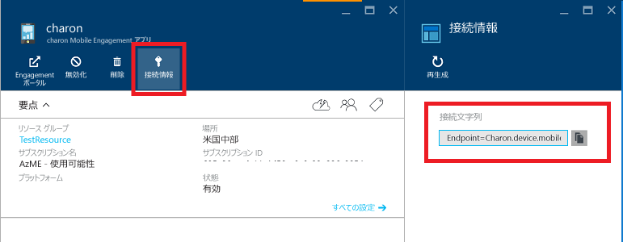

# <a name="get-started-with-azure-mobile-engagement-for-ios-apps-in-objective-c"></a>Objective C で IOS アプリ の Azure Mobile Engagement を開始する
[!INCLUDE [Hero tutorial switcher](../../includes/mobile-engagement-hero-tutorial-switcher.md)]

このトピックでは、Azure Mobile Engagement を使用してアプリの使用状況を把握し、iOS アプリケーションのセグメント化されたユーザーにプッシュ通知を送信する方法について説明します。
このチュートリアルでは、Apple プッシュ通知システム (APNS) を使用して基本データを収集し、プッシュ通知を受信する空の iOS アプリケーションを作成します。

このチュートリアルには、次のものが必要です。

* XCode 8 (Mac アプリ ストアからインストールすることができます)
* [Mobile Engagement iOS SDK]

このチュートリアルを完了することは、iOS アプリケーションの他のすべての Mobile Engagement チュートリアルの前提条件です。

> [!NOTE]
> このチュートリアルを完了するには、アクティブな Azure アカウントが必要です。 アカウントがない場合は、無料試用版のアカウントを数分で作成することができます。 詳細については、「[Azure の無料試用版サイト](https://azure.microsoft.com/pricing/free-trial/?WT.mc_id=A0E0E5C02&amp;returnurl=http%3A%2F%2Fazure.microsoft.com%2Fen-us%2Fdocumentation%2Farticles%2Fmobile-engagement-ios-get-started)」をご覧ください。
>
>

## <a id="setup-azme"></a>iOS アプリ用に Mobile Engagement を設定する
[!INCLUDE [Create Mobile Engagement App in Portal](../../includes/mobile-engagement-create-app-in-portal-new.md)]

## <a id="connecting-app"></a>アプリを Mobile Engagement のバックエンドに接続します
このチュートリアルでは、データを収集してプッシュ通知を送信するために必要な最小限のセットである「基本的な統合」について説明します。 統合に関する完全なドキュメントは、「 [Mobile Engagement iOS SDK 統合](mobile-engagement-ios-sdk-overview.md)

統合のデモンストレーションを行うために、XCode で基本的なアプリを作成します。

### <a name="create-a-new-ios-project"></a>新しい iOS プロジェクトを作成する
[!INCLUDE [Create a new iOS Project](../../includes/mobile-engagement-create-new-ios-app.md)]

### <a name="connect-your-app-to-the-mobile-engagement-backend"></a>アプリを Mobile Engagement のバックエンドに接続します
1. [Mobile Engagement iOS SDK]をダウンロードします。
2. .tar.gz ファイルをコンピューター上のフォルダーに展開します。
3. プロジェクトを右クリックし、 **[Add files to ...]**を選択します。

    ![][1]

4. SDK を抽出したフォルダーに移動し、`EngagementSDK` フォルダーを選択して、左下隅の **[Options]\(オプション\)** をクリックします。**[Copy items if needed]\(必要に応じてアイテムをコピー\)** チェック ボックスとターゲットのチェック ボックスがオンになっていることを確認したら、**[OK]** を押します。

    ![][2]

5. **[フェーズの作成]** タブを開き、**[バイナリとライブラリをリンク]** メニューで、次のようにフレームワークを追加します。

    ![][3]

6. アプリの **[接続情報]** ページで Azure ポータルに戻り、接続文字列をコピーします。

    
7. 次のコード行を **AppDelegate.m** ファイルに追加します。

    ```obj-c
    #import "EngagementAgent.h"
    ```
8. ここで、接続文字列を `didFinishLaunchingWithOptions` デリゲートに貼り付けます。

    ```obj-c
    - (BOOL)application:(UIApplication *)application didFinishLaunchingWithOptions:(NSDictionary *)launchOptions
    {
            [...]   
            [EngagementAgent init:@"Endpoint={YOUR_APP_COLLECTION.DOMAIN};SdkKey={YOUR_SDK_KEY};AppId={YOUR_APPID}"];
            [...]
    }
    ```

9. `setTestLogEnabled` は、問題を識別するための SDK ログを有効にするステートメントです (省略可能)。

## <a id="monitor"></a>リアルタイム監視を有効にする
データを送信してユーザーがアクティブであることを確認するには、少なくとも 1 つの画面 (アクティビティ) を Mobile Engagement のバックエンドに送信する必要があります。

1. **ViewController.h** ファイルを開き、**EngagementViewController.h** をインポートします。

    ```obj-c
    #import "EngagementViewController.h"
    ```

2. **ViewController** インターフェイスのスーパー クラスを `EngagementViewController` に置き換えます。
 
    ```obj-c
   @interface ViewController : EngagementViewController
   ```

## <a id="monitor"></a>リアルタイム監視を使用してアプリを接続する
[!INCLUDE [Connect app with real-time monitoring](../../includes/mobile-engagement-connect-app-with-monitor.md)]

## <a id="integrate-push"></a>プッシュ通知とアプリ内メッセージングを有効にする
Mobile Engagement により、ユーザーと通信を行い、キャンペーンに関するプッシュ通知とアプリ内メッセージングを届けることができます。 このモジュールは、Mobile Engagement ポータルで REACH として呼び出されます。
次のセクションでは、それらを受信するようにアプリをセットアップします。

### <a name="enable-your-app-to-receive-silent-push-notifications"></a>アプリがサイレント プッシュ通知を受信できるようにする
[!INCLUDE [mobile-engagement-ios-silent-push](../../includes/mobile-engagement-ios-silent-push.md)]

### <a name="add-the-reach-library-to-your-project"></a>リーチ ライブラリをプロジェクトに追加する
1. プロジェクトを右クリックします。
2. **[Add file to ...]**を選択します
3. SDK を抽出したフォルダーに移動します。
4. `EngagementReach` フォルダーを選択します
5. **[追加]**をクリックします。

### <a name="modify-your-application-delegate"></a>アプリケーション デリゲートを変更する
1. **AppDeletegate.m** ファイルに戻り、Engagement Reach モジュールをインポートします。

    ```obj-c
    #import "AEReachModule.h"
    #import <UserNotifications/UserNotifications.h>
    ```

2. `application:didFinishLaunchingWithOptions` 内に Reach モジュールを作成し、それをEngagement を初期化する既存の行に渡します。

    ```obj-c
    - (BOOL)application:(UIApplication *)application didFinishLaunchingWithOptions:(NSDictionary *)launchOptions {
        AEReachModule * reach = [AEReachModule moduleWithNotificationIcon:[UIImage imageNamed:@"icon.png"]];
        [EngagementAgent init:@"Endpoint={YOUR_APP_COLLECTION.DOMAIN};SdkKey={YOUR_SDK_KEY};AppId={YOUR_APPID}" modules:reach, nil];
        [...]
        return YES;
    }
    ```

### <a name="enable-your-app-to-receive-apns-push-notifications"></a>アプリで APNS プッシュ通知を受信できるようにする
1. 次の行を `application:didFinishLaunchingWithOptions` メソッドに追加します。

    ```obj-c
    if (NSFoundationVersionNumber >= NSFoundationVersionNumber_iOS_8_0)
    {
        if (NSFoundationVersionNumber > NSFoundationVersionNumber_iOS_9_x_Max)
        {
            [UNUserNotificationCenter.currentNotificationCenter requestAuthorizationWithOptions:(UNAuthorizationOptionBadge | UNAuthorizationOptionSound | UNAuthorizationOptionAlert) completionHandler:^(BOOL granted, NSError * _Nullable error) {}];
        }else
        {
            [application registerUserNotificationSettings:[UIUserNotificationSettings settingsForTypes:(UIUserNotificationTypeBadge | UIUserNotificationTypeSound | UIUserNotificationTypeAlert)   categories:nil]];
        }
        [application registerForRemoteNotifications];
    }
    else
    {
        [application registerForRemoteNotificationTypes:(UIRemoteNotificationTypeBadge | UIRemoteNotificationTypeSound | UIRemoteNotificationTypeAlert)];
    }
    ```
2. 次のように、`application:didRegisterForRemoteNotificationsWithDeviceToken` メソッドを追加します。

    ```obj-c
    - (void)application:(UIApplication *)application didRegisterForRemoteNotificationsWithDeviceToken:(NSData *)deviceToken
    {
            [[EngagementAgent shared] registerDeviceToken:deviceToken];
        NSLog(@"Registered Token: %@", deviceToken);
    }
    ```

3. 次のように、`didFailToRegisterForRemoteNotificationsWithError` メソッドを追加します。

    ```obj-c
    - (void)application:(UIApplication*)application didFailToRegisterForRemoteNotificationsWithError:(NSError*)error
    {
        NSLog(@"Failed to get token, error: %@", error);
    }
    ```

4. 次のように、 `didReceiveRemoteNotification:fetchCompletionHandler` メソッドを追加します。

    ```obj-c
    - (void)application:(UIApplication *)application didReceiveRemoteNotification:(NSDictionary *)userInfo fetchCompletionHandler:(void (^)(UIBackgroundFetchResult result))handler
    {
        [[EngagementAgent shared] applicationDidReceiveRemoteNotification:userInfo fetchCompletionHandler:handler];
    }
    ```
    
[!INCLUDE [mobile-engagement-ios-send-push-push](../../includes/mobile-engagement-ios-send-push.md)]

<!-- URLs. -->
[Mobile Engagement iOS SDK]: http://aka.ms/qk2rnj

<!-- Images. -->
[1]: ./media/mobile-engagement-ios-get-started/xcode-add-files.png
[2]: ./media/mobile-engagement-ios-get-started/xcode-select-engagement-sdk.png
[3]: ./media/mobile-engagement-ios-get-started/xcode-build-phases.png
[4]: ./media/mobile-engagement-ios-get-started/app-connection-info-page.png
