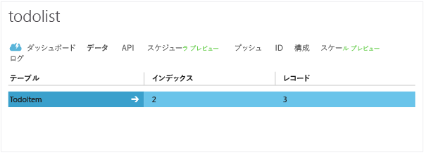

<properties pageTitle="iOS アプリケーション向け Azure のモバイル サービスの使用" metaKeywords="Azure iOS アプリケーション, モバイル サービス iOS, 概要 Azure iOS" description="このチュートリアルでは、iOS 用の開発を行う場合に Azure のモバイル サービスを使用する方法を示します。" metaCanonical="" services="" documentationCenter="Mobile" title="モバイル サービスの使用" authors=""  solutions="" writer="glenga" manager="" editor=""  />

# モバイル サービスの使用

	<a href="/ja-jp/documentation/articles/mobile-services-windows-store-get-started" title="Windows ストア">Windows ストア</a>
	<a href="/ja-jp/documentation/articles/mobile-services-windows-phone-get-started" title="Windows Phone">Windows Phone</a>
	<a href="/ja-jp/documentation/articles/mobile-services-ios-get-started" title="iOS" class="current">iOS</a>
	<a href="/ja-jp/documentation/articles/mobile-services-android-get-started" title="Android">Android</a>
	<a href="/ja-jp/documentation/articles/mobile-services-html-get-started" title="HTML">HTML</a>
	<a href="/ja-jp/documentation/articles/partner-xamarin-mobile-services-ios-get-started" title="Xamarin.iOS">Xamarin.iOS</a>
	<a href="/ja-jp/documentation/articles/partner-xamarin-mobile-services-android-get-started" title="Xamarin.Android">Xamarin.Android</a>
	<a href="/ja-jp/documentation/articles/partner-sencha-mobile-services-get-started/" title="Sencha">Sencha</a>
	<a href="/ja-jp/documentation/articles/mobile-services-javascript-backend-phonegap-get-started/" title="PhoneGap">PhoneGap</a>

	<a href="/ja-jp/documentation/articles/mobile-services-dotnet-backend-ios-get-started/" title=".NET バックエンド">.NET バックエンド</a> |
	<a href="/ja-jp/documentation/articles/mobile-services-ios-get-started/"  title="JavaScript バックエンド" class="current">JavaScript バックエンド</a>

このチュートリアルでは、Azure のモバイル サービスを使用して iOS アプリにクラウドベースのバックエンド サービスを追加する方法を示します。

右側のクリップを見ると、このチュートリアルと同じ手順をビデオで確認できます。

<a href="http://channel9.msdn.com/Series/Windows-Azure-Mobile-Services/iOS-Creating-your-first-app-using-the-Windows-Azure-Mobile-Services-Quickstart" target="_blank" class="label">チュートリアルを見る</a> <a style="background-image: url('/media/devcenter/mobile/videos/get-started-ios-180x120.png') !important;" href="http://channel9.msdn.com/Series/Windows-Azure-Mobile-Services/iOS-Creating-your-first-app-using-the-Windows-Azure-Mobile-Services-Quickstart" target="_blank" class="dev-onpage-video">ビデオを再生する</a> 9:38

このチュートリアルでは、新しいモバイル サービスと、新しいモバイル サービスにアプリ データを保存する簡単な _To do list_ アプリの両方を作成します。作成するモバイル サービスは、サーバー側ビジネス ロジックのために JavaScript を使用します。Visual Studio を使用してサポートされる .NET 言語でサーバー側ビジネス ロジックを記述できるモバイル サービスを作成する方法については、このトピックの「[.NET バックエンド バージョン]」を参照してください。

完成したアプリケーションのスクリーンショットは次のようになります。

![][0]

このチュートリアルを完了するには、XCode 4.5 および iOS 5.0 以降のバージョンが必要です。

<strong></strong>注
 このチュートリアルを完了するには、Azure アカウントが必要です。アカウントがない場合は、無料の試用アカウントを数分で作成することができます。詳細については、<a href="http://www.windowsazure.com/ja-jp/pricing/free-trial/?WT.mc_id=AE564AB28&amp;returnurl=http%3A%2F%2Fwww.windowsazure.com%2Fja-jp%2Fdevelop%2Fmobile%2Ftutorials%2Fget-started-ios%2F" target="_blank">Azure の無料評価版サイト</a>を参照してください。

## 新しいモバイル サービスを作成する

[WACOM.INCLUDE [mobile-services-create-new-service](../includes/mobile-services-create-new-service.md)]

<h2>新しいアプリケーションを作成する新しい iOS アプリケーションを作成する</h2>

モバイル サービスを作成したら、管理ポータルの簡単なクイック スタートに従って、新しいアプリケーションを作成するか、既存のアプリケーションを変更してモバイル サービスに接続することができます。

ここでは、モバイル サービスに接続された新しい iOS アプリを作成します。

1. 管理ポータルで、**[モバイル サービス]** をクリックし、先ほど作成したモバイル サービスをクリックします。

2. [クイック スタート] タブの **[プラットフォームの選択]** で **[iOS]** を選択し、**[新しい iOS アプリを作成する]** を展開します。

   	![][6]

   	これにより、モバイル サービスに接続された iOS アプリを作成するための簡単な 3 つの手順が表示されます。

  	![][7]

3. [Xcode] v4.4 以降をダウンロードしてインストールします (まだインストールしていない場合)。

4. **[TodoItems テーブルを作成する]** をクリックして、アプリケーション データを格納するテーブルを作成します。

5. **[アプリケーションをダウンロードして実行する]** の下の **[ダウンロード]** をクリックします。

  	これにより、モバイル サービスに接続されている _To do list_ サンプル アプリケーションのプロジェクトが、モバイル サービス iOS SDK と共にダウンロードされます。圧縮されたプロジェクト ファイルをローカル コンピューターに保存し、保存場所を書き留めておいてください。

## 新しい iOS アプリを実行する

[WACOM.INCLUDE [mobile-services-ios-run-app](../includes/mobile-services-ios-run-app.md)]

<ol start="4">
<li>
管理ポータルに戻り、[データ]<strong></strong> タブ、<strong>TodoItems</strong> テーブルの順にクリックします。

   	
これで、アプリケーションによってテーブルに挿入されたデータを参照できます。

   	

</li>
</ol>

## 次のステップ
クイック スタートはこれで完了です。モバイル サービスで重要になるこれ以外の作業については、以下のトピックを参照してください。

* [データの使用]
   モバイル サービスを使用してデータの格納およびクエリを実行する方法について説明します。

* [認証の使用]
   ID プロバイダーを使用してアプリケーションのユーザーを認証する方法について説明します。

* [プッシュ通知の使用] 
   アプリケーションにごく基本的なプッシュ通知を送信する方法について説明します。

<!-- Anchors. -->
[モバイル サービスの使用]:#getting-started
[新しいモバイル サービスを作成する]:#create-new-service
[モバイル サービス インスタンスの定義]:#define-mobile-service-instance
[次のステップ]:#next-steps

<!-- Images. -->
[0]: ./media/mobile-services-ios-get-started/mobile-quickstart-completed-ios.png

[6]: ./media/mobile-services-ios-get-started/mobile-portal-quickstart-ios.png
[7]: ./media/mobile-services-ios-get-started/mobile-quickstart-steps-ios.png
[8]: ./media/mobile-services-ios-get-started/mobile-xcode-project.png

[10]: ./media/mobile-services-ios-get-started/mobile-quickstart-startup-ios.png
[11]: ./media/mobile-services-ios-get-started/mobile-data-tab.png
[12]: ./media/mobile-services-ios-get-started/mobile-data-browse.png

<!-- URLs. -->
[データの使用]: /ja-jp/develop/mobile/tutorials/get-started-with-data-ios
[認証の使用]: /ja-jp/develop/mobile/tutorials/get-started-with-users-ios
[プッシュ通知の使用]: /ja-jp/develop/mobile/tutorials/get-started-with-push-ios

[モバイル サービス iOS SDK]: https://go.microsoft.com/fwLink/p/?LinkID=266533
[管理ポータル]: https://manage.windowsazure.com/
[XCode]: https://go.microsoft.com/fwLink/p/?LinkID=266532
[.NET バックエンド バージョン]: /ja-jp/documentation/articles/mobile-services-dotnet-backend-ios-get-started

