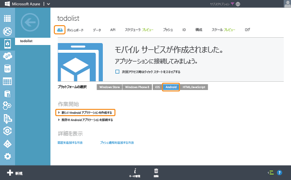

<properties
	pageTitle="Android アプリ用 Azure Mobile Services の使用 (JavaScript バックエンド)"
	description="次のチュートリアルに従って、Android 開発用の Azure Mobile Services を使用します (JavaScript バックエンド)。"
	services="mobile-services"
	documentationCenter="android"
	authors="RickSaling"
	manager="dwrede"
	editor=""/>

<tags
	ms.service="mobile-services"
	ms.workload="mobile"
	ms.tgt_pltfrm="mobile-android"
	ms.devlang="java"
	ms.topic="hero-article"
	ms.date="11/05/2015"
	ms.author="ricksal"/>

# Android 用 Mobile Services の使用 (JavaScript バックエンド)

[AZURE.INCLUDE [mobile-service-note-mobile-apps](../../includes/mobile-services-note-mobile-apps.md)]

&nbsp;

[AZURE.INCLUDE [mobile-services-selector-get-started](../../includes/mobile-services-selector-get-started.md)]

&nbsp;

[AZURE.INCLUDE [mobile-services-hero-slug](../../includes/mobile-services-hero-slug.md)]

このチュートリアルでは、Azure Mobile Services を使用して Android アプリにクラウドベースのバックエンド サービスを追加する方法を示します。このチュートリアルでは、新しいモバイル サービスと、新しいモバイル サービスにアプリケーション データを保存する簡単な **To do list** アプリケーションの両方を作成します。

> [AZURE.VIDEO mobile-get-started-android]

完成したアプリケーションのスクリーンショットは次のようになります。

## 前提条件

このチュートリアルを完了するには、Android Studio 統合開発環境と最新の Android プラットフォームを含む [Android Developer Tools](https://developer.android.com/sdk/index.html) が必要です。このほか、Android のバージョン 4.2 以降が必要になります。

ダウンロードしたクイック スタート プロジェクトには、Android 向けの Azure の Mobile Services SDK が含まれています。

> [AZURE.IMPORTANT]このチュートリアルを完了するには、Azure アカウントが必要です。アカウントがない場合は、無料試用版のアカウントを数分で作成することができます。詳細については、[Azure の無料試用版サイト](http://azure.microsoft.com/pricing/free-trial/?WT.mc_id=AE564AB28)を参照してください。

## 新しいモバイル サービスを作成する

[AZURE.INCLUDE [mobile-services-create-new-service](../../includes/mobile-services-create-new-service.md)]

## 新しい Android アプリを作成する

モバイル サービスを作成したら、Azure クラシック ポータルの簡単なクイック スタートに従って、新しいアプリケーションを作成するか、既存のアプリを変更して、モバイル サービスに接続することができます。

ここでは、モバイル サービスに接続された新しい Android アプリを作成します。

1.  Azure クラシック ポータルで、**[Mobile Services]** をクリックし、先ほど作成したモバイル サービスをクリックします。

2. [クイック スタート] タブの **[プラットフォームの選択]** で **[Android]** を選択し、**[新しい Android アプリを作成する]** を展開します。

   	

   	これにより、モバイル サービスに接続された Android アプリを作成するための簡単な 3 つの手順が表示されます。

  	

3. まだインストールしていない場合は、[Android Developer Tools](https://go.microsoft.com/fwLink/p/?LinkID=280125) をダウンロードしてローカル コンピューターまたは仮想マシンにインストールします。

4. **[TodoItem テーブルを作成する]** をクリックして、アプリケーション データを格納するテーブルを作成します。

5. **[ダウンロード]** ボタンをクリックすると、アプリがダウンロードされます。

## Android アプリを実行する

[AZURE.INCLUDE [mobile-services-run-your-app](../../includes/mobile-services-android-get-started.md)]

## 次のステップ
クイック スタートはこれで完了です。Mobile Services で重要になるこれ以外の作業については、以下のトピックを参照してください。

* [データの使用]  Mobile Services を使用してデータの格納およびクエリを実行する方法について説明します。

* [認証の使用]  ID プロバイダーを使用してアプリケーションのユーザーを認証する方法について説明します。

* [プッシュ通知の使用]  アプリケーションにごく基本的なプッシュ通知を送信する方法について説明します。

[AZURE.INCLUDE [app-service-disqus-feedback-slug](../../includes/app-service-disqus-feedback-slug.md)]

<!-- URLs. -->
[Get started (Eclipse)]: mobile-services-android-get-started-ec.md
[データの使用]: mobile-services-android-get-started-data.md
[認証の使用]: mobile-services-android-get-started-users.md
[プッシュ通知の使用]: mobile-services-javascript-backend-android-get-started-push.md
[Mobile Services Android SDK]: https://go.microsoft.com/fwLink/p/?LinkID=266533

<!---HONumber=AcomDC_1203_2015-->