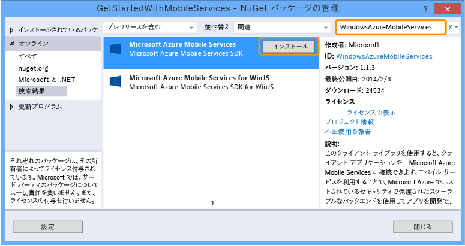
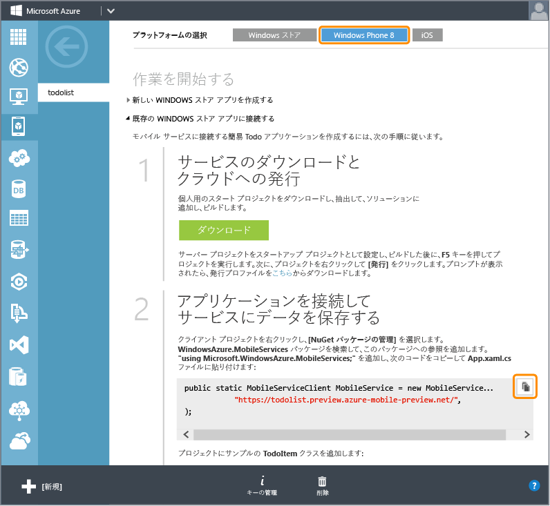

<properties
	pageTitle="既存のアプリへの Mobile Services の追加 (Windows Phone) | Microsoft Azure"
	description="Mobile Services を使用して Windows Phone アプリでデータを活用する方法について説明します。"
	services="mobile-services"
	documentationCenter="windows"
	authors="wesmc7777"
	manager="dwrede"
	editor=""/>

<tags
	ms.service="mobile-services"
	ms.workload="mobile"
	ms.tgt_pltfrm="mobile-windows-phone"
	ms.devlang="dotnet"
	ms.topic="article"
	ms.date="08/18/2015" 
	ms.author="wesmc"/>

# 既存のアプリケーションへの Mobile Services の追加

##概要

[AZURE.INCLUDE [mobile-services-selector-get-started-data-legacy](../../includes/mobile-services-selector-get-started-data-legacy.md)]

このトピックでは、Azure Mobile Services を Windows Phone 8.1 Silverlight アプリのバックエンド データ ソースとして使用する方法について説明します。このチュートリアルでは、メモリにデータを格納するアプリケーションの Visual Studio プロジェクトをダウンロードした後、新しいモバイル サービスを作成してそれをアプリケーションに統合し、アプリケーションの実行時にデータに加えられた変更を表示します。Mobile Services を Windows Phone ストア 8.1 アプリに追加するには、[このバージョンのチュートリアル](mobile-services-dotnet-backend-windows-universal-dotnet-get-started-data.md)を参照してください。

このチュートリアルで作成するモバイル サービスは、Mobile Services の .NET ランタイムをサポートします。これによって、モバイル サービスでサーバー側のビジネス ロジックに .NET 言語と Visual Studio を使用できます。JavaScript でサーバー側ビジネス ロジックを記述できるモバイル サービスを作成する方法については、このトピックの「[JavaScript バックエンド バージョン](mobile-services-windows-phone-get-started-data.md)」を参照してください。

##前提条件

このチュートリアルには、次のものが必要です。

+ Visual Studio 2013 Update 2 以降のバージョン。
+ Microsoft Azure アカウント。アカウントがない場合は、無料試用版アカウントを数分で作成することができます。詳細については、<a href="http://azure.microsoft.com/pricing/free-trial/?WT.mc_id=AE564AB28&amp;returnurl=http%3A%2F%2Fazure.microsoft.com%2Fja-jp%2Fdocumentation%2Farticles%2Fmobile-services-dotnet-backend-windows-store-dotnet-get-started-data%2F" target="_blank">Azure の無料試用版サイト</a>を参照してください。

##GetStartedWithData プロジェクトをダウンロードする

このチュートリアルは、Visual Studio 2013 の Windows Phone Silverlight 8.1 アプリケーション プロジェクトである [GetStartedWithMobileServices アプリケーション](https://code.msdn.microsoft.com/Add-Azure-Mobile-to-a-8b906f72)に基づいています。

1. C# バージョンの GetStartedWithMobileServices サンプル アプリケーションを[デベロッパー サンプル コード集のサイト](https://code.msdn.microsoft.com/Add-Azure-Mobile-to-a-8b906f72)からダウンロードします。

	>[AZURE.NOTE]Windows Phone Silverlght 8.1 アプリケーションを作成するには、ダウンロードした Windows Phone Silverlight 8 アプリケーション プロジェクトの対象 OS を Windows Phone 8.1 に変更します。Windows Phone Store アプリケーションを作成するには、GetStartedWithData サンプル アプリケーション プロジェクトの [Windows Phone Store アプリケーション バージョン](http://go.microsoft.com/fwlink/p/?LinkId=397372)をダウンロードします。

2. Visual Studio を右クリックし、**[管理者として実行]** をクリックして、管理特権で Visual Studio を実行します。

3. Visual Studio で、ダウンロードしたプロジェクトを開き、MainPage.xaml.cs ファイルを確認します。

   	追加された **TodoItem** オブジェクトはメモリ内の **ObservableCollection&lt;TodoItem&gt;** に格納されます。

4. Visual Studio で、アプリケーションのデプロイ ターゲットを選択します。Windows Phone デバイスまたは Windows Phone SDK に付属するエミュレーターにデプロイできます。このチュートリアルでは、エミュレーターへのデプロイ方法を示します。

5. **F5** キーを押します。これにより、デバッグ用にアプリケーションがビルド、デプロイ、開始されます。

6. アプリケーションで、テキスト ボックスにテキストを入力し、**[保存]** をクリックしていくつかの項目をアプリケーションのメモリ内に保存します。

   	

   	更新ボタンの下に、各 `TodoItem` のテキストが、項目に完了マークを付けるチェック ボックスと並んで表示されます。

##新しいモバイル サービスを作成する

[AZURE.INCLUDE [mobile-services-dotnet-backend-create-new-service](../../includes/mobile-services-dotnet-backend-create-new-service.md)]

##モバイル サービス プロジェクトをダウンロードしてソリューションに追加する

1. [Visual Studio Professional 2013](https://go.microsoft.com/fwLink/p/?LinkID=391934) 以降をダウンロードしてインストールします (まだインストールしていない場合)。

2. [Microsoft Azure 管理ポータル](https://manage.windowsazure.com/)で新しい Mobile Service をクリックし、クイック スタート ページで [**Windows**] プラットフォームをクリックします。次に、[**作業の開始**] の下にある [**既存の Windows アプリまたは Windows Phone アプリに接続する**] を展開します。

    

4. **[サービスのダウンロードとクラウドへの発行]** で **[ダウンロード]** をクリックします。

	これにより、モバイル サービスを実装する Visual Studio プロジェクトがダウンロードされます。

4. ダウンロードした個人用のサービス スタート ソリューションを解凍して、zip ファイルにあったフォルダーを、Get Started with Data ソリューション ファイル (.sln) が置かれているのと同じ **C#** ディレクトリにコピーします。これにより、NuGet パッケージ マネージャーはすべてのパッケージの同期を簡単に保てるようになります。

5. Visual Studio のソリューション エクスプ ローラーで、Windows ストア アプリのデータの使用のためのソリューションを右クリックします。**[追加]** をクリックし、**[既存のプロジェクト]** をクリックします。

6. **既存プロジェクトの追加** ダイアログ ボックスで、 **C#** ディレクトリに移動したモバイル サービス プロジェクトのフォルダーを参照します。サービス サブディレクトリ内にある C# プロジェクト ファイル (.csproj) を選択し、[**開く**] をクリックしてそのプロジェクトをソリューションに追加します。

7. Visual Studio のソリューション エクスプ ローラーで、追加したサービス プロジェクトを右クリックし、**[ビルド]** をクリックして、エラーなしでビルドされることを確認します。ビルド中に NuGet パッケージ マネージャーは、プロジェクトで参照されている一部の NuGet パッケージの復元が必要になる場合があります。

8. サービス プロジェクトをもう一度右クリックします。今回は、**デバッグ** コンテキスト メニューの **[新しいインスタンスを開始]** をクリックします。

    Visual Studio では、サービスの既定の Web ページが表示されます。既定の Web ページで **[今すぐ試す]** をクリックして、モバイル サービスのメソッドをテストできます。

    ![モバイル サービスの [今すぐ試してみる] ページ](./media/mobile-services-dotnet-backend-windows-phone-get-started-data/service-welcome-page.png)

    Visual Studio によって、モバイル サービスは既定で IIS Express にローカルでホストされました。タスク バーの IIS Express のトレイ アイコンを右クリックして、これを確認できます。

##Windows Phone アプリを更新して、モバイル サービスを使用する

このセクションでは、Windows Phone アプリを更新してモバイル サービスをアプリケーションのバックエンド サービスとして使用します。

1. Visual Studio のソリューション エクスプローラーで、Windows Phone アプリ プロジェクトを右クリックし、**[NuGet パッケージの管理]** をクリックします。

2. [NuGet パッケージの管理] ダイアログで、オンライン パッケージ コレクションの **WindowsAzure.MobileServices** を検索し、クリックして Azure のモバイル サービス Nuget パッケージをインストールします。次に、ダイアログを閉じます。

    

3. Azure の管理ポータルに戻り、「**アプリケーションを接続してサービスにデータを保存する**」というステップを検索します。`MobileServiceClient` 接続を作成するコード スニペットをコピーします。

    

4. Visual Studio で App.xaml.cs を開きます。コード スニペットを `App` クラス定義の先頭に貼り付けます。また、そのファイルの先頭に次の `using` ステートメントを追加して、ファイルを保存します。

		using Microsoft.WindowsAzure.MobileServices;

5. Visual Studio で MainPage.xaml.cs を開き、ファイルの先頭に using ステートメントを追加します。

		using Microsoft.WindowsAzure.MobileServices;

6. Visual Studio の MainPage.xaml.cs ファイルで、`MainPage` クラス定義を次の定義に置き換え、ファイルを保存します。

    このコードは Mobile Services SDK を使用して、アプリケーションがそのデータをローカルでメモリ内に保存する代わりにサービスによって提供されるテーブルに保存できるようにします。主な方法には、`InsertTodoItem`、`RefreshTodoItems`、`UpdateCheckedTodoItem` の 3 つがあります。これら 3 つの方法では、データ コレクションを Azure のテーブルに非同期的に挿入、クエリ、および更新できます。

        public sealed partial class MainPage : PhoneApplicationPage
        {
            private MobileServiceCollection<TodoItem, TodoItem> items;
            private IMobileServiceTable<TodoItem> todoTable =
                App.MobileService.GetTable<TodoItem>();
            public MainPage()
            {
                this.InitializeComponent();
            }
            private async void InsertTodoItem(TodoItem todoItem)
            {
                await todoTable.InsertAsync(todoItem);
                items.Add(todoItem);
            }
            private async void RefreshTodoItems()
            {
                items = await todoTable
                    .ToCollectionAsync();
                ListItems.ItemsSource = items;
            }
            private async void UpdateCheckedTodoItem(TodoItem item)
            {
                await todoTable.UpdateAsync(item);
            }
            private void ButtonRefresh_Click(object sender, RoutedEventArgs e)
            {
                RefreshTodoItems();
            }
            private void ButtonSave_Click(object sender, RoutedEventArgs e)
            {
                var todoItem = new TodoItem { Text = InputText.Text };
                InsertTodoItem(todoItem);
            }
            private void CheckBoxComplete_Checked(object sender, RoutedEventArgs e)
            {
                CheckBox cb = (CheckBox)sender;
                TodoItem item = cb.DataContext as TodoItem;
                item.Complete = (bool)cb.IsChecked;
                UpdateCheckedTodoItem(item);
            }
            protected override void OnNavigatedTo(NavigationEventArgs e)
            {
                RefreshTodoItems();
            }
        }

##ローカルでホストされているサービスで、Windows Phone アプリケーションをテストする</h2>

このセクションでは Visual Studio を使用して開発用コンピューターでアプリケーションとモバイル サービスをローカルでテストします。IIS Express でローカルにホストされているモバイル サービスを Windows Phone デバイスまたは Windows Phone エミュレーターからテストするには、コンピューターの IP アドレスとポートへの接続を許可するように IIS Express とコンピューターを構成する必要があります。Windows Phone デバイスとエミュレーターは、非ローカル ネットワーク クライアントとして接続します。

#### リモート接続を許可するように IIS Express を構成する

[AZURE.INCLUDE [mobile-services-how-to-configure-iis-express](../../includes/mobile-services-how-to-configure-iis-express.md)]

#### IIS Express でモバイル サービスに対してアプリケーションをテストする

6. Visual Studio で App.xaml.cs ファイルを開き、最近ファイルに貼り付けた `MobileService` 定義をコメント アウトします。コンピューターで構成した IP アドレスとポートに基づいて接続するように、新しい定義を追加します。その後、ファイルを保存します。コードは次のようになります。

        public static MobileServiceClient MobileService = new MobileServiceClient(
            "http://192.168.111.11:54321");

        //public static MobileServiceClient MobileService = new MobileServiceClient(
        //    "https://todolist.azure-mobile.net/",
        //    "XXXXXXXXXXXXXXXXXXXXXXXXXXXXXXXX"
        //);

7. Visual Studio で、F7 キーを押すか、[ビルド] メニューの **[ビルド ソリューション]** をクリックして、Windows Phone アプリとモバイル サービスの両方をビルドします。両方のプロジェクトが Visual Studio の出力ウィンドウにエラーが表示されることなくビルドされることを確認します。

8. Visual Studio で F5 キーを押すか、[デバッグ] メニューの **[デバッグ開始]** をクリックしてアプリケーションを実行し、IIS Express でモバイル サービスをローカルでホストします。

    >[AZURE.NOTE]**[管理者として実行]** オプションを使用して Visual Studio を実行したことを確認します。それ以外の場合、IIS Express が applicationhost.config の変更内容を読み込まない可能性があります。

9. 新しい todoitem のテキストを入力します。その後、**[保存]** をクリックします。これによって、IIS Express でローカルにホストされているモバイル サービスで作成されたデータベースに新しい todoItem が挿入されます。項目のうちの 1 つのチェックボックスをオンにして、完了マークを付けます。

10. Visual Studio でアプリケーションのデバッグを終了します。サーバー エクスプ ローラーを開き、データ接続を展開して、バックエンド サービスに作成されたデータベースの変更を表示できます。**MS\_TableConnectionString** の TodoItems テーブルを右クリックし、**[テーブル データの表示]** をクリックします。

    

11. ローカルにホストされたモバイル サービスのテストが完了したら、コンピューターのポートを開くために作成した Windows ファイアウォール ルールを削除します。

##モバイル サービスを Azure に発行する

[AZURE.INCLUDE [mobile-services-dotnet-backend-publish-service](../../includes/mobile-services-dotnet-backend-publish-service.md)]

##Azure に発行したモバイル サービスをテストする

1. Visual Studio で App.xaml.cs を開きます。ローカルでホストされているモバイル サービスに接続する `MobileServiceClient` を作成するコードをコメント アウトします。Azure のサービスに接続する `MobileServiceClient` を作成するコードをコメント解除します。ファイルの変更内容を保存します。

        sealed partial class App : Application
        {
            //public static MobileServiceClient MobileService = new MobileServiceClient(
            //          "http://192.168.111.11:54321");

            // Use this constructor instead after publishing to the cloud
            public static MobileServiceClient MobileService = new MobileServiceClient(
                 "https://todolist.azure-mobile.net/",
                 "XXXXXXXXXXXXXXXXXXXXXXXXXXXXXXXX"
            );
            ....

2. Visual Studio で F5 キーを押すか、[デバッグ] メニューの **[デバッグ開始]** をクリックします。これにより、Azure でリモートでホストされるモバイル サービスに接続するためにアプリケーションを実行する前に、アプリケーションは前の変更で再ビルドされます。

3. 新しい todoitems をいくつか入力し、それぞれについて **[保存]** をクリックします。チェック ボックスをオンにして、いくつかの新しい項目を完了します。それぞれの新しい todoItem は、Azure 管理ポータルでモバイル サービスに以前に構成した SQL Database で保存および更新されます。

    アプリケーションを再起動して、変更内容が Azure のデータベースに保持されたことを確認できます。また、Azure 管理ポータルまたは Visual Studio の SQL Server オブジェクト エクスプ ローラーを使用して、データベースを確認することもできます。次の 2 つのステップでは、Azure 管理ポータルを使用してデータベースの変更を表示します。

4. Azure 管理ポータルで、モバイル サービスに関連付けられたデータベースの [管理] をクリックします。

    

5. 管理ポータルでクエリを実行して、アプリケーションによって加えられた変更を表示します。クエリは次のようになりますが、`todolist` の代わりにデータベースの名前を使用します。

        SELECT * FROM [todolist].[todoitems]

    

これで、**データの使用**に関するチュートリアルはおしまいです。

##次のステップ

このチュートリアルでは、.NET ランタイムを使用してビルドされた Mobile Services のデータを Windows Phone 8 アプリで操作できるようにするための基本について説明しました。次に、他のチュートリアルを 1 つ試してください。

* [認証の使用]  アプリケーションのユーザーを認証する方法について説明します。

* [アプリケーションにプッシュ通知を追加する]()  アプリにごく基本的なプッシュ通知を送信する方法について説明します。

* [Mobile Services .NET の使用方法の概念リファレンス]  .NET で Mobile Services を使用する方法について説明します。

<!-- Images. -->

<!-- URLs. -->
[Get started with Mobile Services]: ../mobile-services-dotnet-backend-windows-phone-get-started.md
[Get started with data]: mobile-services-dotnet-backend-windows-phone-get-started-data.md
[認証の使用]: mobile-services-dotnet-backend-windows-phone-get-started-users.md
[Get started with push notifications]: mobile-services-dotnet-backend-windows-phone-get-started-push.md

[Windows Phone 8 SDK]: http://go.microsoft.com/fwlink/p/?linkid=268374
[Azure Management Portal]: https://manage.windowsazure.com/
[Management Portal]: https://manage.windowsazure.com/
[Mobile Services SDK]: http://go.microsoft.com/fwlink/p/?LinkId=257545
[デベロッパー サンプル コード集のサイト]: https://code.msdn.microsoft.com/Add-Azure-Mobile-to-a-8b906f72
[Mobile Services .NET の使用方法の概念リファレンス]: mobile-services-windows-dotnet-how-to-use-client-library.md
[MobileServiceClient class]: http://go.microsoft.com/fwlink/p/?LinkId=302030
[How to add a new Windows Firewall port rule]: http://go.microsoft.com/fwlink/?LinkId=392240

<!---HONumber=August15_HO8-->