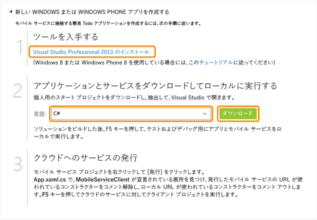

<properties
	pageTitle="Windows ユニバーサル アプリ向けの Mobile Services の使用 | Microsoft Azure"
	description="このチュートリアルでは、ユニバーサル Windows を C# で開発するための Azure Mobile Services の使用方法を示します。"
	services="mobile-services"
	documentationCenter="windows"
	authors="ggailey777"
	manager="dwrede"
	editor=""/>

<tags
	ms.service="mobile-services"
	ms.workload="mobile"
	ms.tgt_pltfrm="mobile-windows"
	ms.devlang="dotnet"
	ms.topic="hero-article"
	ms.date="02/10/2016"
	ms.author="glenga"/>

# Mobile Services の使用

[AZURE.INCLUDE [mobile-service-note-mobile-apps](../../includes/mobile-services-note-mobile-apps.md)]

&nbsp;

[AZURE.INCLUDE [mobile-services-selector-get-started](../../includes/mobile-services-selector-get-started.md)]&nbsp;

>[AZURE.TIP] Microsoft Azure を使用したモバイル開発を初めて行う場合は、Azure Mobile Services の代わりに [Azure Mobile Apps を使用](app-service-mobile-dotnet-backend-windows-store-dotnet-get-started-preview.md)してください。Mobile Apps を通じて[さらに多くのメリット](app-service-mobile-value-prop-migration-from-mobile-services-preview.md)が得られます。

このチュートリアルでは、Azure Mobile Services を使用してユニバーサル Windows アプリにクラウドベースのバックエンド サービスを追加する方法を示します。ユニバーサル Windows アプリ ソリューションには、Windows ストア 8.1 と Windows Phone ストア 8.1 の両方のアプリのプロジェクトと、共通の共有プロジェクトが含まれます。詳細については、「[Windows と Windows Phone を対象とするユニバーサル Windows アプリの構築](http://msdn.microsoft.com/library/windows/apps/xaml/dn609832.aspx)」を参照してください。

このチュートリアルでは、新しいモバイル サービスと、新しいモバイル サービスにアプリケーション データを保存する簡単な *To do list* アプリケーションの両方を作成します。作成するモバイル サービスは、サーバー側ビジネス ロジックのために Visual Studio を使用してサポートされる .NET 言語を使用し、モバイル サービスを管理します。JavaScript でサーバー側ビジネス ロジックを記述できるモバイル サービスを作成する方法については、このトピックの「JavaScript バックエンド バージョン」を参照してください。

>[AZURE.NOTE]このトピックでは、Azure クラシック ポータルを使用して、新しいモバイル サービス プロジェクトとユニバーサル Windows アプリを作成する方法を示します。Visual Studio 2013 更新プログラム 3 を使用して、新しいモバイル サービス プロジェクトを既存の Visual Studio ソリューションに追加することもできます。詳細については、[既存のアプケーションへの Mobile Services の追加](mobile-services-dotnet-backend-windows-universal-dotnet-get-started-data.md)を参照してください。

>モバイル サービスを Windows Phone 8.0 または Windows Phone Silverlight 8.1 アプリ プロジェクトに追加するには、[既存のアプリケーションへの Mobile Services の追加](mobile-services-dotnet-backend-windows-phone-get-started-data.md)を参照してください。

[AZURE.INCLUDE [mobile-services-windows-universal-get-started](../../includes/mobile-services-windows-universal-get-started.md)]

このチュートリアルを完了するには、以下が必要です。

* アクティブな Azure アカウント。アカウントがない場合は、Azure 試用版にサインアップして、最大 10 件の無料モバイル サービスを入手できます。このサービスは評価終了後も使用できます。詳細については、[Azure の無料試用版サイト](https://azure.microsoft.com/pricing/free-trial/?WT.mc_id=A0E0E5C02&amp;returnurl=http%3A%2F%2Fazure.microsoft.com%2Fja-JP%2Fdocumentation%2Farticles%2Fmobile-services-dotnet-backend-windows-store-dotnet-get-started%2F)を参照してください。
* [Visual Studio 2013]。

## 新しいモバイル サービスを作成する

[AZURE.INCLUDE [mobile-services-dotnet-backend-create-new-service](../../includes/mobile-services-dotnet-backend-create-new-service.md)]

## 新しいユニバーサル Windows アプリを作成する

モバイル サービスを作成したら、Azure クラシック ポータルの簡単なクイック スタートに従って、新しいアプリケーションを作成するか、既存のアプリを変更して、モバイル サービスに接続することができます。

ここでは、モバイル サービスに接続された新しいユニバーサル Windows アプリを作成します。

1. [Azure クラシック ポータル]で、**[Mobile Services]** をクリックし、先ほど作成したモバイル サービスをクリックします。

2. [クイック スタート] タブの **[プラットフォームの選択]** で **[Windows]** を選択し、**[新しい Windows ストア アプリを作成する]** を展開します。

   	これにより、モバイル サービスに接続された Windows ストア アプリを作成するための簡単な 3 つの手順が表示されます。

  	

3. まだインストールしていない場合は、[Visual Studio 2013] をダウンロードし、ローカル コンピューターまたは仮想マシンにインストールします。

4. **[アプリケーションとサービスをダウンロードしてローカルに実行する]** で、Windows ストア アプリの言語を選択し、**[ダウンロード]** をクリックします。

  	これにより、モバイル サービスとモバイル サービスに接続されている _To do list_ サンプル アプリケーションの両方のプロジェクトを含むソリューションがダウンロードされます。圧縮されたプロジェクト ファイルをローカル コンピューターに保存し、保存場所を書き留めておいてください。

## ローカル モバイル サービスに対してアプリケーションをテストする

[AZURE.INCLUDE [mobile-services-dotnet-backend-test-local-service-dotnet](../../includes/mobile-services-dotnet-backend-test-local-service-dotnet.md)]

>[AZURE.NOTE]モバイル サービスにアクセスして MainPage.xaml.cs ファイルにあるデータをクエリおよび挿入するコードを確認できます。

## モバイル サービスを発行する

[AZURE.INCLUDE [mobile-services-dotnet-backend-publish-service](../../includes/mobile-services-dotnet-backend-publish-service.md)]

<ol start="4">
<li>
共通コード プロジェクトで、App.xaml.cs ファイルを開き、<a href="http://msdn.microsoft.com/library/Windowsazure/microsoft.windowsazure.mobileservices.mobileserviceclient.aspx" target="_blank">MobileServiceClient</a> インスタンスを作成するコードを見つけて、<em>localhost</em> を使用してこのクライアントを作成するコードをコメント アウトし、リモート モバイル サービス URL を使用してクライアントを作成するコードのコメントを解除すると、次のようになります。

        <pre><code>public static MobileServiceClient MobileService = new MobileServiceClient(
            "https://todolist.azure-mobile.net/",
            "XXXX-APPLICATION-KEY-XXXXX");</code></pre>

	
クライアントは Azure に発行されたモバイル サービスにアクセスするようになります。
</li>
</ol>

## Azure でホストされるモバイル サービスに対してアプリケーションをテストする

モバイル サービスが発行され、クライアントが Azure でホストされるリモート モバイル サービスに接続されたら、項目ストレージ用に Azure を使用してアプリケーションを実行できます。

[AZURE.INCLUDE [mobile-services-windows-universal-test-app](../../includes/mobile-services-windows-universal-test-app.md)]

## 次のステップ
クイック スタートはこれで完了です。Mobile Services で重要になるこれ以外の作業については、以下のトピックを参照してください。

* [既存のアプリケーションへの Mobile Services の追加][Get started with data]  Mobile Services を使用してデータの格納およびクエリを実行する方法について説明します。

* [オフライン データの同期の使用]  オフライン データの同期を使用して、アプリの応答性と信頼性を高める方法について説明します。

* [Mobile Services アプリへの認証の追加][Get started with authentication]  ID プロバイダーを使用してアプリケーションのユーザーを認証する方法について説明します。

* [アプリケーションにプッシュ通知を追加する][Get started with push notifications]  アプリにごく基本的なプッシュ通知を送信する方法について説明します。

* [Mobile Services .NET バックエンドのトラブルシューティング]  Mobile Services .NET バックエンドで発生する問題を診断して解決する方法について説明します。

ユニバーサル Windows アプリの詳細については、「[Supporting multiple device platforms from a single mobile service (単一のモバイル サービスから複数のデバイス プラットフォームをサポートする)](mobile-services-how-to-use-multiple-clients-single-service.md#shared-vs)」を参照してください。

[AZURE.INCLUDE [app-service-disqus-feedback-slug](../../includes/app-service-disqus-feedback-slug.md)]

<!-- Anchors. -->

<!-- Images. -->

<!-- URLs. -->
[Visual Studio 2013]: https://go.microsoft.com/fwLink/p/?LinkID=257546
[Get started with data]: mobile-services-dotnet-backend-windows-universal-dotnet-get-started-data.md
[Get started with data]: ../mobile-services-dotnet-backend-windows-store-dotnet-get-started-data.md
[オフライン データの同期の使用]: mobile-services-windows-store-dotnet-get-started-offline-data.md
[Get started with authentication]: ../mobile-services-dotnet-backend-windows-store-dotnet-get-started-users.md
[Get started with push notifications]: ../mobile-services-dotnet-backend-windows-store-dotnet-get-started-push.md
[Visual Studio Professional 2013]: https://go.microsoft.com/fwLink/p/?LinkID=257546
[Mobile Services SDK]: http://go.microsoft.com/fwlink/?LinkId=257545
[JavaScript and HTML]: mobile-services-win8-javascript/
[Azure クラシック ポータル]: https://manage.windowsazure.com/
[Mobile Services .NET バックエンドのトラブルシューティング]: mobile-services-dotnet-backend-how-to-troubleshoot.md

<!---HONumber=AcomDC_0211_2016-->