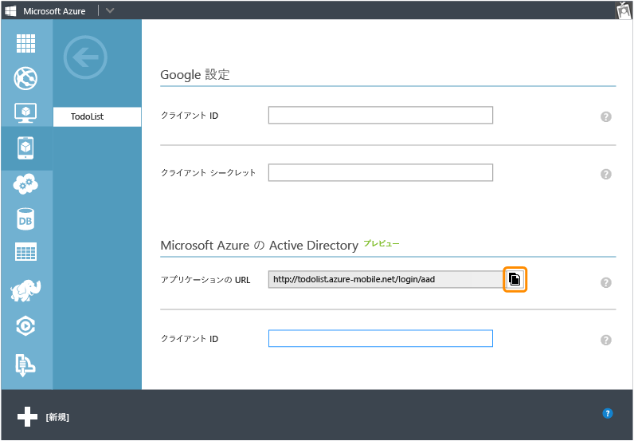
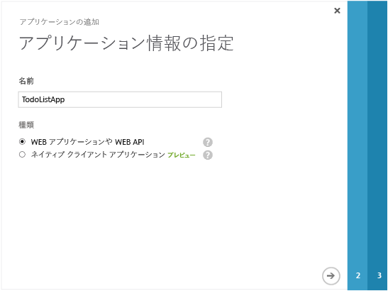
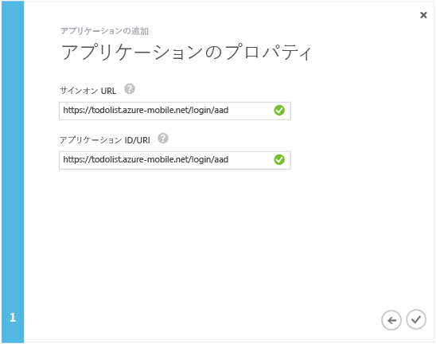
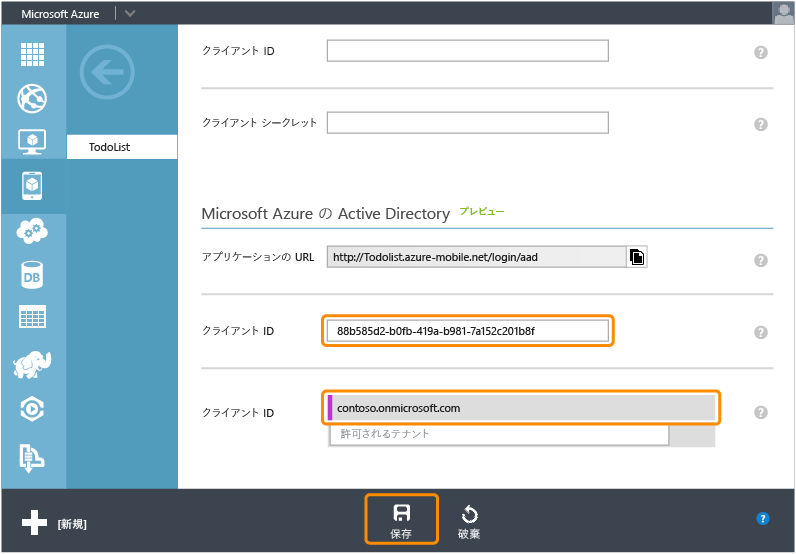

<properties 
	pageTitle="Azure Active Directory 認証用の登録 | Microsoft Azure" 
	description="Mobile Services アプリケーションで Azure Active Directory 認証用に登録する方法について説明します。" 
	authors="wesmc7777" 
	services="mobile-services" 
	documentationCenter="" 
	manager="dwrede" 
	editor=""/>

<tags 
	ms.service="mobile-services" 
	ms.workload="mobile" 
	ms.tgt_pltfrm="multiple" 
	ms.devlang="multiple" 
	ms.topic="article" 
	ms.date="09/24/2015" 
	ms.author="ricksal"/>

# アプリケーションを登録して Azure Active Directory アカウント ログインを使用する

[AZURE.INCLUDE [mobile-services-selector-register-identity-provider](../../includes/mobile-services-selector-register-identity-provider.md)]

##概要

このトピックでは、モバイル サービスの認証プロバイダーとして Azure Active Directory を使用できるようにするためにアプリを登録する方法を説明します。

##アプリを登録する

>[AZURE.NOTE]このトピックで説明する手順は、アプリケーションで[サービス主導型ログイン操作](http://msdn.microsoft.com/library/azure/dn283952.aspx)を使用する場合にチュートリアル「[Mobile Services アプリへの認証の追加](../mobile-services-dotnet-backend-windows-store-dotnet-get-started-users.md)」と併せて使用するように作られています。アプリケーションの要件として Azure Active Directory および .NET バックエンド モバイル サービスに対して[クライアント主導型ログイン操作](http://msdn.microsoft.com/library/azure/jj710106.aspx)が必要な場合は、「[Active Directory 認証ライブラリのシングル サインオンによるアプリケーションの認証](mobile-services-windows-store-dotnet-adal-sso-authentication.md)」チュートリアルに従ってください。

1. [Azure 管理ポータル]にログオンし、モバイル サービスに移動して、**[Identity]** タブをクリックします。**Azure Active Directory** の ID プロバイダー セクションまでスクロールして、そこに表示されている **[アプリの URL]** をコピーします。

    

2. 管理ポータルの **[Active Directory]** に移動してご利用のディレクトリをクリックし、**[ドメイン]** をクリックして、ディレクトリの既定のドメインをメモしておきます。

3. **[アプリケーション]**、**[追加]**、**[組織で開発中のアプリケーションを追加]** を順にクリックします。

4. アプリケーションの追加ウィザードで、アプリケーションの**名前**を入力し、種類として **[Web アプリケーションや Web API]** をクリックします。

    

5. **[サインオン URL]** ボックスで、モバイル サービスからコピーした、アプリの URL の値を貼り付けます。**[アプリケーション ID/URI]** ボックスに同じ一意の値を入力し、クリックして続行します。
 
    

6. アプリケーションが追加されたら、**[構成]** タブをクリックして、アプリの **[クライアント ID]** をコピーします。

    >[AZURE.NOTE]また .NET バックエンド モバイル サービスでは、**[シングル サインオン]** の **[応答 URL]** 値を編集して、モバイル サービスの URL の末尾のパスが _signin-aad_ になるようにします。たとえば、`https://todolist.azure-mobile.net/signin-aad` のように指定します。

7. モバイル サービスの **[ID]** タブに戻り、コピーした **クライアント ID** の値を Azure Active Directory の ID プロバイダーに貼り付けます。
 
    

8.  **[許可されたテナント]** リストで、アプリケーションを登録したディレクトリのドメイン (`contoso.onmicrosoft.com` など) を入力し、**[保存]** をクリックします。

これで、アプリケーションで認証に Azure Active Directory を使用する準備ができました。

<!-- Anchors. -->

<!-- Images. -->

<!-- URLs. -->
[Azure 管理ポータル]: https://manage.windowsazure.com/

 

<!---HONumber=Oct15_HO3-->