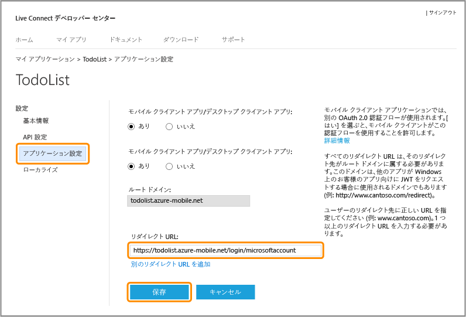
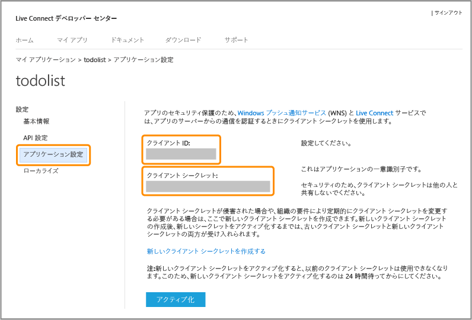

<properties 
	pageTitle="Microsoft 認証用の登録 - Mobile Services" 
	description="Azure Mobile Services アプリケーションで Microsoft 認証用に登録する方法について説明します。" 
	authors="ggailey777" 
	services="mobile-services" 
	documentationCenter="Mobile" 
	manager="dwrede" 
	editor=""/>

<tags 
	ms.service="mobile-services" 
	ms.workload="mobile" 
	ms.tgt_pltfrm="NA" 
	ms.devlang="multiple" 
	ms.topic="article" 
	ms.date="06/14/2015" 
	ms.author="glenga"/>

# 認証で Microsoft アカウントを使用するためのアプリケーションの登録

[AZURE.INCLUDE [mobile-services-selector-register-identity-provider](../../includes/mobile-services-selector-register-identity-provider.md)]

## 概要 

このトピックでは、Azure Mobile Services の ID プロバイダーとして Microsoft アカウントを使用できるようにモバイル アプリを登録する方法について説明します。Live SDK を使用するサービス主導型認証とクライアント主導型認証の両方に同じ手順が適用されます。

##Windows デベロッパー センターで Windows ストア アプリを登録する

Windows ストア アプリを最初に Windows デベロッパー センターで登録する必要があります。

>[AZURE.NOTE]Windows Phone 8、Windows Phone 8.1 Silverlight、および Windows 以外のアプリは、このセクションをスキップできます。

1. アプリケーションをまだ登録していない場合は、Windows ストア アプリのデベロッパー センターで[アプリの提出のページ]に移動し、Microsoft アカウントでログインして、**[アプリの名前]** をクリックします。

   	

2. [**一意の名前を予約することにより新しいアプリを作成する**] をクリックしてから [**続行**] をクリックし、[**アプリ名**] にアプリケーションの名前を入力し、[**アプリの名前の予約**] 、[**保存**] 順にクリックします。

   	

   	これでアプリケーションの新しい Windows ストア登録が作成されます。

3. Visual Studio で、チュートリアル [Mobile Services の使用](mobile-services-dotnet-backend-windows-store-dotnet-get-started.md)を実行したときに作成したプロジェクトを開きます。

4. ソリューション エクスプローラーで Windows ストア アプリ プロジェクトを右クリックし、[**ストア**]、[**アプリケーションをストアと関連付ける**] の順にクリックします。

  	

   	**アプリケーションを Windows ストアと関連付ける**ウィザードが表示されます。

5. ウィザードで、[**サインイン**] をクリックしてから Microsoft アカウントでログインし、手順 2 で予約したアプリケーションを選択して[**次へ**] 、[**関連付け**] の順にクリックします。

   	この操作により、必要な Windows ストア登録情報がアプリケーション マニフェストに追加されます。

6. (省略可能) ユニバーサル Windows アプリケーションの場合、Windows Phone ストア プロジェクトの手順 4 および 5 を繰り返します。

6. 新しいアプリケーションの Windows デベロッパー センター ページに戻り、**[サービス]** をクリックします。

   	

7. [サービス] ページで **[Azure のモバイル サービス]** の **[Live サービス サイト]** をクリックします。

	

これにより、アプリの Microsoft アカウント ページが表示されます。

## Microsoft アカウントの登録の構成と Mobile Services への接続

このセクションの最初の手順は、Windows Phone 8、Windows Phone 8.1 Silverlight、および Windows 以外のストア アプリにのみ適用されます。これらのアプリの場合、Windows ストア アプリでだけ使用可能なパッケージ セキュリティ ID (SID) も無視できます。

1. Windows ストア アプリ以外の場合、Microsoft アカウント デベロッパー センターの <a href="http://go.microsoft.com/fwlink/p/?LinkId=262039" target="_blank">[マイ アプリケーション]</a> ページに移動し、Microsoft アカウントでログオンして (必要な場合)、**[アプリケーションの作成]** をクリックし、**[アプリケーション名]** を入力して、**[同意する]** をクリックします。

   	これにより Microsoft アカウントでアプリ名が確保され、アプリの Microsoft アカウント ページが表示されます。

2. アプリの Microsoft アカウント ページで、**[API 設定]** をクリックし、**[モバイル アプリまたはデスクトップ クライアント アプリ]** を選択し、モバイル サービス URL を **[ターゲット ドメイン]** として設定し、**[リダイレクト URL]** の `https://<mobile_service>.azure-mobile.net/login/microsoftaccount/` の値を指定し、**[保存]** をクリックします。

	 >[AZURE.NOTE]Visual Studio を使用して Azure に発行された .NET バックエンド モバイル サービスについては、リダイレクト URL はユーザーのモバイル サービスの URL の末尾にパス _signin-microsoft_ .NET サービスとしてのユーザーのモバイル サービスを追加したものです (例:`https://todolist.azure-mobile.net/signin-microsoft`)。

    

	**[ルート ドメイン]** は自動的に設定されます。

4. **[アプリ設定]** をクリックして、**[クライアント ID]**、**[クライアント シークレット]**、**[パッケージ SID]** の値を書き留めます。
	
   	
	
	
    > [AZURE.NOTE]クライアント シークレットは、重要なセキュリティ資格情報です。クライアント シークレットは、他のユーザーと共有したり、アプリケーションで配信したりしないでください。Windows ストア アプリの登録でのみ、パッケージ SID フィールドが表示されます。

4. [Azure 管理ポータル]で、モバイル サービスの **[ID]** タブをクリックし、ID プロバイダーから入手したクライアント ID、クライアント シークレット、パッケージ SID を入力して、**[保存]** をクリックします。

 	![Mobile Services の [ID] タブ](./media/mobile-services-how-to-register-microsoft-authentication/mobile-services-identity-tab.png)
	
	>[AZURE.NOTE]Windows Phone 8、Windows Phone Store 8.1 Silverlight、または Windows 以外のアプリの場合は、パッケージ SID を指定する必要はありません。
	
これで、Microsoft アカウントと連携するようにモバイル サービスとアプリケーションが構成されました。

<!-- Anchors. -->

<!-- Images. -->

<!-- URLs. -->

[アプリの提出のページ]: http://go.microsoft.com/fwlink/p/?LinkID=266582
[My Applications]: http://go.microsoft.com/fwlink/p/?LinkId=262039

[Azure 管理ポータル]: https://manage.windowsazure.com/
 

<!---HONumber=August15_HO6-->