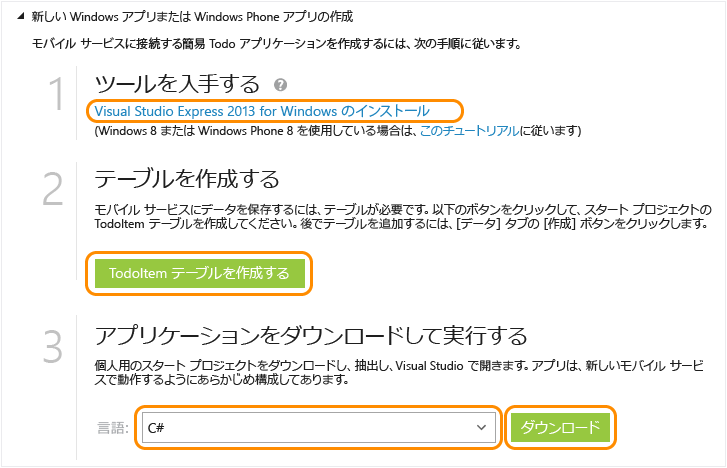

<properties
	pageTitle="Windows ストア アプリ向け Mobile Services の使用 | Microsoft Azure"
	description="このチュートリアルでは、C# または JavaScript で Windows ストア用の開発を行う場合に Azure Mobile Services を使用する方法を示します。"
	services="mobile-services"
	documentationCenter="windows"
	authors="ggailey777"
	manager="dwrede"
	editor=""/>

<tags
	ms.service="mobile-services"
	ms.workload="mobile"
	ms.tgt_pltfrm="mobile-windows"
	ms.devlang="dotnet"
	ms.topic="article" 
	ms.date="08/08/2015"
	ms.author="glenga"/>

# Mobile Services の使用

[AZURE.INCLUDE [mobile-services-selector-get-started](../../includes/mobile-services-selector-get-started.md)]

このチュートリアルでは、Azure Mobile Services を使用してユニバーサル Windows アプリにクラウドベースのバックエンド サービスを追加する方法を示します。ユニバーサル Windows アプリ ソリューションには、Windows ストア 8.1 と Windows Phone ストア 8.1 の両方のアプリのプロジェクトと、共通の共有プロジェクトが含まれます。詳細については、「[Windows と Windows Phone を対象とするユニバーサル Windows アプリの構築](http://msdn.microsoft.com/library/windows/apps/xaml/dn609832.aspx)」を参照してください。

このチュートリアルでは、新しいモバイル サービスと、新しいモバイル サービスにアプリケーション データを保存する簡単な *To do list* アプリケーションの両方を作成します。作成するモバイル サービスは、サーバー側ビジネス ロジックのために JavaScript を使用します。Visual Studio を使用してサポートされる .NET 言語でサーバー側ビジネス ロジックを記述できるモバイル サービスを作成する方法については、このトピックの「.NET バックエンド バージョン」を参照してください。

>[AZURE.NOTE]このトピックでは、Azure 管理ポータルを使用して、新しい Mobile Services プロジェクトとユニバーサル Windows アプリを作成する方法を示します。Visual Studio 2013 を使用して、新しいモバイル サービス プロジェクトを既存の Visual Studio ソリューションに追加することもできます。詳細については、[既存のアプケーションへの Mobile Services の追加](mobile-services-javascript-backend-windows-universal-dotnet-get-started-data.md)を参照してください。

>モバイル サービスを Windows Phone 8.0 または Windows Phone ストア 8.1 アプリ プロジェクトに追加するには、[既存のアプケーションへの Mobile Services の追加](mobile-services-windows-phone-get-started-data.md)を参照してください。

[AZURE.INCLUDE [mobile-services-windows-universal-get-started](../../includes/mobile-services-windows-universal-get-started.md)]

このチュートリアルを完了するには、以下が必要です。

* アクティブな Azure アカウントアカウントがない場合、Azure 評価版にサインアップして、最大 10 件の無料モバイル サービスを入手できます。このサービスは評価終了後も使用できます。詳細については、[Azure の無料試用版サイト](http://azure.microsoft.com/pricing/free-trial/?WT.mc_id=A0E0E5C02&amp;returnurl=http%3A%2F%2Fazure.microsoft.com%2Fja-jp%2Fdocumentation%2Farticles%2Fmobile-services-javascript-backend-windows-store-javascript-get-started%2F)を参照してください。
* [Visual Studio 2013 Express for Windows]

## 新しいモバイル サービスを作成する

[AZURE.INCLUDE [mobile-services-create-new-service](../../includes/mobile-services-create-new-service.md)]

## 新しいユニバーサル Windows アプリを作成する

モバイル サービスを作成したら、管理ポータルの簡単なクイック スタートに従って、新しいユニバーサル Windows アプリを作成するか、既存の Windows ストアまたは Windows Phone アプリ プロジェクトを変更してモバイル サービスに接続することができます。

ここでは、モバイル サービスに接続された新しいユニバーサル Windows アプリを作成します。

1.  管理ポータルで、**[モバイル サービス]** をクリックし、先ほど作成したモバイル サービスをクリックします。

2. [クイック スタート] タブの **[プラットフォームの選択]** で **[Windows]** を選択し、**[新しい Windows ストア アプリを作成する]** を展開します。

   	これにより、モバイル サービスに接続された Windows ストア アプリを作成するための簡単な 3 つの手順が表示されます。

  	

3. まだインストールしていない場合は、[Visual Studio 2013 Express for Windows] をダウンロードし、ローカル コンピューターまたは仮想マシンにインストールします。

4. **[TodoItem テーブルを作成する]** をクリックして、アプリケーション データを格納するテーブルを作成します。

5. **[アプリケーションをダウンロードして実行する]** で、アプリケーションの言語を選択し、**[ダウンロード]** をクリックします。

  	これにより、モバイル サービスに接続する、*To do list* サンプル アプリケーションのプロジェクトがダウンロードされます。圧縮されたプロジェクト ファイルをローカル コンピューターに保存し、保存場所を書き留めておいてください。

## Windows アプリケーションを実行する

[AZURE.INCLUDE [mobile-services-javascript-backend-run-app](../../includes/mobile-services-javascript-backend-run-app.md)]

>[AZURE.NOTE]モバイル サービスにアクセスして MainPage.xaml.cs ファイルにあるデータをクエリおよび挿入するコードを確認できます。

## 次のステップ
クイック スタートはこれで完了です。Mobile Services で重要になるこれ以外の作業については、以下のトピックを参照してください。

* [既存のアプリケーションへの Mobile Services の追加][Get started with data]  Mobile Services を使用してデータの格納およびクエリを実行する方法について説明します。

* [オフライン データの同期の使用]  オフライン データの同期を使用して、アプリの応答性と信頼性を高める方法について説明します。

* [Mobile Services アプリへの認証の追加][Get started with authentication]  ID プロバイダーを使用してアプリケーションのユーザーを認証する方法について説明します。

* [アプリケーションにプッシュ通知を追加する][Get started with push notifications]  アプリにごく基本的なプッシュ通知を送信する方法について説明します。

ユニバーサル Windows アプリの詳細については、「[Supporting multiple device platforms from a single mobile service (単一のモバイル サービスから複数のデバイス プラットフォームをサポートする)](mobile-services-how-to-use-multiple-clients-single-service.md#shared-vs)」を参照してください。

<!-- Anchors. -->
[Getting started with Mobile Services]: #getting-started
[Create a new mobile service]: #create-new-service
[Define the mobile service instance]: #define-mobile-service-instance
[Next Steps]: #next-steps

<!-- Images. -->

<!-- URLs. -->
[Get started with data]: mobile-services-javascript-backend-windows-universal-dotnet-get-started-data.md
[Get started with data]: ../mobile-services-windows-store-dotnet-get-started-data.md
[オフライン データの同期の使用]: mobile-services-windows-store-dotnet-get-started-offline-data.md
[Get started with authentication]: ../mobile-services-windows-store-dotnet-get-started-users.md
[Get started with push notifications]: ../mobile-services-javascript-backend-windows-store-dotnet-get-started-push.md
[Visual Studio 2013 Express for Windows]: http://go.microsoft.com/fwlink/?LinkId=257546
[Mobile Services SDK]: http://go.microsoft.com/fwlink/?LinkId=257545
[Management Portal]: https://manage.windowsazure.com/
[Get started with data in Mobile Services using Visual Studio 2012]: ../mobile-services-windows-store-dotnet-get-started-data-vs2012.md
 

<!---HONumber=August15_HO7-->