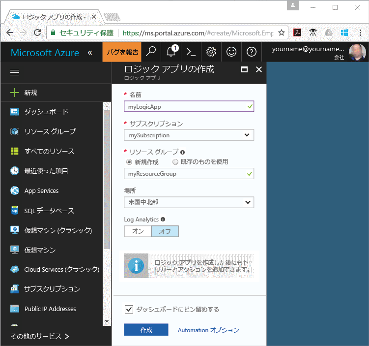
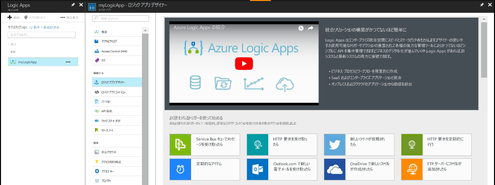
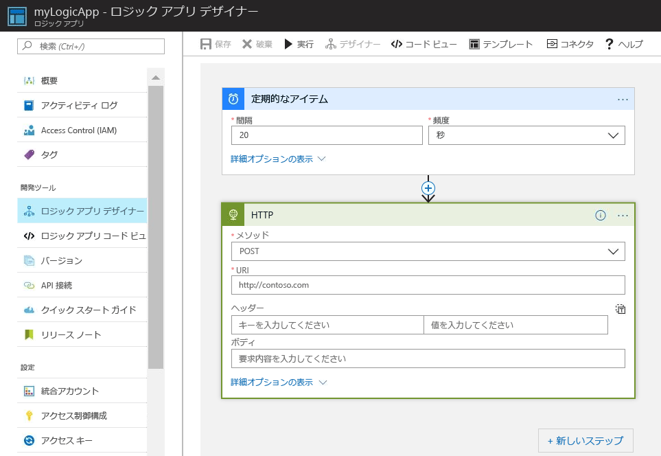
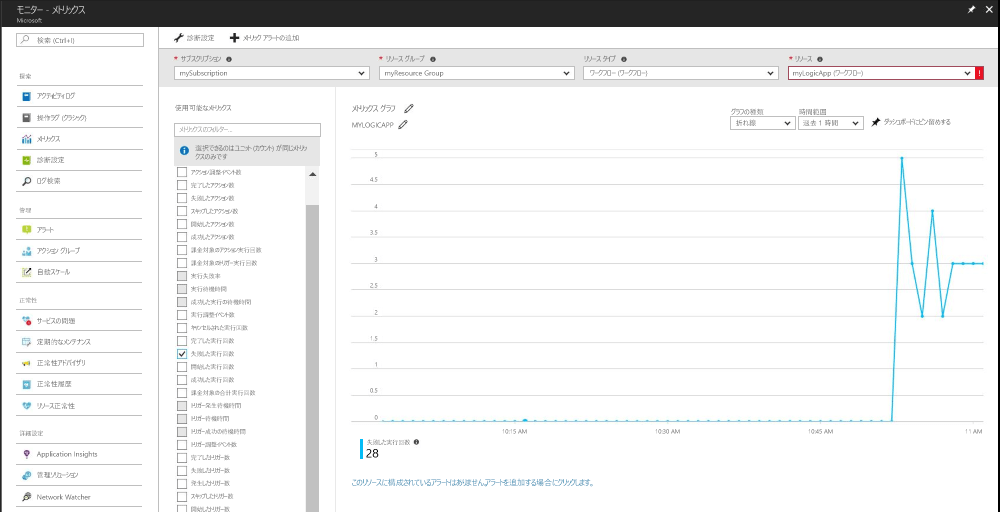
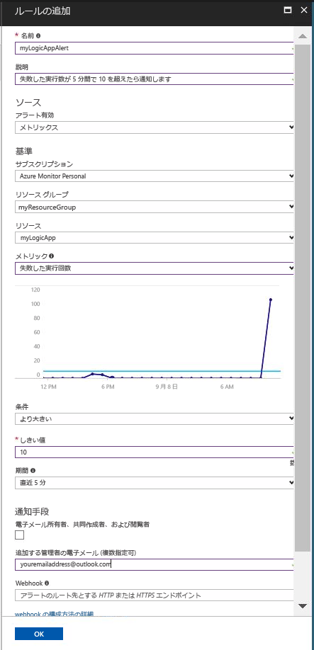

# メトリック値が条件を満たしている場合は通知を受け取る

Azure Monitor はメトリックを多くの Azure リソースで使用できるようにします。 これらのメトリックはリソースのパフォーマンスと正常性を伝えます。 多くの場合、メトリック値はリソースの問題を指している可能性があります。 異常な動作を監視し、その動作が発生した場合は通知するメトリック アラートを作成することができます。 このクイック スタートでは、ロジック アプリの作成、ジョブの作成、およびロジック アプリのメトリックを表示する手順を説明します。 その後、アラートの作成と、ロジック アプリ リソースのメトリックに関する通知を受け取る方法について説明します。

メトリックとメトリック アラートの詳細については、[Azure Monitor メトリックの概要](./monitoring-overview-metrics.md)および [Azure Monitor アラートの概要](./monitoring-overview-alerts.md)に関するページを参照してください。 

Azure サブスクリプションをお持ちでない場合は、開始する前に[無料](https://azure.microsoft.com/free/)アカウントを作成してください。

## Azure ポータルにサインインします。

[Azure ポータル](https://portal.azure.com/)にサインインします。

## ロジック アプリの作成

1. Azure Portal の左上にある **[新規]** ボタンをクリックします。

2. **ロジック アプリ**を検索して選択します。 **myResourceGroup** という名前の新しいリソース グループを作成し、既定の場所を使用します。 **[作成]** ボタンをクリックします。

3. ロジック アプリ情報を入力し、**[ダッシュボードにピン留めする]** オプションをオンにします。 完了したら **[作成]** をクリックします。

      

4. ロジック アプリはダッシュボードにピン留めする必要があります。 クリックしてロジック アプリに移動します。

5. [ロジック アプリ] パネルで、**[ロジック アプリ デザイナー]** を選択します。

       

6. 次の図のように値を設定します。

    。 

7. デザイナーで、**繰り返し**トリガーを選択します。

8. 間隔を 20 に設定し、頻度を秒に設定して、ロジック アプリが 20 秒ごとにトリガーされるようにします。

9. **[新しいステップ]** ボタンをクリックし、**[アクションの追加]** を選択します。

10. **[HTTP]** オプションを選択し、**[HTTP-HTTP]** を選択します。

11. **[メソッド]** を POST に設定し、**[Uri]** を任意の Web アドレスに設定します。

12. [ **Save**] をクリックします。

## ロジック アプリのメトリックを表示する

1. 左側のナビゲーション ウィンドウで **[監視]**オプションをクリックします。

2. **[メトリック]** タブを選択し、ロジック アプリの**サブスクリプション**、**リソース グループ**、**リソースの種類**および**リソース**の情報を入力します。

3. メトリックの一覧から、**[開始された実行]** を選択します。

4. グラフの **[時間の範囲]** を変更し、過去 1 時間のデータを表示するようにします。

5. これで、過去 1 時間にロジック アプリで開始された実行総数を示すグラフが表示されます。

    

## ロジック アプリのメトリック アラートを作成する

1.  メトリック パネルの右上部分にある **[メトリック アラートの追加]** ボタンをクリックします。

2. メトリック アラートに 'myLogicAppAlert' という名前を付け、そのアラートの簡単な説明を入力します。

3. メトリック アラートの **[条件]** を 'より大きい' に設定し、**[しきい値]** を '10' に設定して、**[期間]** を '過去 5 分間' に設定します。

4. 最後に、**[追加する管理者の電子メール]** で電子メール アドレスを入力します。 このアラートを設定することで、5 分以内に失敗したロジック アプリの実行回数が 10 回を超えた場合に電子メールを確実に受け取れるようになります。

    

## ロジック アプリのメトリック アラート通知を受け取る
1. しばらくすると、アラートが 'アクティブ' になったことを通知する電子メールが 'Microsoft Azure アラート' から届きます。

2. ロジック アプリに戻り、繰り返しトリガーの間隔を 1 に変更し、頻度を時間に変更します。

3. これで、数分で、アラートが解決されたことを通知する電子メールが 'Microsoft Azure アラート' から届くようになります。

## リソースのクリーンアップ

このコレクションの他のクイック スタートは、このクイック スタートに基づいています。 引き続きクイック スタートまたはチュートリアルの作業を行う場合は、このクイック スタートで作成したリソースをクリーンアップしないでください。 これ以上作業を行わない場合は、次の手順に従って、このクイック スタートで作成したすべてのリソースを Azure Portal で削除してください。

1. Azure Portal の左側のメニューで、**[監視]** をクリックします。

2. **[アラート]** タブを選択し、このクイック スタート ガイドで作成したアラートを見つけて、それをクリックします。

3. メトリック アラート パネルで、**[削除]** をクリックします。

4. Azure Portal の左側のメニューで、**Logic App** を検索して、**[Logic App]** をクリックします。

5. パネルのテキスト ボックスで、このクイック スタートで作成したロジック アプリをクリックしてから **[削除]** をクリックします。

## 次のステップ

このクイック スタートでは、リソースのメトリック アラートを作成する方法を学習しました。 メトリック アラートの詳細については、クリックしてアラートの概要ページに移動して参照してください。

> [!div class="nextstepaction"]
> [Azure Monitor のサブスクリプション アクション アラート](./monitor-quick-audit-notify-action-in-subscription.md )

