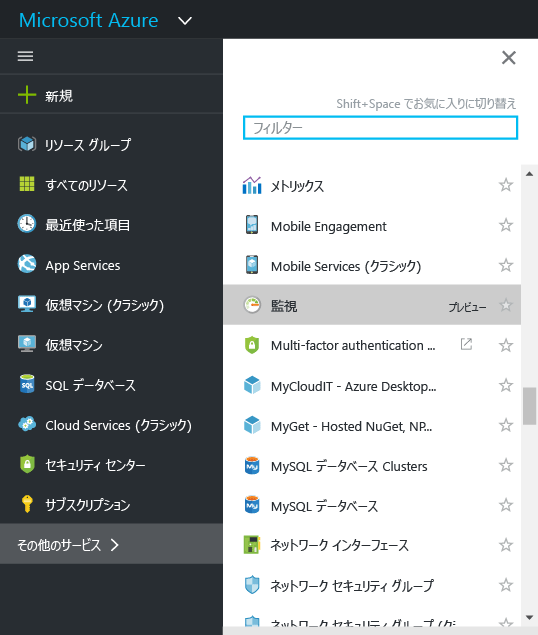
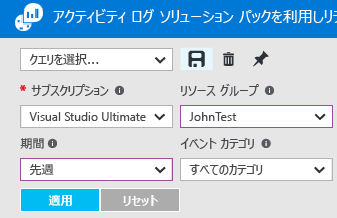
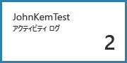
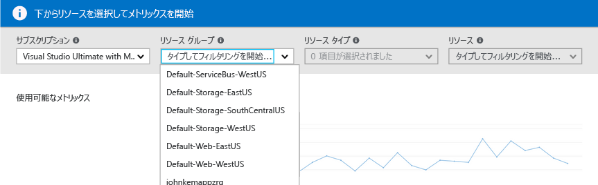
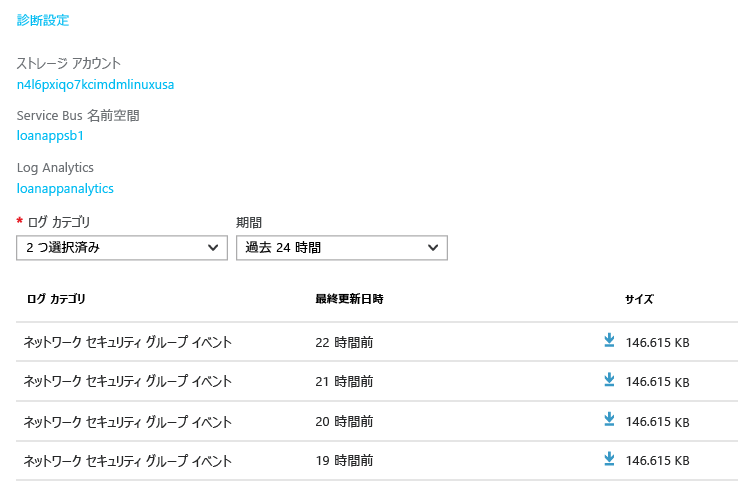
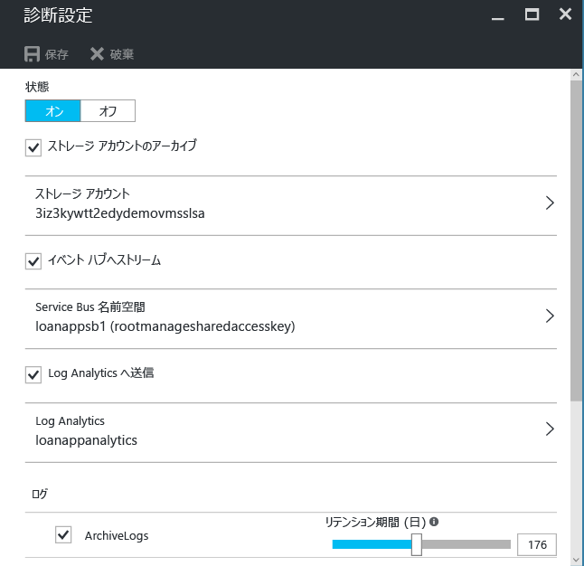
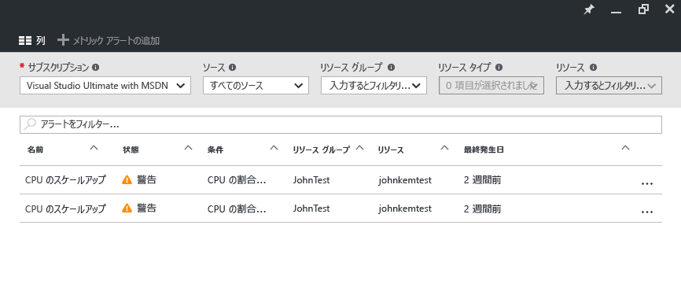
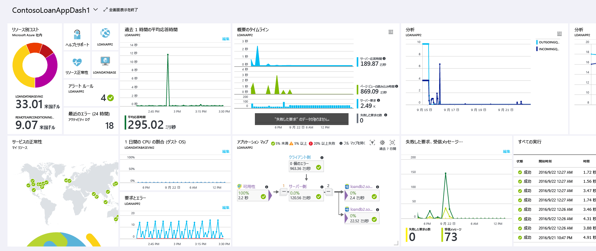

# Azure Monitor の使用
Azure Monitor は、Azure リソースを監視するための&1; つのソースを提供するプラットフォーム サービスです。 Azure Monitor を使用すると、Azure のリソースのメトリックとログを視覚化、クエリ、ルーティング、アーカイブし、そのメトリックとログに対してアクションを実行できます。 このデータを操作するには、Monitor ポータル ブレード、[Monitor PowerShell コマンドレット](insights-powershell-samples.md)、[クロスプラットフォーム CLI](insights-cli-samples.md)、または [Azure Monitor REST API](https://msdn.microsoft.com/library/dn931943.aspx) を使用します。 この記事では、Azure Monitor の重要なコンポーネントをいくつか取り上げて、ポータルを使用しながら説明します。

1. ポータルでは、**[More services (その他のサービス)]** に移動し、**[Monitor]** オプションを見つけます。 星のアイコンをクリックして、このオプションをお気に入りリストに追加し、左側のナビゲーション バーから簡単にアクセスできるようにします。
   
    
2. **[Monitor]** をクリックして、**[Monitor]** ブレードを開きます。 このブレードは、すべての監視設定とデータが&1; つにまとめられた統合ビューです。 最初に開くのは **[アクティビティ ログ]** セクションです。
   
    ![[Monitor] ブレードのナビゲーション](./media/monitoring-get-started/monitor-blade-nav.png)
   
   > [!WARNING]
   > 上部の **[サービスの通知]** オプションと **[通知グループ]** オプションは、この機能のプライベート プレビューに参加しているユーザーにのみ表示されます。
   > 
   > 
   
    Azure Monitor には、**アクティビティ ログ**、**メトリック**、**診断ログ**の&3; つの基本的なデータ監視カテゴリがあります。
3. **[アクティビティ ログ]** をクリックすると、アクティビティ ログ セクションが表示されます。
   
    ![[アクティビティ ログ] ブレード](./media/monitoring-get-started/monitor-act-log-blade.png)
   
    [**アクティビティ ログ**](monitoring-overview-activity-logs.md)には、サブスクリプションのリソースに対して実行されたすべての操作が示されています。 アクティビティ ログを使用すると、サブスクリプションのリソースに対する作成、更新、または削除操作すべてについて、"いつ誰が何を" 行ったのかを確認できます。 たとえば、アクティビティ ログにより、いつ誰が Web アプリを停止したかがわかります。 アクティビティ ログ イベントがプラットフォームに保存され、クエリで使用できる期間は 90 日です。
   
    一般的なフィルターに対するクエリを作成して保存し、最も重要なクエリをポータル ダッシュボードに固定すると、発生したイベントが条件を満たしているかどうかを常に把握できます。
4. 過去&1; 週間の特定のリソース グループが表示されるようにビューをフィルター処理し、 **保存** ボタンをクリックします。
   
    
5. **固定** ボタンをクリックします。
   
    ![アクティビティ ログの [固定] をクリック](./media/monitoring-get-started/monitor-act-log-pin.png)
   
    このチュートリアルのビューのほとんどを、ダッシュボードに固定できます。 これは、サービスの運用データ情報に対して&1; つのソースを作成するうえで役立ちます。 
6. ダッシュボードに戻ります。 クエリ (および結果数) がダッシュボードに表示されていることがわかります。 これは、最近サブスクリプションで実行されたアクションで、目立ったものをすばやく確認する必要がある場合に役立ちます。 たとえば、新しいロールが割り当てられた、VM が削除された、などのアクションを確認できます。
   
    
7. **[Monitor]** タイルに戻り、**[メトリック]** をクリックします。 最初に、ブレードの上部にあるドロップダウン オプションでのフィルター処理と選択によって、リソースを選択する必要があります。
   
    
   
    すべての Azure リソースによって[**メトリック**](monitoring-overview-metrics.md)が出力されます。 このビューでは、すべてのメトリックが&1; つのウィンドウで表示されるため、リソースがどのように実行されているかを簡単に把握できます。
8. リソースを選択すると、ブレードの左側に使用可能なすべてのメトリックが表示されます。 メトリックを選択して複数のメトリックを一度にグラフ化し、グラフの種類と時間の範囲を変更できます。 このリソースに設定されたすべてのメトリック アラートを表示することもできます。
   
    ![[メトリック] ブレード](./media/monitoring-get-started/monitor-metric-blade.png)
   
   > [!NOTE]
   > メトリックの中には、リソースで [[Application Insights]](../application-insights/app-insights-overview.md) や Windows または Linux の Azure 診断を有効にしないと使用できないものがあります。
   > 
   > 
9. グラフに問題がない場合は、 **[固定]** ボタンを使用して、そのグラフをにダッシュボードに固定できます。
10. **[Monitor]** ブレードに戻り、**[診断ログ]** をクリックします。
    
    ![[診断ログ] ブレード](./media/monitoring-get-started/monitor-diaglogs-blade.png)
    
    [**Azure 診断ログ**](monitoring-overview-of-diagnostic-logs.md)は、リソースによって出力されるログです。このログでは、その特定のリソースの操作に関するデータを確認できます。** たとえば、ネットワーク セキュリティ グループの規則の数とロジック アプリ ワークフロー ログの種類は両方とも診断ログです。 こうしたログは、ストレージ アカウントに格納したり、Event Hub にストリーミングしたり、[Log Analytics](../log-analytics/log-analytics-overview.md) に送信したりできます。 Log Analytics は、高度な検索およびアラート機能を備えた Microsoft のオペレーション インテリジェンス製品です。
    
    ポータルでは、サブスクリプションのリソースの一覧を表示およびフィルター処理して、診断ログが有効になっているかどうかを確認できます。
11. 診断ログ ブレードのリソースをクリックします。 診断ログがストレージ アカウントに保存されている場合は、時間単位のログの一覧が表示されます。このログは直接ダウンロードできます。
    
    
    
    **[診断設定]** をクリックして、ストレージ アカウントへのアーカイブ、Event Hubs へのストリーミング、または Log Analytics ワークスペースへの送信を設定したり、こうした設定を変更したりすることもできます。
    
    
    
    Log Analytics への診断ログの設定した場合は、ポータルの **[ログ検索]** セクションで、そのログを検索できます。
12. [Monitor] ブレードの **[アラート]** セクションに移動します。
    
    
    
    ここで、Azure リソースのすべての[**アラート**](monitoring-overview-alerts.md)を管理できます。 これには、メトリック、アクティビティ ログのイベント (プライベート プレビュー)、Application Insights Web テスト (場所)、および Application Insights プロアクティブ診断のアラートが含まれます。 アラートにより、電子メールの送信または webhook URL への HTTP POST をトリガーできます。
13. **[Add metric alert (メトリック アラートの追加)]** をクリックして、アラートを作成します。
    
    ![[Add metric alert (メトリック アラートの追加)]](./media/monitoring-get-started/monitor-alerts-add.png)
    
    その後、アラートをダッシュボードに固定すると、いつでも簡単にその状態を確認できます。
14. [Monitor] セクションには、[Application Insights](../application-insights/app-insights-overview.md) アプリケーションと [Log Analytics](../log-analytics/log-analytics-overview.md) 管理ソリューションへのリンクも含まれます。 こうした他の Micorosoft 製品は Azure Monitor に緊密に統合されています。
15. Application Insights または Log Analytics を使用していない場合、Azure Monitor は、現在のパートナーの監視、ログ、およびアラート製品と連携している可能性があります。 パートナーの一覧と統合方法については、 [パートナー ページ](monitoring-partners.md) を参照してください。

ここで示した手順を実行し、関連するすべてのタイルをダッシュボードに固定すると、次のようなアプリケーションとインフラストラクチャの包括的なビューを作成できます。

## 次のステップ
* [Azure Monitor の概要](monitoring-overview.md)

