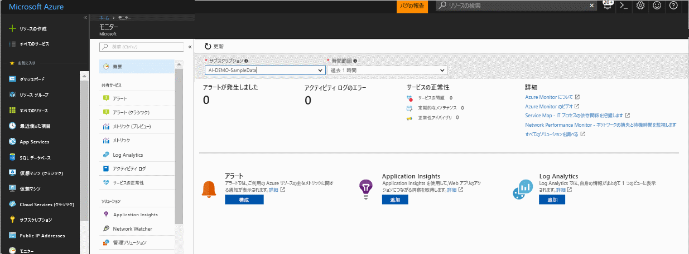
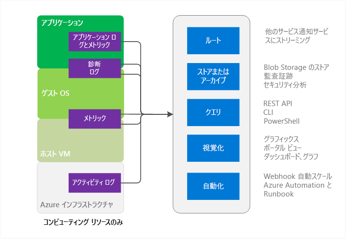
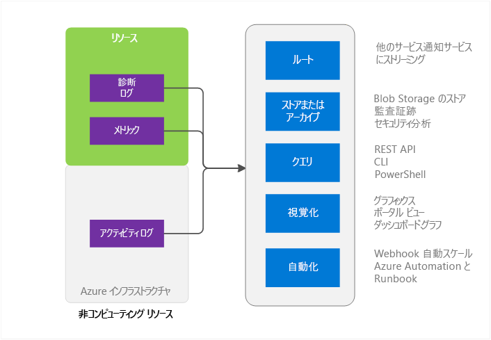

# Azure Monitor の概要
この記事では、Microsoft Azure の Azure Monitor サービスの概要を説明します。 Azure Monitor の動作について説明し、Azure Monitor の使用方法に関するその他の情報の参照先を紹介します。  概要ビデオをご希望の場合は、この記事の最後にある「次のステップ」のリンクを参照してください。 

## Azure Monitor と Microsoft のその他の監視製品
Azure Monitor では、Microsoft Azure のほとんどのサービスに対して、基礎レベルのインフラストラクチャのメトリックとログを提供します。 Azure Monitor にまだデータを格納していない Azure サービスは、今後データを格納する予定です。

Microsoft は、開発者、DevOps、または IT オペレーター向けの追加の監視機能が備わっている製品やサービスを他にも提供しています。これらの機能には、オンプレミスのインストールも用意されています。 このようなさまざまな製品やサービスの連携方法の概要と理解については、[Microsoft Azure での監視](monitoring-overview.md)に関する記事を参照してください。

## ポータルの概要ページ

Azure Monitor には、役立つランディング ページがあります。 
- Azure によって提供される監視機能を理解します。
- Azure のプラットフォームを検出し、高度な監視機能を構成して実行します。

このページは、サービスの開始を含むナビゲーションのための開始ポイントです。 異なるサービスから収集された重要な問題が表示され、状況に応じてそれらの問題に対応できます。
 

ページを開くときに、読み取りアクセス権があるサブスクリプションから選択できます。 選択したサブスクリプションの次の情報を確認できます。

- **トリガーされたアラートとアラートのソース**: このテーブルは、集計数、アラートのソース、および選択した期間中のアラートの発生数を示します。 これは、新旧両方のアラートに適用されます。 詳しくは、[新しい Azure アラート](monitoring-overview-unified-alerts.md)に関するページをご覧ください。 
- **アクティビティ ログ エラー**: いずれかの Azure リソースによって、重大度がエラー レベルであるイベントが記録された場合は、全体の数を表示し、アクティビティ ログ ページに移動して各イベントを調べることができます。
- **Azure Service Health**: Service Health サービスの問題の数、計画メンテナンス イベント、および正常性の勧告を確認できます。 Azure Service Health は、Azure インストラクチャの問題が利用中のサービスにいつ影響を及ぼすかに関するパーソナライズされた情報を提供します。  詳細については、「[Azure Service Health](../service-health/service-health-overview.md)」を参照してください。  
- **Application Insights**: 現在のサブスクリプション内の各 AppInsights リソースの KPI を表示します。 KPI は、ASP.NET Web アプリ、Java、Node、および全般の種類のアプリケーションで、サーバー側のアプリケーションの監視用に最適化されています。 KPI には、要求率、応答時間、エラー率、および可用性 % のメトリックが含まれます。 

Log Analytics または Application Insights を使用していない場合、または現在のサブスクリプション内に Azure アラートを構成していない場合は、オンボード プロセスを開始するためのリンクがページに表示されます。

## Azure Monitor のソース - Compute のサブセット

ここに示した Compute Services には、以下が含まれます。 
- Cloud Services 
- Virtual Machines 
- 仮想マシン スケール セット 
- Service Fabric

### アプリケーション - 診断ログ、アプリケーション ログ、メトリック
コンピューティング リソース用のモデルに示したとおり、アプリケーションはゲスト OS で実行できます。 各アプリケーションからは、それぞれに固有のログとメトリックのセットが出力されます。 Azure Monitor は、Azure 診断拡張機能 (Windows または Linux) を利用して、アプリケーション レベルのメトリックとログの大半を収集します。 種類には次のものが含まれます。

* パフォーマンス カウンター
* Application Logs
* Windows イベント ログ
* .NET イベント ソース
* IIS ログ
* マニフェスト ベースの ETW
* クラッシュ ダンプ
* カスタム エラー ログ

診断拡張機能を使用しない場合、使用できるメトリックはごくわずかです (CPU 使用率など)。 

### ホスト VM とゲスト VM のメトリック
上記のコンピューティング リソースには、対話相手となる専用のホスト VM とゲスト OS が存在します。 ホスト VM およびゲスト OS は、Hyper-V ハイパーバイザー モデルのルート VM およびゲスト VM に相当するものです。 この両方でメトリックを収集できます。 また、ゲスト OS では診断ログを収集することもできます。   

### アクティビティ ログ
リソースの情報については、Azure インフラストラクチャで確認できるようなアクティビティ ログ (旧称、操作ログまたは監査ログ) を検索できます。 このログには、リソースが作成された時点や破棄された時点などの情報が記載されています。  詳細については、[アクティビティ ログの概要](monitoring-overview-activity-logs.md)に関する記事を参照してください。 

## Azure Monitor のソース - 上記以外のすべて

### リソース - メトリックと診断ログ
収集可能なメトリックと診断ログは、リソースの種類によって異なります。 たとえば、Web Apps は、ディスク IO と CPU 使用率に関する統計情報を提供します。 このようなメトリックは、Service Bus キューのためには存在しません。その代わり、このキューには、キューのサイズやメッセージのスループットのようなメトリックが用意されています。 各リソースの収集可能なメトリックの一覧については、[サポートされるメトリック](monitoring-supported-metrics.md)に関する記事を参照してください。 

### ホスト VM とゲスト VM のメトリック
リソースと特定のホスト VM またはゲスト VM の間に必ずしも 1 対 1 のマッピングが存在するわけではありません。そのため、メトリックは使用できません。

### アクティビティ ログ
アクティビティ ログは、コンピューティング リソースの場合と同じです。  

## 監視データの用途
データを収集したら、Azure Monitor でそのデータを使用して、次のことを実行できます。

### ルート
監視データを他の場所にストリーミングできます。 

たとえば、次のようになります。

- Application Insights に送信すると、Application Insights のより優れた視覚化ツールや分析ツールを使用できます。
- Event Hubs に送信すると、サード パーティ製のツールにルーティングできます。 

### 保存とアーカイブ
一部の監視データは既に保存されており、Azure Monitor で一定期間使用できます。 
- メトリックは 90 日間保存されます。 
- アクティビティ ログのエントリは 90 日間保存されます。 
- 診断ログは一切保存されません。 

上記の期間よりも長くデータを保存したい場合は、Azure Storage を使用できます。 監視データは、設定した保持ポリシーに基づいてストレージ アカウントで保持されます。 Azure Storage でこのデータが占有する容量に対して料金が発生します。 

このデータを使用する方法はいくつかあります。

- データが書き込まれたら、それを Azure の内部または外部の他のツールに読み込ませ、処理する。
- データをローカルにダウンロードしてアーカイブするか、クラウドのアイテム保持ポリシーを変更して、データを長期間保持する。  
- アーカイブ目的で、期限を定めることなく Azure Storage にデータを置いておく。 

### クエリ
Azure Monitor REST API、クロス プラットフォーム コマンド ライン インターフェイス (CLI) コマンド、PowerShell コマンドレット、または .NET SDK を使えば、システム ストレージまたは Azure ストレージ内のデータにアクセスできます。

たとえば、次のようになります。

* 独自に作成したカスタム監視アプリケーションのためのデータを取得する
* カスタム クエリを作成し、そのデータをサードパーティ製アプリケーションに送信する

### 視覚化
グラフィックスやグラフで監視データを視覚化すると、データ自体を見るよりも格段に早く傾向を把握できます。  

視覚化の方法には、次のようなものがあります。

* Azure ポータルの使用
* Azure Application Insights にデータをルーティングする
* Microsoft PowerBI にデータをルーティングする
* ライブ ストリーミングを使ってサード パーティ製の視覚化ツールにデータをルーティングするか、ツールに Azure Storage のアーカイブからデータを読み込ませる

### 自動化
> [!NOTE]
> Microsoft Azure アラートの継続的な展開の一部として、アラートの統合されたエクスペリエンスを利用できます。 詳しくは、[新しい Azure アラート](monitoring-overview-unified-alerts.md)に関するページをご覧ください。

Azure アラートでは、アラートはもとより、プロセス全体をトリガーする場合にも、監視データを利用できます。 たとえば、次のようになります。

* データを使用し、アプリケーションの負荷に応じてコンピューティング インスタンスを自動でスケールアップまたはスケールダウンする
* メトリックまたはログの条件に基づいてメールを送信する 
* Web URL (webhook) を呼び出して Azure 外部のシステムでアクションを実行する
* Azure Automation で Runbook を開始し、さまざまなタスクを実行する

## Azure Monitor にアクセスする方法
一般に、次のいずれかの方法で、データの追跡、ルーティング、および取得の操作を行うことができます。 ただし、アクションやデータの種類によっては利用できない方法もあります。

* [Azure Portal](https://portal.azure.com)
* [PowerShell](insights-powershell-samples.md)  
* [クロスプラットフォーム コマンド ライン インターフェイス (CLI)](insights-cli-samples.md)
* [REST API](https://docs.microsoft.com/rest/api/monitor/)
* [.NET SDK](http://www.nuget.org/packages/Microsoft.Azure.Management.Monitor)

## 次の手順
項目ごとに詳しい情報を確認できます。
- Azure Monitor のビデオ チュートリアルは、  
「[Get Started with Azure Monitor](https://channel9.msdn.com/Blogs/Azure-Monitoring/Get-Started-with-Azure-Monitor)」 (Azure Monitor を使ってみる) をご覧ください。 
- Azure Monitor の使用シナリオについて説明するビデオ「[Explore Microsoft Azure monitoring and diagnostics](https://channel9.msdn.com/events/Ignite/2016/BRK2234)」(Microsoft Azure 監視と診断の詳細) および [Azure Monitor の紹介ビデオ (Ignite 2016 より)](https://myignite.microsoft.com/videos/4977) もあります。
- Azure Monitor インターフェイスについては、「[Azure Monitor の使用](monitoring-get-started.md)」をご覧ください。
- クラウド サービス、仮想マシン、仮想マシン スケール セット、または Service Fabric アプリケーションの問題を診断する場合は、[Azure 診断拡張機能](../azure-diagnostics.md)を設定してください。
- [Application Insights](https://azure.microsoft.com/documentation/services/application-insights/) App Service Web アプリの問題を診断する場合には、こちらをご覧ください。
- [Azure Storage のトラブルシューティング](../storage/common/storage-e2e-troubleshooting.md) Storage Blobs、テーブル、またはキューを使用している場合には、こちらをご覧ください。
- [Log Analytics](https://azure.microsoft.com/documentation/services/log-analytics/)
