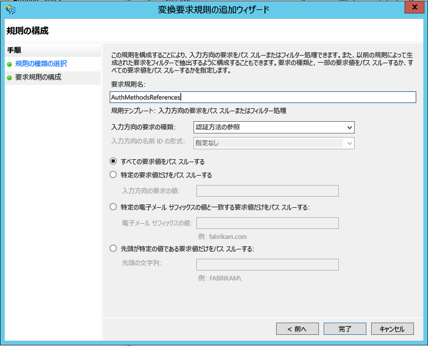

# Azure Multi-Factor Authentication および AD FS を使用したクラウド リソースのセキュリティ保護
組織が Azure Active Directory を使用している場合には、Azure Multi-Factor Authentication または Active Directory フェデレーション サービス (AD FS) を使って、Azure AD がアクセスするリソースをセキュリティで保護できます。 以下では、Azure Multi-factor Authentication または Active Directory フェデレーション サービス (AD FS) を使って Azure Active Directory リソースのセキュリティを確保する方法を紹介します。

## AD FS を使って Azure AD リソースのセキュリティを確保する
クラウド リソースをセキュリティで保護するには、ユーザーが&2; 段階認証の実行に成功したときに、Active Directory フェデレーション サービスが multipleauthn 要求を出力するよう要求規則を設定します。 この要求は、Azure AD に渡されます。 以下では、その手順を説明します。

1. AD FS 管理を開きます。
2. 左側で、**[証明書利用者信頼]** を選択します。
3. **[Microsoft Office 365 ID プラットフォーム]** を右クリックし、**[要求規則の編集…]** を選択します

   

4. [発行変換規則] で、**[規則の追加]** をクリックします。

   

5. 変換要求規則追加ウィザードで、ドロップダウンから **[入力方向の要求をパス スルーまたはフィルター処理]** を選択し、**[次へ]** をクリックします。

   

6. 規則に名前を付けます。 
7. 受信要求の種類として **[認証方法の参照]** を選択します。
8. **[すべての要求値をパススルーする]** を選択します。
    
9. **[完了]**をクリックします。 AD FS 管理コンソールを閉じます。

## フェデレーション ユーザー用の信頼できる IP
管理者は、信頼できる IP を使用すると、特定の IP アドレスまたはイントラネット内から要求が送信されているフェデレーション ユーザーの&2; 段階認証をバイパスできます。 次のセクションで、要求がフェデレーション ユーザーのイントラネット内から送信されている場合に、信頼できる IP とフェデレーション ユーザーを Azure Multi-Factor Authentication にどのように構成し、2 段階認証をどのようにバイパスするかについて説明します。 これは、要求の種類 [企業ネットワーク内] で [入力方向の要求をパス スルーまたはフィルター処理] テンプレートを使用するように AD FS を構成することによって実現されます。

ここで示す例では、証明書利用者信頼で Office 365 を使用します。

### AD FS 要求規則を構成する
最初に実行する必要があるのは、AD FS の要求を構成することです。 2 つの要求規則を作成します。1 つは [企業ネットワーク内] という要求の種類用であり、もう&1; つはユーザーのサインイン状態を維持するためのものです。

1. AD FS 管理を開きます。
2. 左側で、**[証明書利用者信頼]** を選択します。
3. **[Microsoft Office 365 ID プラットフォーム]** を右クリックし、**[要求規則の編集…]** を選択します。
   
4. [発行変換規則] で、**[規則の追加]** をクリックします。
   
5. 変換要求規則追加ウィザードで、ドロップダウンから **[入力方向の要求をパス スルーまたはフィルター処理]** を選択し、**[次へ]** をクリックします。
   
6. [要求規則名] の横にあるボックスに、規則の名前を入力します。 例: InsideCorpNet。
7. [入力方向の要求の種類] の横にあるドロップダウンから、**[企業ネットワーク内]** を選択します。
   
8. **[完了]**をクリックします。
9. [発行変換規則] で、**[規則の追加]** をクリックします。
10. 変換要求規則の追加ウィザードで、ドロップダウンから **[カスタム規則を使用して要求を送信]** を選択し、**[次へ]** をクリックします。
11. [要求規則名] の下のボックスに 「*Keep Users Signed In*」(ユーザーをサインインしたままにする) と入力します。
12. [カスタム規則:] ボックスに次のように入力します。

        c:[Type == "http://schemas.microsoft.com/2014/03/psso"]
            => issue(claim = c);
    
13. **[完了]**をクリックします。
14. **[Apply]**をクリックします。
15. **[OK]**をクリックします。
16. AD FS 管理を閉じます。

### Azure Multi-Factor Authentication の信頼できる IP とフェデレーション ユーザーを構成する
これで要求が準備できたので、信頼できる IP を構成できます。

1. [Azure クラシック ポータル](https://manage.windowsazure.com)にサインインします。
2. 左側の **[Active Directory]**をクリックします。
3. [ディレクトリ] では、信頼できる IP を設定するディレクトリを選択します。
4. 選択したディレクトリで、**[構成]** をクリックします。
5. [多要素認証] セクションで、**[サービス設定の管理]** をクリックします。
6. [サービス設定] ページの [信頼できる IP] で、**[イントラネット内のフェデレーション ユーザーからのリクエストの場合、多要素認証をスキップする]** を選択します。
   
7. **[Save]**をクリックします。
8. 更新が適用されたら、**[閉じる]** をクリックします。

これで終了です。 この時点で、Office 365 のフェデレーション ユーザーは、企業のイントラネットの外部から要求を送信するときに、MFA のみを使用するだけですみます。

