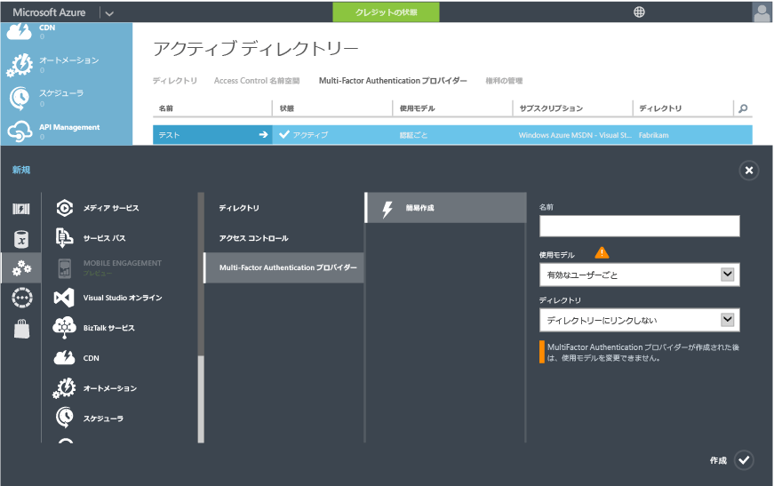

<properties 
	pageTitle="クラウドでの Azure Multi-Factor Authentication Server の概要" 
	description="クラウドで Azure MFA を開始する方法について説明する Azure Multi-Factor Authentication のページです。" 
	services="multi-factor-authentication" 
	documentationCenter="" 
	authors="billmath" 
	manager="stevenpo" 
	editor="curtand"/>

<tags 
	ms.service="multi-factor-authentication" 
	ms.workload="identity" 
	ms.tgt_pltfrm="na" 
	ms.devlang="na" 
	ms.topic="get-started-article" 
	ms.date="02/16/2016" 
	ms.author="billmath"/>

# クラウドでの Azure Multi-Factor Authentication Server の概要

クラウドで多要素認証を使用することを決めたので、早速開始してみましょう。 Azure Multi-Factor Authentication は、わずか数回のクリックで始めることができます。Multi-Factor Authentication for Office 365 または Multi-Factor Authentication for Azure Administrators を使用している場合、手順 3 にスキップできます。

1. [Azure サブスクリプションへのサインアップ](https://azure.microsoft.com/pricing/free-trial/)
	- Azure サブスクリプションをまだ取得していない場合、サインアップする必要があります。Azure MFA を開始して使ってみるだけの場合、評価版のサブスクリプションを使用できます。
2. [Multi-Factor Auth プロバイダーの作成](#creating-an-azure-multi-factor-auth-provider)または[ユーザーへのライセンスの割り当て](#assigning-an-azure-ad-premium-or-enterprise-mobility-license-to-users)
	- 次のいずれかを実行する必要があります。Azure Multi-Factor Auth プロバイダーを作成して自分のディレクトリに割り当てるか、ライセンスをユーザーに割り当てます。ライセンスの使用は、Azure MFA、Azure AD Premium、EMS を所有するユーザーが対象となります。Azure Multi-Factor Authentication は、Azure Active Directory Premium に含まれています。また、Enterprise Mobility Suite にも含まれています。すべてのユーザーが多要素認証を使用するために必要なライセンスがある場合、認証プロバイダーを作成する必要はありません。 
3. [ユーザーの Multi-Factor Authentication を有効にする](#turn-on-multi-factor-authentication-for-users)
	- Office 365 または Azure ポータルを通じてユーザーの Azure MFA を有効にします。 
4. [電子メールをエンド ユーザーに送信して MFA に関して通知する](#send-email-to-end-users)
	- ユーザーのアカウントに対して多要素認証を有効にしたら、電子メールで通知することをお勧めします。次回サインインするときに、ユーザーはプロセスを完了するよう求められます。電子メールを送信しておけば、その心構えができます。 

## Azure Multi-Factor Auth プロバイダーの作成
Azure Active Directory を持つグローバル管理者と Office 365 ユーザーは、既定で多要素認証を使用できます。ただし高度な機能が必要である場合は、通常版の Azure MFA をご購入ください。

Azure Multi-Factor Auth プロバイダーは、通常版の Azure MFA に備わっている機能を活用するために使用されます。その対象となるのは、Azure MFA、Azure AD Premium、EMS のいずれのライセンスも持たないユーザーです。Azure MFA、Azure AD Premium、EMS には、通常版の Azure MFA が既定で含まれています。ライセンスを所有している場合、Azure Multi-Factor Auth プロバイダーは必要ありません。以下の手順で、Azure Multi-Factor Authentication プロバイダーの作成方法を説明します。

### Multi-Factor Auth プロバイダーを作成するには
--------------------------------------------------------------------------------

1. Azure ポータルに管理者としてサインインします。
2. 左側で、[Active Directory] を選択します。
3. [Active Directory] ページの上部で [Multi-Factor Authentication Provider] をクリックします。下部にある **[新規]** をクリックします。
4. [App Services] の下の [Multi-Factor Auth Providers] を選択し、[簡易作成] を選択します。
5. 次のフィールドに入力し、[作成] をクリックします。
	1. 名前 – Multi-Factor Auth プロバイダーの名前。
	2. 使用モデル – Multi-Factor Authentication プロバイダーの使用モデル。
		- 認証ごと – 認証ごとに課金される購入モデル。通常、コンシューマー向けのアプリケーションで Azure Multi-factor Authentication を使用するシナリオで使用されます。
		- 有効ユーザーごと – 有効ユーザーごとに課金される購入モデル。通常、Office 365 などのアプリケーションにアクセスに従業員向けに使用されます。
	2. ディレクトリ – Multi-Factor Authentication プロバイダーに関連付けられている Azure Active Directory テナント。次の点に注意してください。
		- Multi-Factor Auth プロバイダーの作成に、Azure AD ディレクトリは必要はありません。Azure Multi-Factor Authentication Server または SDK のみを使用する計画の場合、これをブランクにすることができます。
		- 高度な機能を利用するためには、Azure AD ディレクトリに Multi-Factor Auth プロバイダーを関連付ける必要があります。
		- Azure AD Connect、AAD Sync、または DirSync は、オンプレミスの Active Directory 環境を Azure AD ディレクトリと同期している場合にのみ必要です。非同期の Azure AD ディレクトリしか使用していない場合、同期は不要です。
		

5. 作成をクリックした後、Multi-Factor Authentication プロバイダーが作成され、"Multi-Factor Authentication プロバイダーが正常に作成されました" というメッセージが表示されます。[OK] をクリックします。

	 
## Azure MFA、Azure AD Premium、または Enterprise Mobility のライセンスをユーザーに割り当てる

Azure MFA、Azure AD Premium、または Enterprise Mobility Suite のライセンスを購入済みである場合、Multi-Factor Auth プロバイダーを作成する必要はありません。ユーザーにライセンスを割り当てるだけで、MFA に対するライセンスの有効化を開始することができます。

### Azure MFA、Azure AD Premium、または Enterprise Mobility Suite のライセンスを割り当てるには
--------------------------------------------------------------------------------

1. Azure ポータルに管理者としてサインインします。
2. 左側で、**[Active Directory]** を選択します。
3. [Active Directory] ページで、有効にするユーザーが存在するディレクトリをダブルクリックします。
4. ディレクトリ ページの上部にある **[ライセンス]** を選択します。
5. [ライセンス] ページで、[Azure Multi-Factor Authentication]、[Active Directory Premium]、または [Enterprise Mobility Suite] を選択し、[割り当て] をクリックします。
6. ダイアログ ボックスで、ライセンスを割り当てるユーザーまたはグループを選択し、チェック マーク アイコンをクリックして変更を保存します。

## ユーザーの多要素認証を有効にする

Azure Multi-factor Authentication のユーザー アカウントには、次の 3 つの異なる状態があります。

状態 | 説明 |非ブラウザー アプリに影響があるか| メモ 
:-------------: | :-------------: |:-------------: |:-------------: |
無効 | 新しいユーザーの既定の状態は、多要素認証に登録されていません。|いいえ|ユーザーは多要素認証を使用していません。
有効 |ユーザーは多要素認証に登録されています。|いいえ。これらは登録プロセスが完了するまで機能し続けます。|ユーザーは有効ですが、登録プロセスが完了していません。次回サインインするときにプロセスを完了するよう求められます。
適用|ユーザーが登録されており、多要素認証を使用するための登録プロセスが完了しています。|はい。アプリ パスワードが作成され、使用されるまでは機能しません。 | ユーザーは登録を完了していない可能性があります。登録プロセスが完了している場合、多要素認証を使用しています。登録プロセスが完了していない場合、次回サインインするときにプロセスを完了するよう求められます。

ユーザーの MFA を有効にするには、次の手順を使用します。

### 多要素認証を有効にするには
--------------------------------------------------------------------------------
1.  Microsoft Azure 管理ポータルに管理者としてサインインします。
2.  左側の [Active Directory] をクリックします。
3.  [ディレクトリ] の下で、有効にするユーザーのディレクトリをクリックします。
4.  上部の [ユーザー] をクリックします。
5.  ページ下部の [多要素認証の管理] をクリックします。
6.  多要素認証を有効にするユーザーを検索します。上部でビューを変更することが必要になる場合があります。状態が無効であることを確認し、名前の横のボックスをオンにします。
7.  右側の [有効化] をクリックします。[多要素認証を有効にする] をクリックします。
8.  有効にした後、ユーザーに通知することをお勧めします。通知は電子メールで行います。ロックアウトされないよう、ブラウザー以外のアプリケーションの使い方も伝えるようにしてください。

Windows PowerShell を使用して状態を変更するには、次の操作を使用できます。`$st.State` を変更して、上記の状態のいずれかと同等になるようにすることができます。

		$st = New-Object -TypeName Microsoft.Online.Administration.StrongAuthenticationRequirement
		$st.RelyingParty = "*"
		$st.State = “Enabled”
		$sta = @($st)
		Set-MsolUser -UserPrincipalName bsimon@contoso.com -StrongAuthenticationRequirements $sta

## エンド ユーザーへの電子メールの送信

ユーザーを有効にした後、連絡先情報を提供する必要があることを知らせる電子メールをユーザーに送信することをお勧めします。電子メール テンプレートの例を参考として以下に示します。ユーザーに視聴を促すビデオへのリンクも含まれています。

		Subject: ACTION REQUIRED: Your password for Outlook and other apps needs updated

		Body:

		For added security, we have enabled multi-factor authentication for your account. 

		Action Required: You will need to complete the enrollment steps below to make your account secure with multi-factor authentication.  

		What to expect once MFA is enabled:

		Multi-factor authentication requires a password that you know and a phone that you have in order to sign into browser applications and to access Office 365, Azure portals.

		For Office 365 non-browser applications such as outlook, lync, a mail client on your mobile device etc, a special password called an app password is required instead of your account password to sign in. App passwords are different than your account password, and are generated during the multi-factor authentication set up process. 

		Please follow these enrollment steps to avoid interruption of your Office 365 service:

			1.  Sign in to the Office 365 Portal at http://portal.microsoftonline.com.
			2.  Follow the instructions to set up your preferred multi-factor authentication method when signing into Office 365 using a web browser. 
			3.  Create one app password for each device.
			4.  Enter the same app password in all applicable apps on that device e.g. Outlook, Mail client, Lync, Word, Powerpoint, Excel, CRM etc. 
			5.  Update your Office client applications or other mobile applications to use an app password.

		You can visit http://aka.ms/mfasetup to create app passwords or change your MFA Setting.  Please bookmark this.

		NOTE: Before entering an app password, you will need to clear the sign-in information (delete sign-in info), restart the application,   and sign-in with the username and app password. Follow the steps documented : http://technet.microsoft.com/library/dn270518.aspx#apppassword.

		Watch a video showing these steps at http://g.microsoftonline.com/1AX00en/175.

		Best Regards,
		Your Administrator

## 次のステップ
クラウド側の多要素認証を設定したら、デプロイ側の構成とセットアップを行います。「[Azure Multi-Factor Authentication の構成](multi-factor-authentication-whats-next.md)」を参照してください。

<!---HONumber=AcomDC_0323_2016-->