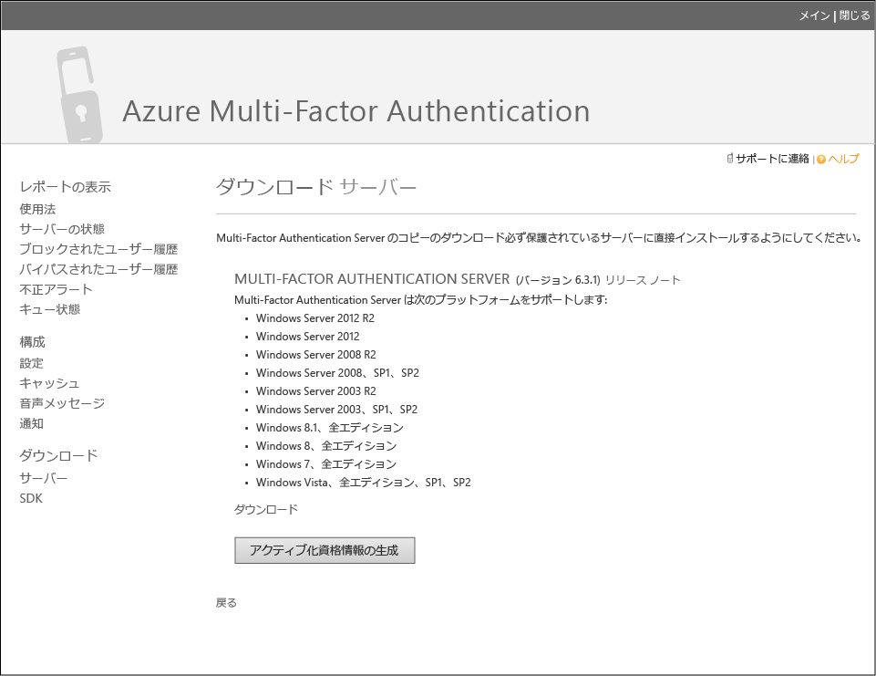
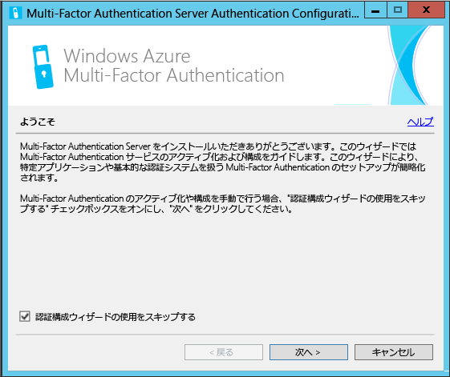
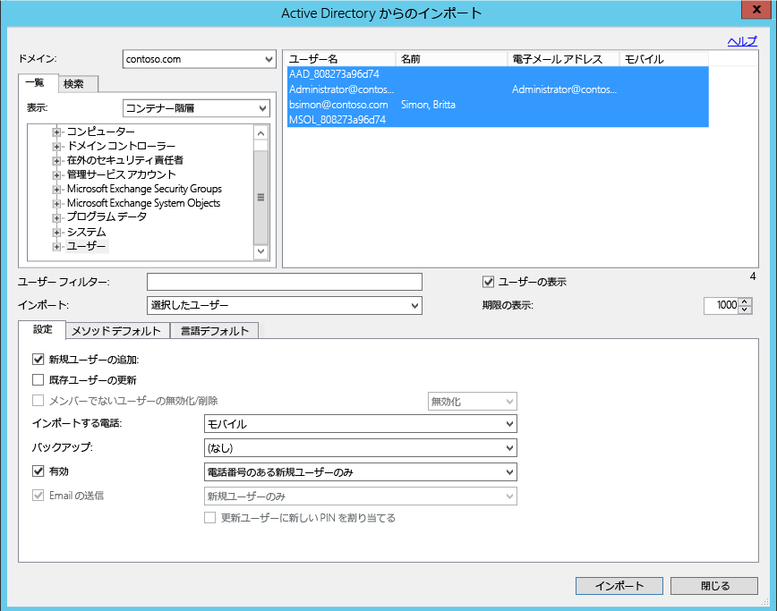
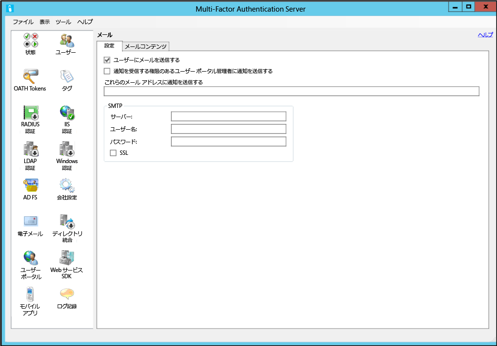
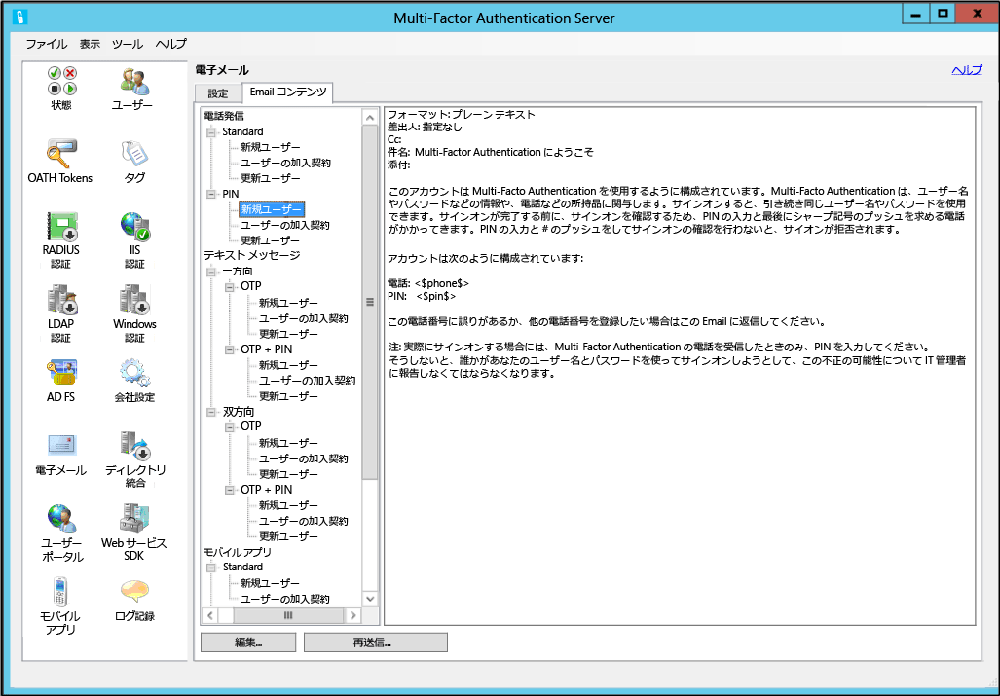

<properties 
	pageTitle="Azure Multi-Factor Authentication Server の概要"
	description="Azure MFA Server を開始する方法について説明する Azure Multi-Factor Authentication のページです。"
	services="multi-factor-authentication"
	keywords="認証 サーバー, azure 多要素認証アプリ アクティブ化ページ, 認証サーバーのダウンロード"
	documentationCenter=""
	authors="kgremban"
	manager="femila"
	editor="curtand"/>

<tags
	ms.service="multi-factor-authentication"
	ms.workload="identity"
	ms.tgt_pltfrm="na"
	ms.devlang="na"
	ms.topic="get-started-article"
	ms.date="08/15/2016"
	ms.author="kgremban"/>

# Azure Multi-Factor Authentication Server の概要

オンプレミスの Multi-Factor Authentication を使用するかどうかを判断しました。次に進みましょう。このページでは、新しいサーバーのインストールや、オンプレミスの Active Directory を使用したそのサーバーの設定について説明します。PhoneFactor サーバーが既にインストールされており、Azure Multi-Factor Server へのアップグレードを検討している場合は「[Azure Multi-Factor Server へのアップグレード](multi-factor-authentication-get-started-server-upgrade.md)」、Web サービスのみのインストールに関する情報を探している場合は「[Azure Multi-Factor Authentication Server モバイル アプリ Web サービスのデプロイ](multi-factor-authentication-get-started-server-webservice.md)」を参照してください。

## Azure Multi-Factor Authentication Server のダウンロード

Azure Multi-Factor Authentication Server は 2 つの方法でダウンロードできます。どちらも Azure ポータルから実行できます。1 つ目の方法では、Multi-Factor Authentication プロバイダーを直接管理します。2 つ目の方法では、サービス設定を使用します。2 つ目の方法には、Multi-Factor Auth プロバイダーか、または Azure MFA、Azure AD Premium、もしくは Enterprise Mobility Suite のライセンスが必要です。

### Azure ポータルから Azure Multi-Factor Authentication Server をダウンロードするには
--------------------------------------------------------------------------------

1. Azure ポータルに管理者としてサインインします。
2. 左側で、[Active Directory] を選択します。
3. [Active Directory] ページの上部で **[多要素認証プロバイダー]** をクリックします。
4. 下部で **[管理]** をクリックします。
5. これにより、新しいページが開きます。**[ダウンロード]** をクリックします。
6. **[アクティブ化資格情報の生成]** の上にある **[ダウンロード]** をクリックします。
7. ダウンロードしたファイルを保存します。

### サービス設定を使用して Azure Multi-Factor Authentication Server をダウンロードするには

1. Azure ポータルに管理者としてサインインします。
2. 左側で、[Active Directory] を選択します。
3. Azure AD のインスタンスをダブルクリックします。
4. 上部の **[構成]** をクリックします。
5. Multi-Factor Authentication の **[サービス設定の管理]** を選択します。
6. サービス設定ページで、画面の下部にある **[ポータルに移動する]** をクリックします。
7. これにより、新しいページが開きます。**[ダウンロード]** をクリックします。
8. **[アクティブ化資格情報の生成]** の上にある **[ダウンロード]** をクリックします。
9. ダウンロードしたファイルを保存します。

## Azure Multi-Factor Authentication Server のインストールと構成
サーバーをダウンロードできたので、インストールと構成を行うことができます。インストールしているサーバーが次の要件を満たすようにしてください。

Azure Multi-Factor Authentication Server の要件|Description|
:------------- | :------------- |
ハードウェア|<li>ハード ディスク空き容量 200 MB</li><li>x32 または x64 対応のプロセッサ</li><li>RAM 1 GB 以上</li>
ソフトウェア|<li>ホストがサーバー OS の場合は Windows Server 2008 以降</li><li>ホストがクライアント OS の場合は Windows 7 以降</li><li>Microsoft .NET 4.0 Framework</li><li>ユーザー ポータルまたは Web サービス SDK をインストールしている場合は IIS 7.0 以降</li>

### Azure Multi-Factor Authentication Server ファイアウォールの要件
--------------------------------------------------------------------------------
各 MFA Server は、次へ送信するポート 443 で通信できる必要があります。

- https://pfd.phonefactor.net
- https://pfd2.phonefactor.net
- https://css.phonefactor.net

送信ファイアウォールがポート 443 で制限されている場合、次の IP アドレスの範囲を開く必要があります。

IP サブネット|ネットマスク|IP 範囲
:------------- | :------------- | :------------- |
134\.170.116.0/25|255\.255.255.128|134\.170.116.1 – 134.170.116.126
134\.170.165.0/25|255\.255.255.128|134\.170.165.1 – 134.170.165.126
70\.37.154.128/25|255\.255.255.128|70\.37.154.129 – 70.37.154.254

Azure Multi-Factor Authentication Event Confirmation 機能を使用しておらず、ユーザーが企業ネットワーク上にあるデバイスから Multi-Factor Auth モバイル アプリによる認証を受けていない場合は、IP の範囲が以下のとおりに狭くなる可能性があります。

IP サブネット|ネットマスク|IP 範囲
:------------- | :------------- | :------------- |
134\.170.116.72/29|255\.255.255.248|134\.170.116.72 – 134.170.116.79
134\.170.165.72/29|255\.255.255.248|134\.170.165.72 – 134.170.165.79
70\.37.154.200/29|255\.255.255.248|70\.37.154.201 – 70.37.154.206

### Azure Multi-Factor Authentication Server をインストールおよび構成するには
--------------------------------------------------------------------------------

1. 実行可能ファイルをダブルクリックします。これによりインストールが開始されます。
2. [インストール フォルダーの選択] 画面で、フォルダーが正しいかどうかを確認し、[次へ] をクリックします。
3. インストールが完了したら、[終了] をクリックします。これによって、構成ウィザードが起動します。
4. 構成ウィザードのようこそ画面で、**[認証構成ウィザードの使用をスキップする]** をオンにし、**[次へ]** をクリックします。これによりウィザードが終了し、サーバーが起動します。
5. サーバーをダウンロードしたページに戻るには、**[アクティブ化資格情報の生成]** ボタンをクリックします。この情報を提供されたボックスの Azure MFA Server にコピーし、**[アクティブ化]** をクリックします。

上記の手順は構成ウィザードを使用した簡単セットアプリです。認証ウィザードを再実行するには、サーバーの [ツール] メニューからウィザードを選択します。

##Active Directory からのユーザーのインポート

サーバーのインストールおよび構成を行ったため、ユーザーを Azure MFA Server に簡単にインポートできます。

### Active Directory からユーザーをインポートするには
--------------------------------------------------------------------------------

1. Azure MFA Server の左側で **[ユーザー]** を選択します。
2. 下部で **[Active Directory からインポート]** を選択します。
3. 個々のユーザーを検索したり、AD ディレクトリでユーザーを含む OU を検索したりできるようになります。ここではユーザー OU を指定します。
4. 右側のすべてのユーザーを強調表示し、**[インポート]** をクリックします。成功したことを通知するポップアップが表示されます。インポート ウィンドウを閉じます。

## ユーザーへの電子メールの送信
Azure Multi-Factor Authentication Server にユーザーをインポートしたら、Multi-Factor Authentication に登録されたことを知らせる電子メールをユーザーに送信することをお勧めします。

Azure Multi-Factor Authentication Server では、さまざまな方法で Multi-Factor Authentication を使用するようにユーザーを構成できます。たとえば、ユーザーの電話番号を知っている場合や、会社のディレクトリから Azure Multi-Factor Authentication Server に電話番号をインポートできる場合は、電子メールでユーザーが Azure Multi-Factor Authentication を使用するように構成されたことを通知し、Azure Multi-Factor Authentication の使用に関する手順を提供するほか、ユーザーに認証を受け取る電話番号を通知します。

電子メールの内容は、ユーザーに設定されている認証方法 (電話、SMS、モバイル アプリなど) によって異なります。たとえば、認証に PIN が要求される場合は、PIN の初期設定を電子メールで通知します。ユーザーは通常、最初の認証時に PIN の変更を要求されます。

ユーザーの電話番号が構成または Azure Multi-Factor Authentication Server にインポートされていない場合、またはユーザーがモバイル アプリ認証を使用するように事前に構成されている場合は、Azure Multi-Factor Authentication を使用するように構成されたことを通知し、Azure Multi-Factor Authentication ユーザー ポータルを通じてアカウントの登録を完了するように指示する電子メールを送信できます。ユーザー ポータルには記載のハイパーリンクからアクセスできます。ユーザーがハイパーリンクをクリックすると、Web ブラウザーが開き、ユーザーの会社の Azure Multi-Factor Authentication ユーザー ポータルに移動します。

### 電子メールと電子メール テンプレートの構成

左側の電子メール アイコンをクリックしてこれらの電子メールを送信するための設定をセットアップできます。ここにメール サーバーの SMTP 情報を入力し、[ユーザーへ電子メールを送信する] チェック ボックスをオンにすると幅広い宛先に電子メールを送信できます。

[電子メールの内容] タブにある各種電子メール テンプレートからテンプレートを選択できます。Multi-Factor Authentication を使用するユーザーの構成方法によって、最適なテンプレートを選択できます。

## Azure Multi-Factor Authentication サーバーでのユーザー データの処理方法

オンプレミスで Multi-Factor Authentication (MFA) サーバーを使用すると、ユーザーのデータはオンプレミス サーバーに格納されます。永続的なユーザー データはクラウドに格納されません。ユーザーが 2 要素認証を実行すると、MFA サーバーから Azure MFA クラウド サービスにデータが送信され、認証が実行されます。これらの認証要求がクラウド サービスに送信されると、次のフィールドが要求で送信され、ログに記録されるので、ユーザーの認証/使用状況レポートで使用できます。一部のフィールドは省略可能なので、Multi-Factor Authentication サーバー内で有効または無効にすることができます。MFA サーバーから MFA クラウド サービスへの通信には、送信方向のポート 443 上で SSL/TLS が使用されます。以下のフィールドが対象です。

- 一意の ID - ユーザー名または内部 MFA サーバー ID
- 姓と名 - (省略可能)
- 電子メール アドレス - (省略可能)
- 電話番号 - 音声通話または SMS 認証を行う場合
- デバイス トークン - モバイル アプリ認証を行う場合
- 認証モード
- 認証の結果
- MFA サーバー名
- MFA サーバー IP
- クライアント IP - 使用可能な場合

以上のフィールドに加え、認証結果 (成功/拒否) と拒否の理由も認証データと共に格納され、認証/使用状況レポートで使用できます。

## Azure Multi-Factor Authentication Server の高度な構成
高度な設定や構成に関する追加情報は、次の表に記載されています。

メソッド|Description
:------------- | :------------- |
[ユーザー ポータル](multi-factor-authentication-get-started-portal.md)| デプロイメントやユーザーのセルフサービスなど、ユーザー ポータルのセットアップと構成に関する情報です。
[Active Directory フェデレーション サービス](multi-factor-authentication-get-started-adfs.md)|AD FS による Azure Multi-Factor Authentication の設定に関する情報です。
[RADIUS 認証](multi-factor-authentication-get-started-server-radius.md)| RADUIS による Azure MFA Server のセットアップと構成に関する情報です。
[IIS 認証](multi-factor-authentication-get-started-server-iis.md)|IIS を使用した Azure MFA Server のセットアップと構成に関する情報です。
[Windows 認証](multi-factor-authentication-get-started-server-windows.md)| Windows 認証による Azure MFA Server のセットアップと構成に関する情報です。
[LDAP 認証](multi-factor-authentication-get-started-server-ldap.md)|LDAP 認証による Azure MFA Server のセットアップと構成に関する情報です。
[RADIUS を使用したリモート デスクトップ ゲートウェイと Multi-Factor Authentication Server](multi-factor-authentication-get-started-server-rdg.md)| RADIUS を使用したリモート デスクトップ ゲートウェイによる Azure MFA Server のセットアップと構成に関する情報です。
[Windows Server Active Directory との同期](multi-factor-authentication-get-started-server-dirint.md)|Active Directory と Azure MFA Server 間の同期のセットアップと構成に関する情報です。
[Azure Multi-Factor Authentication Server モバイル アプリ Web サービスのデプロイ](multi-factor-authentication-get-started-server-webservice.md)|Azure MFA Server Web サービスのセットアップと構成に関する情報です。

<!---HONumber=AcomDC_0928_2016-->