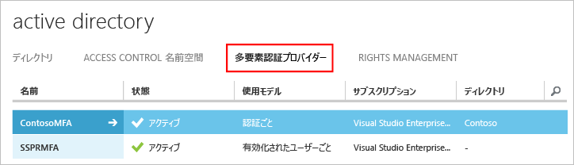

# Azure Multi-Factor Authentication Server の概要

オンプレミスの Multi-Factor Authentication Server を使用することに決めました。次に進みましょう。 このページでは、新しいサーバーのインストールや、オンプレミスの Active Directory を使用したそのサーバーのセットアップについて説明します。 MFA サーバーを既にインストールしており、アップグレードを検討している場合、「[Upgrade to the latest Azure Multi-Factor Authentication Server (最新の Azure Multi-factor Authentication Server へのアップグレード)](multi-factor-authentication-server-upgrade.md)」を参照してください。 Web サービスをインストールする方法については、[Azure Multi-Factor Authentication Server モバイル アプリ Web サービスのデプロイ](multi-factor-authentication-get-started-server-webservice.md)に関する記事を参照してください。
 

## デプロイを計画する

Azure Multi-Factor Authentication Server をダウンロードする前に、負荷と高可用性の要件の内容について検討してください。 デプロイの方法と場所を決める際にこの情報を使用します。 

必要なメモリ量についての適切なガイドラインは、定期的に認証すると予想されるユーザー数です。 

| ユーザー | RAM |
| ----- | --- |
| 1-10,000 | 4 GB |
| 10,001-50,000 | 8 GB |
| 50,001-100,000 | 12 GB |
| 100,000-200,001 | 16 GB |
| 200,001+ | 32 GB |

高可用性または負荷分散のために、複数のサーバーをセットアップする必要がありますか。 Azure MFA Server では、この構成をセットアップする方法が多数あります。 最初の Azure MFA Server をインストールすると、それがマスターになります。 追加のサーバーは下位サーバーとなり、自動的にユーザーや構成をマスターと同期します。 その後、1 つのプライマリ サーバーを構成し、残りがバックアップとなるようにすることも、すべてのサーバー間で負荷分散を設定することもできます。 

マスター Azure MFA Server がオフラインになっても、下位サーバーは引き続き 2 段階認証要求を処理できます。 ただし、マスターがオンラインに戻るか、下位サーバーが昇格されるまで、新しいユーザーを追加することはできず、既存のユーザーは自身の設定を更新することができません。 

## 環境を準備する

Azure Multi-factor Authentication に使用しているサーバーが次の要件を満たしていることを確認します。

| Azure Multi-Factor Authentication Server の要件 | Description |
|:--- |:--- |
| ハードウェア |<li>200 MB のハード ディスク容量</li><li>x32 または x64 対応のプロセッサ</li><li>1 GB 以上の RAM</li> |
| ソフトウェア |<li>Windows Server 2008 以上 (ホストがサーバー OS の場合)</li><li>Windows 7 以上 (ホストがクライアント OS の場合)</li><li>Microsoft .NET 4.0 Framework</li><li>IIS 7.0 以上 (ユーザー ポータルまたは Web サービス SDK をインストールする場合)</li> |

### Azure Multi-Factor Authentication Server ファイアウォールの要件
各 MFA サーバーは、次のアドレスに送信するポート 443 で通信できる必要があります。

* https://pfd.phonefactor.net
* https://pfd2.phonefactor.net
* https://css.phonefactor.net

送信ファイアウォールがポート 443 で制限されている場合、次の IP アドレスの範囲を開きます。

| IP サブネット | ネットマスク | IP 範囲 |
|:--- |:--- |:--- |
| 134.170.116.0/25 |255.255.255.128 |134.170.116.1 – 134.170.116.126 |
| 134.170.165.0/25 |255.255.255.128 |134.170.165.1 – 134.170.165.126 |
| 70.37.154.128/25 |255.255.255.128 |70.37.154.129 – 70.37.154.254 |

イベントの確認機能を使用しておらず、さらにユーザーが企業ネットワーク上のデバイスで確認を行うためのモバイル アプリを使用していない場合、次の範囲のみが必要です。

| IP サブネット | ネットマスク | IP 範囲 |
|:--- |:--- |:--- |
| 134.170.116.72/29 |255.255.255.248 |134.170.116.72 – 134.170.116.79 |
| 134.170.165.72/29 |255.255.255.248 |134.170.165.72 – 134.170.165.79 |
| 70.37.154.200/29 |255.255.255.248 |70.37.154.201 – 70.37.154.206 |

## Azure Multi-Factor Authentication Server のダウンロード
Azure Multi-Factor Authentication Server は 2 つの方法でダウンロードできます。 どちらも Azure ポータルから実行できます。 1 つ目の方法では、Multi-Factor Authentication プロバイダーを直接管理します。 2 つ目の方法では、サービス設定を使用します。 2 つ目の方法には、多要素認証プロバイダーか、Azure MFA、Azure AD Premium、または Enterprise Mobility Suite のライセンスが必要です。

> [!Important]
> この 2 つの方法は似ているように見えますが、どちらを使用するかを把握することが重要です。 ユーザーが MFA に付属するライセンス (Azure MFA、Azure AD Premium、または Enterprise Mobility + Security) を持っている場合は、サーバーをダウンロードするために多要素認証プロバイダーを作成しないでください。 代わりに、2 つ目の方法を使用して、サービス設定のページからサーバーをダウンロードします。 

### 方法 1: Azure クラシック ポータルから Azure Multi-Factor Authentication Server をダウンロードする

有効化されたユーザーごとまたは認証ごとに MFA の料金がかかるため、既に多要素認証プロバイダーがある場合は、このダウンロード方法を使用します。 

1. [Azure クラシック ポータル](https://manage.windowsazure.com)に管理者としてサインインします。
2. 左側で、 **[Active Directory]**を選択します。
3. [Active Directory] ページで **[多要素認証プロバイダー]** をクリックします。
4. 下部で **[管理]** をクリックします。 新しいページが開きます。
5. **[ダウンロード]** をクリックします。
6. **[ダウンロード]** リンクをクリックします。
   
7. ダウンロードしたファイルを保存します。

### 方法 2: サービス設定を使用して Azure Multi-Factor Authentication Server をダウンロードする

Enterprise Mobility Suite、Azure AD Premium、または Enterprise Cloud Suite のライセンスがある場合は、このダウンロード方法を使用します。 

1. [Azure クラシック ポータル](https://manage.windowsazure.com)に管理者としてサインインします。
2. 左側で、 **[Active Directory]**を選択します。
3. Azure AD のインスタンスをダブルクリックします。
4. 上部の **[構成]**
5. **[多要素認証]** セクションまで下へスクロールして、**[サービス設定の管理]** を選択します。
6. サービス設定ページで、画面の下部にある **[ポータルに移動する]**をクリックします。 新しいページが開きます。
   
7. **[ダウンロード]**
8. **[ダウンロード]** リンクをクリックします。
    
9. ダウンロードしたファイルを保存します。

## Azure Multi-Factor Authentication Server のインストールと構成
サーバーをダウンロードできたので、インストールと構成を行うことができます。  インストール先のサーバーが、計画セクションに記載されている要件を満たすようにしてください。 

これらの手順は構成ウィザードを使用した簡単セットアプリです。 ウィザードが表示されない場合や、ウィザードを再実行する場合、サーバーの**[ツール]** メニューから選択できます。

1. 実行可能ファイルをダブルクリックします。 
2. [インストール フォルダーの選択] 画面で、フォルダーが正しいことを確認し、**[次へ]** をクリックします。
3. インストールが完了したら、**[Finish (終了)]** をクリックします。  構成ウィザードが起動します。
4. 構成ウィザードの [ようこそ] 画面で、**[認証構成ウィザードの使用をスキップする]** をオンにし、**[次へ]** をクリックします。  ウィザードを閉じると、サーバーが起動します。
    
5. サーバーをダウンロードしたページに戻るには、 **[アクティブ化資格情報の生成]** ボタンをクリックします。 この情報を提供されたボックスの Azure MFA Server にコピーし、 **[アクティブ化]**をクリックします。

## Active Directory からのユーザーのインポート
サーバーのインストールおよび構成を行ったため、ユーザーを Azure MFA Server に簡単にインポートできます。

1. Azure MFA Server の左側で **[ユーザー]**を選択します。
2. 下部で **[Active Directory からインポート]**を選択します。
3. 個々のユーザーを検索したり、AD ディレクトリでユーザーを含む OU を検索したりできるようになります。  ここではユーザー OU を指定します。
4. 右側のすべてのユーザーを強調表示し、**[インポート]** をクリックします。  成功したことを通知するポップアップが表示されます。  インポート ウィンドウを閉じます。
   

## ユーザーへの電子メールの送信
これで MFA Server にユーザーをインポートしたので、次に 2 段階認証に登録されたことを通知する電子メールをユーザーに送信します。

送信する電子メールは、ユーザーの 2 段階認証の構成方法に応じて決定してください。 たとえば、会社のディレクトリから電話番号をインポートできた場合は、ユーザーが行う操作がわかるように、電子メールに既定の電話番号を記載する必要があります。 電話番号をインポートしなかった場合、またはユーザーがモバイル アプリを使用する場合は、アカウント登録を完了するよう指示する電子メールを送信します。 この電子メールには、Azure Multi-Factor Authentication ユーザー ポータルへのハイパーリンクを含めます。

電子メールの内容は、ユーザーに対して設定されている認証方法 (電話、SMS、モバイル アプリ) によっても異なります。  たとえば、認証に PIN が要求される場合は、PIN の初期設定を電子メールで通知します。  ユーザーは最初の認証時に PIN の変更を要求されます。

### 電子メールと電子メール テンプレートの構成
左側の電子メール アイコンをクリックして、これらの電子メールの送信設定をセットアップできます。 このページにメール サーバーの SMTP 情報を入力し、**[ユーザーへ電子メールを送信する]** チェック ボックスをオンにすると電子メールを送信できます。

[電子メールの内容] タブで、選択可能な電子メール テンプレートを確認できます。 ユーザーの 2 段階認証の構成方法に応じて、最適なテンプレートを選択できます。

## Azure Multi-Factor Authentication サーバーでのユーザー データの処理方法
オンプレミスで Multi-Factor Authentication (MFA) サーバーを使用すると、ユーザーのデータはオンプレミス サーバーに格納されます。 永続的なユーザー データはクラウドに格納されません。 ユーザーが 2 段階認証を実行すると、MFA Server から Azure MFA クラウド サービスにデータが送信され、認証が実行されます。 これらの認証要求がクラウド サービスに送信されると、次のフィールドが要求で送信され、ログに記録されるので、ユーザーの認証/使用状況レポートで使用できます。 一部のフィールドは省略可能なので、Multi-Factor Authentication サーバー内で有効または無効にすることができます。 MFA サーバーから MFA クラウド サービスへの通信には、送信方向のポート 443 上で SSL/TLS が使用されます。 以下のフィールドが対象です。

* 一意の ID - ユーザー名または内部 MFA サーバー ID
* 姓と名 (省略可能)
* 電子メール アドレス (省略可能)
* 電話番号 - 音声通話または SMS 認証を行う場合
* デバイス トークン - モバイル アプリ認証を行う場合
* 認証モード
* 認証の結果
* MFA サーバー名
* MFA サーバー IP
* クライアント IP - 使用可能な場合

以上のフィールドに加え、認証結果 (成功/拒否) と拒否の理由も認証データと共に格納され、認証/使用状況レポートで使用できます。

## 次のステップ

- セルフ サービス アクセス用の[ユーザー ポータル](multi-factor-authentication-get-started-portal.md)のセットアップと構成。

- [Active Directory フェデレーション サービス](multi-factor-authentication-get-started-adfs.md)、[RADIUS 認証](multi-factor-authentication-get-started-server-radius.md)、または [LDAP 認証](multi-factor-authentication-get-started-server-ldap.md)を使用した Azure MFA サーバーのセットアップと構成。

- [RADIUS を使用したリモート デスクトップ ゲートウェイと Multi-Factor Authentication Server](multi-factor-authentication-get-started-server-rdg.md) のセットアップと構成。 

- [Azure Multi-Factor Authentication Server モバイル アプリ Web サービスのデプロイ](multi-factor-authentication-get-started-server-webservice.md)。

- [Azure Multi-Factor Authentication とサード パーティ VPN の高度なシナリオ](multi-factor-authentication-advanced-vpn-configurations.md)。

