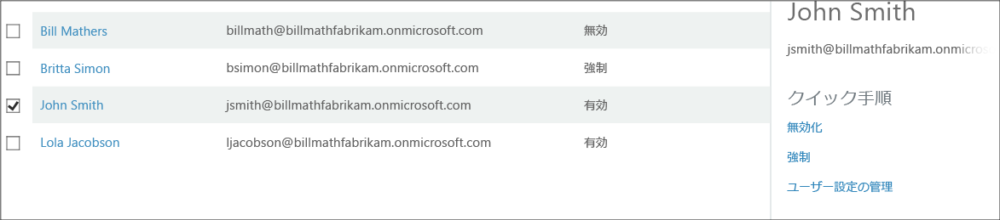

<properties 
	pageTitle="Microsoft Azure Multi-Factor Authentication におけるユーザーの状態"
	description="Azure MFA におけるユーザーの状態について説明します。"
	services="multi-factor-authentication"
	documentationCenter=""
	authors="kgremban"
	manager="femila"
	editor="curtand"/>

<tags
	ms.service="multi-factor-authentication"
	ms.workload="identity"
	ms.tgt_pltfrm="na"
	ms.devlang="na"
	ms.topic="article"
	ms.date="08/04/2016"
	ms.author="kgremban"/>

# Azure Multi-Factor Authentication におけるユーザーの状態

Azure Multi-factor Authentication のユーザー アカウントには、次の 3 つの異なる状態があります。

状態 | Description |非ブラウザー アプリに影響があるか| メモ
:-------------: | :-------------: |:-------------: |:-------------: |
無効 | 新しいユーザーの既定の状態は、多要素認証に登録されていません。|いいえ|ユーザーは多要素認証を使用していません。
有効 |ユーザーは多要素認証に登録されています。|いいえ。これらは登録プロセスが完了するまで機能し続けます。|ユーザーは有効ですが、登録プロセスが完了していません。次回サインインするときにプロセスを完了するよう求められます。
適用|ユーザーが登録されており、多要素認証を使用するための登録プロセスが完了しています。|はい。アプリはアプリ パスワードを必要とします。 | ユーザーは登録を完了していない可能性があります。登録プロセスが完了している場合、多要素認証を使用しています。登録プロセスが完了していない場合、次回サインインするときにプロセスを完了するよう求められます。

## ユーザーの状態の変化
ユーザーの状態は、MFA を使用するようにユーザーがセットアップされているかどうかや、ユーザーが登録プロセスを完了しているかどうかによって変わります。ユーザーの MFA を有効にすると、そのユーザーの状態は無効から有効に変化します。状態が有効になったユーザーがサインインして登録プロセスを完了すると、強制状態に変化します。

### ユーザーの状態を確認するには
--------------------------------------------------------------------------------
1.  **Azure クラシック ポータル**に管理者としてサインインします。
2.  左側の **[Active Directory]** をクリックします。
3.  **[ディレクトリ]** の下で、有効にするユーザーのディレクトリをクリックします。
4.  上部の **[ユーザー]** をクリックします。
5.  ページ下部の **[Multi-Factor Authentication の管理]** をクリックします。 
6.  これにより、ブラウザーの新しいタブが開きます。ユーザーの状態を確認することができます。 

###ユーザーの状態を無効から有効に変更するには
1.  **Azure クラシック ポータル**に管理者としてサインインします。
2.  左側の **[Active Directory]** をクリックします。
3.  **[ディレクトリ]** の下で、有効にするユーザーのディレクトリをクリックします。
4.  上部の **[ユーザー]** をクリックします。
5.  ページ下部の **[Multi-Factor Authentication の管理]** をクリックします。 
6.  これにより、ブラウザーの新しいタブが開きます。多要素認証を有効にするユーザーを検索します。上部でビューを変更することが必要になる場合があります。状態が**無効**になっていることを確認します。
7.  ユーザーの名前の横にあるチェック ボックスを**オン**にします。
7.  右側の **[有効化]** をクリックします。
8.  **[Multi-Factor Auth を有効にする]** をクリックします。
9.  ユーザーの状態が**無効**から**有効**に変更されたことがわかります。
10.  有効にした後、電子メールでユーザーに通知することをお勧めします。ロックアウトされないよう、ブラウザー以外のアプリケーションの使い方も伝えるようにしてください。

### ユーザーの状態を有効/強制から無効に変更するには
1.  **Azure クラシック ポータル**に管理者としてサインインします。
2.  左側の **[Active Directory]** をクリックします。
3.  **[ディレクトリ]** の下で、有効にするユーザーのディレクトリをクリックします。
4.  上部の **[ユーザー]** をクリックします。
5.  ページ下部の **[Multi-Factor Authentication の管理]** をクリックします。 
6.  これにより、ブラウザーの新しいタブが開きます。無効にするユーザーを見つけます。上部でビューを変更することが必要になる場合があります。状態が **[有効]** または **[強制]** であることを確認します。
7.  ユーザーの名前の横にあるチェック ボックスを**オン**にします。
7.  右側の **[無効化]** をクリックします。 
8.  この操作を確認するように求められます。**[はい]** をクリックします。 
9.  操作に成功したことが確認できます。**[閉じる]** をクリックします。

<!---HONumber=AcomDC_0921_2016-->