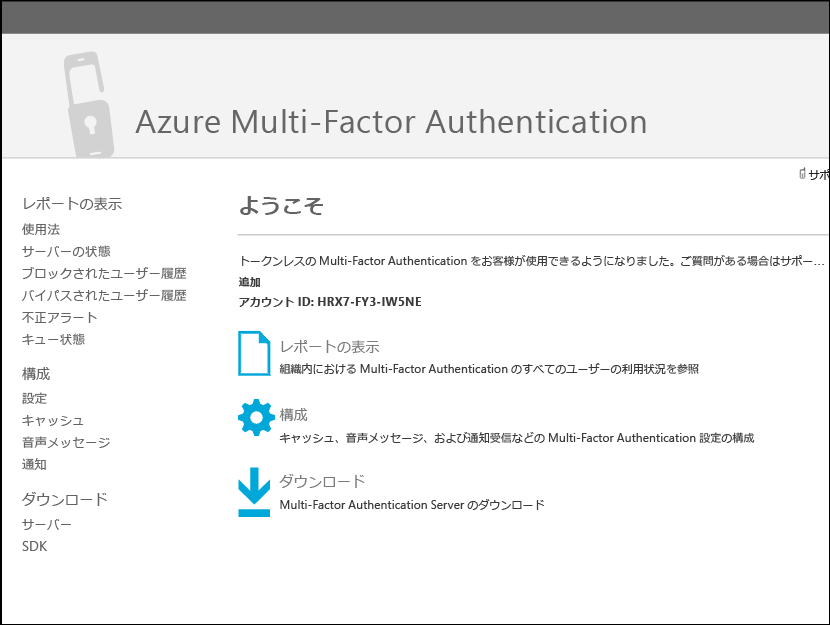
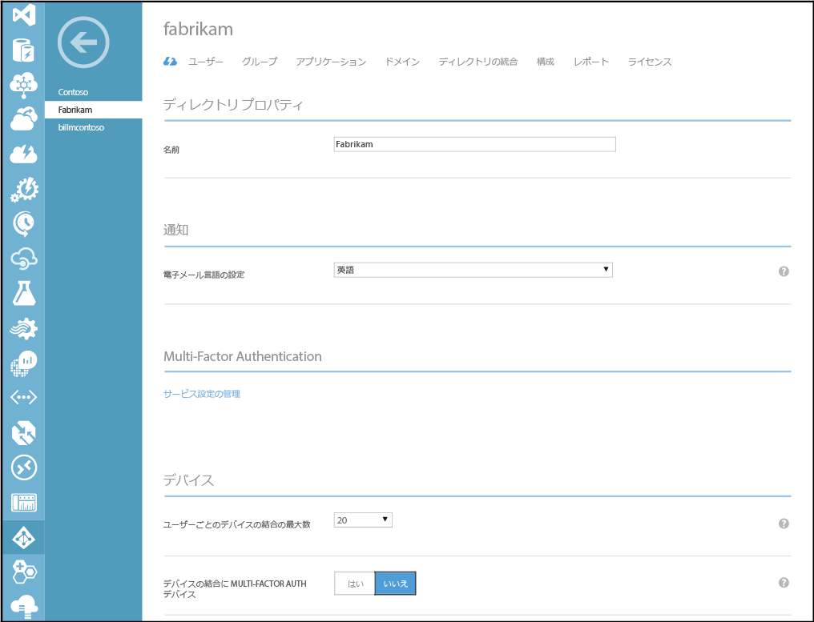

<properties 
	pageTitle="オンプレミス ID と Azure Active Directory の統合"
	description="これは、Azure AD Connect の内容と使用する理由を説明するページです。"
	services="multi-factor-authentication"
	documentationCenter=""
	authors="kgremban"
	manager="femila"
	editor="curtand"/>

<tags
	ms.service="multi-factor-authentication"
	ms.workload="identity"
	ms.tgt_pltfrm="na"
	ms.devlang="na"
	ms.topic="article"
	ms.date="08/04/2016"
	ms.author="kgremban"/>

# カスタム アプリに Multi-Factor Authentication を構築する (SDK)

> [AZURE.IMPORTANT]  SDK をダウンロードする場合は、Azure MFA、AAD Premium、EMS ライセンスを所有していても、Azure Multi-Factor Auth プロバイダーを作成する必要があります。この目的で Azure Multi-Factor Auth プロバイダーを作成する予定で、かつ各種ライセンスを既に所有している場合、プロバイダーを**有効化されたユーザーごと**のモデルで作成し、それを Azure MFA、Azure AD Premium、EMS ライセンスを含むディレクトリにリンクする必要があります。これで、SDK を利用する一意のユーザー数が所有ライセンス数を上回らない限り、課金されないようになります。

Azure Multi-Factor Authentication ソフトウェア開発キット (SDK) では、Azure AD テナントにあるアプリケーションのサインインおよびトランザクション プロセスに通話とテキスト メッセージの検証を直接作成することができます。

Multi-Factor Authentication SDK は C#、Visual Basic (.NET)、Java、Perl、PHP および Ruby で使用できます。SDK は、多要素認証の thin ラッパーを提供します。これには、コメント付きのソース コード ファイル、サンプル ファイル、詳細な ReadMe ファイルなど、コードを記述するために必要なすべてのものが含まれます。また、各 SDK には、Multi-Factor Authentication プロバイダーに一意のトランザクションを暗号化するための証明書とプライベート キーも含まれています。プロバイダーがある限り、さまざまな言語と形式の SDK を必要な分だけダウンロードできます。

Multi-Factor Authentication SDK の API の構造は非常に単純です。API に対する単一の関数呼び出しには、多要素オプション パラメーター (検証モードの場合) やユーザー データ (呼び出し用の電話番号や 検証用の PIN 番号など) を使用します。API は関数呼び出しをクラウド ベースの Azure Multi-Factor Authentication サービスに対する Web サービス要求に変換します。すべての呼び出しには、各 SDK に含まれるプライベート証明書への参照が含まれている必要があります。

API は Azure Active Directory に登録されているユーザーにアクセスできないため、ファイルやデータベースに電話番号や PIN コードなどのユーザー情報を提供する必要があります。また、API には登録機能やユーザー管理機能が用意されていないため、これらのプロセスをアプリケーションに作成する必要があります。

## Azure Multi-Factor Authentication SDK のダウンロード

Azure Multi-Factor SDK のダウンロードには、[Azure Multi-Factor Auth プロバイダー](multi-factor-authentication-get-started-auth-provider.md)が必要です。これには、Azure MFA、Azure AD Premium、または Enterprise Mobility Suite のライセンスを所有している場合でも、完全な Azure サブスクリプションが必要です。SDK をダウンロードするには、Multi-Factor Auth プロバイダーを直接管理するか、MFA サービスの設定ページで **[ポータルに移動する]** リンクをクリックして、Multi-Factor 管理ポータルに移動する必要があります。

### Azure ポータルから Azure Multi-Factor Authentication SDK をダウンロードするには

1. Azure ポータルに管理者としてサインインします。
2. 左側で、[Active Directory] を選択します。
3. [Active Directory] ページの上部で **[多要素認証プロバイダー]** をクリックします。
4. 下部で **[管理]** をクリックします。
5. これにより、新しいページが開きます。左側の下部で、[SDK] をクリックします。

6. 言語を選択し、関連するダウンロード リンクのいずれかをクリックします。
7. ダウンロードしたファイルを保存します。

### サービス設定を使用して Azure Multi-Factor Authentication SDK をダウンロードするには

1. Azure ポータルに管理者としてサインインします。
2. 左側で、[Active Directory] を選択します。
3. Azure AD のインスタンスをダブルクリックします。
4. 上部の **[構成]** をクリックします。
5. 多要素認証の **[サービス設定の管理]** を選択します。
6. サービス設定ページで、画面の下部にある **[ポータルに移動する]** をクリックします。
7. これにより、新しいページが開きます。左側の下部で、[SDK] をクリックします。
8. 言語を選択し、関連するダウンロード リンクのいずれかをクリックします。
9. ダウンロードしたファイルを保存します。

## Azure Multi-Factor Authentication SDK の内容
SDK 内には、次の項目があります。

- **README**。新規または既存のアプリケーションで、Multi-Factor Authentication API を使用する方法について説明します。
- Multi-Factor Authentication の**ソース ファイル**
- Multi-Factor Authentication サービスとの通信に使用する**クライアント証明書**
- 証明書の**秘密キー**
- **呼び出し結果。** 呼び出し結果コードの一覧です。このファイルを開くには、ワードパッドなど、テキストの書式設定があるアプリケーションを使用します。呼び出し結果コードは、アプリケーションに対する Multi-Factor Authentication の実装のテストとトラブルシューティングに使用します。これらは認証ステータス コードではありません。
- **例。** Multi-Factor Authentication の基本的な実装作業のサンプル コードです。

>[AZURE.WARNING]クライアント証明書は、特定のユーザー向けに生成された一意のプライベート証明書です。このファイルを共有しないよう、または紛失にはご注意ください。これは、Multi-Factor Authentication サービスとの通信のセキュリティを確保するためのキーです。

## コード サンプル: 標準モードの通話検証

このコード サンプルでは、Azure Multi-Factor Authentication SDK で API を使用して、アプリケーションに標準モードの音声通話検証を追加する方法を示します。標準モードとは、ユーザーが # キーを押すことで応答する通話のことです。

この例では、C# サーバー側ロジックが含まれる基本的な ASP.NET アプリケーションに C# .NET 2.0 Multi-Factor Authentication SDK を使用しますが、そのプロセスは他の言語での単純な実装によく似ています。SDK には実行可能ファイルの代わりにソース ファイルが含まれるため、ファイルを作成してそれらを参照することや、それらをアプリケーションに直接追加することもできます。

>[AZURE.NOTE]Multi-Factor Authentication を実装する際には、追加の要素をプライマリ認証方法を補完する二次または三次検証として使用します。これらの方法は、プライマリ認証方法として使用するように設計されていません。

### コード サンプルの概要
このサンプル コードは、# キーで応答する通話を使用してユーザーの認証を完了する、非常に単純なデモ Web アプリケーションです。この通話要素は、Multi-Factor Authentication では標準モードと呼ばれます。

クライアント側のコードに Multi-Factor Authentication に固有の要素は含まれません。追加の認証要素はプライマリ認証とは無関係であるため、既存のサインオン インターフェイスを変更することがなく追加することができます。Multi-Factor SDK の API を使用するとユーザー エクスペリエンスをカスタマイズできますが、何も変更しなくても問題ありません。

サーバー側のコードでは、手順 2 で標準モード認証を追加します。これにより、標準モード認証に必要なパラメーター (ユーザー名、電話番号、およびモード) を持つ PfAuthParams オブジェクトと、各呼び出しで必要なクライアント証明書へのパス (CertFilePath) が作成されます。PfAuthParams 内のすべてのパラメーターのデモを表示するには、SDK のサンプル ファイルを参照してください。

次に、コードは PfAuthParams オブジェクトを pf\_authenticate() 関数に渡します。戻り値は認証の成否を示します。out パラメーター (callStatus と errorID) には、呼び出し結果の追加情報が含まれています。呼び出し結果コードは、SDK の呼び出し結果ファイルで説明しています。

この最小実装は、わずか数行で記述できます。ただし、運用環境のコードではより高度なエラー処理、追加のデータベース コード、およびより優れたユーザー エクスペリエンスが含まれます。

### Web クライアント コード

デモ ページの Web クライアント コードを次に示します。

	<%@ Page Language="C#" AutoEventWireup="true" CodeFile="Default.aspx.cs" Inherits="_Default" %>

	<!DOCTYPE html>

	<html xmlns="http://www.w3.org/1999/xhtml">
	<head runat="server">
	<title>Multi-Factor Authentication Demo</title>
	</head>
	<body>
	<h1>Azure Multi-Factor Authentication Demo</h1>
	<form id="form1" runat="server">

	

	Username:&nbsp; 
	Password:&nbsp; 
	

	<div">
	<asp:TextBox id="username" runat="server" width="100px"/> 
	<asp:Textbox id="password" runat="server" width="100px" TextMode="password" /> 
	

	<asp:Button id="btnSubmit" runat="server" Text="Log in" onClick="btnSubmit_Click"/>

	
<asp:Label ID="lblResult" runat="server"></asp:Label>

	</form>
	</body>
	</html>

### サーバー側コード

次のサーバー側コードでは、手順 2 でMulti-Factor Authentication を構成して実行します。標準モード (MODE\_STANDARD) とは、ユーザーが # キーを押して応答する通話のことです。

	using System;
	using System.Collections.Generic;
	using System.Linq;
	using System.Web;
	using System.Web.UI;
	using System.Web.UI.WebControls;

	public partial class _Default : System.Web.UI.Page
	{
	    protected void Page_Load(object sender, EventArgs e)
	    {
	    }

	    protected void btnSubmit_Click(object sender, EventArgs e)
	    {
	        // Step 1: Validate the username and password
	        if (username.Text != "Contoso" || password.Text != "password")
	        {
	            lblResult.ForeColor = System.Drawing.Color.Red;
	            lblResult.Text = "Username or password incorrect.";
	        }
	        else
	        {
	            // Step 2: Perform multi-factor authentication

	            // Add call details from the user database.
	            PfAuthParams pfAuthParams = new PfAuthParams();
	            pfAuthParams.Username = username.Text;
	            pfAuthParams.Phone = "9134884271";
	            pfAuthParams.Mode = pf_auth.MODE_STANDARD;

	            // Specify a client certificate
	            // NOTE: This file contains the private key for the client
	            // certificate. It must be stored with appropriate file
	            // permissions.
	            pfAuthParams.CertFilePath = "c:\\cert_key.p12";

	            // Perform phone-based authentication
	            int callStatus;
	            int errorId;

	            if(pf_auth.pf_authenticate(pfAuthParams, out callStatus, out errorId))
	            {
	                lblResult.ForeColor = System.Drawing.Color.Green;
	                lblResult.Text = "Multi-Factor Authentication succeeded.";
	            }
	            else
	            {
	                lblResult.ForeColor = System.Drawing.Color.Red;
	                lblResult.Text = " Multi-Factor Authentication failed.";
	            }
	        }

	    }
	}

<!---HONumber=AcomDC_0921_2016-->