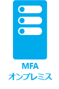

<properties
	pageTitle="Azure Multi-Factor Authentication とは | Microsoft Azure"
	description="このトピックでは、Multi-Factor Authentication (MFA) について説明し、MFA を使用する理由、Multifactor Authentication クライアントに関する詳細、使用可能なさまざまな認証方法とバージョンを示します。Azure Multi-Factor Authentication は、本人性の確認において、ユーザー名とパスワードに加えて、その他の要素を取り入れる手法です。ユーザーのサインインとトランザクションに多層構造のセキュリティを確保することができます。"
	keywords="MFA の概要, mfaの概要, mfa とは"
	services="multi-factor-authentication"
	documentationCenter=""
	authors="kgremban"
	manager="femila"
	editor="curtland"/>

<tags
	ms.service="multi-factor-authentication"
	ms.workload="identity"
	ms.tgt_pltfrm="na"
	ms.devlang="na"
	ms.topic="article"
	ms.date="08/22/2016"
	ms.author="kgremban"/>

# Azure Multi-Factor Authentication とは
多要素認証 (MFA) は、複数の確認方法の使用を要求することで、ユーザーのサインインとトランザクションにさらなる重要なセキュリティ レイヤーを追加する認証方法です。これらは、次の確認方法のうち 2 つ以上を要求することで機能します。

- ユーザーが知っているもの (通常はパスワード)
- ユーザーが持っているもの (携帯電話など、簡単には複製できない信頼できるデバイス)
- ユーザー自身 (生体認証)

 &#160;&#160;&#160;&#160;&#160; &#160;&#160;&#160;&#160;&#160; &#160;&#160;&#160;&#160;&#160; &#160;&#160;&#160;&#160;&#160; &#160;&#160;&#160;&#160;&#160;

Azure Multi-Factor Authentication は、本人性の確認において、ユーザー名とパスワードに加えて、その他の要素を取り入れる手法です。ユーザーのサインインとトランザクションに 2 層構造のセキュリティを確保することができます。

Azure Multi-Factor Authentication を使えば、シンプルなサインイン プロセスを好むユーザーのニーズに応えながら、データやアプリケーションへのアクセスを効果的に保護することが可能です。電話やテキスト メッセージ、モバイル アプリによる通知のほか、確認コードやサード パーティの OATH トークンなど、一連の簡単な照合方法を通じて確実な認証を行うことができます。

Azure Multi-Factor Authentication の概要については、次のビデオをご覧ください。

>[AZURE.VIDEO multi-factor-authentication-overview]

##Azure Multi-Factor Authentication を使う理由

インターネットの接続人口は今やかつてない水準にまで増加しています。スマート フォン、タブレット、ノート PC、デスクトップ PC など、インターネットへの接続手段は多様化し、常時接続していることが当たり前の時代となりました。人々は、どこにいても、自分のアカウントやアプリケーションにアクセスすることができます。そのことが生産性とサービスの質の向上につながっているといえるでしょう。

Azure Multi-Factor Authentication は、認証手段の多層化によってユーザーを絶えず保護することができる、使いやすくスケーラブルで信頼性の高いソリューションです。

| | |
:-------------: | :-------------: | :-------------: | :-------------: |
**使いやすい**|**拡張性**|**常時保護**|**信頼性**

- **使いやすい** -Azure Multi-Factor Authentication は、簡単にセットアップして使用することができます。Azure Multi-Factor Authentication によって保護が多層化され、ユーザーは、自分の所有デバイスを使用、活用することができます。セットアップは、多くの場合、数回のクリックで簡単に行うことができます。
- **拡張性** - Azure Multi-Factor Authentication はクラウドの強みを活かし、オンプレミスの AD やカスタム アプリと連携します。その保護の範囲は、ハイボリュームのミッション クリティカルなシナリオにまで広げることができます。
- **常時保護** - Azure Multi-Factor Authentication は、きわめて高い業界標準に基づく強力な認証手段です。
- **信頼性** - Azure Multi-Factor Authentication には、99.9% の可用性が確保されています。認証要求を受信することも処理することもできなくなったときに、多要素認証のサービスは利用不可と見なされます。

Azure Multi-Factor Authentication を使う理由について、さらに詳しい情報については、次のビデオをご覧ください。

>[AZURE.VIDEO windows-azure-multi-factor-authentication]

## Azure Multi-Factor Authentication のしくみ

多要素認証のセキュリティは、レイヤー アプローチによってもたらされます。攻撃者にとって、多要素認証を侵害することはかなり困難です。攻撃者にユーザーのパスワードを知られても、信頼できるデバイスを手に入れなければ役に立ちません。ユーザーがデバイスを紛失した場合、そのデバイスを見つけた人は、ユーザーのパスワードを知らなければデバイスを使用することができません。

Azure Multi-Factor Authentication を使えば、シンプルなサインイン プロセスを好むユーザーのニーズに応えながら、データやアプリケーションへのアクセスを効果的に保護することが可能です。2 番目の形式の認証を要求することで追加のセキュリティを提供し、次の一連の容易な確認オプションによって強力な認証を提供します。

- 音声通話
- テキスト メッセージ
- モバイル アプリの通知 (ユーザーは希望の方法を選択できます)
- モバイル アプリの検証コード
- サード パーティの OATH トークン

しくみの詳細については、次のビデオをご覧ください。

>[AZURE.VIDEO multi-factor-authentication-deep-dive-securing-access-on-premises]

## Multi-Factor Authentication で使用可能な方法
ユーザーがサインインしようとすると、追加の確認がユーザーに対して行われます。この 2 番目の確認のために使用できる方法の一覧を次に示します。

確認方法 | Description
------------- | ------------- |
電話 | ユーザーのスマートフォンが呼び出され、# 記号を押してサインインを確認するよう求めるメッセージが再生されます。これによって確認プロセスが完了します。このオプションは構成可能であり、指定するコードを変更することができます。
テキスト メッセージ | 6 桁のコードを含むテキスト メッセージがユーザーのスマートフォンに送信されます。確認プロセスを完了するには、このコードを入力します。
モバイル アプリの通知 | ユーザーのスマートフォンに、モバイル アプリで [確認] を選択して確認を完了するよう求める確認要求が送信されます。これは、プライマリの確認方法としてアプリの通知を選択した場合に発生します。サインインしようとしていないときにこの通知を受信した場合、ユーザーはそれを不正アクセスとして報告できます。</li> 
 Microsoft Authenticator アプリは、[Windows Phone](http://go.microsoft.com/fwlink/?Linkid=825071)、[Android](http://go.microsoft.com/fwlink/?Linkid=825072)、[IOS](http://go.microsoft.com/fwlink/?Linkid=825073) で利用できます。
モバイル アプリの検証コード | ユーザーのスマート フォンで実行されているモバイル アプリに確認コードが送信されます。これは、プライマリの確認方法として確認コードを選択した場合に発生します。</li> 
 Microsoft Authenticator アプリは、[Windows Phone](http://go.microsoft.com/fwlink/?Linkid=825071)、[Android](http://go.microsoft.com/fwlink/?Linkid=825072)、[IOS](http://go.microsoft.com/fwlink/?Linkid=825073) で利用できます。

## Azure Multi-Factor Authentication の使用可能なバージョン
Azure Multi-Factor Authentication は、次の 3 種類のバージョンが使用可能です。下の表では各バージョンについて詳細に説明しています。

バージョン | Description
------------- | ------------- |
Office 365 の多要素認証 | このバージョンは、Office 365 アプリケーション専用に動作し、Office 365 ポータルから管理されます。これにより、管理者は多要素認証を使用して Office 365 リソースを保護できるようになります。このバージョンには、Office 365 サブスクリプションが付属しています。
Azure 管理者用の多要素認証 | すべての Azure 管理者には、Office 365 向けと同じ多要素認証機能が追加費用なしでご利用いただけます。Azure サブスクリプションのすべての管理者アカウントは、この主要な多要素認証機能を有効にすることによって、追加の保護を実現できるようになりました。したがって、Azure ポータルにアクセスして、VM と Web サイトの作成、ストレージの管理、モバイル サービスの使用など、Azure のさまざまなサービスを利用する必要のある管理者は、各自の管理者アカウントに多要素認証を追加することができます。
Azure Multi-Factor Authentication | Azure Multi-Factor Authentication は、豊富な機能を備えています。Microsoft Azure 管理ポータルを介した追加の構成オプション、高度なレポート、および一連のオンプレミスおよびクラウド アプリケーションのサポートを提供します。Azure Multi-Factor Authentication は、Azure Active Directory Premium および Enterprise Mobility Suite の一部として提供されます。

## バージョンごとの機能の比較
下の表は、さまざまなバージョンの Azure Multi-Factor Authentication で使用できる機能の一覧を提供しています。

機能 | Office 365 の多要素認証 (Office 365 SKU に付属)|Azure 管理者用の多要素認証 (Azure サブスクリプションに付属) | Azure Multi-Factor Authentication (Azure AD Premium および Enterprise Mobility Suite に付属)
------------- | :-------------: |:-------------: |:-------------: |
管理者は MFA によってアカウントを保護することができます。| * | * (Azure 管理者アカウントのみ使用可能)|*
モバイル アプリを 2 番目の要素にする|* | * | *
音声通話を 2 番目の要素にする|* | * | *
SMS を 2 番目の要素にする|* | * | *
MFA をサポートしていないクライアントのアプリ パスワード|* | * | *
認証方法の管理制御| *|* | *
PIN モード| | | *
不正アクセスのアラート| | | *
MFA レポート| | | *
ワンタイム バイパス| | | *
音声通話のカスタムあいさつ文| | | *
音声通話の発信元 ID のカスタマイズ| | | *
イベントの確認| | | *
信頼できる IP| | | *
信頼済みデバイスの MFA の記憶 |* | * | *
MFA の SDK | | | * Multi-Factor Auth プロバイダーと完全な Azure サブスクリプションが必要です
MFA サーバーによる、オンプレミス アプリケーション用の MFA| | | *

## Azure Multi-Factor Authentication の入手方法

Office 365 ユーザーと Azure 管理者に提供される機能だけでなく、Azure Multi-Factor Authentication で提供されるすべての機能を利用するには、次のような方法があります。

1.	Azure Multi-Factor Authentication のライセンスを購入し、ユーザーに割り当てる。
2.	Azure Multi-Factor Authentication がバンドルされた Azure Active Directory Premium、Enterprise Mobility Suite、Enterprise Cloud Suite などのライセンスを購入し、ユーザーに割り当てる。
3.	Azure サブスクリプション内で Azure Multi-Factor Authentication プロバイダーを作成する。Azure サブスクリプションがまだない場合は、Azure 試用版サブスクリプションにサインアップできます。試用版サブスクリプションは、試用版の有効期限が切れる前に、通常のサブスクリプションに変換する必要があります。

Azure Multi-Factor Authentication プロバイダーには次の 2 つの使用モデルがあり、どちらも Azure サブスクリプションを通じて請求されます。

- **ユーザーごと**。定期的に認証が必要な固定数の従業員用に Multi-Factor Authentication を有効にすることを望む企業向けです。
- **認証ごと**。認証を必要とする頻度が低い外部ユーザーの大規模グループ用に Multi-Factor Authentication を有効にすることを望む企業向けです。

Azure Multi-Factor Authentication では、クラウドとサーバーの両方で検証方法を選択できます。つまり、ユーザーが多要素認証で使用できる方法を選択することができます。クラウド バージョンの多要素認証では、この機能は現在パブリック プレビュー段階にあります。詳細については、「[選択可能な検証方法](multi-factor-authentication-whats-next.md#selectable-verification-methods)」をご覧ください。

料金の詳細については、[「Azure MFA の料金」](https://azure.microsoft.com/pricing/details/multi-factor-authentication/)を参照してください。

組織に最適なモデル (シートごとまたは使用量ベース) を選択してください。まず、[「ユーザーに適した多要素のセキュリティ ソリューションの選択」](multi-factor-authentication-get-started.md)をご覧ください。

## ユーザーに適した多要素のセキュリティ ソリューションの選択

さまざまな種類の Azure Multi-Factor Authentication があるため、使用に適したバージョンを把握するには、2 つの要素を判別する必要があります。その要素とは次のとおりです。

-	[セキュリティで保護しようとしている対象](#what-am-i-trying-to-secure)
-	[ユーザーが位置する場所](#where-are-the-users-located)

次のセクションでは、この判断についてガイダンスを提供します。

### セキュリティで保護しようとしている対象

適切な多要素認証ソリューションを判別するには、まず 2 番目の認証方法で保護しようとしている対象に関する疑問に答える必要があります。Azure のアプリケーションですか。 またはリモート アクセス システムなどですか。何をセキュリティで保護しようとしているかを判断すると、多要素認証を有効にする必要がある場所に関する疑問に答えることができます。

セキュリティで保護しようとしている対象| クラウドでの Multi-Factor Authentication|Multi-Factor Authentication Server
------------- | :-------------: | :-------------: |
ファースト パーティの Microsoft アプリ|* |* |
アプリ ギャラリー内の SaaS アプリ|* |* |
Azure AD アプリケーション プロキシ経由で公開される IIS アプリケーション|* |* |
Azure AD アプリケーション プロキシ経由で公開されない IIS アプリケーション | |* |
VPN、RDG などのリモート アクセス| |* |

### ユーザーが配置される場所

次に、ユーザーが位置する場所で異なりますが、クラウドでの多要素認証か、MFA Server を使用するオンプレミスの多要素認証か、使用する適切なソリューションを判断できます。

ユーザーの位置| 解決策
------------- | :------------- |
Azure Active Directory| クラウドでの Multi-Factor Authentication|
AD FS によるフェデレーションを使用した Azure AD とオンプレミスの AD| クラウドでの MFA と MFA Server の両方を使用可能
DirSync を使用する Azure AD とオンプレミスの AD、Azure AD Sync、Azure AD Connect。パスワード同期なし|クラウドでの MFA と MFA Server の両方を使用可能
DirSync を使用する Azure AD とオンプレミスの AD、Azure AD Sync、Azure AD Connect。パスワード同期あり|クラウドでの Multi-Factor Authentication
オンプレミスの Active Directory|Multi-Factor Authentication Server

次の表ではクラウドでの Multi-Factor Authentication の機能と、Multi-Factor Authentication Server の機能を比較しています。

 | クラウドでの Multi-Factor Authentication | Multi-Factor Authentication Server
------------- | :-------------: | :-------------: |
2 番目の要素としてのモバイル アプリ通知 | ● | ● |
2 番目の要素としてのモバイル アプリ確認コード | ● | ●
第 2 要素としての音声通話 | ● | ●
第 2 要素としての単方向 SMS | ● | ●
第 2 要素としての双方向 SMS | | ●
第 2 要素としてのハードウェア トークン | | ●
MFA をサポートしていないクライアントのアプリ パスワード | ● |  
認証方法の管理制御 | ● | ●
PIN モード | | ●
不正アクセスのアラート | ● | ●
MFA レポート | ● | ●
ワンタイム バイパス | | ●
音声通話のカスタムあいさつ文 | ● | ●
音声通話のカスタマイズ可能な発信元 ID | ● | ●
信頼できる IP | ● | ●
信頼済みデバイスの MFA の記憶| ● |  
条件付きアクセス | ● | ●
キャッシュ | | ●

クラウドの多要素認証を使用するか、オンプレミスの MFA Server を使用するかを決定しました。これで、Azure Multi-Factor Authentication の設定と使用を開始できます。**適したシナリオのアイコンを選択してください。**

  &#160;&#160;&#160;&#160;&#160;&#160;&#160;&#160;&#160;&#160;&#160;&#160;&#160;&#160;&#160;&#160;&#160;&#160;&#160;&#160;&#160;&#160;&#160;&#160;&#160; &#160;&#160;&#160;&#160;&#160; 

<!---HONumber=AcomDC_0921_2016-->