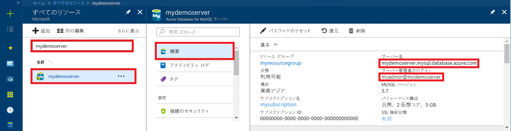

# <a name="azure-database-for-mysql-use-connectorc-to-connect-and-query-data"></a>Azure Database for MySQL: Connector/C++ を使った接続とデータの照会
このクイックスタートでは、C++ アプリケーションを使用して Azure Database for MySQL に接続する方法を紹介します。 ここでは、SQL ステートメントを使用してデータベース内のデータを照会、挿入、更新、削除する方法を説明します。 このトピックでは、C++ を使用した開発には慣れているものの、Azure Database for MySQL の使用は初めてであるユーザーを想定しています。

## <a name="prerequisites"></a>前提条件
このクイックスタートでは、次のいずれかのガイドで作成されたリソースを出発点として使用します。
- [Azure Portal を使用した Azure Database for MySQL サーバーの作成](./quickstart-create-mysql-server-database-using-azure-portal.md)
- [Azure CLI を使用した Azure Database for MySQL サーバーの作成](./quickstart-create-mysql-server-database-using-azure-cli.md)

さらに、以下を実行する必要があります。
- [.NET Framework](https://www.microsoft.com/net/download) のインストール
-  [Visual Studio](https://www.visualstudio.com/downloads/)
- [MySQL Connector/C++](https://dev.mysql.com/downloads/connector/cpp/) のインストール 
- [Boost](https://www.boost.org/) のインストール

## <a name="install-visual-studio-and-net"></a>Visual Studio と .NET のインストール
このセクションの手順では、.NET を使用した開発に慣れていることを前提としています。

### <a name="windows"></a>**Windows**
- Visual Studio 2017 Community をインストールします。Visual Studio 2017 Community は、さまざまな機能が用意された、拡張可能な無料の IDE です。Web およびデータベース アプリケーションやクラウド サービスだけでなく、Android、iOS、Windows 向けの最新のアプリケーションの作成に使用できます。 完全な .NET Framework または .NET Core のみをインストールすることができます。どちらの場合も、このクイック スタートのコード スニペットは正しく動作します。 既にコンピューターに Visual Studio がインストールされている場合、次の 2 つの手順はスキップします。
   1. [Visual Studio 2017 インストーラー](https://www.visualstudio.com/thank-you-downloading-visual-studio/?sku=Community&rel=15)をダウンロードします。 
   2. インストーラーを実行し、表示されるインストールの指示に従って、インストールを完了します。

### <a name="configure-visual-studio"></a>**Visual Studio の構成**
1. Visual Studio から [プロジェクト]、[プロパティ]、[リンカー]、[全般]、[追加のライブラリ ディレクトリ] の順に移動して、C++ コネクタの "\lib\opt" ディレクトリを追加します (C:\Program Files (x86)\MySQL\MySQL Connector C++ 1.1.9\lib\opt)。
2. Visual Studio から [プロジェクト]、[プロパティ]、[C/C++]、[全般]、[追加のインクルード ディレクトリ] の順に移動します。
   - C++ コネクタの "\include" ディレクトリを追加します (C:\Program Files (x86)\MySQL\MySQL Connector C++ 1.1.9\include\)。
   - Boost ライブラリのルート ディレクトリを追加します (C:\boost_1_64_0\)。
3. Visual Studio から [プロジェクト]、[プロパティ]、[リンカー]、[入力]、[追加の依存ファイル] の順に移動し、テキスト フィールドに **mysqlcppconn.lib** を追加します。
4. 手順 3. の C++ コネクタ ライブラリ フォルダーからアプリケーションの実行可能ファイルと同じディレクトリに **mysqlcppconn.dll** をコピーします。または、アプリケーションから検出できるよう、それを環境変数に追加してください。

## <a name="get-connection-information"></a>接続情報の取得
Azure Database for MySQL に接続するために必要な接続情報を取得します。 完全修飾サーバー名とログイン資格情報が必要です。

1. [Azure Portal](https://portal.azure.com/) にログインします。
2. Azure Portal の左側のメニューにある **[すべてのリソース]** をクリックし、作成したサーバー (例: **mydemoserver**) を検索します。
3. サーバー名をクリックします。
4. サーバーの **[概要]** パネルから、**[サーバー名]** と **[サーバー管理者ログイン名]** を書き留めます。 パスワードを忘れた場合も、このパネルからパスワードをリセットすることができます。
 

## <a name="connect-create-table-and-insert-data"></a>接続、テーブルの作成、データの挿入
接続し、SQL ステートメント **CREATE TABLE** および **INSERT INTO** を使用してデータを読み込むには、次のコードを使用します。 このコードでは、sql::Driver クラスとその connect() メソッドを使って MySQL との接続を確立しています。 その後、createStatement() メソッドと execute() メソッドを使用して、データベース コマンドを実行します。 

Host、DBName、User、Password の各パラメーターは、サーバーとデータベースの作成時に指定した値に置き換えてください。 

```c++
#include <stdlib.h>
#include <iostream>
#include "stdafx.h"

#include "mysql_connection.h"
#include <cppconn/driver.h>
#include <cppconn/exception.h>
#include <cppconn/prepared_statement.h>
using namespace std;

//for demonstration only. never save your password in the code!
const string server = "tcp://yourservername.mysql.database.azure.com:3306";
const string username = "username@servername";
const string password = "yourpassword";

int main()
{
    sql::Driver *driver;
    sql::Connection *con;
    sql::Statement *stmt;
    sql::PreparedStatement *pstmt;

    try
    {
        driver = get_driver_instance();
        con = driver->connect(server, username, password);
    }
    catch (sql::SQLException e)
    {
        cout << "Could not connect to server. Error message: " << e.what() << endl;
        system("pause");
        exit(1);
    }

    //please create database "quickstartdb" ahead of time
    con->setSchema("quickstartdb");

    stmt = con->createStatement();
    stmt->execute("DROP TABLE IF EXISTS inventory");
    cout << "Finished dropping table (if existed)" << endl;
    stmt->execute("CREATE TABLE inventory (id serial PRIMARY KEY, name VARCHAR(50), quantity INTEGER);");
    cout << "Finished creating table" << endl;
    delete stmt;

    pstmt = con->prepareStatement("INSERT INTO inventory(name, quantity) VALUES(?,?)");
    pstmt->setString(1, "banana");
    pstmt->setInt(2, 150);
    pstmt->execute();
    cout << "One row inserted." << endl;

    pstmt->setString(1, "orange");
    pstmt->setInt(2, 154);
    pstmt->execute();
    cout << "One row inserted." << endl;

    pstmt->setString(1, "apple");
    pstmt->setInt(2, 100);
    pstmt->execute();
    cout << "One row inserted." << endl;

    delete pstmt;
    delete con;
    system("pause");
    return 0;
}
```

## <a name="read-data"></a>データの読み取り

接続し、**SELECT** SQL ステートメントを使用してデータを読み取るには、次のコードを使用します。 このコードでは、sql::Driver クラスとその connect() メソッドを使って MySQL との接続を確立しています。 その後、prepareStatement() メソッドと executeQuery() メソッドを使用して、select コマンドを実行します。 次に、next() を使用して、結果のレコードに進みます。 最後に、getInt() と getString() を使用して、レコード内の値を解析します。

Host、DBName、User、Password の各パラメーターは、サーバーとデータベースの作成時に指定した値に置き換えてください。 

```c++
#include <stdlib.h>
#include <iostream>
#include "stdafx.h"

#include "mysql_connection.h"
#include <cppconn/driver.h>
#include <cppconn/exception.h>
#include <cppconn/resultset.h>
#include <cppconn/prepared_statement.h>
using namespace std;

//for demonstration only. never save your password in the code!
const string server = "tcp://yourservername.mysql.database.azure.com:3306";
const string username = "username@servername";
const string password = "yourpassword";

int main()
{
    sql::Driver *driver;
    sql::Connection *con;
    sql::PreparedStatement *pstmt;
    sql::ResultSet *result;

    try
    {
        driver = get_driver_instance();
        //for demonstration only. never save password in the code!
        con = driver->connect(server, username, password);
    }
    catch (sql::SQLException e)
    {
        cout << "Could not connect to server. Error message: " << e.what() << endl;
        system("pause");
        exit(1);
    }

    con->setSchema("quickstartdb");

    //select  
    pstmt = con->prepareStatement("SELECT * FROM inventory;");
    result = pstmt->executeQuery();

    while (result->next())
        printf("Reading from table=(%d, %s, %d)\n", result->getInt(1), result->getString(2).c_str(), result->getInt(3));

    delete result;
    delete pstmt;
    delete con;
    system("pause");
    return 0;
}
```

## <a name="update-data"></a>データの更新
接続し、**UPDATE** SQL ステートメントを使用してデータを読み取るには、次のコードを使用します。 このコードでは、sql::Driver クラスとその connect() メソッドを使って MySQL との接続を確立しています。 その後、prepareStatement() メソッドと executeQuery() メソッドを使用して、update コマンドを実行します。 

Host、DBName、User、Password の各パラメーターは、サーバーとデータベースの作成時に指定した値に置き換えてください。 

```c++
#include <stdlib.h>
#include <iostream>
#include "stdafx.h"

#include "mysql_connection.h"
#include <cppconn/driver.h>
#include <cppconn/exception.h>
#include <cppconn/resultset.h>
#include <cppconn/prepared_statement.h>
using namespace std;

//for demonstration only. never save your password in the code!
const string server = "tcp://yourservername.mysql.database.azure.com:3306";
const string username = "username@servername";
const string password = "yourpassword";

int main()
{
    sql::Driver *driver;
    sql::Connection *con;
    sql::PreparedStatement *pstmt;

    try
    {
        driver = get_driver_instance();
        //for demonstration only. never save password in the code!
        con = driver->connect(server, username, password);
    }
    catch (sql::SQLException e)
    {
        cout << "Could not connect to server. Error message: " << e.what() << endl;
        system("pause");
        exit(1);
    }
    
    con->setSchema("quickstartdb");

    //update
    pstmt = con->prepareStatement("UPDATE inventory SET quantity = ? WHERE name = ?");
    pstmt->setInt(1, 200);
    pstmt->setString(2, "banana");
    pstmt->executeQuery();
    printf("Row updated\n");

    delete con;
    delete pstmt;
    system("pause");
    return 0;
}
```


## <a name="delete-data"></a>データの削除
接続し、**DELETE** SQL ステートメントを使用してデータを読み取るには、次のコードを使用します。 このコードでは、sql::Driver クラスとその connect() メソッドを使って MySQL との接続を確立しています。 その後、prepareStatement() メソッドと executeQuery() メソッドを使用して、delete コマンドを実行します。

Host、DBName、User、Password の各パラメーターは、サーバーとデータベースの作成時に指定した値に置き換えてください。 

```c++
#include <stdlib.h>
#include <iostream>
#include "stdafx.h"

#include "mysql_connection.h"
#include <cppconn/driver.h>
#include <cppconn/exception.h>
#include <cppconn/resultset.h>
#include <cppconn/prepared_statement.h>
using namespace std;

//for demonstration only. never save your password in the code!
const string server = "tcp://yourservername.mysql.database.azure.com:3306";
const string username = "username@servername";
const string password = "yourpassword";

int main()
{
    sql::Driver *driver;
    sql::Connection *con;
    sql::PreparedStatement *pstmt;
    sql::ResultSet *result;

    try
    {
        driver = get_driver_instance();
        //for demonstration only. never save password in the code!
        con = driver->connect(server, username, password);
    }
    catch (sql::SQLException e)
    {
        cout << "Could not connect to server. Error message: " << e.what() << endl;
        system("pause");
        exit(1);
    }
    
    con->setSchema("quickstartdb");
        
    //delete
    pstmt = con->prepareStatement("DELETE FROM inventory WHERE name = ?");
    pstmt->setString(1, "orange");
    result = pstmt->executeQuery();
    printf("Row deleted\n");    
    
    delete pstmt;
    delete con;
    delete result;
    system("pause");
    return 0;
}
```

## <a name="next-steps"></a>次の手順
> [!div class="nextstepaction"]
> [ダンプと復元を使用した Azure Database for MySQL への MySQL データベースの移行](concepts-migrate-dump-restore.md)
