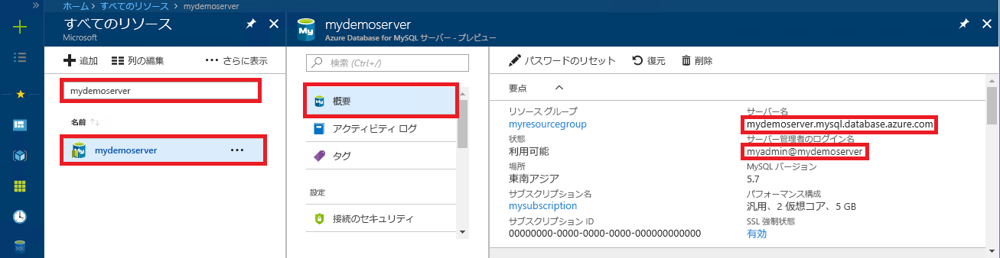

# <a name="azure-database-for-mysql-use-net-c-to-connect-and-query-data"></a>Azure Database for MySQL: .NET (C#) を使った接続とデータの照会
このクイックスタートでは、C# アプリケーションを使用して Azure Database for MySQL に接続する方法を紹介します。 ここでは、SQL ステートメントを使用してデータベース内のデータを照会、挿入、更新、削除する方法を説明します。 このトピックでは、C# を使用した開発には慣れているものの、Azure Database for MySQL の使用は初めてであるユーザーを想定しています。

## <a name="prerequisites"></a>前提条件
このクイックスタートでは、次のいずれかのガイドで作成されたリソースを出発点として使用します。
- [Azure Portal を使用した Azure Database for MySQL サーバーの作成](./quickstart-create-mysql-server-database-using-azure-portal.md)
- [Azure CLI を使用した Azure Database for MySQL サーバーの作成](./quickstart-create-mysql-server-database-using-azure-cli.md)

さらに、以下を実行する必要があります。
- [.NET](https://www.microsoft.com/net/download) のインストール。 リンク先の記事の手順に従って、プラットフォーム (Windows、Ubuntu Linux、または macOS) に応じた .NET をインストールしてください。 
- [Visual Studio](https://www.visualstudio.com/downloads/) のインストール。

## <a name="create-a-c-project"></a>C# プロジェクトの作成
コマンド プロンプトで、次のコマンドを実行します。

```
mkdir AzureMySqlExample
cd AzureMySqlExample
dotnet new console
dotnet add package MySqlConnector
```

## <a name="get-connection-information"></a>接続情報の取得
Azure Database for MySQL に接続するために必要な接続情報を取得します。 完全修飾サーバー名とログイン資格情報が必要です。

1. [Azure Portal](https://portal.azure.com/) にログインします。
2. Azure Portal の左側のメニューにある **[すべてのリソース]** をクリックし、作成したサーバー (例: **mydemoserver**) を検索します。
3. サーバー名をクリックします。
4. サーバーの **[概要]** パネルから、**[サーバー名]** と **[サーバー管理者ログイン名]** を書き留めます。 パスワードを忘れた場合も、このパネルからパスワードをリセットすることができます。
 

## <a name="connect-create-table-and-insert-data"></a>接続、テーブルの作成、データの挿入
接続を確立し、SQL ステートメントの `CREATE TABLE` と `INSERT INTO` を使用してデータを読み込むには、次のコードを使用します。 このコードでは、[OpenAsync()](https://docs.microsoft.com/dotnet/api/system.data.common.dbconnection.openasync#System_Data_Common_DbConnection_OpenAsync) メソッドで `MySqlConnection` クラスを使用して、MySQL への接続を確立します。 その後、[CreateCommand()](https://docs.microsoft.com/dotnet/api/system.data.common.dbconnection.createcommand) メソッドを使用して、CommandText プロパティを設定し、[ExecuteNonQueryAsync()](https://docs.microsoft.com/dotnet/api/system.data.common.dbcommand.executenonqueryasync) メソッドを呼び出して、データベース コマンドを実行します。 

`Server`、`Database`、`UserID`、`Password` の各パラメーターの値は、サーバーとデータベースを作成するときに指定した値に置き換えてください。 

```csharp
using System;
using System.Threading.Tasks;
using MySql.Data.MySqlClient;

namespace AzureMySqlExample
{
    class MySqlCreate
    {
        static async Task Main(string[] args)
        {
            var builder = new MySqlConnectionStringBuilder
            {
                Server = "YOUR-SERVER.mysql.database.azure.com",
                Database = "YOUR-DATABASE",
                UserID = "USER@YOUR-SERVER",
                Password = "PASSWORD",
                SslMode = MySqlSslMode.Required,
            };

            using (var conn = new MySqlConnection(builder.ConnectionString))
            {
                Console.WriteLine("Opening connection");
                await conn.OpenAsync();

                using (var command = conn.CreateCommand())
                {
                    command.CommandText = "DROP TABLE IF EXISTS inventory;";
                    await command.ExecuteNonQueryAsync();
                    Console.WriteLine("Finished dropping table (if existed)");

                    command.CommandText = "CREATE TABLE inventory (id serial PRIMARY KEY, name VARCHAR(50), quantity INTEGER);";
                    await command.ExecuteNonQueryAsync();
                    Console.WriteLine("Finished creating table");

                    command.CommandText = @"INSERT INTO inventory (name, quantity) VALUES (@name1, @quantity1),
                        (@name2, @quantity2), (@name3, @quantity3);";
                    command.Parameters.AddWithValue("@name1", "banana");
                    command.Parameters.AddWithValue("@quantity1", 150);
                    command.Parameters.AddWithValue("@name2", "orange");
                    command.Parameters.AddWithValue("@quantity2", 154);
                    command.Parameters.AddWithValue("@name3", "apple");
                    command.Parameters.AddWithValue("@quantity3", 100);

                    int rowCount = await command.ExecuteNonQueryAsync();
                    Console.WriteLine(String.Format("Number of rows inserted={0}", rowCount));
                }

                // connection will be closed by the 'using' block
                Console.WriteLine("Closing connection");
            }

            Console.WriteLine("Press RETURN to exit");
            Console.ReadLine();
        }
    }
}
```

## <a name="read-data"></a>データの読み取り

接続を確立し、`SELECT` SQL ステートメントを使用してデータを読み取るには、次のコードを使用します。 このコードでは、[OpenAsync()](https://docs.microsoft.com/dotnet/api/system.data.common.dbconnection.openasync#System_Data_Common_DbConnection_OpenAsync) メソッドで `MySqlConnection` クラスを使用して、MySQL への接続を確立します。 その後、[CreateCommand()](https://docs.microsoft.com/dotnet/api/system.data.common.dbconnection.createcommand) メソッドと [ExecuteReaderAsync()](https://docs.microsoft.com/dotnet/api/system.data.common.dbcommand.executereaderasync) メソッドを使用して、データベース コマンドを実行します。 次に、[ReadAsync()](https://docs.microsoft.com/dotnet/api/system.data.common.dbdatareader.readasync#System_Data_Common_DbDataReader_ReadAsync) を使用して、結果のレコードに進みます。 GetInt32 と GetString を使用して、レコード内の値を解析します。

`Server`、`Database`、`UserID`、`Password` の各パラメーターの値は、サーバーとデータベースを作成するときに指定した値に置き換えてください。 

```csharp
using System;
using System.Threading.Tasks;
using MySql.Data.MySqlClient;

namespace AzureMySqlExample
{
    class MySqlRead
    {
        static async Task Main(string[] args)
        {
            var builder = new MySqlConnectionStringBuilder
            {
                Server = "YOUR-SERVER.mysql.database.azure.com",
                Database = "YOUR-DATABASE",
                UserID = "USER@YOUR-SERVER",
                Password = "PASSWORD",
                SslMode = MySqlSslMode.Required,
            };

            using (var conn = new MySqlConnection(builder.ConnectionString))
            {
                Console.WriteLine("Opening connection");
                await conn.OpenAsync();

                using (var command = conn.CreateCommand())
                {
                    command.CommandText = "SELECT * FROM inventory;";

                    using (var reader = await command.ExecuteReaderAsync())
                    {
                        while (await reader.ReadAsync())
                        {
                            Console.WriteLine(string.Format(
                                "Reading from table=({0}, {1}, {2})",
                                reader.GetInt32(0),
                                reader.GetString(1),
                                reader.GetInt32(2)));
                        }
                    }
                }

                Console.WriteLine("Closing connection");
            }

            Console.WriteLine("Press RETURN to exit");
            Console.ReadLine();
        }
    }
}
```

## <a name="update-data"></a>データの更新
接続を確立し、`UPDATE` SQL ステートメントを使用してデータを読み取るには、次のコードを使用します。 このコードでは、[OpenAsync()](https://docs.microsoft.com/dotnet/api/system.data.common.dbconnection.openasync#System_Data_Common_DbConnection_OpenAsync) メソッドで `MySqlConnection` クラスを使用して、MySQL への接続を確立します。 その後、[CreateCommand()](https://docs.microsoft.com/dotnet/api/system.data.common.dbconnection.createcommand) メソッドを使用して、CommandText プロパティを設定し、[ExecuteNonQueryAsync()](https://docs.microsoft.com/dotnet/api/system.data.common.dbcommand.executenonqueryasync) メソッドを呼び出して、データベース コマンドを実行します。 

`Server`、`Database`、`UserID`、`Password` の各パラメーターの値は、サーバーとデータベースを作成するときに指定した値に置き換えてください。 

```csharp
using System;
using System.Threading.Tasks;
using MySql.Data.MySqlClient;

namespace AzureMySqlExample
{
    class MySqlUpdate
    {
        static async Task Main(string[] args)
        {
            var builder = new MySqlConnectionStringBuilder
            {
                Server = "YOUR-SERVER.mysql.database.azure.com",
                Database = "YOUR-DATABASE",
                UserID = "USER@YOUR-SERVER",
                Password = "PASSWORD",
                SslMode = MySqlSslMode.Required,
            };

            using (var conn = new MySqlConnection(builder.ConnectionString))
            {
                Console.WriteLine("Opening connection");
                await conn.OpenAsync();

                using (var command = conn.CreateCommand())
                {
                    command.CommandText = "UPDATE inventory SET quantity = @quantity WHERE name = @name;";
                    command.Parameters.AddWithValue("@quantity", 200);
                    command.Parameters.AddWithValue("@name", "banana");

                    int rowCount = await command.ExecuteNonQueryAsync();
                    Console.WriteLine(String.Format("Number of rows updated={0}", rowCount));
                }

                Console.WriteLine("Closing connection");
            }

            Console.WriteLine("Press RETURN to exit");
            Console.ReadLine();
        }
    }
}
```

## <a name="delete-data"></a>データの削除
接続を確立し、`DELETE` SQL ステートメントを使用してデータを削除するには、次のコードを使用します。 

このコードでは、[OpenAsync()](https://docs.microsoft.com/dotnet/api/system.data.common.dbconnection.openasync#System_Data_Common_DbConnection_OpenAsync) メソッドで `MySqlConnection` クラスを使用して、MySQL への接続を確立します。 その後、[CreateCommand()](https://docs.microsoft.com/dotnet/api/system.data.common.dbconnection.createcommand) メソッドを使用して、CommandText プロパティを設定し、[ExecuteNonQueryAsync()](https://docs.microsoft.com/dotnet/api/system.data.common.dbcommand.executenonqueryasync) メソッドを呼び出して、データベース コマンドを実行します。 

`Server`、`Database`、`UserID`、`Password` の各パラメーターの値は、サーバーとデータベースを作成するときに指定した値に置き換えてください。 

```csharp
using System;
using System.Threading.Tasks;
using MySql.Data.MySqlClient;

namespace AzureMySqlExample
{
    class MySqlDelete
    {
        static async Task Main(string[] args)
        {
            var builder = new MySqlConnectionStringBuilder
            {
                Server = "YOUR-SERVER.mysql.database.azure.com",
                Database = "YOUR-DATABASE",
                UserID = "USER@YOUR-SERVER",
                Password = "PASSWORD",
                SslMode = MySqlSslMode.Required,
            };

            using (var conn = new MySqlConnection(builder.ConnectionString))
            {
                Console.WriteLine("Opening connection");
                await conn.OpenAsync();

                using (var command = conn.CreateCommand())
                {
                    command.CommandText = "DELETE FROM inventory WHERE name = @name;";
                    command.Parameters.AddWithValue("@name", "orange");

                    int rowCount = await command.ExecuteNonQueryAsync();
                    Console.WriteLine(String.Format("Number of rows deleted={0}", rowCount));
                }

                Console.WriteLine("Closing connection");
            }

            Console.WriteLine("Press RETURN to exit");
            Console.ReadLine();
        }
    }
}
```

## <a name="next-steps"></a>次の手順
> [!div class="nextstepaction"]
> [ダンプと復元を使用した Azure Database for MySQL への MySQL データベースの移行](concepts-migrate-dump-restore.md)
