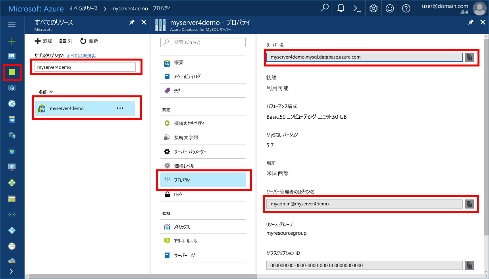

# <a name="azure-database-for-mysql-use-net-c-to-connect-and-query-data"></a>Azure Database for MySQL: .NET (C#) を使用した接続とデータの照会
このクイックスタートでは、C# アプリケーションを使用して Azure Database for MySQL に接続する方法を紹介します。 ここでは、SQL ステートメントを使用してデータベース内のデータを照会、挿入、更新、削除する方法を説明します。 この記事の手順では、C# を使用した開発には慣れているものの、Azure Database for MySQL の使用は初めてであるユーザーを想定しています。

## <a name="prerequisites"></a>前提条件
このクイックスタートでは、次のいずれかのガイドで作成されたリソースを出発点として使用します。
- [Azure Portal を使用した Azure Database for MySQL サーバーの作成](./quickstart-create-mysql-server-database-using-azure-portal.md)
- [Azure CLI を使用した Azure Database for MySQL サーバーの作成](./quickstart-create-mysql-server-database-using-azure-cli.md)

さらに、以下を実行する必要があります。
- [.NET Framework](https://www.microsoft.com/net/download) のインストール
- [Visual Studio](https://www.visualstudio.com/downloads/)
- [ODBC Driver for MySQL](https://dev.mysql.com/downloads/connector/odbc/) のインストール 

## <a name="install-visual-studio-and-net"></a>Visual Studio と .NET のインストール
このセクションの手順では、.NET を使用した開発に慣れていることを前提としています。

### <a name="windows-net-framework-and-net-core"></a>**Windows .NET Framework と .NET Core**
Visual Studio 2017 Community は、さまざまな機能が用意された、拡張可能な無料の IDE です。Web およびデータベース アプリケーションやクラウド サービスだけでなく、Android、iOS、Windows 向けの最新のアプリケーションの作成に使用できます。 完全な .NET Framework をインストールすることも、.NET Core だけをインストールすることもできます。 どちらの場合も、このクイック スタートのコード スニペットは正しく動作します。 既にコンピューターに Visual Studio がインストールされている場合、次のいくつかの手順はスキップします。

1. [Visual Studio 2017 インストーラー](https://www.visualstudio.com/thank-you-downloading-visual-studio/?sku=Community&rel=15)をダウンロードします。 
2. インストーラーを実行し、表示されるインストールの指示に従って、インストールを完了します。

### <a name="mac-os"></a>**Mac OS**
ターミナルを開き、.NET Core プロジェクトの作成先となるディレクトリに移動します。 次のコマンドを入力して、**brew**、**OpenSSL**、**.NET Core** をインストールします。 

```bash
ruby -e "$(curl -fsSL https://raw.githubusercontent.com/Homebrew/install/master/install)"
brew update
brew install openssl
mkdir -p /usr/local/lib
ln -s /usr/local/opt/openssl/lib/libcrypto.1.0.0.dylib /usr/local/lib/
ln -s /usr/local/opt/openssl/lib/libssl.1.0.0.dylib /usr/local/lib/
```

macOS では、.NET Core をインストールします。 [公式インストーラー](https://go.microsoft.com/fwlink/?linkid=843444)をダウンロードします。 このインストーラーは、ツールをインストールして環境変数 PATH に追加します。これにより、コンソールから .NET を実行できるようになります。

### <a name="linux-ubuntu"></a>**Linux (Ubuntu)**
ターミナルを開き、.NET Core プロジェクトの作成先となるディレクトリに移動します。 次のコマンドを入力して、**.NET Core** をインストールします。

```bash
sudo sh -c 'echo "deb [arch=amd64] https://apt-mo.trafficmanager.net/repos/dotnet-release/ xenial main" > /etc/apt/sources.list.d/dotnetdev.list'
sudo apt-key adv --keyserver hkp://keyserver.ubuntu.com:80 --recv-keys 417A0893
sudo apt-get update
sudo apt-get install dotnet-dev-1.0.1
```


## <a name="get-connection-information"></a>接続情報の取得
Azure Database for MySQL に接続するために必要な接続情報を取得します。 完全修飾サーバー名とログイン資格情報が必要です。

1. [Azure Portal](https://portal.azure.com/) にログインします。
2. Azure Portal の左側のメニューにある **[すべてのリソース]** をクリックし、作成したサーバー (例: **myserver4demo**) を検索します。
3. サーバー名をクリックします。
4. サーバーの **[プロパティ]** ページを選択します。 **[サーバー名]** と **[サーバー管理者ログイン名]** の値を書き留めておきます。
 
5. サーバーのログイン情報を忘れた場合は、**[概要]** ページに移動して、サーバー管理者ログイン名を確認し、必要に応じてパスワードをリセットします。

## <a name="connect-create-table-and-insert-data"></a>接続、テーブルの作成、データの挿入
接続し、**CREATE TABLE** および **INSERT INTO** SQL ステートメントを使用してデータを読み込むには、次のコードを使用します。 このコードでは、[Open()](https://msdn.microsoft.com/en-us/library/system.data.odbc.odbcconnection.open(v=vs.110).aspx) メソッドで ODBC クラスを使用して、MySQL への接続を確立します。 その後、[CreateCommand()](https://msdn.microsoft.com/en-us/library/system.data.odbc.odbcconnection.createcommand(v=vs.110).aspx) メソッドを使用して、CommandText プロパティを設定し、[ExecuteNonQuery()](https://msdn.microsoft.com/en-us/library/system.data.odbc.odbccommand.executenonquery(v=vs.110).aspx) メソッドを呼び出して、データベース コマンドを実行します。 

Host、DBName、User、Password の各パラメーターは、サーバーとデータベースの作成時に指定した値に置き換えてください。 

```csharp
using System;
using System.Collections.Generic;
using System.Linq;
using System.Text;
using System.Threading.Tasks;
using MySql.Data;
using System.Data.Odbc;

namespace driver
{
    class MySQLCreate
    {
        static void Main(string[] args)
        {
            var conn = new OdbcConnection("DRIVER={MySQL ODBC 5.3 unicode Driver}; Server=myserver4demo.mysql.database.azure.com; Port=3306;" +
            " Database=quickstartdb; Uid=myadmin@myserver4demo; Pwd=server_admin_password; sslverify=0; Option=3;MULTI_STATEMENTS=1");

            Console.Out.WriteLine("Opening connection");
            conn.Open();

            var command = conn.CreateCommand();
            command.CommandText = "DROP TABLE IF EXISTS inventory;";
            command.ExecuteNonQuery();
            Console.Out.WriteLine("Finished dropping table (if existed)");

            command.CommandText = "CREATE TABLE inventory (id serial PRIMARY KEY, name VARCHAR(50), quantity INTEGER);";
            command.ExecuteNonQuery();
            Console.Out.WriteLine("Finished creating table");

            command.CommandText =
                String.Format(
                    @"INSERT INTO inventory (name, quantity) VALUES ({0}, {1});
                    INSERT INTO inventory (name, quantity) VALUES ({2}, {3});
                    INSERT INTO inventory (name, quantity) VALUES ({4}, {5});",
                    "\'banana\'", 150,
                    "\'orange\'", 154,
                    "\'apple\'", 100
                    );

            int nRows = command.ExecuteNonQuery();
            Console.Out.WriteLine(String.Format("Number of rows inserted={0}", nRows));

            Console.Out.WriteLine("Closing connection");
            conn.Close();

            Console.WriteLine("Press RETURN to exit");
            Console.ReadLine();
        }

    }
}

```

## <a name="read-data"></a>データの読み取り

接続し、**SELECT** SQL ステートメントを使用してデータを読み取るには、次のコードを使用します。 このコードでは、[Open()](https://msdn.microsoft.com/en-us/library/system.data.odbc.odbcconnection.open(v=vs.110).aspx) メソッドで ODBC クラスを使用して、MySQL への接続を確立します。 その後、[CreateCommand()](https://msdn.microsoft.com/en-us/library/system.data.odbc.odbcconnection.createcommand(v=vs.110).aspx) メソッドと [ExecuteReader()](https://msdn.microsoft.com/en-us/library/system.data.odbc.odbccommand.executereader(v=vs.110).aspx) メソッドを使用して、データベース コマンドを実行します。 次に、[Read()](https://msdn.microsoft.com/en-us/library/system.data.odbc.odbcdatareader.read(v=vs.110).aspx) を使用して、結果のレコードに進みます。 GetInt32 と GetString を使用して、レコード内の値を解析します。

Host、DBName、User、Password の各パラメーターは、サーバーとデータベースの作成時に指定した値に置き換えてください。 

```csharp
using System;
using System.Collections.Generic;
using System.Linq;
using System.Text;
using System.Threading.Tasks;
using MySql.Data;
using System.Data.Odbc;


namespace driver
{
    class MySQLRead
    {

        static void Main(string[] args)
        {
            var conn = new OdbcConnection("DRIVER={MySQL ODBC 5.3 unicode Driver}; Server=myserver4demo.mysql.database.azure.com; Port=3306;" +
            " Database=quickstartdb; Uid=myadmin@myserver4demo; Pwd=server_admin_password; sslverify=0; Option=3;MULTI_STATEMENTS=1");

            Console.Out.WriteLine("Opening connection");
            conn.Open();

            var command = conn.CreateCommand();
            command.CommandText = "SELECT * FROM inventory;";

            var reader = command.ExecuteReader();
            while (reader.Read())
            {
                Console.WriteLine(
                    string.Format(
                        "Reading from table=({0}, {1}, {2})",
                        reader.GetInt32(0).ToString(),
                        reader.GetString(1),
                        reader.GetInt32(2).ToString()
                        )
                    );
            }

            Console.Out.WriteLine("Closing connection");
            conn.Close();

            Console.WriteLine("Press RETURN to exit");
            Console.ReadLine();
        }
    }
}


```

## <a name="update-data"></a>データの更新
接続し、**UPDATE** SQL ステートメントを使用してデータを読み取るには、次のコードを使用します。 このコードでは、[Open()](https://msdn.microsoft.com/en-us/library/system.data.odbc.odbcconnection.open(v=vs.110).aspx) メソッドで ODBC クラスを使用して、MySQL への接続を確立します。 その後、[CreateCommand()](https://msdn.microsoft.com/en-us/library/system.data.odbc.odbcconnection.createcommand(v=vs.110).aspx) メソッドを使用して、CommandText プロパティを設定し、[ExecuteNonQuery()](https://msdn.microsoft.com/en-us/library/system.data.odbc.odbccommand.executenonquery(v=vs.110).aspx) メソッドを呼び出して、データベース コマンドを実行します。

Host、DBName、User、Password の各パラメーターは、サーバーとデータベースの作成時に指定した値に置き換えてください。 

```csharp
using System;
using System.Collections.Generic;
using System.Linq;
using System.Text;
using System.Threading.Tasks;
using System.Data.Odbc;

namespace driver
{
    class MySQLUpdate
    {
        static void Main(string[] args)
        {
            var conn = new OdbcConnection("DRIVER={MySQL ODBC 5.3 unicode Driver}; Server=myserver4demo.mysql.database.azure.com; Port=3306;" +
            " Database=quickstartdb; Uid=myadmin@myserver4demo; Pwd=server_admin_password; sslverify=0; Option=3;MULTI_STATEMENTS=1");

            Console.Out.WriteLine("Opening connection");
            conn.Open();

            var command = conn.CreateCommand();
            command.CommandText =
            String.Format("UPDATE inventory SET quantity = {0} WHERE name = {1};",
                200,
                "\'banana\'"
                );

            int nRows = command.ExecuteNonQuery();
            Console.Out.WriteLine(String.Format("Number of rows updated={0}", nRows));

            Console.Out.WriteLine("Closing connection");
            conn.Close();

            Console.WriteLine("Press RETURN to exit");
            Console.ReadLine();
        }
    }
}


```


## <a name="delete-data"></a>データの削除
接続し、**DELETE** SQL ステートメントを使用してデータを削除するには、次のコードを使用します。 

このコードでは、[Open()](https://msdn.microsoft.com/en-us/library/system.data.odbc.odbcconnection.open(v=vs.110).aspx) メソッドで ODBC クラスを使用して、MySQL への接続を確立します。 その後、[CreateCommand()](https://msdn.microsoft.com/en-us/library/system.data.odbc.odbcconnection.createcommand(v=vs.110).aspx) メソッドを使用して、CommandText プロパティを設定し、[ExecuteNonQuery()](https://msdn.microsoft.com/en-us/library/system.data.odbc.odbccommand.executenonquery(v=vs.110).aspx) メソッドを呼び出して、データベース コマンドを実行します。

Host、DBName、User、Password の各パラメーターは、サーバーとデータベースの作成時に指定した値に置き換えてください。 

```csharp
using System;
using System.Collections.Generic;
using System.Linq;
using System.Text;
using System.Threading.Tasks;
using System.Data.Odbc;

namespace driver
{
    class MySQLDelete
    {
        static void Main(string[] args)
        {
            var conn = new OdbcConnection("DRIVER={MySQL ODBC 5.3 unicode Driver}; Server=myserver4demo.mysql.database.azure.com; Port=3306;" +
            " Database=quickstartdb; Uid=myadmin@myserver4demo; Pwd=server_admin_password; sslverify=0; Option=3;MULTI_STATEMENTS=1");

            Console.Out.WriteLine("Opening connection");
            conn.Open();

            var command = conn.CreateCommand();
            command.CommandText =
                String.Format("DELETE FROM inventory WHERE name = {0};",
                    "\'orange\'");
            int nRows = command.ExecuteNonQuery();
            Console.Out.WriteLine(String.Format("Number of rows deleted={0}", nRows));

            Console.Out.WriteLine("Closing connection");
            conn.Close();

            Console.WriteLine("Press RETURN to exit");
            Console.ReadLine();
        }
    }
}

```

## <a name="next-steps"></a>次のステップ
> [!div class="nextstepaction"]
> [ダンプと復元を使用した Azure Database for MySQL への MySQL データベースの移行](concepts-migrate-dump-restore.md)

