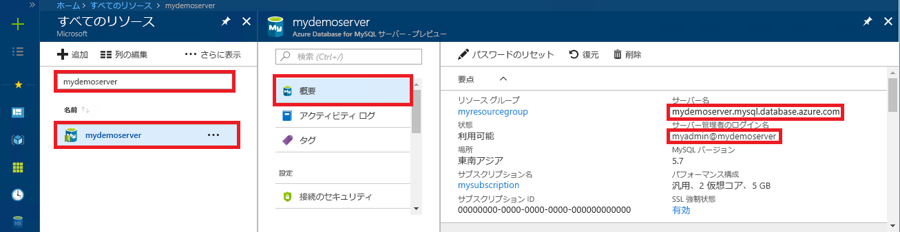

# <a name="azure-database-for-mysql-use-go-language-to-connect-and-query-data"></a>Azure Database for MySQL: Go 言語を使った接続とデータの照会
このクイックスタートでは、Windows、Ubuntu Linux、Apple macOS の各プラットフォームから、[Go](https://golang.org/) 言語で記述されたコードを使用して Azure Database for MySQL に接続する方法を紹介します。 ここでは、SQL ステートメントを使用してデータベース内のデータを照会、挿入、更新、削除する方法を説明します。 このトピックでは、Go を使用した開発には慣れているものの、Azure Database for MySQL の使用は初めてであるユーザーを想定しています。

## <a name="prerequisites"></a>前提条件
このクイックスタートでは、次のいずれかのガイドで作成されたリソースを出発点として使用します。
- [Azure Portal を使用した Azure Database for MySQL サーバーの作成](./quickstart-create-mysql-server-database-using-azure-portal.md)
- [Azure CLI を使用した Azure Database for MySQL サーバーの作成](./quickstart-create-mysql-server-database-using-azure-cli.md)

## <a name="install-go-and-mysql-connector"></a>Go と MySQL コネクタのインストール
ご使用のコンピューターに [Go](https://golang.org/doc/install) および [go-sql-driver for MySQL](https://github.com/go-sql-driver/mysql#installation) をインストールします。 プラットフォームに応じて、該当するセクションの手順に従ってください。

### <a name="windows"></a> Windows
1. Go for Microsoft Windows を[ダウンロード](https://golang.org/dl/)し、[インストール手順](https://golang.org/doc/install)に従ってインストールします。
2. スタート メニューからコマンド プロンプトを起動します。
3. プロジェクトのフォルダーを作成します。 `mkdir  %USERPROFILE%\go\src\mysqlgo`
4. ディレクトリをプロジェクト フォルダーに変更します (例: `cd %USERPROFILE%\go\src\mysqlgo`)。
5. GOPATH の環境変数がソース コード ディレクトリをポイントするように設定します。 `set GOPATH=%USERPROFILE%\go`
6. `go get github.com/go-sql-driver/mysql` コマンドを実行して [go-sql-driver for mysql](https://github.com/go-sql-driver/mysql#installation) をインストールします。

   まとめると、Go をインストールしてから、コマンド プロンプトで以下のコマンドを実行します。
   ```cmd
   mkdir  %USERPROFILE%\go\src\mysqlgo
   cd %USERPROFILE%\go\src\mysqlgo
   set GOPATH=%USERPROFILE%\go
   go get github.com/go-sql-driver/mysql
   ```

### <a name="linux-ubuntu"></a>Linux (Ubuntu)
1. Bash シェルを起動します。 
2. `sudo apt-get install golang-go` を実行して Go をインストールします。
3. プロジェクトのフォルダーを自分のホーム ディレクトリに作成します (例: `mkdir -p ~/go/src/mysqlgo/`)。
4. ディレクトリをこのフォルダーに変更します (例: `cd ~/go/src/mysqlgo/`)。
5. GOPATH 環境変数に有効なソース ディレクトリを設定します (現在のホーム ディレクトリの go フォルダーなど)。 Bash シェルで `export GOPATH=~/go` を実行し、現在のシェル セッションの GOPATH として go ディレクトリを追加します。
6. `go get github.com/go-sql-driver/mysql` コマンドを実行して [go-sql-driver for mysql](https://github.com/go-sql-driver/mysql#installation) をインストールします。

   まとめると、以下の Bash コマンドを実行します。
   ```bash
   sudo apt-get install golang-go
   mkdir -p ~/go/src/mysqlgo/
   cd ~/go/src/mysqlgo/
   export GOPATH=~/go/
   go get github.com/go-sql-driver/mysql
   ```

### <a name="apple-macos"></a>Apple macOS
1. [インストール手順](https://golang.org/doc/install)に従って、ご利用のプラットフォームに適した Go をダウンロードしてインストールします。 
2. Bash シェルを起動します。
3. プロジェクトのフォルダーを自分のホーム ディレクトリに作成します (例: `mkdir -p ~/go/src/mysqlgo/`)。
4. ディレクトリをこのフォルダーに変更します (例: `cd ~/go/src/mysqlgo/`)。
5. GOPATH 環境変数に有効なソース ディレクトリを設定します (現在のホーム ディレクトリの go フォルダーなど)。 Bash シェルで `export GOPATH=~/go` を実行し、現在のシェル セッションの GOPATH として go ディレクトリを追加します。
6. `go get github.com/go-sql-driver/mysql` コマンドを実行して [go-sql-driver for mysql](https://github.com/go-sql-driver/mysql#installation) をインストールします。

   まとめると、Go をインストールしてから、以下の Bash コマンドを実行します。
   ```bash
   mkdir -p ~/go/src/mysqlgo/
   cd ~/go/src/mysqlgo/
   export GOPATH=~/go/
   go get github.com/go-sql-driver/mysql
   ```

## <a name="get-connection-information"></a>接続情報の取得
Azure Database for MySQL に接続するために必要な接続情報を取得します。 完全修飾サーバー名とログイン資格情報が必要です。

1. [Azure Portal](https://portal.azure.com/) にログインします。
2. Azure Portal の左側のメニューにある **[すべてのリソース]** をクリックし、作成したサーバー (例: **mydemoserver**) を検索します。
3. サーバー名をクリックします。
4. サーバーの **[概要]** パネルから、**[サーバー名]** と **[サーバー管理者ログイン名]** を書き留めます。 パスワードを忘れた場合も、このパネルからパスワードをリセットすることができます。
 
   

## <a name="build-and-run-go-code"></a>Go コードのビルドと実行 
1. Golang コードを記述するには、Microsoft Windows のメモ帳、Ubuntu の [vi](http://manpages.ubuntu.com/manpages/xenial/man1/nvi.1.html#contenttoc5) や [Nano](https://www.nano-editor.org/)、macOS の TextEdit などのシンプルなテキスト エディターを使用できます。 充実した対話的な開発環境 (IDE) の方が好ましい場合は、Jetbrains の [Gogland](https://www.jetbrains.com/go/)、Microsoft の [Visual Studio Code](https://code.visualstudio.com/)、または [Atom](https://atom.io/) をお試しください。
2. 以下のセクションからテキスト ファイルに Go コードを貼り付け、\*.go というファイル拡張子でプロジェクト フォルダーに保存します (たとえば、Windows の場合は `%USERPROFILE%\go\src\mysqlgo\createtable.go` に、Linux の場合は `~/go/src/mysqlgo/createtable.go` に保存します)。
3. コード内で `HOST`、`DATABASE`、`USER`、および `PASSWORD` の定数を見つけて、サンプルの値を独自の値で置き換えます。 
4. コマンド プロンプトまたは Bash シェルを起動します。 ディレクトリをプロジェクト フォルダーに変更します。 たとえば Windows の場合、「`cd %USERPROFILE%\go\src\mysqlgo\`」と入力します。 Linux の場合は、「`cd ~/go/src/mysqlgo/`」と入力します。  前述した一部の IDE エディターでは、シェル コマンドを必要とせずに、デバッグとランタイムの機能が提供されています。
5. コマンド「`go run createtable.go`」を入力してコードを実行し、アプリケーションをコンパイルして実行します。 
6. または、コードをネイティブ アプリケーションとしてビルドするには、`go build createtable.go` を実行し、`createtable.exe` を起動してアプリケーションを実行します。

## <a name="connect-create-table-and-insert-data"></a>接続、テーブルの作成、データの挿入
サーバーに接続し、テーブルを作成した後、**INSERT** SQL ステートメントを使用してデータを読み込むには、次のコードを使用します。 

このコードでは、3 つのパッケージをインポートします。[sql パッケージ](https://golang.org/pkg/database/sql/)、Azure Database for MySQL と通信するためのドライバーである [go sql driver for mysql](https://github.com/go-sql-driver/mysql#installation)、コマンド ラインで入力と出力を表示するための [fmt パッケージ](https://golang.org/pkg/fmt/)です。

このコードでは、[sql.Open()](http://go-database-sql.org/accessing.html) メソッドを呼び出して Azure Database for MySQL に接続し、[db.Ping()](https://golang.org/pkg/database/sql/#DB.Ping) メソッドを使用してその接続を確認します。 [データベース ハンドル](https://golang.org/pkg/database/sql/#DB)が全体を通して使用され、データベース サーバーの接続プールが保持されます。 このコードでは、複数の DDL コマンドを実行するために [Exec()](https://golang.org/pkg/database/sql/#DB.Exec) メソッドを数回呼び出しています。 また、このコードは、[Prepare()](http://go-database-sql.org/prepared.html) と Exec() を使用して、準備済みステートメントを実行し、異なるパラメーターを使って 3 つの行を挿入しています。 毎回、カスタム checkError() メソッドによってエラーが発生したかどうかがチェックされ、エラーが発生した場合は panic によってプログラムが終了します。

`host`、`database`、`user`、`password` の各定数は、実際の値に置き換えてください。 

```Go
package main

import (
    "database/sql"
    "fmt"

    _ "github.com/go-sql-driver/mysql"
)

const (
    host     = "mydemoserver.mysql.database.azure.com"
    database = "quickstartdb"
    user     = "myadmin@mydemoserver"
    password = "yourpassword"
)

func checkError(err error) {
    if err != nil {
        panic(err)
    }
}

func main() {

    // Initialize connection string.
    var connectionString = fmt.Sprintf("%s:%s@tcp(%s:3306)/%s?allowNativePasswords=true", user, password, host, database)

    // Initialize connection object.
    db, err := sql.Open("mysql", connectionString)
    checkError(err)
    defer db.Close()

    err = db.Ping()
    checkError(err)
    fmt.Println("Successfully created connection to database.")

    // Drop previous table of same name if one exists.
    _, err = db.Exec("DROP TABLE IF EXISTS inventory;")
    checkError(err)
    fmt.Println("Finished dropping table (if existed).")

    // Create table.
    _, err = db.Exec("CREATE TABLE inventory (id serial PRIMARY KEY, name VARCHAR(50), quantity INTEGER);")
    checkError(err)
    fmt.Println("Finished creating table.")

    // Insert some data into table.
    sqlStatement, err := db.Prepare("INSERT INTO inventory (name, quantity) VALUES (?, ?);")
    res, err := sqlStatement.Exec("banana", 150)
    checkError(err)
    rowCount, err := res.RowsAffected()
    fmt.Printf("Inserted %d row(s) of data.\n", rowCount)

    res, err = sqlStatement.Exec("orange", 154)
    checkError(err)
    rowCount, err = res.RowsAffected()
    fmt.Printf("Inserted %d row(s) of data.\n", rowCount)

    res, err = sqlStatement.Exec("apple", 100)
    checkError(err)
    rowCount, err = res.RowsAffected()
    fmt.Printf("Inserted %d row(s) of data.\n", rowCount)
    fmt.Println("Done.")
}

```

## <a name="read-data"></a>データの読み取り
接続し、**SELECT** SQL ステートメントを使用してデータを読み取るには、次のコードを使用します。 

このコードでは、3 つのパッケージをインポートします。[sql パッケージ](https://golang.org/pkg/database/sql/)、Azure Database for MySQL と通信するためのドライバーである [go sql driver for mysql](https://github.com/go-sql-driver/mysql#installation)、コマンド ラインで入力と出力を表示するための [fmt パッケージ](https://golang.org/pkg/fmt/)です。

このコードでは、[sql.Open()](http://go-database-sql.org/accessing.html) メソッドを呼び出して Azure Database for MySQL に接続し、[db.Ping()](https://golang.org/pkg/database/sql/#DB.Ping) メソッドを使用してその接続を確認します。 [データベース ハンドル](https://golang.org/pkg/database/sql/#DB)が全体を通して使用され、データベース サーバーの接続プールが保持されます。 このコードは、[Query()](https://golang.org/pkg/database/sql/#DB.Query) メソッドを呼び出して select コマンドを実行します。 次に、[Next()](https://golang.org/pkg/database/sql/#Rows.Next) を実行して結果セットを反復処理し、[Scan()](https://golang.org/pkg/database/sql/#Rows.Scan) を使用して列の値を解析しながら、その値を変数に保存していきます。 毎回、カスタム checkError() メソッドによってエラーが発生したかどうかがチェックされ、エラーが発生した場合は panic によってプログラムが終了します。

`host`、`database`、`user`、`password` の各定数は、実際の値に置き換えてください。 

```Go
package main

import (
    "database/sql"
    "fmt"

    _ "github.com/go-sql-driver/mysql"
)

const (
    host     = "mydemoserver.mysql.database.azure.com"
    database = "quickstartdb"
    user     = "myadmin@mydemoserver"
    password = "yourpassword"
)

func checkError(err error) {
    if err != nil {
        panic(err)
    }
}

func main() {

    // Initialize connection string.
    var connectionString = fmt.Sprintf("%s:%s@tcp(%s:3306)/%s?allowNativePasswords=true", user, password, host, database)

    // Initialize connection object.
    db, err := sql.Open("mysql", connectionString)
    checkError(err)
    defer db.Close()

    err = db.Ping()
    checkError(err)
    fmt.Println("Successfully created connection to database.")

    // Variables for printing column data when scanned.
    var (
        id       int
        name     string
        quantity int
    )

    // Read some data from the table.
    rows, err := db.Query("SELECT id, name, quantity from inventory;")
    checkError(err)
    defer rows.Close()
    fmt.Println("Reading data:")
    for rows.Next() {
        err := rows.Scan(&id, &name, &quantity)
        checkError(err)
        fmt.Printf("Data row = (%d, %s, %d)\n", id, name, quantity)
    }
    err = rows.Err()
    checkError(err)
    fmt.Println("Done.")
}
```

## <a name="update-data"></a>データの更新
接続し、**UPDATE** SQL ステートメントを使用してデータを更新するには、次のコードを使用します。 

このコードでは、3 つのパッケージをインポートします。[sql パッケージ](https://golang.org/pkg/database/sql/)、Azure Database for MySQL と通信するためのドライバーである [go sql driver for mysql](https://github.com/go-sql-driver/mysql#installation)、コマンド ラインで入力と出力を表示するための [fmt パッケージ](https://golang.org/pkg/fmt/)です。

このコードでは、[sql.Open()](http://go-database-sql.org/accessing.html) メソッドを呼び出して Azure Database for MySQL に接続し、[db.Ping()](https://golang.org/pkg/database/sql/#DB.Ping) メソッドを使用してその接続を確認します。 [データベース ハンドル](https://golang.org/pkg/database/sql/#DB)が全体を通して使用され、データベース サーバーの接続プールが保持されます。 このコードは、[Exec()](https://golang.org/pkg/database/sql/#DB.Exec) メソッドを呼び出して update コマンドを実行します。 毎回、カスタム checkError() メソッドによってエラーが発生したかどうかがチェックされ、エラーが発生した場合は panic によってプログラムが終了します。

`host`、`database`、`user`、`password` の各定数は、実際の値に置き換えてください。 

```Go
package main

import (
    "database/sql"
    "fmt"

    _ "github.com/go-sql-driver/mysql"
)

const (
    host     = "mydemoserver.mysql.database.azure.com"
    database = "quickstartdb"
    user     = "myadmin@mydemoserver"
    password = "yourpassword"
)

func checkError(err error) {
    if err != nil {
        panic(err)
    }
}

func main() {

    // Initialize connection string.
    var connectionString = fmt.Sprintf("%s:%s@tcp(%s:3306)/%s?allowNativePasswords=true", user, password, host, database)

    // Initialize connection object.
    db, err := sql.Open("mysql", connectionString)
    checkError(err)
    defer db.Close()

    err = db.Ping()
    checkError(err)
    fmt.Println("Successfully created connection to database.")

    // Modify some data in table.
    rows, err := db.Exec("UPDATE inventory SET quantity = ? WHERE name = ?", 200, "banana")
    checkError(err)
    rowCount, err := rows.RowsAffected()
    fmt.Printf("Deleted %d row(s) of data.\n", rowCount)
    fmt.Println("Done.")
}
```

## <a name="delete-data"></a>データの削除
接続し、**DELETE** SQL ステートメントを使用してデータを削除するには、次のコードを使用します。 

このコードでは、3 つのパッケージをインポートします。[sql パッケージ](https://golang.org/pkg/database/sql/)、Azure Database for MySQL と通信するためのドライバーである [go sql driver for mysql](https://github.com/go-sql-driver/mysql#installation)、コマンド ラインで入力と出力を表示するための [fmt パッケージ](https://golang.org/pkg/fmt/)です。

このコードでは、[sql.Open()](http://go-database-sql.org/accessing.html) メソッドを呼び出して Azure Database for MySQL に接続し、[db.Ping()](https://golang.org/pkg/database/sql/#DB.Ping) メソッドを使用してその接続を確認します。 [データベース ハンドル](https://golang.org/pkg/database/sql/#DB)が全体を通して使用され、データベース サーバーの接続プールが保持されます。 このコードは、[Exec()](https://golang.org/pkg/database/sql/#DB.Exec) メソッドを呼び出して delete コマンドを実行します。 毎回、カスタム checkError() メソッドによってエラーが発生したかどうかがチェックされ、エラーが発生した場合は panic によってプログラムが終了します。

`host`、`database`、`user`、`password` の各定数は、実際の値に置き換えてください。 

```Go
package main

import (
    "database/sql"
    "fmt"
    _ "github.com/go-sql-driver/mysql"
)

const (
    host     = "mydemoserver.mysql.database.azure.com"
    database = "quickstartdb"
    user     = "myadmin@mydemoserver"
    password = "yourpassword"
)

func checkError(err error) {
    if err != nil {
        panic(err)
    }
}

func main() {

    // Initialize connection string.
    var connectionString = fmt.Sprintf("%s:%s@tcp(%s:3306)/%s?allowNativePasswords=true", user, password, host, database)

    // Initialize connection object.
    db, err := sql.Open("mysql", connectionString)
    checkError(err)
    defer db.Close()

    err = db.Ping()
    checkError(err)
    fmt.Println("Successfully created connection to database.")

    // Modify some data in table.
    rows, err := db.Exec("DELETE FROM inventory WHERE name = ?", "orange")
    checkError(err)
    rowCount, err := rows.RowsAffected()
    fmt.Printf("Deleted %d row(s) of data.\n", rowCount)
    fmt.Println("Done.")
}
```

## <a name="next-steps"></a>次の手順
> [!div class="nextstepaction"]
> [エクスポートとインポートを使用したデータベースの移行](./concepts-migrate-import-export.md)
