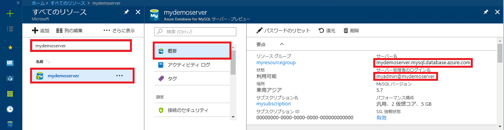

# <a name="azure-database-for-mysql-use-nodejs-to-connect-and-query-data"></a>Azure Database for MySQL: Node.js を使った接続とデータの照会
このクイックスタートでは、Windows、Ubuntu Linux、Mac の各プラットフォームから [Node.js](https://nodejs.org/) を使用して Azure Database for MySQL に接続する方法を紹介します。 ここでは、SQL ステートメントを使用してデータベース内のデータを照会、挿入、更新、削除する方法を説明します。 このトピックでは、Node.js を使用した開発には慣れているものの、Azure Database for MySQL の使用は初めてであるユーザーを想定しています。

## <a name="prerequisites"></a>前提条件
このクイックスタートでは、次のいずれかのガイドで作成されたリソースを出発点として使用します。
- [Azure Portal を使用した Azure Database for MySQL サーバーの作成](./quickstart-create-mysql-server-database-using-azure-portal.md)
- [Azure CLI を使用した Azure Database for MySQL サーバーの作成](./quickstart-create-mysql-server-database-using-azure-cli.md)

さらに、以下を実行する必要があります。
- [Node.js](https://nodejs.org) ランタイムをインストールします。
- Node.js アプリケーションから MySQL に接続するための [mysql](https://www.npmjs.com/package/mysql) パッケージをインストールします。 

## <a name="install-nodejs-and-the-mysql-connector"></a>Node.js と MySQL コネクタのインストール
プラットフォームに応じて、該当するセクションの手順に従って Node.js をインストールしてください。 npm を使用して mysql パッケージとその依存関係をプロジェクト フォルダーにインストールしてください。

### <a name="windows"></a>**Windows**
1. [Node.js ダウンロード ページ](https://nodejs.org/en/download/)にアクセスし、必要な Windows インストーラー オプションを選択します。
2. ローカル プロジェクト フォルダーを作成します (例: `nodejsmysql`)。 
3. コマンド プロンプトを起動し、ディレクトリをプロジェクト フォルダーに変更します (例: `cd c:\nodejsmysql\`)。
4. NPM ツールを実行して、mysql ライブラリをプロジェクト フォルダーにインストールします。

   ```cmd
   cd c:\nodejsmysql\
   "C:\Program Files\nodejs\npm" install mysql
   "C:\Program Files\nodejs\npm" list
   ```

5. `npm list` の出力テキストを確認してインストール結果を検証します。 バージョン番号は、新しいパッチのリリースに伴って変わる場合があります。

### <a name="linux-ubuntu"></a>**Linux (Ubuntu)**
1. 次のコマンドを実行して、**Node.js** と、Node.js 用のパッケージ マネージャー **npm** をインストールします。

   ```bash
   sudo apt-get install -y nodejs npm
   ```

2. 次のコマンドを実行して、`mysqlnodejs` というプロジェクト フォルダーを作成し、そのフォルダーに mysql パッケージをインストールします。

   ```bash
   mkdir nodejsmysql
   cd nodejsmysql
   npm install --save mysql
   npm list
   ```
3. npm list の出力テキストを確認してインストール結果を検証します。 バージョン番号は、新しいパッチのリリースに伴って変わる場合があります。

### <a name="mac-os"></a>**Mac OS**
1. 次のコマンドを入力して **brew** をインストールします。これは、Mac OS X と **Node.js** に対応する使いやすいパッケージ マネージャーです。

   ```bash
   ruby -e "$(curl -fsSL https://raw.githubusercontent.com/Homebrew/install/master/install)"
   brew install node
   ```
2. 次のコマンドを実行して、`mysqlnodejs` というプロジェクト フォルダーを作成し、そのフォルダーに mysql パッケージをインストールします。

   ```bash
   mkdir nodejsmysql
   cd nodejsmysql
   npm install --save mysql
   npm list
   ```

3. `npm list` の出力テキストを確認してインストール結果を検証します。 バージョン番号は、新しいパッチのリリースに伴って変わる場合があります。

## <a name="get-connection-information"></a>接続情報の取得
Azure Database for MySQL に接続するために必要な接続情報を取得します。 完全修飾サーバー名とログイン資格情報が必要です。

1. [Azure Portal](https://portal.azure.com/) にログインします。
2. Azure Portal の左側のメニューにある **[すべてのリソース]** をクリックし、作成したサーバー (例: **mydemoserver**) を検索します。
3. サーバー名をクリックします。
4. サーバーの **[概要]** パネルから、**[サーバー名]** と **[サーバー管理者ログイン名]** を書き留めます。 パスワードを忘れた場合も、このパネルからパスワードをリセットすることができます。
 

## <a name="running-the-javascript-code-in-nodejs"></a>Node.js での JavaScript コードの実行
1. JavaScript コードをテキスト ファイルに貼り付け、そのファイルを .js というファイル拡張子でプロジェクト フォルダーに保存します (例: C:\nodejsmysql\createtable.js や /home/username/nodejsmysql/createtable.js)。
2. コマンド プロンプトまたは Bash シェルを起動し、ディレクトリをプロジェクト フォルダーに変更します (`cd nodejsmysql`)。
3. アプリケーションを実行するには、node コマンドに続けてファイル名を入力します (例: `node createtable.js`)。
4. Windows で環境変数 PATH に node アプリケーションが追加されていない場合、node アプリケーションを起動するには完全パスを使用する必要があります (例: `"C:\Program Files\nodejs\node.exe" createtable.js`)。

## <a name="connect-create-table-and-insert-data"></a>接続、テーブルの作成、データの挿入
接続し、SQL ステートメント **CREATE TABLE** および **INSERT INTO** を使用してデータを読み込むには、次のコードを使用します。

MySQL サーバーとやり取りするには、[mysql.createConnection()](https://github.com/mysqljs/mysql#establishing-connections) メソッドを使用します。 サーバーへの接続を確立するには、[connect()](https://github.com/mysqljs/mysql#establishing-connections) 関数を使用します。 MySQL データベースに対して SQL クエリを実行するには、[query()](https://github.com/mysqljs/mysql#performing-queries) 関数を使用します。 

`host`、`user`、`password`、`database` の各パラメーターの値は、サーバーとデータベースを作成するときに指定した値に置き換えてください。

```javascript
const mysql = require('mysql');

var config =
{
    host: 'mydemoserver.mysql.database.azure.com',
    user: 'myadmin@mydemoserver',
    password: 'your_password',
    database: 'quickstartdb',
    port: 3306,
    ssl: true
};

const conn = new mysql.createConnection(config);

conn.connect(
    function (err) { 
    if (err) { 
        console.log("!!! Cannot connect !!! Error:");
        throw err;
    }
    else
    {
       console.log("Connection established.");
           queryDatabase();
    }   
});

function queryDatabase(){
       conn.query('DROP TABLE IF EXISTS inventory;', function (err, results, fields) { 
            if (err) throw err; 
            console.log('Dropped inventory table if existed.');
        })
       conn.query('CREATE TABLE inventory (id serial PRIMARY KEY, name VARCHAR(50), quantity INTEGER);', 
            function (err, results, fields) {
                if (err) throw err;
            console.log('Created inventory table.');
        })
       conn.query('INSERT INTO inventory (name, quantity) VALUES (?, ?);', ['banana', 150], 
            function (err, results, fields) {
                if (err) throw err;
            else console.log('Inserted ' + results.affectedRows + ' row(s).');
        })
       conn.query('INSERT INTO inventory (name, quantity) VALUES (?, ?);', ['orange', 154], 
            function (err, results, fields) {
                if (err) throw err;
            console.log('Inserted ' + results.affectedRows + ' row(s).');
        })
       conn.query('INSERT INTO inventory (name, quantity) VALUES (?, ?);', ['apple', 100], 
        function (err, results, fields) {
                if (err) throw err;
            console.log('Inserted ' + results.affectedRows + ' row(s).');
        })
       conn.end(function (err) { 
        if (err) throw err;
        else  console.log('Done.') 
        });
};
```

## <a name="read-data"></a>データの読み取り
接続し、**SELECT** SQL ステートメントを使用してデータを読み取るには、次のコードを使用します。 

MySQL サーバーとやり取りするには、[mysql.createConnection()](https://github.com/mysqljs/mysql#establishing-connections) メソッドを使用します。 サーバーとの接続を確立するには、[connect()](https://github.com/mysqljs/mysql#establishing-connections) メソッドを使用します。 MySQL データベースに対して SQL クエリを実行するには、[query()](https://github.com/mysqljs/mysql#performing-queries) メソッドを使用します。 クエリの結果は、results 配列を使って保存します。

`host`、`user`、`password`、`database` の各パラメーターの値は、サーバーとデータベースを作成するときに指定した値に置き換えてください。

```javascript
const mysql = require('mysql');

var config =
{
    host: 'mydemoserver.mysql.database.azure.com',
    user: 'myadmin@mydemoserver',
    password: 'your_password',
    database: 'quickstartdb',
    port: 3306,
    ssl: true
};

const conn = new mysql.createConnection(config);

conn.connect(
    function (err) { 
        if (err) { 
            console.log("!!! Cannot connect !!! Error:");
            throw err;
        }
        else {
            console.log("Connection established.");
            readData();
        }   
    });

function readData(){
        conn.query('SELECT * FROM inventory', 
            function (err, results, fields) {
                if (err) throw err;
                else console.log('Selected ' + results.length + ' row(s).');
                for (i = 0; i < results.length; i++) {
                    console.log('Row: ' + JSON.stringify(results[i]));
                }
                console.log('Done.');
            })
       conn.end(
           function (err) { 
                if (err) throw err;
                else  console.log('Closing connection.') 
        });
};
```

## <a name="update-data"></a>データの更新
接続し、**UPDATE** SQL ステートメントを使用してデータを読み取るには、次のコードを使用します。 

MySQL サーバーとやり取りするには、[mysql.createConnection()](https://github.com/mysqljs/mysql#establishing-connections) メソッドを使用します。 サーバーとの接続を確立するには、[connect()](https://github.com/mysqljs/mysql#establishing-connections) メソッドを使用します。 MySQL データベースに対して SQL クエリを実行するには、[query()](https://github.com/mysqljs/mysql#performing-queries) メソッドを使用します。 

`host`、`user`、`password`、`database` の各パラメーターの値は、サーバーとデータベースを作成するときに指定した値に置き換えてください。

```javascript
const mysql = require('mysql');

var config =
{
    host: 'mydemoserver.mysql.database.azure.com',
    user: 'myadmin@mydemoserver',
    password: 'your_password',
    database: 'quickstartdb',
    port: 3306,
    ssl: true
};

const conn = new mysql.createConnection(config);

conn.connect(
    function (err) { 
        if (err) { 
            console.log("!!! Cannot connect !!! Error:");
            throw err;
        }
        else {
            console.log("Connection established.");
            updateData();
        }   
    });

function updateData(){
       conn.query('UPDATE inventory SET quantity = ? WHERE name = ?', [200, 'banana'], 
            function (err, results, fields) {
                if (err) throw err;
                else console.log('Updated ' + results.affectedRows + ' row(s).');
        })
       conn.end(
           function (err) { 
                if (err) throw err;
                else  console.log('Done.') 
        });
};
```

## <a name="delete-data"></a>データの削除
接続し、**DELETE** SQL ステートメントを使用してデータを読み取るには、次のコードを使用します。 

MySQL サーバーとやり取りするには、[mysql.createConnection()](https://github.com/mysqljs/mysql#establishing-connections) メソッドを使用します。 サーバーとの接続を確立するには、[connect()](https://github.com/mysqljs/mysql#establishing-connections) メソッドを使用します。 MySQL データベースに対して SQL クエリを実行するには、[query()](https://github.com/mysqljs/mysql#performing-queries) メソッドを使用します。 

`host`、`user`、`password`、`database` の各パラメーターの値は、サーバーとデータベースを作成するときに指定した値に置き換えてください。

```javascript
const mysql = require('mysql');

var config =
{
    host: 'mydemoserver.mysql.database.azure.com',
    user: 'myadmin@mydemoserver',
    password: 'your_password',
    database: 'quickstartdb',
    port: 3306,
    ssl: true
};

const conn = new mysql.createConnection(config);

conn.connect(
    function (err) { 
        if (err) { 
            console.log("!!! Cannot connect !!! Error:");
            throw err;
        }
        else {
            console.log("Connection established.");
            deleteData();
        }   
    });

function deleteData(){
       conn.query('DELETE FROM inventory WHERE name = ?', ['orange'], 
            function (err, results, fields) {
                if (err) throw err;
                else console.log('Deleted ' + results.affectedRows + ' row(s).');
        })
       conn.end(
           function (err) { 
                if (err) throw err;
                else  console.log('Done.') 
        });
};
```

## <a name="next-steps"></a>次の手順
> [!div class="nextstepaction"]
> [エクスポートとインポートを使用したデータベースの移行](./concepts-migrate-import-export.md)
