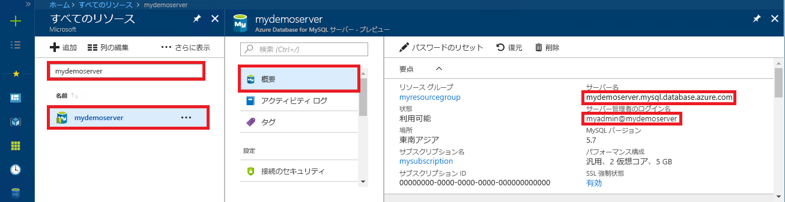

# <a name="azure-database-for-mysql-use-php-to-connect-and-query-data"></a>Azure Database for MySQL: PHP を使用した接続とデータの照会
このクイックスタートでは、[PHP](http://php.net/manual/intro-whatis.php) アプリケーションを使用して Azure Database for MySQL に接続する方法を紹介します。 ここでは、SQL ステートメントを使用してデータベース内のデータを照会、挿入、更新、削除する方法を説明します。 このトピックでは、PHP を使用した開発には慣れているものの、Azure Database for MySQL の使用は初めてであるユーザーを想定しています。

## <a name="prerequisites"></a>前提条件
このクイックスタートでは、次のいずれかのガイドで作成されたリソースを出発点として使用します。
- [Azure Portal を使用した Azure Database for MySQL サーバーの作成](./quickstart-create-mysql-server-database-using-azure-portal.md)
- [Azure CLI を使用した Azure Database for MySQL サーバーの作成](./quickstart-create-mysql-server-database-using-azure-cli.md)

## <a name="install-php"></a>PHP のインストール
独自のサーバーに PHP をインストールするか、PHP が含まれた Azure [Web アプリ](../app-service/app-service-web-overview.md)を作成します。

### <a name="macos"></a>MacOS
- [PHP 7.1.4 バージョン](http://php.net/downloads.php)をダウンロードします。
- PHP をインストールし、さらなる構成については [PHP マニュアル](http://php.net/manual/install.macosx.php)を参照します。

### <a name="linux-ubuntu"></a>Linux (Ubuntu)
- [PHP 7.1.4 非スレッドセーフ バージョン (x64)](http://php.net/downloads.php) をダウンロードします。
- PHP をインストールし、さらなる構成については [PHP マニュアル](http://php.net/manual/install.unix.php)を参照します。

### <a name="windows"></a>Windows
- [PHP 7.1.4 非スレッドセーフ バージョン (x64)](http://windows.php.net/download#php-7.1) をダウンロードします。
- PHP をインストールし、さらなる構成については [PHP マニュアル](http://php.net/manual/install.windows.php)を参照します。

## <a name="get-connection-information"></a>接続情報の取得
Azure Database for MySQL に接続するために必要な接続情報を取得します。 完全修飾サーバー名とログイン資格情報が必要です。

1. [Azure Portal](https://portal.azure.com/) にログインします。
2. Azure Portal の左側のメニューにある **[すべてのリソース]** をクリックし、作成したサーバー (例: **mydemoserver**) を検索します。
3. サーバー名をクリックします。
4. サーバーの **[概要]** パネルから、**[サーバー名]** と **[サーバー管理者ログイン名]** を書き留めます。 パスワードを忘れた場合も、このパネルからパスワードをリセットすることができます。
 

## <a name="connect-and-create-a-table"></a>接続とテーブルの作成
接続し、**CREATE TABLE** SQL ステートメントを使用してテーブルを作成するには、次のコードを使用します。 

このコードでは、PHP に含まれている **MySQL Improved 拡張機能** (mysqli) クラスを使用します。 このコードでは、[mysqli_init](http://php.net/manual/mysqli.init.php) メソッドと [mysqli_real_connect](http://php.net/manual/mysqli.real-connect.php) メソッドを呼び出して MySQL に接続します。 次に、[mysqli_query](http://php.net/manual/mysqli.query.php) メソッドを呼び出してクエリを実行します。 その後、[mysqli_close](http://php.net/manual/mysqli.close.php) メソッドを呼び出して接続を閉じます。

host、username、password、db_name の各パラメーターは実際の値に置き換えてください。 

```php
<?php
$host = 'mydemoserver.mysql.database.azure.com';
$username = 'myadmin@mydemoserver';
$password = 'your_password';
$db_name = 'your_database';

//Establishes the connection
$conn = mysqli_init();
mysqli_real_connect($conn, $host, $username, $password, $db_name, 3306);
if (mysqli_connect_errno($conn)) {
die('Failed to connect to MySQL: '.mysqli_connect_error());
}

// Run the create table query
if (mysqli_query($conn, '
CREATE TABLE Products (
`Id` INT NOT NULL AUTO_INCREMENT ,
`ProductName` VARCHAR(200) NOT NULL ,
`Color` VARCHAR(50) NOT NULL ,
`Price` DOUBLE NOT NULL ,
PRIMARY KEY (`Id`)
);
')) {
printf("Table created\n");
}

//Close the connection
mysqli_close($conn);
?>
```

## <a name="insert-data"></a>データを挿入する
接続し、**INSERT** SQL ステートメントを使用してデータを挿入するには、次のコードを使用します。

このコードでは、PHP に含まれている **MySQL Improved 拡張機能** (mysqli) クラスを使用します。 このコードでは、[mysqli_prepare](http://php.net/manual/mysqli.prepare.php) メソッドを使用して、準備済みの INSERT ステートメントを作成した後、[mysqli_stmt_bind_param](http://php.net/manual/mysqli-stmt.bind-param.php) メソッドを使用して、挿入される列の値ごとにパラメーターをバインドします。 このコードでは、[mysqli_stmt_execute](http://php.net/manual/mysqli-stmt.execute.php) メソッドでステートメントを実行してから、[mysqli_stmt_close](http://php.net/manual/mysqli-stmt.close.php) メソッドでステートメントを閉じます。

host、username、password、db_name の各パラメーターは実際の値に置き換えてください。 

```php
<?php
$host = 'mydemoserver.mysql.database.azure.com';
$username = 'myadmin@mydemoserver';
$password = 'your_password';
$db_name = 'your_database';

//Establishes the connection
$conn = mysqli_init();
mysqli_real_connect($conn, $host, $username, $password, $db_name, 3306);
if (mysqli_connect_errno($conn)) {
die('Failed to connect to MySQL: '.mysqli_connect_error());
}

//Create an Insert prepared statement and run it
$product_name = 'BrandNewProduct';
$product_color = 'Blue';
$product_price = 15.5;
if ($stmt = mysqli_prepare($conn, "INSERT INTO Products (ProductName, Color, Price) VALUES (?, ?, ?)")) {
mysqli_stmt_bind_param($stmt, 'ssd', $product_name, $product_color, $product_price);
mysqli_stmt_execute($stmt);
printf("Insert: Affected %d rows\n", mysqli_stmt_affected_rows($stmt));
mysqli_stmt_close($stmt);
}

// Close the connection
mysqli_close($conn);
?>
```

## <a name="read-data"></a>データの読み取り
接続し、**SELECT** SQL ステートメントを使用してデータを読み取るには、次のコードを使用します。  このコードでは、PHP に含まれている **MySQL Improved 拡張機能** (mysqli) クラスを使用します。 このコードでは、[mysqli_query](http://php.net/manual/mysqli.query.php) メソッドを使用して SQL クエリを実行し、[mysqli_fetch_assoc](http://php.net/manual/mysqli-result.fetch-assoc.php) メソッドを使用して結果の行をフェッチします。

host、username、password、db_name の各パラメーターは実際の値に置き換えてください。 

```php
<?php
$host = 'mydemoserver.mysql.database.azure.com';
$username = 'myadmin@mydemoserver';
$password = 'your_password';
$db_name = 'your_database';

//Establishes the connection
$conn = mysqli_init();
mysqli_real_connect($conn, $host, $username, $password, $db_name, 3306);
if (mysqli_connect_errno($conn)) {
die('Failed to connect to MySQL: '.mysqli_connect_error());
}

//Run the Select query
printf("Reading data from table: \n");
$res = mysqli_query($conn, 'SELECT * FROM Products');
while ($row = mysqli_fetch_assoc($res)) {
var_dump($row);
}

//Close the connection
mysqli_close($conn);
?>
```

## <a name="update-data"></a>データの更新
接続し、**UPDATE** SQL ステートメントを使用してデータを更新するには、次のコードを使用します。

このコードでは、PHP に含まれている **MySQL Improved 拡張機能** (mysqli) クラスを使用します。 このコードでは、[mysqli_prepare](http://php.net/manual/mysqli.prepare.php) メソッドを使用して、準備済みの UPDATE ステートメントを作成し、[mysqli_stmt_bind_param](http://php.net/manual/mysqli-stmt.bind-param.php) メソッドを使用して、更新される列の値ごとにパラメーターをバインドします。 このコードでは、[mysqli_stmt_execute](http://php.net/manual/mysqli-stmt.execute.php) メソッドでステートメントを実行してから、[mysqli_stmt_close](http://php.net/manual/mysqli-stmt.close.php) メソッドでステートメントを閉じます。

host、username、password、db_name の各パラメーターは実際の値に置き換えてください。 

```php
<?php
$host = 'mydemoserver.mysql.database.azure.com';
$username = 'myadmin@mydemoserver';
$password = 'your_password';
$db_name = 'your_database';

//Establishes the connection
$conn = mysqli_init();
mysqli_real_connect($conn, $host, $username, $password, $db_name, 3306);
if (mysqli_connect_errno($conn)) {
die('Failed to connect to MySQL: '.mysqli_connect_error());
}

//Run the Update statement
$product_name = 'BrandNewProduct';
$new_product_price = 15.1;
if ($stmt = mysqli_prepare($conn, "UPDATE Products SET Price = ? WHERE ProductName = ?")) {
mysqli_stmt_bind_param($stmt, 'ds', $new_product_price, $product_name);
mysqli_stmt_execute($stmt);
printf("Update: Affected %d rows\n", mysqli_stmt_affected_rows($stmt));

//Close the connection
mysqli_stmt_close($stmt);
}

mysqli_close($conn);
?>
```


## <a name="delete-data"></a>データの削除
接続し、**DELETE** SQL ステートメントを使用してデータを読み取るには、次のコードを使用します。 

このコードでは、PHP に含まれている **MySQL Improved 拡張機能** (mysqli) クラスを使用します。 このコードでは、[mysqli_prepare](http://php.net/manual/mysqli.prepare.php) メソッドを使用して、準備済みの DELETE ステートメントを作成し、[mysqli_stmt_bind_param](http://php.net/manual/mysqli-stmt.bind-param.php) メソッドを使用して、ステートメント内の WHERE 句のパラメーターをバインドします。 このコードでは、[mysqli_stmt_execute](http://php.net/manual/mysqli-stmt.execute.php) メソッドでステートメントを実行してから、[mysqli_stmt_close](http://php.net/manual/mysqli-stmt.close.php) メソッドでステートメントを閉じます。

host、username、password、db_name の各パラメーターは実際の値に置き換えてください。 

```php
<?php
$host = 'mydemoserver.mysql.database.azure.com';
$username = 'myadmin@mydemoserver';
$password = 'your_password';
$db_name = 'your_database';

//Establishes the connection
$conn = mysqli_init();
mysqli_real_connect($conn, $host, $username, $password, $db_name, 3306);
if (mysqli_connect_errno($conn)) {
die('Failed to connect to MySQL: '.mysqli_connect_error());
}

//Run the Delete statement
$product_name = 'BrandNewProduct';
if ($stmt = mysqli_prepare($conn, "DELETE FROM Products WHERE ProductName = ?")) {
mysqli_stmt_bind_param($stmt, 's', $product_name);
mysqli_stmt_execute($stmt);
printf("Delete: Affected %d rows\n", mysqli_stmt_affected_rows($stmt));
mysqli_stmt_close($stmt);
}

//Close the connection
mysqli_close($conn);
?>
```

## <a name="next-steps"></a>次の手順
> [!div class="nextstepaction"]
> [Azure Database for MySQL に SSL で接続する](howto-configure-ssl.md)
