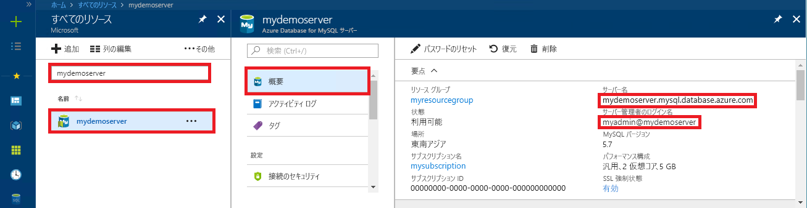

# <a name="quickstart-use-python-to-connect-and-query-data-with-azure-database-for-mysql"></a>クイック スタート:Python を使用して Azure Database for MySQL のデータに接続してクエリを実行する

このクイックスタートでは、Python を使用して Azure Database for MySQL に接続します。 Mac、Ubuntu Linux、Windows の各プラットフォームから SQL ステートメントを使用して、データベース内のデータを照会、挿入、更新、削除できます。 

このトピックでは、Python を使用した開発には慣れているものの、Azure Database for MySQL の使用は初めてであるユーザーを想定しています。

## <a name="prerequisites"></a>前提条件

- アクティブなサブスクリプションが含まれる Azure アカウント。 [無料でアカウントを作成できます](https://azure.microsoft.com/free/?ref=microsoft.com&utm_source=microsoft.com&utm_medium=docs&utm_campaign=visualstudio)。
- Azure Database for MySQL サーバー。 [Azure portal を使用して Azure Database for MySQL サーバーを作成](quickstart-create-mysql-server-database-using-azure-portal.md)するか、[Azure CLI を使用して Azure Database for MySQL サーバーを作成](quickstart-create-mysql-server-database-using-azure-cli.md)してください。

## <a name="install-python-and-the-mysql-connector"></a>Python と MySQL コネクタのインストール

次の手順を使用して、お使いのコンピューターに Python と Python 用 MySQL コネクタをインストールします。 

> [!NOTE]
> このクイックスタートでは、未加工の SQL クエリの手法を使用して、MySQL に接続します。 Web フレームワークを使用している場合は、それらのフレームワークに対して推奨されているコネクタを使用してください (たとえば、Django の場合は [mysqlclient](https://pypi.org/project/mysqlclient/))。

1. ご使用の OS に [Python 3.7 以上](https://www.python.org/downloads/)をダウンロードしてインストールします。 MySQL コネクタで必要となるため、必ず Python を `PATH` に追加します。
   
1. コマンド プロンプトまたは `bash` シェルを開き、大文字の V スイッチを指定して `python -V` を実行して、Python のバージョンを確認します。
   
1. `pip` パッケージ インストーラーは、Python の最新バージョンに含まれています。 `pip install -U pip` を実行して、`pip` を最新バージョンに更新します。 
   
   `pip` がインストールされていない場合は、`get-pip.py` を使用してダウンロードおよびインストールできます。 詳細については、「[インストール](https://pip.pypa.io/en/stable/installing/)」を参照してください。 
   
1. `pip` を使用して、Python 用 MySQL コネクタとその依存関係をインストールします。
   
   ```bash
   pip install mysql-connector-python
   ```
   
   MySQL 用 Python コネクタは、[mysql.com](https://dev.mysql.com/downloads/connector/python/) からインストールすることもできます。 Python 用 MySQL コネクタの詳細については、「[MySQL Connector/Python 開発者ガイド](https://dev.mysql.com/doc/connector-python/en/)」を参照してください。 

## <a name="get-connection-information"></a>接続情報の取得

Azure portal から Azure Database for MySQL に接続するために必要な接続情報を取得します。 サーバー名、データベース名、およびログイン資格情報が必要です。

1. [Azure portal](https://portal.azure.com/) にサインインします。
   
1. ポータルの検索バーで、作成した Azure Database for MySQL サーバー (たとえば、**mydemoserver**) を検索して選択します。
   
   
   
1. サーバーの **[概要]** ページから、 **[サーバー名]** と **[サーバー管理者ログイン名]** を書き留めます。 パスワードを忘れた場合も、このページからパスワードをリセットすることができます。
   
   

## <a name="run-the-python-examples"></a>Python サンプルを実行する

この記事の各コード例では、次のことを行います。

1. テキスト エディターで新しいファイルを作成します。
1. ファイルにコード例を追加します。 コード内の `<mydemoserver>`、`<myadmin>`、`<mypassword>`、および `<mydatabase>` の各プレースホルダーを、実際の MySQL サーバーとデータベースの値に置き換えます。
1. *.py* 拡張子を付けてファイルをプロジェクト フォルダーに保存します (たとえば、*C:\pythonmysql\createtable.py*、 */home/username/pythonmysql/createtable.py*)。
1. コードを実行するために、コマンド プロンプトまたは `bash` シェルを開き、ディレクトリを対象のプロジェクト フォルダー (たとえば、`cd pythonmysql`) に変更します。 `python` コマンドに続けてファイル名 (たとえば、`python createtable.py`) を入力し、Enter キーを押します。 
   
   > [!NOTE]
   > Windows で *python.exe* が見つからない場合は、Python のパスを PATH 環境変数に追加するか、*python.exe* への完全パス (たとえば、`C:\python27\python.exe createtable.py`) を指定してください。

## <a name="create-a-table-and-insert-data"></a>テーブルを作成してデータを挿入する

次のコードを使用して、サーバーとデータベースに接続し、テーブルを作成した後、**INSERT** SQL ステートメントを使用してデータを読み込みます。 

このコードでは、mysql.connector ライブラリをインポートし、[connect()](https://dev.mysql.com/doc/connector-python/en/connector-python-api-mysql-connector-connect.html) 関数を使用して、config コレクション内の[引数](https://dev.mysql.com/doc/connector-python/en/connector-python-connectargs.html)を使用して Azure Database for MySQL に接続します。 このコードでは、接続でカーソルを使用し、[cursor.execute()](https://dev.mysql.com/doc/connector-python/en/connector-python-api-mysqlcursor-execute.html) メソッドによって MySQL データベースに対する SQL クエリを実行します。 

```python
import mysql.connector
from mysql.connector import errorcode

# Obtain connection string information from the portal
config = {
  'host':'<mydemoserver>.mysql.database.azure.com',
  'user':'<myadmin>@<mydemoserver>',
  'password':'<mypassword>',
  'database':'<mydatabase>'
}

# Construct connection string
try:
   conn = mysql.connector.connect(**config)
   print("Connection established")
except mysql.connector.Error as err:
  if err.errno == errorcode.ER_ACCESS_DENIED_ERROR:
    print("Something is wrong with the user name or password")
  elif err.errno == errorcode.ER_BAD_DB_ERROR:
    print("Database does not exist")
  else:
    print(err)
else:
  cursor = conn.cursor()

  # Drop previous table of same name if one exists
  cursor.execute("DROP TABLE IF EXISTS inventory;")
  print("Finished dropping table (if existed).")

  # Create table
  cursor.execute("CREATE TABLE inventory (id serial PRIMARY KEY, name VARCHAR(50), quantity INTEGER);")
  print("Finished creating table.")

  # Insert some data into table
  cursor.execute("INSERT INTO inventory (name, quantity) VALUES (%s, %s);", ("banana", 150))
  print("Inserted",cursor.rowcount,"row(s) of data.")
  cursor.execute("INSERT INTO inventory (name, quantity) VALUES (%s, %s);", ("orange", 154))
  print("Inserted",cursor.rowcount,"row(s) of data.")
  cursor.execute("INSERT INTO inventory (name, quantity) VALUES (%s, %s);", ("apple", 100))
  print("Inserted",cursor.rowcount,"row(s) of data.")

  # Cleanup
  conn.commit()
  cursor.close()
  conn.close()
  print("Done.")
```

## <a name="read-data"></a>データの読み取り

接続し、**SELECT** SQL ステートメントを使用してデータを読み取るには、次のコードを使用します。 

このコードでは、mysql.connector ライブラリをインポートし、[connect()](https://dev.mysql.com/doc/connector-python/en/connector-python-api-mysql-connector-connect.html) 関数を使用して、config コレクション内の[引数](https://dev.mysql.com/doc/connector-python/en/connector-python-connectargs.html)を使用して Azure Database for MySQL に接続します。 このコードでは、接続でカーソルを使用し、[cursor.execute()](https://dev.mysql.com/doc/connector-python/en/connector-python-api-mysqlcursor-execute.html) メソッドによって MySQL データベースに対する SQL クエリを実行します。 

このコードでは、[fetchall()](https://dev.mysql.com/doc/connector-python/en/connector-python-api-mysqlcursor-fetchall.html) メソッドを使用してデータ行を読み取り、結果セットをコレクション行に保持し、`for` 反復子を使用して行をループ処理します。

```python
import mysql.connector
from mysql.connector import errorcode

# Obtain connection string information from the portal
config = {
  'host':'<mydemoserver>.mysql.database.azure.com',
  'user':'<myadmin>@<mydemoserver>',
  'password':'<mypassword>',
  'database':'<mydatabase>'
}

# Construct connection string
try:
   conn = mysql.connector.connect(**config)
   print("Connection established")
except mysql.connector.Error as err:
  if err.errno == errorcode.ER_ACCESS_DENIED_ERROR:
    print("Something is wrong with the user name or password")
  elif err.errno == errorcode.ER_BAD_DB_ERROR:
    print("Database does not exist")
  else:
    print(err)
else:
  cursor = conn.cursor()

  # Read data
  cursor.execute("SELECT * FROM inventory;")
  rows = cursor.fetchall()
  print("Read",cursor.rowcount,"row(s) of data.")

  # Print all rows
  for row in rows:
    print("Data row = (%s, %s, %s)" %(str(row[0]), str(row[1]), str(row[2])))

  # Cleanup
  conn.commit()
  cursor.close()
  conn.close()
  print("Done.")
```

## <a name="update-data"></a>データの更新

接続し、**UPDATE** SQL ステートメントを使用してデータを更新するには、次のコードを使用します。 

このコードでは、mysql.connector ライブラリをインポートし、[connect()](https://dev.mysql.com/doc/connector-python/en/connector-python-api-mysql-connector-connect.html) 関数を使用して、config コレクション内の[引数](https://dev.mysql.com/doc/connector-python/en/connector-python-connectargs.html)を使用して Azure Database for MySQL に接続します。 このコードでは、接続でカーソルを使用し、[cursor.execute()](https://dev.mysql.com/doc/connector-python/en/connector-python-api-mysqlcursor-execute.html) メソッドによって MySQL データベースに対する SQL クエリを実行します。 

```python
import mysql.connector
from mysql.connector import errorcode

# Obtain connection string information from the portal
config = {
  'host':'<mydemoserver>.mysql.database.azure.com',
  'user':'<myadmin>@<mydemoserver>',
  'password':'<mypassword>',
  'database':'<mydatabase>'
}

# Construct connection string
try:
   conn = mysql.connector.connect(**config)
   print("Connection established")
except mysql.connector.Error as err:
  if err.errno == errorcode.ER_ACCESS_DENIED_ERROR:
    print("Something is wrong with the user name or password")
  elif err.errno == errorcode.ER_BAD_DB_ERROR:
    print("Database does not exist")
  else:
    print(err)
else:
  cursor = conn.cursor()

  # Update a data row in the table
  cursor.execute("UPDATE inventory SET quantity = %s WHERE name = %s;", (200, "banana"))
  print("Updated",cursor.rowcount,"row(s) of data.")

  # Cleanup
  conn.commit()
  cursor.close()
  conn.close()
  print("Done.")
```

## <a name="delete-data"></a>データの削除

接続し、**DELETE** SQL ステートメントを使用してデータを削除するには、次のコードを使用します。 

このコードでは、mysql.connector ライブラリをインポートし、[connect()](https://dev.mysql.com/doc/connector-python/en/connector-python-api-mysql-connector-connect.html) 関数を使用して、config コレクション内の[引数](https://dev.mysql.com/doc/connector-python/en/connector-python-connectargs.html)を使用して Azure Database for MySQL に接続します。 このコードでは、接続でカーソルを使用し、[cursor.execute()](https://dev.mysql.com/doc/connector-python/en/connector-python-api-mysqlcursor-execute.html) メソッドによって MySQL データベースに対する SQL クエリを実行します。 

```python
import mysql.connector
from mysql.connector import errorcode

# Obtain connection string information from the portal
config = {
  'host':'<mydemoserver>.mysql.database.azure.com',
  'user':'<myadmin>@<mydemoserver>',
  'password':'<mypassword>',
  'database':'<mydatabase>'
}

# Construct connection string
try:
   conn = mysql.connector.connect(**config)
   print("Connection established.")
except mysql.connector.Error as err:
  if err.errno == errorcode.ER_ACCESS_DENIED_ERROR:
    print("Something is wrong with the user name or password.")
  elif err.errno == errorcode.ER_BAD_DB_ERROR:
    print("Database does not exist.")
  else:
    print(err)
else:
  cursor = conn.cursor()

  # Delete a data row in the table
  cursor.execute("DELETE FROM inventory WHERE name=%(param1)s;", {'param1':"orange"})
  print("Deleted",cursor.rowcount,"row(s) of data.")

  # Cleanup
  conn.commit()
  cursor.close()
  conn.close()
  print("Done.")
```

## <a name="next-steps"></a>次のステップ

> [!div class="nextstepaction"]
> [エクスポートとインポートを使用したデータベースの移行](./concepts-migrate-import-export.md)
