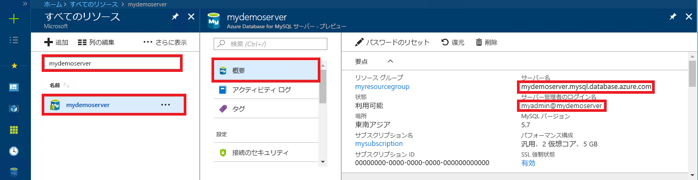

# <a name="azure-database-for-mysql-use-python-to-connect-and-query-data"></a>Azure Database for MySQL: Python を使った接続とデータの照会
このクイックスタートでは、[Python](https://python.org) を使用して Azure Database for MySQL に接続する方法を紹介します。 Mac OS、Ubuntu Linux、Windows の各プラットフォームから、SQL ステートメントを使用してデータベース内のデータを照会、挿入、更新、削除しています。 このトピックでは、Python を使用した開発には慣れているものの、Azure Database for MySQL の使用は初めてであるユーザーを想定しています。

## <a name="prerequisites"></a>前提条件
このクイックスタートでは、次のいずれかのガイドで作成されたリソースを出発点として使用します。
- [Azure Portal を使用した Azure Database for MySQL サーバーの作成](./quickstart-create-mysql-server-database-using-azure-portal.md)
- [Azure CLI を使用した Azure Database for MySQL サーバーの作成](./quickstart-create-mysql-server-database-using-azure-cli.md)

## <a name="install-python-and-the-mysql-connector"></a>Python と MySQL コネクタのインストール
ご使用のマシンに [Python](https://www.python.org/downloads/) と [MySQL Connector for Python](https://dev.mysql.com/downloads/connector/python/) をインストールします。 プラットフォームに応じて、以下の該当するセクションの手順に従ってください。 

> [!NOTE]
> このクイック スタートでは、未加工の SQL クエリの手法を使用して、MySQL に接続し、クエリを実行します。 Web フレームワークを使用している場合は、それらのフレームワークに対して推奨されているコネクタを使用します。 たとえば、Django と共に使用するには、[mysqlclient](https://pypi.org/project/mysqlclient/) が推奨されています。
>

### <a name="windows"></a> Windows
1. Python 2.7 を [python.org](https://www.python.org/downloads/windows/) からダウンロードしてインストールします。 
2. コマンド プロンプトを起動して Python のインストールを確認します。 大文字の V スイッチを使用して `C:\python27\python.exe -V` コマンドを実行し、バージョン番号を確認してください。
3. ご使用のバージョンの Python に対応する Python Connector for MySQL を [mysql.com](https://dev.mysql.com/downloads/connector/python/) からインストールします。

### <a name="linux-ubuntu"></a>Linux (Ubuntu)
1. 一般に、Linux (Ubuntu) では、既定の環境の一部として Python がインストールされます。
2. Bash シェルを起動して Python のインストールを確認します。 大文字の V スイッチを使用して `python -V` コマンドを実行し、バージョン番号を確認してください。
3. PIP のインストールを確認します。`pip show pip -V` コマンドを実行してバージョン番号を確認してください。 
4. 一部のバージョンの Python には PIP が含まれている場合があります。 PIP がインストールされていない場合は、`sudo apt-get install python-pip` コマンドを実行して、[PIP](https://pip.pypa.io/en/stable/installing/) パッケージをインストールしてください。
5. `pip install -U pip` コマンドを実行して PIP を最新バージョンに更新します。
6. 次の PIP コマンドを使用して、MySQL Connector for Python とその依存関係をインストールします。

   ```bash
   sudo pip install mysql-connector-python-rf
   ```
 
### <a name="macos"></a>MacOS
1. 一般に、Mac OS では、既定の OS 環境の一部として Python がインストールされます。
2. Bash シェルを起動して Python のインストールを確認します。 大文字の V スイッチを使用して `python -V` コマンドを実行し、バージョン番号を確認してください。
3. PIP のインストールを確認します。`pip show pip -V` コマンドを実行してバージョン番号を確認してください。
4. 一部のバージョンの Python には PIP が含まれている場合があります。 PIP がインストールされていない場合は、[PIP](https://pip.pypa.io/en/stable/installing/) パッケージをインストールしてください。
5. `pip install -U pip` コマンドを実行して PIP を最新バージョンに更新します。
6. 次の PIP コマンドを使用して、MySQL Connector for Python とその依存関係をインストールします。

   ```bash
   pip install mysql-connector-python-rf
   ``` 

## <a name="get-connection-information"></a>接続情報の取得
Azure Database for MySQL に接続するために必要な接続情報を取得します。 完全修飾サーバー名とログイン資格情報が必要です。

1. [Azure Portal](https://portal.azure.com/) にログインします。
2. Azure Portal の左側のメニューにある **[すべてのリソース]** をクリックし、作成したサーバー (例: **mydemoserver**) を検索します。
3. サーバー名をクリックします。
4. サーバーの **[概要]** パネルから、**[サーバー名]** と **[サーバー管理者ログイン名]** を書き留めます。 パスワードを忘れた場合も、このパネルからパスワードをリセットすることができます。
 

## <a name="run-python-code"></a>Python コードの実行
- コードをテキスト ファイルに貼り付け、そのファイルを .py というファイル拡張子でプロジェクト フォルダーに保存します (例: C:\pythonmysql\createtable.py や /home/username/pythonmysql/createtable.py)。
- このコードを実行するには、コマンド プロンプトまたは Bash シェルを起動します。 プロジェクト フォルダーに移動します (`cd pythonmysql`)。 そのうえで、python コマンドに続けてファイル名を入力し (`python createtable.py`)、アプリケーションを実行します。 Windows OS で python.exe が見つからない場合は、実行可能ファイルの完全パスを指定するか、Python のパスを PATH 環境変数に追加してください。 `C:\python27\python.exe createtable.py`

## <a name="connect-create-table-and-insert-data"></a>接続、テーブルの作成、データの挿入
サーバーに接続し、テーブルを作成した後、**INSERT** SQL ステートメントを使用してデータを読み込むには、次のコードを使用します。 

このコードには mysql.connector ライブラリをインポートしています。 その [connect()](https://dev.mysql.com/doc/connector-python/en/connector-python-api-mysql-connector-connect.html) 関数に config コレクションの[接続引数](https://dev.mysql.com/doc/connector-python/en/connector-python-connectargs.html)を渡して、Azure Database for MySQL に接続します。 MySQL データベースに対する SQL クエリは、接続のカーソルを使用し、[cursor.execute()](https://dev.mysql.com/doc/connector-python/en/connector-python-api-mysqlcursor-execute.html) メソッドで実行しています。 

`host`、`user`、`password`、`database` の各パラメーターの値は、サーバーとデータベースを作成するときに指定した値に置き換えてください。

```Python
import mysql.connector
from mysql.connector import errorcode

# Obtain connection string information from the portal
config = {
  'host':'mydemoserver.mysql.database.azure.com',
  'user':'myadmin@mydemoserver',
  'password':'yourpassword',
  'database':'quickstartdb'
}

# Construct connection string
try:
   conn = mysql.connector.connect(**config)
   print("Connection established")
except mysql.connector.Error as err:
  if err.errno == errorcode.ER_ACCESS_DENIED_ERROR:
    print("Something is wrong with the user name or password")
  elif err.errno == errorcode.ER_BAD_DB_ERROR:
    print("Database does not exist")
  else:
    print(err)
else:
  cursor = conn.cursor()

  # Drop previous table of same name if one exists
  cursor.execute("DROP TABLE IF EXISTS inventory;")
  print("Finished dropping table (if existed).")

  # Create table
  cursor.execute("CREATE TABLE inventory (id serial PRIMARY KEY, name VARCHAR(50), quantity INTEGER);")
  print("Finished creating table.")

  # Insert some data into table
  cursor.execute("INSERT INTO inventory (name, quantity) VALUES (%s, %s);", ("banana", 150))
  print("Inserted",cursor.rowcount,"row(s) of data.")
  cursor.execute("INSERT INTO inventory (name, quantity) VALUES (%s, %s);", ("orange", 154))
  print("Inserted",cursor.rowcount,"row(s) of data.")
  cursor.execute("INSERT INTO inventory (name, quantity) VALUES (%s, %s);", ("apple", 100))
  print("Inserted",cursor.rowcount,"row(s) of data.")

  # Cleanup
  conn.commit()
  cursor.close()
  conn.close()
  print("Done.")
```

## <a name="read-data"></a>データの読み取り
接続し、**SELECT** SQL ステートメントを使用してデータを読み取るには、次のコードを使用します。 

このコードには mysql.connector ライブラリをインポートしています。 その [connect()](https://dev.mysql.com/doc/connector-python/en/connector-python-api-mysql-connector-connect.html) 関数に config コレクションの[接続引数](https://dev.mysql.com/doc/connector-python/en/connector-python-connectargs.html)を渡して、Azure Database for MySQL に接続します。 MySQL データベースに対する SQL ステートメントは、接続のカーソルを使用し、[cursor.execute()](https://dev.mysql.com/doc/connector-python/en/connector-python-api-mysqlcursor-execute.html) メソッドで実行しています。 データ行の読み取りには、[fetchall()](https://dev.mysql.com/doc/connector-python/en/connector-python-api-mysqlcursor-fetchall.html) メソッドを使用します。 結果セットを rows コレクションに格納し、for 反復子を使用して一連の行を反復処理しています。

`host`、`user`、`password`、`database` の各パラメーターの値は、サーバーとデータベースを作成するときに指定した値に置き換えてください。

```Python
import mysql.connector
from mysql.connector import errorcode

# Obtain connection string information from the portal
config = {
  'host':'mydemoserver.mysql.database.azure.com',
  'user':'myadmin@mydemoserver',
  'password':'yourpassword',
  'database':'quickstartdb'
}

# Construct connection string
try:
   conn = mysql.connector.connect(**config)
   print("Connection established")
except mysql.connector.Error as err:
  if err.errno == errorcode.ER_ACCESS_DENIED_ERROR:
    print("Something is wrong with the user name or password")
  elif err.errno == errorcode.ER_BAD_DB_ERROR:
    print("Database does not exist")
  else:
    print(err)
else:
  cursor = conn.cursor()

  # Read data
  cursor.execute("SELECT * FROM inventory;")
  rows = cursor.fetchall()
  print("Read",cursor.rowcount,"row(s) of data.")

  # Print all rows
  for row in rows:
    print("Data row = (%s, %s, %s)" %(str(row[0]), str(row[1]), str(row[2])))

  # Cleanup
  conn.commit()
  cursor.close()
  conn.close()
  print("Done.")
```

## <a name="update-data"></a>データの更新
接続し、**UPDATE** SQL ステートメントを使用してデータを更新するには、次のコードを使用します。 

このコードには mysql.connector ライブラリをインポートしています。  その [connect()](https://dev.mysql.com/doc/connector-python/en/connector-python-api-mysql-connector-connect.html) 関数に config コレクションの[接続引数](https://dev.mysql.com/doc/connector-python/en/connector-python-connectargs.html)を渡して、Azure Database for MySQL に接続します。 MySQL データベースに対する SQL ステートメントは、接続のカーソルを使用し、[cursor.execute()](https://dev.mysql.com/doc/connector-python/en/connector-python-api-mysqlcursor-execute.html) メソッドで実行しています。 

`host`、`user`、`password`、`database` の各パラメーターの値は、サーバーとデータベースを作成するときに指定した値に置き換えてください。

```Python
import mysql.connector
from mysql.connector import errorcode

# Obtain connection string information from the portal
config = {
  'host':'mydemoserver.mysql.database.azure.com',
  'user':'myadmin@mydemoserver',
  'password':'yourpassword',
  'database':'quickstartdb'
}

# Construct connection string
try:
   conn = mysql.connector.connect(**config)
   print("Connection established")
except mysql.connector.Error as err:
  if err.errno == errorcode.ER_ACCESS_DENIED_ERROR:
    print("Something is wrong with the user name or password")
  elif err.errno == errorcode.ER_BAD_DB_ERROR:
    print("Database does not exist")
  else:
    print(err)
else:
  cursor = conn.cursor()

  # Update a data row in the table
  cursor.execute("UPDATE inventory SET quantity = %s WHERE name = %s;", (200, "banana"))
  print("Updated",cursor.rowcount,"row(s) of data.")

  # Cleanup
  conn.commit()
  cursor.close()
  conn.close()
  print("Done.")
```

## <a name="delete-data"></a>データの削除
接続し、**DELETE** SQL ステートメントを使用してデータを削除するには、次のコードを使用します。 

このコードには mysql.connector ライブラリをインポートしています。  その [connect()](https://dev.mysql.com/doc/connector-python/en/connector-python-api-mysql-connector-connect.html) 関数に config コレクションの[接続引数](https://dev.mysql.com/doc/connector-python/en/connector-python-connectargs.html)を渡して、Azure Database for MySQL に接続します。 MySQL データベースに対する SQL クエリは、接続のカーソルを使用し、[cursor.execute()](https://dev.mysql.com/doc/connector-python/en/connector-python-api-mysqlcursor-execute.html) メソッドで実行しています。 

`host`、`user`、`password`、`database` の各パラメーターの値は、サーバーとデータベースを作成するときに指定した値に置き換えてください。

```Python
import mysql.connector
from mysql.connector import errorcode

# Obtain connection string information from the portal
config = {
  'host':'mydemoserver.mysql.database.azure.com',
  'user':'myadmin@mydemoserver',
  'password':'yourpassword',
  'database':'quickstartdb'
}

# Construct connection string
try:
   conn = mysql.connector.connect(**config)
   print("Connection established.")
except mysql.connector.Error as err:
  if err.errno == errorcode.ER_ACCESS_DENIED_ERROR:
    print("Something is wrong with the user name or password.")
  elif err.errno == errorcode.ER_BAD_DB_ERROR:
    print("Database does not exist.")
  else:
    print(err)
else:
  cursor = conn.cursor()

  # Delete a data row in the table
  cursor.execute("DELETE FROM inventory WHERE name=%(param1)s;", {'param1':"orange"})
  print("Deleted",cursor.rowcount,"row(s) of data.")

  # Cleanup
  conn.commit()
  cursor.close()
  conn.close()
  print("Done.")
```

## <a name="next-steps"></a>次の手順
> [!div class="nextstepaction"]
> [エクスポートとインポートを使用したデータベースの移行](./concepts-migrate-import-export.md)
