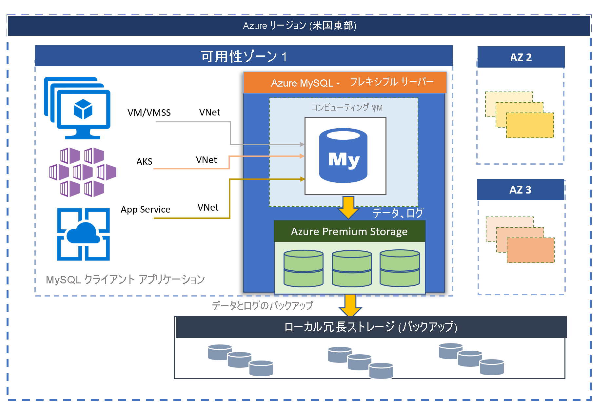

# Azure Database for MySQL - フレキシブル サーバー (プレビュー)

MySQL コミュニティ エディションを搭載した Azure Database for MySQL は、次の 2 つのデプロイ モードで利用できます。
- シングル サーバー 
- フレキシブル サーバー (プレビュー)

この記事では、フレキシブル サーバー デプロイ モデルの概要を示し、主要概念について概説します。 ワークロードに適したデプロイ オプションを決定する方法については、[Azure で適切な MySQL サーバー オプションを選択する](./../select-right-deployment-type.md)方法に関するページを参照してください。

## 概要

Azure Database for MySQL フレキシブル サーバーは、データベース管理機能と構成設定のよりきめ細かな制御と柔軟性を提供するように設計されたフル マネージド データベース サービスです。 一般に、サービスでは、ユーザーの要件に基づいて、より高い柔軟性とサーバー構成のカスタマイズが提供されます。 フレキシブル サーバー アーキテクチャにより、ユーザーは単一の可用性ゾーン内および複数の可用性ゾーンにまたがる高可用性を選択できます。 また、フレキシブル サーバーでは、サーバーを停止および開始する機能と、負荷の急増に対応できる SKU を備えた、優れたコスト最適化制御が提供され、完全なコンピューティング容量を継続的には必要としないワークロードに最適です。 現在、このサービスでは、MySQL 5.7 と 8.0 のコミュニティ バージョンがサポートされています。 このサービスは現在プレビュー段階にあり、現時点ではさまざまな [Azure リージョン](https://azure.microsoft.com/global-infrastructure/services/)で利用できます。

フレキシブル サーバーは、以下に適しています 
- より優れた制御とカスタマイズが必要なアプリケーション開発。
- ゾーン冗長の高可用性
- マネージド メンテナンス期間

 

## 可用性ゾーン内および可用性ゾーン間での高可用性

フレキシブル サーバー デプロイ モデルは、単一の可用性ゾーン内および複数の可用性ゾーンにまたがる高可用性をサポートするように設計されています。 このアーキテクチャでは、コンピューティングとストレージが分離されています。 データベース エンジンは仮想マシン上で実行され、データ ファイルは Azure Storage に格納されます。 ストレージには、データベース ファイルの 3 つのローカル冗長同期コピーが保持され、常にデータの持続性が確保されます。 

1 つの可用性ゾーン内では、計画的なイベントまたは計画外のイベントによってサーバーがダウンした場合、サービスによって次の自動化された手順を使用してサーバーの高可用性が維持されます。

1. 新しいコンピューティング VM がプロビジョニングされます。
2. データ ファイルを含むストレージが新しい仮想マシンにマップされます
3. 新しい仮想マシンで MySQL データベース エンジンがオンラインになります。
4. サーバーで接続を受け入れる準備が整うと、クライアント アプリケーションは再接続できます。
   
:::image type="content" source="media/overview/2-flexible-server-architecture.png" alt-text="単一ゾーンの高可用性の概念の図"::: 

ゾーン冗長の高可用性が構成されている場合、サービスによって同じ Azure リージョン内の可用性ゾーン間でホット スタンバイ サーバーがプロビジョニングおよび管理されます。 データ損失をゼロにするために、ソース サーバー上でのデータの変更は、スタンバイ サーバーに同期的にレプリケートされます。 ゾーン冗長の高可用性により、計画済みまたは計画外のフェールオーバー イベントがトリガーされると、スタンバイ サーバーが直ちにオンラインになり、受信トランザクションを処理できるようになります。 一般的なフェールオーバー時間は 60 秒から 120 秒です。 これにより、サービスでは、高可用性がサポートされ、特定の Azure リージョンにおける単一の可用性ゾーンの障害に耐えることができる向上した回復性が提供されます。 

詳細については、[高可用性の概念](concepts-high-availability.md)に関する記事を参照してください。

:::image type="content" source="media/overview/3-flexible-server-overview-zone-redundant-ha.png" alt-text="ゾーン冗長の高可用性の概念の図"::: 

## マネージド メンテナンス期間によるパッチの自動適用

このサービスでは、基になるハードウェア、OS、およびデータベース エンジンの自動修正が実行されます。 パッチには、セキュリティとソフトウェアの更新プログラムが含まれています。 MySQL エンジンの場合、マイナー バージョンのアップグレードも、計画メンテナンス リリースの一部として含まれています。 ユーザーは、パッチ適用のスケジュールをシステム管理として構成することも、カスタム スケジュールを定義することもできます。 メンテナンス スケジュールの間に、パッチが適用され、パッチ適用プロセスの一環として更新を完了するためにサーバーの再起動が必要になる場合があります。 カスタム スケジュールを使用すると、ユーザーはパッチ適用のサイクルを予測可能にし、ビジネスへの影響が最小限のメンテナンス期間を選択できます。 一般に、サービスは、継続的インテグレーションとリリースの一環として、毎月のリリース スケジュールに従います。

詳細については、[予定メンテナンス](concepts-maintenance.md)に関するページを参照してください。 

## 自動バックアップ

フレキシブル サーバー サービスにより、サーバーのバックアップが自動的に作成され、ユーザーが構成したローカル冗長または geo 冗長のストレージにそれが保存されます。 バックアップを使用すると、サーバーを、バックアップのリテンション期間内の任意の時点に復元できます。 バックアップの既定のリテンション期間は 7 日です。 必要に応じて、リテンション期間を最大 35 日に構成できます。 すべてのバックアップが、AES 256 ビット暗号化を使用して暗号化されます。 

詳細については、[バックアップの概念](concepts-backup-restore.md)に関する記事を参照してください。

## ネットワーク分離

Azure Database for MySQL フレキシブル サーバーに接続するには、2 つのネットワーク オプションがあります。 **プライベート アクセス (VNet 統合)** オプションと **パブリック アクセス (許可された IP アドレス)** オプションです。 

* **プライベート アクセス (VNet 統合)** – お使いの [Azure Virtual Network](../../virtual-network/virtual-networks-overview.md) 内にフレキシブル サーバーをデプロイできます。 Azure の仮想ネットワークでは、非公開の、セキュリティで保護されたネットワーク通信が提供されます。 仮想ネットワーク内のリソースでは、プライベート IP アドレスを通した通信が可能です。

   以下の機能が必要な場合は、VNet 統合オプションを選択します。
   * プライベート IP アドレスを使用して、同じ仮想ネットワーク内の Azure リソースからフレキシブル サーバーに接続する
   * VPN または ExpressRoute を使用して Azure 以外のリソースからフレキシブル サーバーに接続する
   * パブリック エンドポイントがない

* **パブリック アクセス (許可された IP アドレス)** – パブリック エンドポイントを使用してフレキシブル サーバーをデプロイできます。 パブリック エンドポイントは、パブリックに解決できる DNS アドレスです。 "許可されている IP アドレス" という語句は、サーバーへのアクセス許可を付与することが選択された IP の範囲を意味します。 これらのアクセス許可は、**ファイアウォール規則** と呼ばれます。

詳細については、[ネットワークの概念](concepts-networking.md)に関する記事を参照してください。

## 数秒以内でのパフォーマンスの調整とスケール

フレキシブル サーバー サービスは、次の 3 つの SKU レベルで使用できます: Burstable、General Purpose、Memory Optimized。 Burstable レベルは、完全なコンピューティング容量を継続的には必要としない低コストの開発および低コンカレンシーのワークロードに最適です。 General Purpose および Memory Optimized は、高いコンカレンシー、スケール、予測可能なパフォーマンスを必要とする運用ワークロードに適しています。 最初は月数ドルの小規模データベースでアプリを構築し、後から実際のソリューションのニーズに応じて、スケールをシームレスに調整することができます。 ストレージのスケーリングはオンラインであり、ストレージの自動拡張がサポートされています。 動的なスケーラビリティにより、データベースは変化の激しいリソース要件に透過的に対処することができます。 消費したリソースについてだけ支払います。 

詳細については、[コンピューティングとストレージの概念](concepts-compute-storage.md)に関する記事を参照してください。

## 最大 10 個の読み取りレプリカを使用して、読み取りワークロードをスケールアウトする

MySQL は、インターネット規模の Web およびモバイル アプリケーションを実行するための一般的なデータベース エンジンの 1 つです。 多くのお客様は、オンライン教育サービス、ビデオ ストリーミング サービス、デジタル支払いソリューション、eコマース プラットフォーム、ゲーム サービス、ニュース ポータル、政府機関、医療機関の Web サイトなどにそれを使用しています。 これらのサービスは、Web またはモバイル アプリケーションでのトラフィックの増加に合わせて、サービスを提供し、スケーリングする必要があります。

アプリケーション側に関しては、通常、アプリケーションは Java または PHP で開発され、 [Azure 仮想マシン スケール セット](../../virtual-machine-scale-sets/overview.md) や  [Azure App Services](../../app-service/overview.md)  で実行できるように移行されたり、 [Azure Kubernetes Service (AKS)](../../aks/intro-kubernetes.md) で実行できるようにコンテナー化されたりします。 仮想マシン スケール セット、App Service、または AKS が基盤のインフラストラクチャである場合、アプリケーションのスケーリングは、新しい VM が即座にプロビジョニングされ、要求に対応するためにアプリケーションのステートレス コンポーネントがレプリケートされることによって簡単に行われますが、多くの場合、データベースが集中的なステートフル コンポーネントとしてボトルネックになります。

読み取りレプリカ機能を使用すると、Azure Database for MySQL フレキシブル サーバーから読み取り専用サーバーに、データをレプリケートできます。 ソース サーバーから **最大で 10 個のレプリカ** にレプリケートできます。 レプリカは、MySQL エンジンのネイティブな[バイナリ ログ (binlog) ファイルの位置ベースのレプリケーション テクノロジ](https://dev.mysql.com/doc/refman/5.7/en/replication-features.html)を使用して、非同期で更新されます。 [ProxySQL](https://techcommunity.microsoft.com/t5/azure-database-for-mysql/load-balance-read-replicas-using-proxysql-in-azure-database-for/ba-p/880042) などのロード バランサー プロキシ ソリューションを使用して、アプリケーションのワークロードをシームレスにスケールアウトし、アプリケーションのリファクタリング コストを発生させずにレプリカを読み取ることができます。 

詳細については、[読み取りレプリカの概念](concepts-read-replicas.md)に関するページを参照してください。 

## サーバーを停止および開始してコストを最適化する

フレキシブル サーバー サービスを使用すると、サーバーをオンデマンドで停止および開始して、コストを最適化することができます。 コンピューティング層の課金は、サーバーが停止すると直ちに停止されます。 これにより、開発、テスト、期限付きの予測可能な運用ワークロードにおいて、大幅なコスト削減を実現できます。 サーバーは、すぐに再起動しない限り 7 日間は停止状態のままになります。 

詳細については、[サーバーの概念](concept-servers.md)に関するページを参照してください。 

## エンタープライズ グレードのセキュリティとプライバシー

フレキシブル サーバー サービスでは、保存データのストレージ暗号化に FIPS 140-2 認証済みの暗号モジュールが使用されます。 データ (バックアップを含む) と、クエリの実行中に作成される一時ファイルは暗号化されます。 このサービスでは、Azure ストレージ暗号化に含まれる AES 256 ビット暗号が使用され、キーはシステムによって管理されます (既定)。 

サービスでは、既定で適用されるトランスポート層セキュリティを使用して、動作中のデータが暗号化されます。 フレキシブル サーバーでは、トランスポート層セキュリティ (TLS 1.2) を使用して暗号化された接続のみがサポートされ、TLS 1.0 と TLS 1.1 を使用する受信接続はすべて拒否されます。 

詳細については、[フレキシブル サーバーへの暗号化された接続の使用方法](https://docs.mongodb.com/manual/tutorial/configure-ssl)に関する記事を参照してください。

フレキシブル サーバーでは、[Azure Virtual Network](../../virtual-network/virtual-networks-overview.md) (VNet) 統合を使用して、サーバーに完全にプライベート アクセスできます。 Azure Virtual Network 内のサーバーには、プライベート IP アドレスを介してのみアクセスおよび接続できます。 VNet 統合では、パブリック アクセスが拒否され、パブリック エンドポイントを使用してサーバーに到達できません。 

詳細については、[ネットワークの概念](concepts-networking.md)に関する記事を参照してください。

## 監視とアラート

フレキシブル サーバー サービスには、組み込みのパフォーマンス監視機能とアラート機能が搭載されています。 すべての Azure メトリックは 1 分間隔で、各メトリックの 30 日間の履歴が保持されます。 メトリックにアラートを構成できます。 このサービスを使用すると、リソースの使用状況を監視するためのホスト サーバー メトリックが公開され、遅いクエリのログを構成できます。 これらのツールを使用すると、ワークロードをすばやく最適化し、最適なパフォーマンスが得られるようにサーバーを構成することができます。 

詳細については、[監視の概念](concepts-monitoring.md)に関する記事を参照してください。

## 移行

このサービスでは、MySQL のコミュニティ バージョンが実行されます。 これにより、アプリケーションの完全な互換性が確保され、MySQL エンジン上で開発された既存のアプリケーションを単一サーバー サービスに移行するために必要なリファクタリング コストが最小限に抑えられます。 単一サーバーへの移行は、次のいずれかのオプションを使用して実行できます。

- **ダンプと復元** – ユーザーがダウンタイムを許容できるオフライン移行では、mysqldump や mydumper などのコミュニティ ツールを使用してダンプと復元を行うことで、最も迅速に移行することができます。 詳細については、ダンプと復元を使用した移行に関する記事を参照してください。 
- **Azure Database Migration Service** – 最小限のダウンタイムで単一サーバーへのシームレスで簡素化された移行を行うには、[Azure Database Migration Service](../../dms/tutorial-mysql-azure-mysql-online.md) を利用できます。 

## Azure Azure リージョン

Azure でワークロードを実行する利点の 1 つは、グローバルに展開できることです。 Azure Database for MySQL フレキシブル サーバーは、現在、次の Azure リージョンで提供されています。

| Region | 可用性 | ゾーン冗長 HA | 
| --- | --- | --- |
| 西ヨーロッパ | :heavy_check_mark: | :heavy_check_mark: |
| 北ヨーロッパ | :heavy_check_mark: | :heavy_check_mark: |
| 英国南部 | :heavy_check_mark: | :x: | 
| 米国東部 2 | :heavy_check_mark: | :heavy_check_mark: |
| 米国西部 2 | :heavy_check_mark: | :heavy_check_mark: |
| 米国中部 | :heavy_check_mark: | :x: | 
| 米国東部 | :heavy_check_mark: | :heavy_check_mark: |
| カナダ中部 | :heavy_check_mark: | :x: | 
| Southeast Asia | :heavy_check_mark: | :heavy_check_mark: |
| 韓国中部 | :heavy_check_mark: | :x: | 
| Japan East | :heavy_check_mark: | :x: | 
| オーストラリア東部 | :heavy_check_mark: | :heavy_check_mark: |

近日中に新しいリージョンを追加できるよう取り組んでいます。

## 連絡先
Azure Database for MySQL フレキシブル サーバーについてのご質問やご提案については、Azure Database for MySQL チームまでメール ([@Ask Azure DB for MySQL](mailto:AskAzureDBforMySQL@service.microsoft.com)) でお送りください。 このメール アドレスはテクニカル サポートのエイリアスではありません。

さらに、適切な連絡先について次の点を考慮してください。

- Azure サポートに問い合わせる場合は、[Azure portal からチケットを申請します](https://portal.azure.com/?#blade/Microsoft_Azure_Support/HelpAndSupportBlade)。
- アカウントを使用して問題を修正するには、Azure Portal で[サポート要求](https://ms.portal.azure.com/#blade/Microsoft_Azure_Support/HelpAndSupportBlade/newsupportrequest)を提出します。
- フィードバックを提供したり、新しい機能を要求したりするには、[UserVoice](https://feedback.azure.com/forums/597982-azure-database-for-mysql) でエントリを作成します。

## 次のステップ
Azure Database for MySQL 単一サーバー デプロイ モードの概要を確認したので、以下のことを行う準備ができました。

- 最初のサーバーを作成する。 
  - [Azure portal を使用して Azure Database for MySQL フレキシブル サーバーを作成する](quickstart-create-server-portal.md)
  - [Azure CLI を使用して Azure Database for MySQL フレキシブル サーバーを作成する](quickstart-create-server-cli.md)
  - [Azure CLI を使用して Azure Database for MySQL フレキシブル サーバーを管理する](how-to-manage-server-portal.md)

- 次の任意の言語を使って最初のアプリを作成します。
  - [Python](connect-python.md)
  - [Php](connect-php.md)
