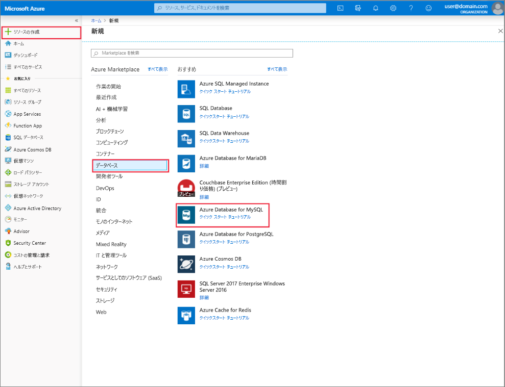

# Azure Portal を使用した Azure Database for MySQL サーバーの作成と管理
このトピックでは、新しい Azure Database for MySQL サーバーをすばやく作成する方法について説明します。 Azure Portal を使用したサーバーの管理方法に関する情報も含まれています。 サーバーの管理には、サーバーの詳細とデータベースの表示、パスワードのリセット、リソースのスケーリング、サーバーの削除が含まれます。

## Azure Portal にログインする
[Azure Portal](https://portal.azure.com) にログインします。

## Azure Database for MySQL サーバーの作成
"mydemoserver" という名前の Azure Database for MySQL サーバーを作成するには、次の手順のようにします。

1. Azure Portal の左上隅にある **[リソースの作成]** ボタンをクリックします。

2. [新規] ページで **[データベース]** を選択し、[データベース] ページで **[Azure Database for MySQL]** を選択します。

    > Azure Database for MySQL サーバーは、定義済みの一連の[コンピューティング リソースとストレージ リソース](./concepts-pricing-tiers.md)を使用して作成されます。 データベースは、Azure リソース グループ内と Azure Database for MySQL サーバー内に作成されます。

   

3. 次の情報を使用して、Azure Database for MySQL のフォームに入力します。

    | **フォームのフィールド** | **フィールドの説明** |
    |----------------|-----------------------|
    | *サーバー名* | mydemoserver (サーバー名はグローバルに一意である必要があります) |
    | *サブスクリプション* | mysubscription (ドロップダウン メニューから選びます) |
    | *リソース グループ* | myresourcegroup (新しいリソース グループを作成するか既存のリソース グループを使います) |
    | *ソースの選択* | 空白 (空の MySQL サーバーを作成します) |
    | *サーバー管理者ログイン* | myadmin (管理者アカウント名をセットアップ) |
    | *パスワード* | 管理者アカウントのパスワードを設定します |
    | *パスワードの確認* | 管理者アカウントのパスワードを確認 |
    | *場所* | 東南アジア (北ヨーロッパまたは米国西部を選びます) |
    | *バージョン* | 5.7 (Azure Database for MySQL サーバーのバージョンを選びます) |

4. **[価格レベル]** をクリックして、新しいサーバーのサービス レベルとパフォーマンス レベルを指定します。 **[汎用]** タブを選びます。*Gen 5*、*2 仮想コア*、*5 GB*、および *7 日* は、それぞれ **[コンピューティング世代]**、**[仮想コア]**、**[ストレージ]**、および **[バックアップの保有期間]** の既定値です。 これらのスライダーはそのままにします。 サーバー バックアップを geo 冗長ストレージで有効にするには、**[バックアップ冗長オプション]** から **[地理冗長]** を選択します。

   

5. **[作成]** をクリックしてサーバーをプロビジョニングします。 プロビジョニングには数分かかります。

    > **[ダッシュボードにピン留めする]** チェック ボックスをオンにすると、デプロイを追跡しやすくなります。

## Azure Database for MySQL サーバーの更新
新しいサーバーをプロビジョニングした後、ユーザーには、管理者パスワードのリセットや、仮想コアまたはストレージの変更によるサーバーのスケールアップやスケールダウンなど、既存サーバーの構成に関するいくつかのオプションがあります。

### 管理者ユーザー パスワードを変更する
1. サーバーの **[概要]** から、**[パスワードのリセット]** をクリックしてパスワード リセット ウィンドウを表示します。

   

2. 次のように、ウィンドウで新しいパスワードを入力し、そのパスワードを確認します。

   

3. **[OK]** をクリックして新しいパスワードを保存します。

### 仮想コアのスケールアップ/スケールダウン

1. **[設定]** の下にある **[価格レベル]** をクリックします。

2. スライダーを目的の値に動かして、**[vCore]** の設定を変更します。

    

3. **[OK]** をクリックして変更を保存します。

### ストレージのスケールアップ

1. **[設定]** の下にある **[価格レベル]** をクリックします。

2. スライダーを目的の値に動かして、**[ストレージ]** の設定を変更します。

    

3. **[OK]** をクリックして変更を保存します。

## Azure Database for MySQL サーバーの削除

1. サーバーの **[概要]** から **[削除]** ボタンをクリックして、削除確認プロンプトを開きます。

    

2. 二重確認のために入力ボックスにサーバーの名前を入力します。

    

3. **[削除]** ボタンをクリックして、サーバーの削除を確認します。 通知バーに "MySQL サーバーが正常に削除されました" というポップアップが表示されるまで待ちます。

## Azure Database for MySQL データベースの一覧表示
サーバーの **[概要]** で、下部にあるデータベース タイルが表示されるまで下にスクロールします。 サーバーのすべてのデータベースがテーブルに表示されます。

   

## Azure Database for MySQL サーバーの詳細を表示する
サーバーに関する詳細情報を表示するには、**[設定]** の下にある **[プロパティ]** をクリックします。

## 次の手順

[クイック スタート:Azure portal を使用した Azure Database for MySQL サーバーの作成](./quickstart-create-mysql-server-database-using-azure-portal.md)