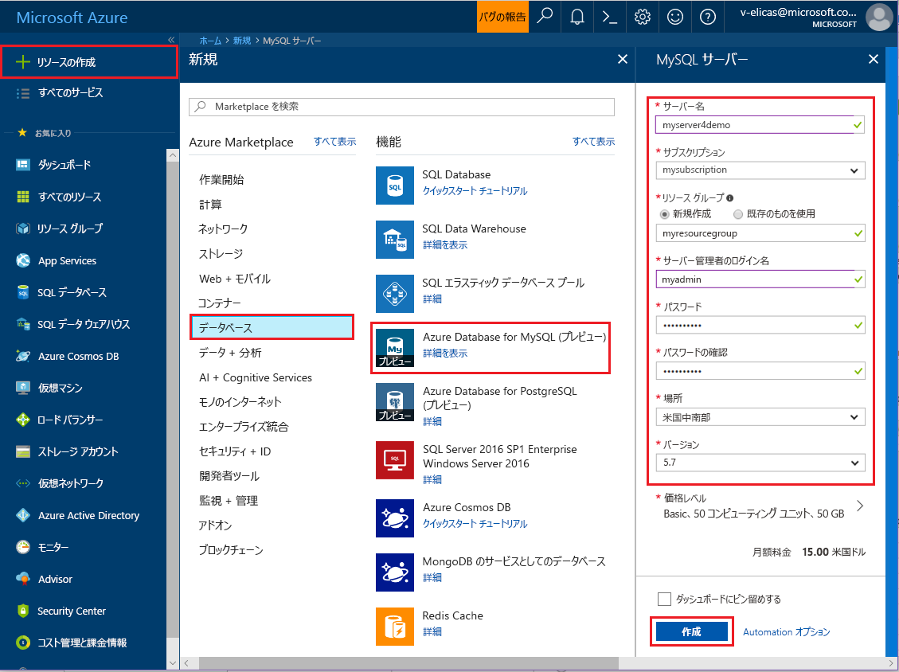
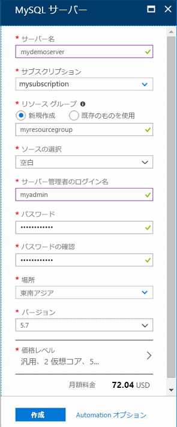
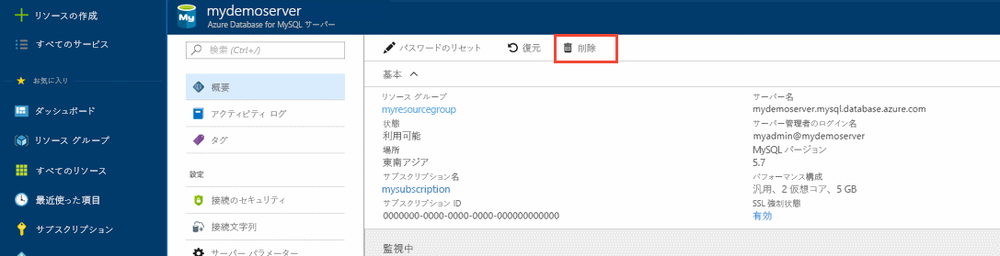

# <a name="create-an-azure-database-for-mysql-server-by-using-the-azure-portal"></a>Azure Portal を使用した Azure Database for MySQL サーバーの作成

Azure Database for MySQL は、高可用性 MySQL データベースをクラウドで実行、管理、スケーリングするための管理されたサービスです。 このクイック スタートでは、Azure Portal を使用して 5 分で Azure Database for MySQL サーバーを作成する方法を説明します。  

Azure サブスクリプションをお持ちでない場合は、開始する前に[無料の Azure アカウント](https://azure.microsoft.com/free/)を作成してください。

## <a name="sign-in-to-the-azure-portal"></a>Azure ポータルにサインインします。
Web ブラウザーを開き、[Azure Portal](https://portal.azure.com/) に移動します。 資格情報を入力してポータルにサインインします。 既定のビューはサービス ダッシュボードです。

## <a name="create-an-azure-database-for-mysql-server"></a>Azure Database for MySQL サーバーの作成
Azure Database for MySQL サーバーは、定義済みの一連の[コンピューティング リソースとストレージ リソース](./concepts-compute-unit-and-storage.md)を使って作成します。 サーバーは、[Azure リソース グループ](../azure-resource-manager/resource-group-overview.md)内に作成します。

Azure Database for MySQL サーバーを作成するには、次の手順に従います。

1. ポータルの左上隅にある **[リソースの作成]** ボタン (+) を選択します。

2. **[データベース]** > **[Azure Database for MySQL]** の順に選択します。 検索ボックスに「**MySQL**」と入力してサービスを検索することもできます。

   

3. 新しいサーバーの詳細フォームには次の情報を入力してください。
   
   

    **設定** | **推奨値** | **フィールドの説明** 
    ---|---|---
    サーバー名 | 一意のサーバー名 | Azure Database for MySQL サーバーを識別する一意の名前を選択します。 たとえば mydemoserver を選択します。 指定したサーバー名にドメイン名 *.mysql.database.azure.com* が追加されます。 サーバー名に含めることができるのは、英小文字、数字、およびハイフン (-) のみであり、 3 ～ 63 文字にする必要があります。
    サブスクリプション | 該当するサブスクリプション | サーバーに使用する Azure サブスクリプションを選択します。 複数のサブスクリプションをお持ちの場合は、リソースの課金対象となるサブスクリプションを選択してください。
    リソース グループ | *myresourcegroup* | 新規または既存のリソース グループの名前を入力します。    リソース グループ|*myresourcegroup*| 新しいリソース グループ名、またはサブスクリプションの既存のリソース グループ名。
    ソースの選択 | "*空白*" | *[空白]* を選択し、最初から新しいサーバーを作成します  (既存の Azure Database for MySQL サーバーの geo バックアップからサーバーを作成する場合は、*[Backup]* を選択します)。
    サーバー管理者のログイン | myadmin | サーバーに接続するときに使用するサインイン アカウント。 管理者のサインイン名に **azure_superuser**、**admin**、**administrator**、**root**、**guest**、**public** は使用できません。
    パスワード | *<任意>* | サーバー管理者アカウントの新しいパスワードを入力します。 8 文字以上 128 文字以内にする必要があります。 パスワードには、英大文字、英小文字、数字 (0 から 9)、英数字以外の文字 (!、$、#、% など) のうち、3 つのカテゴリの文字が含まれている必要があります。
    パスワードの確認 | *<任意>*| 管理者アカウントのパスワードを確認します。
    場所 | *ユーザーに最も近いリージョン*| ユーザーや他の Azure アプリケーションに最も近い場所を選択します。
    Version | *最新のメジャー バージョン*| 最新メジャー バージョン (別のバージョンを指定する特定の要件がある場合を除く)。
    価格レベル  | **汎用**、**Gen 4**、**2 仮想コア**、**5 GB**、**7 日**、**地理冗長** | 新しいサーバーのコンピューティング、ストレージ、およびバックアップ構成。 **[価格レベル]** を選択します。 次に、**[汎用]** タブを選択します。*Gen 4*、"*2 仮想コア*"、*5 GB*、および "*7 日*" は、それぞれ **[コンピューティング世代]**、**[仮想コア]**、**[ストレージ]**、および **[バックアップの保有期間]** の既定値です。 これらのスライダーはそのままにします。 サーバー バックアップを geo 冗長ストレージで有効にするには、**[バックアップ冗長オプション]** から **[地理冗長]** を選択します。 この価格レベルの選択を保存するには、**[OK]** を選択します。 次のスクリーンショットは、これらの選択を示しています。
  
    > [!IMPORTANT]
    > ここで指定するサーバー管理者のサインイン名とパスワードは、このクイックスタートの後半でサーバーとそのデータベースにサインインするために必要です。 後で使用するために、この情報を覚えておくか、記録しておきます。
    > 

   ![サーバーの作成 - [価格レベル] ウィンドウ](./media/quickstart-create-mysql-server-database-using-azure-portal/3-pricing-tier.png)

4.  **[作成]** を選択して、サーバーをプロビジョニングします。 プロビジョニングには、最大 20 分かかる場合があります。
   
5.  デプロイ プロセスを監視するには、ツール バーの **[通知]** (ベル アイコン) を選択します。
   
  既定では、データベース **information_schema**、**mysql**、**performance_schema**、および **sys** は、ご利用のサーバーに作成されます。

## <a name="configure-a-server-level-firewall-rule"></a>サーバーレベルのファイアウォール規則の構成

Azure Database for MySQL サービスでは、サーバー レベルでファイアウォールが作成されます。 これにより、外部のアプリケーションやツールから、サーバーまたはサーバー上のすべてのデータベースへの接続が禁止されます。接続を許可するためには、特定の IP アドレスに対して、ファイアウォールを開放するファイアウォール規則を作成する必要があります。 

1.   デプロイが完了した後、サーバーを探します。 必要に応じて、検索することができます。 たとえば、左側のメニューから **[すべてのリソース]** を選択します。 次に、サーバー名 (例の **mydemoserver** など) を入力して、新しく作成されたサーバーを検索します。 検索結果の一覧からサーバー名を選択します。 サーバーの **[概要]** ページが開き、さらに多くの構成オプションが表示されます。

2. サーバーのページで、**[接続のセキュリティ]** を選択します。

3.  **[ファイアウォール規則]** という見出しの下で、**[規則名]** 列の空白のテキスト ボックスを選択し、ファイアウォール規則の作成を開始します。 このサーバーにアクセスする予定のクライアントの正確な IP の範囲を入力します。
   
   ![[接続のセキュリティ] - [ファイアウォール規則]](./media/quickstart-create-mysql-server-database-using-azure-portal/5-firewall-2.png)


4. **[接続のセキュリティ]** ページの上部のツール バーで、**[保存]** を選択します。 更新が正常に完了したことを示す通知が表示されるまで待ってから次に進んでください。 

   > [!NOTE]
   > Azure Database for MySQL との接続では、ポート 3306 が通信に使用されます。 企業ネットワーク内から接続を試みる場合、ポート 3306 での送信トラフィックが許可されていない場合があります。 その場合、会社の IT 部門によってポート 3306 が開放されない限り、サーバーに接続することはできません。
   > 

## <a name="get-the-connection-information"></a>接続情報の取得
データベース サーバーに接続するには、サーバーの完全な名前と管理者サインイン資格情報が必要となります。 これらの値は、クイックスタートの記事の前の方でメモしてあると思われます。 メモしていなかった場合、Azure Portal で、サーバーの **[概要]** ページまたは **[プロパティ]** ページからサーバー名とサインイン情報を簡単に確認できます。

これらの値を見つけるには、次の手順を実行します。 

1. サーバーの **[概要]** ページを開きます。 **[サーバー名]** と **[サーバー管理者ログイン名]** の値を書き留めておきます。 

2. 各フィールドの上にカーソルを合わせると、テキストの右側にコピー アイコンが表示されます。 必要に応じてコピー アイコンを選択して値をコピーします。

この例では、サーバー名は **mydemoserver.mysql.database.azure.com**、サーバー管理者サインインは **myadmin@mydemoserver** です。

## <a name="connect-to-mysql-by-using-the-mysql-command-line-tool"></a>mysql コマンド ライン ツールを使用した MySQL への接続
**mysql.exe** コマンドライン ツールを使用してサーバーに接続します。 MySQL を[ここ](https://dev.mysql.com/downloads/)からダウンロードして、コンピューターにインストールすることができます。 

1. mysql ユーティリティで Azure Database for MySQL サーバーに接続するには、次の形式を使用します。

    ```bash
    mysql --host <fully qualified server name> --user <server admin login name>@<server name> -p
    ```

    たとえば、次のコマンドは、サンプル サーバーに接続します。

    ```bash
    mysql --host mydemoserver.mysql.database.azure.com --user myadmin@mydemoserver -p
    ```

    mysql パラメーター |推奨値|説明
    ---|---|---
    --host | *サーバー名* | 前に Azure Database for MySQL サーバーを作成したときに使用したサーバー名の値。 この例におけるサーバーは、**mydemoserver.mysql.database.azure.com** です。 例で示されているように、完全修飾ドメイン名 (**\*.mysql.database.azure.com**) を使用します。 サーバー名を覚えていない場合は、前のセクションの手順に従って接続情報を取得してください。 
    --user | "*サーバー管理者ログイン名*" |前の手順で Azure Database for MySQL サーバーを作成したときに指定したサーバー管理者ログイン ユーザー名。 ユーザー名を覚えていない場合は、前のセクションの手順に従って接続情報を取得してください。 形式は *username@servername* です。
    -p | "*プロンプトが表示されるまで待つ*" |プロンプトが表示されたら、サーバーの作成時に指定したのと同じパスワードを入力してください。 入力したパスワードの文字は bash プロンプトには表示されないことに注意してください。 パスワードを入力したら、**Enter** キーを押します。

   接続されると、コマンドの入力を求める `mysql>` プロンプトが mysql ユーティリティによって表示されます。 

   以下に示したのは mysql の出力例です。

    ```bash
    Welcome to the MySQL monitor.  Commands end with ; or \g.
    Your MySQL connection id is 65505
    Server version: 5.6.26.0 MySQL Community Server (GPL)
    
    Copyright (c) 2000, 2017, Oracle and/or its affiliates. All rights reserved.
    
    Oracle is a registered trademark of Oracle Corporation and/or its
    affiliates. Other names may be trademarks of their respective
    owners.

    Type 'help;' or '\h' for help. Type '\c' to clear the current input statement.
    
    mysql>
    ```
    > [!TIP]
    > クライアントの IP アドレスを許可するようにファイアウォールが構成されていない場合、次のエラーが発生します。
    >
    > エラー 2003 (28000): IP アドレス 123.456.789.0 のクライアントはこのサーバーへのアクセスが許可されていません。
    >
    > エラーを解決するには、サーバーの構成が、この記事の「サーバーレベルのファイアウォール規則の構成」セクションの手順と一致していることを確認してください。

4. 接続が正常に機能していることを確認するために、mysql> プロンプトに「`status`」と入力して、サーバーの状態を確認します。

    ```sql
    status
    ```

   > [!TIP]
   > その他のコマンドについては、「[MySQL 5.7 リファレンス マニュアル - 4.5.1 章](https://dev.mysql.com/doc/refman/5.7/en/mysql.html)」を参照してください。

5.  **mysql>** プロンプトに次のコマンドを入力して空のデータベースを作成します。
    ```sql
    CREATE DATABASE quickstartdb;
    ```
    このコマンドは、完了するまでに少し時間がかかる場合があります。 

    Azure Database for MySQL サーバー内には 1 つまたは複数のデータベースを作成できます。 サーバーごとに 1 つのデータベースを作成してすべてのリソースを利用するか、複数のデータベースを作成してリソースを共有することができます。 作成できるデータベース数に制限はありませんが、複数のデータベースは同一のサーバー リソースを共有します。 

6. **mysql>** プロンプトに次のコマンドを入力してデータベースを一覧表示します。

    ```sql
    SHOW DATABASES;
    ```

7.  「`\q`」を入力してから、**Enter** キーを押して mysql ツールを終了します。 

これで、Azure Database for MySQL サーバーに接続し、空のユーザー データベースを作成することができました。 次のセクションに進んで、同様の練習をしましょう。 次の練習では、広く使われているもう 1 つのツール、MySQL Workbench を使って同じサーバーに接続します。

## <a name="connect-to-the-server-by-using-the-mysql-workbench-gui-tool"></a>MySQL Workbench GUI ツールを使用したサーバーへの接続
GUI ツールである MySQL Workbench を使用してサーバーに接続するには、次の手順を実行します。

1.  クライアント コンピューターで MySQL Workbench アプリケーションを起動します。 MySQL Workbench は「[Download MySQL Workbench (MySQL Workbench のダウンロード)](https://dev.mysql.com/downloads/workbench/)」からダウンロードしてインストールできます。

2. 新しい接続を作成します。 **[MySQL Connections]\(MySQL 接続\)** という見出しの横に表示されている正符号 (+) アイコンをクリックします。

3. **[Setup New Connection]\(新しい接続のセットアップ\)** ダイアログ ボックスで、実際のサーバーの接続情報を **[Parameters]\(パラメーター\)** タブに入力します。以下に示した値は、あくまで例です。 ホスト名、ユーザー名、パスワードは、実際の値に置き換えてください。

   

    |Setting |推奨値|フィールドの説明|
    |---|---|---|
     接続名 | Demo connection | この接続のラベル。 |
    接続方法 | Standard (TCP/IP) | Standard (TCP/IP) で十分です。 |
    ホスト名 | *[サーバー名]* | 前に Azure Database for MySQL サーバーを作成したときに使用したサーバー名の値。 この例におけるサーバーは、**mydemoserver.mysql.database.azure.com** です。 例で示されているように、完全修飾ドメイン名 (**\*.mysql.database.azure.com**) を使用します。 サーバー名を覚えていない場合は、前のセクションの手順に従って接続情報を取得してください。|
     ポート | 3306 | Azure Database for MySQL サーバーに接続するときに使用するポート。 |
    ユーザー名 |  "*サーバー管理者ログイン名*" | 前の手順で Azure Database for MySQL サーバーを作成したときに指定したサーバー管理者サインイン情報。 この例のユーザー名は **myadmin@mydemoserver** です。 ユーザー名を覚えていない場合は、前のセクションの手順に従って接続情報を取得してください。 形式は *username@servername* です。
    パスワード | "*パスワード*" | **[Store in Vault]\(コンテナーに保存\)** ボタンを選択してパスワードを保存します。 |

4. **[Test Connection]\(接続のテスト\)** を選択して、すべてのパラメーターが正しく構成されているかどうかをテストします。 その後、**[OK]** を選択して接続を保存します。 

    > [!NOTE]
    > ご使用のサーバーには SSL が既定で適用されるため、正常に接続するためには追加の構成が必要です。 詳細については、「[Azure Database for MySQL に安全に接続するためにアプリケーションで SSL 接続を構成する](./howto-configure-ssl.md)」を参照してください。 このクイックスタートに関して SSL を無効にするには、Azure Portal にアクセスし、 [接続のセキュリティ] ページを選択して、**[SSL 接続を強制する]** トグル ボタンを無効にします。

## <a name="clean-up-resources"></a>リソースのクリーンアップ
このクイックスタートで作成したリソースは、2 とおりの方法でクリーンアップすることができます。 [Azure リソース グループ](../azure-resource-manager/resource-group-overview.md)を削除した場合、そのリソース グループに含まれたすべてのリソースが対象となります。 他のリソースをそのまま維持する場合は、1 つのサーバー リソースだけを削除してください。

> [!TIP]
> このコレクションの他のクイックスタートは、このクイックスタートに基づいています。 引き続きクイックスタートの作業を行う場合は、このクイックスタートで作成したリソースをクリーンアップしないでください。 これ以上作業を行わない場合は、以下の手順に従い、このクイックスタートで作成したすべてのリソースを削除してください。
>

新しく作成したサーバーを含むリソース グループ全体を削除する手順は次のとおりです。

1.  Azure Portal で目的のリソース グループを探します。 左側のメニューで **[リソース グループ]** を選択し、目的のリソース グループの名前 (この例の **myresourcegroup** など) を選択します。

2.  リソース グループ ページで **[削除]** を選択します。 次に、リソース グループの名前 (この例の **myresourcegroup** など) をボックスに入力して削除の確認を行い、**[削除]** を選択します。

新しく作成したサーバーだけを削除する手順は次のとおりです。

1.  Azure Portal で目的のサーバーを探します (まだ開いていない場合)。 Azure Portal の左側のメニューから **[すべてのリソース]** を選択します。 次に、作成したサーバーを検索します。

2.  **[概要]** ページで **[削除]** を選択します。 

   

3.  削除するサーバーの名前を確認し、影響を受けるデータベースをその下に表示します。 目的のサーバー名 (例に示した **mydemoserver** など) をボックスに入力します。 **[削除]** を選択します。

## <a name="next-steps"></a>次の手順

> [!div class="nextstepaction"]
> [最初の Azure Database for MySQL データベースを設計する](./tutorial-design-database-using-portal.md)

