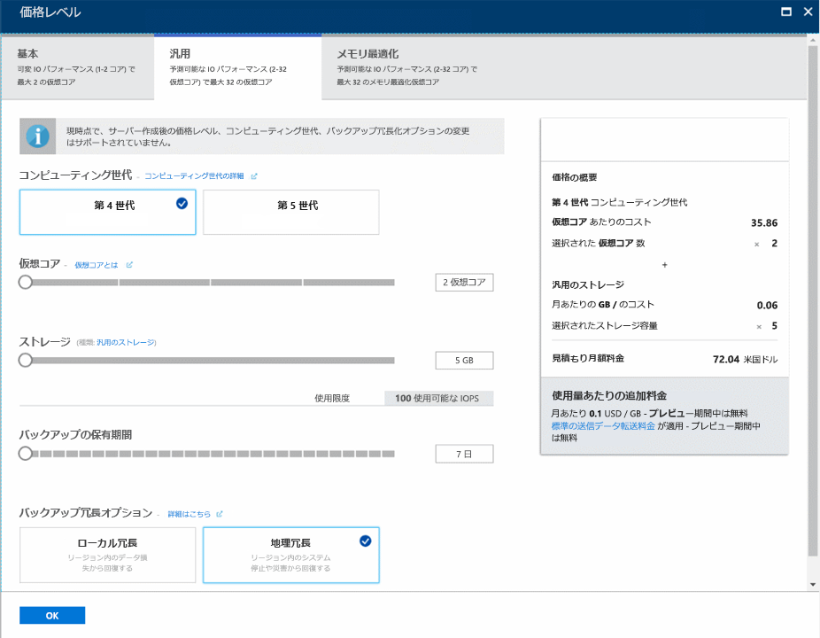

# <a name="tutorial-design-an-azure-database-for-mysql-database-using-the-azure-portal"></a>チュートリアル:Azure portal を使用して Azure Database for MySQL データベースを設計する
Azure Database for MySQL は、高可用性 MySQL データベースをクラウドで実行、管理、および拡張することができる、管理されたサービスです。 Azure Portal を使用して、簡単にサーバーを管理し、データベースを設計することができます。

このチュートリアルでは、Azure Portal を使用して次のことを行う方法を説明します。

> [!div class="checklist"]
> * Azure Database for MySQL の作成
> * サーバーのファイアウォールの構成
> * mysql コマンド ライン ツールを使用したデータベースの作成
> * サンプル データの読み込み
> * データのクエリを実行する
> * データの更新
> * データの復元

## <a name="sign-in-to-the-azure-portal"></a>Azure Portal にサインインします。
Web ブラウザーを開いて [Microsoft Azure Portal](https://portal.azure.com/) にアクセスします。 資格情報を入力してポータルにサインインします。 既定のビューはサービス ダッシュボードです。

## <a name="create-an-azure-database-for-mysql-server"></a>Azure Database for MySQL サーバーの作成
Azure Database for MySQL サーバーは、定義済みの一連の[コンピューティング リソースとストレージ リソース](./concepts-compute-unit-and-storage.md)を使って作成されます。 サーバーは、[Azure リソース グループ](https://docs.microsoft.com/azure/azure-resource-manager/resource-group-overview)内に作成されます。

1. **[データベース]** > **[Azure Database for MySQL]** の順に移動します。 **[データベース]** カテゴリ内に MySQL Server が見つからない場合は、**[すべて表示]** をクリックして、使用可能なすべてのデータベース サービスを表示します。 検索ボックスに「**Azure Database for MySQL**」と入力すれば、サービスをすばやく探せます。
   
   

2. **[Azure Database for MySQL]** タイルをクリックして **[作成]** をクリックします。 Azure Database for MySQL フォームに入力します。
   
   

    **設定** | **推奨値** | **フィールドの説明** 
    ---|---|---
    サーバー名 | 一意のサーバー名 | Azure Database for MySQL サーバーを識別する一意の名前を選択します。 たとえば mydemoserver を選択します。 指定したサーバー名にドメイン名 *.mysql.database.azure.com* が追加されます。 サーバー名に含めることができるのは、英小文字、数字、およびハイフン (-) のみであり、 3 ～ 63 文字にする必要があります。
    サブスクリプション | 該当するサブスクリプション | サーバーに使用する Azure サブスクリプションを選択します。 複数のサブスクリプションをお持ちの場合は、リソースの課金対象となるサブスクリプションを選択してください。
    リソース グループ | *myresourcegroup* | 新規または既存のリソース グループの名前を入力します。    リソース グループ|*myresourcegroup*| 新しいリソース グループ名、またはサブスクリプションの既存のリソース グループ名。
    ソースの選択 | "*空白*" | *[空白]* を選択し、最初から新しいサーバーを作成します  (既存の Azure Database for MySQL サーバーの geo バックアップからサーバーを作成する場合は、*[Backup]* を選択します)。
    サーバー管理者のログイン | myadmin | サーバーに接続するときに使用するサインイン アカウント。 管理者のサインイン名に **azure_superuser**、**admin**、**administrator**、**root**、**guest**、**public** は使用できません。
    パスワード | *<任意>* | サーバー管理者アカウントの新しいパスワードを入力します。 8 文字以上 128 文字以内にする必要があります。 パスワードには、英大文字、英小文字、数字 (0 から 9)、英数字以外の文字 (!、$、#、% など) のうち、3 つのカテゴリの文字が含まれている必要があります。
    パスワードの確認 | *<任意>*| 管理者アカウントのパスワードを確認します。
    場所 | *ユーザーに最も近いリージョン*| ユーザーや他の Azure アプリケーションに最も近い場所を選択します。
    Version | "*最新バージョン*"| 最新バージョン (別のバージョンを指定する特定の要件がある場合を除く)。
    価格レベル  | **汎用**、**Gen 4**、**2 仮想コア**、**5 GB**、**7 日**、**地理冗長** | 新しいサーバーのコンピューティング、ストレージ、およびバックアップ構成。 **[価格レベル]** を選択します。 次に、**[汎用]** タブを選択します。*Gen 4*、"*2 仮想コア*"、*5 GB*、および "*7 日*" は、それぞれ **[コンピューティング世代]**、**[仮想コア]**、**[ストレージ]**、および **[バックアップの保有期間]** の既定値です。 これらのスライダーはそのままにします。 サーバー バックアップを geo 冗長ストレージで有効にするには、**[バックアップ冗長オプション]** から **[地理冗長]** を選択します。 この価格レベルの選択を保存するには、**[OK]** を選択します。 次のスクリーンショットは、これらの選択を示しています。
    
   

3. **Create** をクリックしてください。 1 ～ 2 分で、新しい Azure Database for MySQL サーバーがクラウドで実行されます。 ツール バーの **[通知]** ボタンをクリックすると、デプロイ プロセスを監視できます。

## <a name="configure-firewall"></a>ファイアウォールの構成
Azure Databases for MySQL は、ファイアウォールによって保護されます。 既定では、サーバーとサーバー内部のデータベースに対する接続はすべて拒否されます。 初めて Azure Database for MySQL に接続する前に、ファイアウォールを構成し、クライアント マシンのパブリック ネットワーク IP アドレス (またはその範囲) を追加します。

1. 新しく作成したサーバーをクリックし、**[接続のセキュリティ]** をクリックします。
   
   
2. **自分の IP を追加**するか、またはファイアウォール規則を構成できます。 規則を作成したら、忘れずに **[保存]** をクリックしてください。
これで、mysql コマンド ライン ツールまたは MySQL Workbench GUI ツールを使用してサーバーに接続することができます。

> [!TIP]
> Azure Database for MySQL サーバーは、ポート 3306 経由で通信します。 企業ネットワーク内から接続しようとしても、ポート 3306 での送信トラフィックがネットワークのファイアウォールで禁止されている場合があります。 その場合、会社の IT 部門によってポート 3306 が開放されない限り、Azure MySQL サーバーに接続することはできません。

## <a name="get-connection-information"></a>接続情報の取得
Azure Portal から、Azure Database for MySQL サーバーの完全修飾**サーバー名**と**サーバー管理者ログイン名**を取得します。 この完全修飾サーバー名は、mysql コマンド ライン ツールでサーバーに接続する際に使用します。 

1. [Azure Portal](https://portal.azure.com/) の左側のメニューにある **[すべてのリソース]** をクリックして名前を入力し、Azure Database for MySQL サーバーを探します。 サーバー名を選択すると、詳細が表示されます。

2. **[概要]** ページで、**[サーバー名]** と **[サーバー管理者ログイン名]** の値をメモしておきます。 各フィールドの横にあるコピー ボタンをクリックすると、クリップボードにコピーできます。
   

この例では、サーバー名は *mydemoserver.mysql.database.azure.com*、サーバー管理者ログインは *myadmin@mydemoserver* です。

## <a name="connect-to-the-server-using-mysql"></a>mysql を使用してサーバーに接続する
[mysql コマンドライン ツール](https://dev.mysql.com/doc/refman/5.7/en/mysql.html)を使用して、Azure Database for MySQL サーバーへの接続を確立します。 mysql コマンドライン ツールは、ブラウザーで Azure Cloud Shell から実行するか、ローカルにインストールされている mysql ツールを使用して自分のマシンから起動できます。 Azure Cloud Shell を起動するには、この記事のコード ブロックにある `Try It` ボタンをクリックするか、Azure Portal にアクセスして右上のツール バーにある `>_` アイコンをクリックします。 

接続するためのコマンドを入力します。
```azurecli-interactive
mysql -h mydemoserver.mysql.database.azure.com -u myadmin@mydemoserver -p
```

## <a name="create-a-blank-database"></a>空のデータベースの作成
サーバーに接続したら、使用する空のデータベースを作成します。
```sql
CREATE DATABASE mysampledb;
```

プロンプトで次のコマンドを実行し、新しく作成したデータベースに接続を切り替えます。
```sql
USE mysampledb;
```

## <a name="create-tables-in-the-database"></a>データベースのテーブルを作成する
Azure Database for MySQL データベースに接続する方法を説明したので、次はいくつかの基本的なタスクを実行します。

最初に、テーブルを作成してデータを読み込みます。 インベントリ情報を格納するテーブルを作成しましょう。
```sql
CREATE TABLE inventory (
    id serial PRIMARY KEY, 
    name VARCHAR(50), 
    quantity INTEGER
);
```

## <a name="load-data-into-the-tables"></a>テーブルにデータを読み込む
テーブルを作成したので、次はデータを挿入します。 開いているコマンド プロンプト ウィンドウで、次のクエリを実行してデータ行を挿入します。
```sql
INSERT INTO inventory (id, name, quantity) VALUES (1, 'banana', 150); 
INSERT INTO inventory (id, name, quantity) VALUES (2, 'orange', 154);
```

これで、先ほど作成したテーブルにサンプル データが 2 行挿入されました。

## <a name="query-and-update-the-data-in-the-tables"></a>クエリを実行し、テーブル内のデータを更新する
次のクエリを実行して、データベース テーブルから情報を取得します。
```sql
SELECT * FROM inventory;
```

さらに、テーブル内のデータを更新することもできます。
```sql
UPDATE inventory SET quantity = 200 WHERE name = 'banana';
```

データを取得するとき、それに応じてデータ行が更新されます。
```sql
SELECT * FROM inventory;
```

## <a name="restore-a-database-to-a-previous-point-in-time"></a>データベースを以前の状態に復元する
大切なデータベース テーブルを不注意で削除し、簡単にはデータを復元できなくなった状況を想像してみてください。 Azure Database for MySQL では、サーバーを特定時点まで復元し、データベースのコピーを新しいサーバーに作成することができます。 この新しいサーバーを使用して、削除されたデータを復元することができます。 次の手順を実行して、テーブルを追加する前の状態にサンプル データベースを復元します。

1. Azure Portal で、ご利用の Azure Database for MySQL を探します。 **[概要]** ページのツール バーで **[復元]** をクリックします。 [復元] ページが表示されます。

   

2. **[復元]** フォームに必要な情報を入力します。
   
   ![10-2 [復元] フォーム](./media/tutorial-design-database-using-portal/2-restore-form.png)
   
   - **復元ポイント**:一覧表示された期間から、どの時点までさかのぼって復元するかを選択します。 ローカル タイム ゾーンは必ず UTC に変換してください。
   - **新しいサーバーに復元**: 復元先の新しいサーバー名を指定します。
   - **場所**: リージョンはソース サーバーと同じ場所にします。変更することはできません。
   - **価格レベル**:ソース サーバーと同じ価格レベルにします。変更することはできません。
   
3. **[OK]** をクリックして、[テーブルが削除される前の状態にサーバーを復元](./howto-restore-server-portal.md)します。 サーバーを復元すると、指定した時点のサーバーのコピーが新たに作成されます。 

## <a name="next-steps"></a>次の手順
このチュートリアルでは、Azure Portal を使用して次のことを行う方法を説明しました。

> [!div class="checklist"]
> * Azure Database for MySQL の作成
> * サーバーのファイアウォールの構成
> * mysql コマンド ライン ツールを使用したデータベースの作成
> * サンプル データの読み込み
> * データのクエリを実行する
> * データの更新
> * データの復元

> [!div class="nextstepaction"]
> [Azure Database for MySQL にアプリケーションを接続する方法](./howto-connection-string.md)
