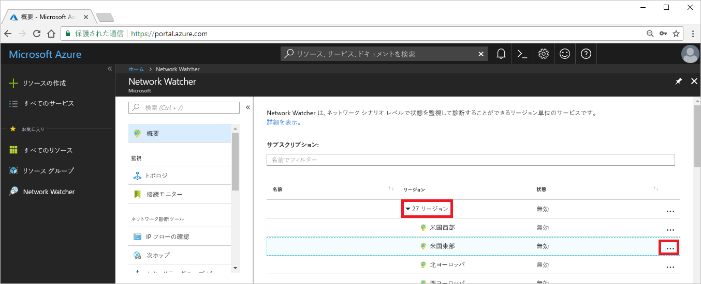

# チュートリアル:Azure portal を使用して仮想マシン ネットワークのルーティングの問題を診断する

仮想マシン (VM) をデプロイするときに、Azure ではその VM に対して複数の既定のルートを作成します。 カスタム ルートを作成して、Azure の既定のルートをオーバーライドできます。 状況によっては、カスタム ルートによって、VM が他のリソースと通信できなくなる可能性もあります。 このチュートリアルでは、以下の内容を学習します。

> [!div class="checklist"]
> * VM の作成
> * Network Watcher の次ホップ機能を使った URL への通信のテスト
> * IP アドレスへの通信のテスト
> * ルーティングの問題の診断と解決方法の理解

好みに応じて、[Azure CLI](diagnose-vm-network-routing-problem-cli.md) または [Azure PowerShell](diagnose-vm-network-routing-problem-powershell.md) を使用して仮想マシン ネットワークのルーティングの問題を診断することもできます。

Azure サブスクリプションをお持ちでない場合は、開始する前に [無料アカウント](https://azure.microsoft.com/free/?WT.mc_id=A261C142F) を作成してください。

## Azure にログインする

Azure Portal (https://portal.azure.com ) にログインします。

## VM の作成

1. Azure Portal の左上隅にある **[+ リソースの作成]** を選択します。
2. **[Compute]** を選択し、 **[Windows Server 2016 Datacenter]** または **[Ubuntu Server 17.10 VM]** を選択します。
3. 次の情報を入力するか選択し、それ以外の設定では既定値をそのまま使用して、 **[OK]** を選択します。

    |Setting|値|
    |---|---|
    |名前|myVm|
    |ユーザー名| 任意のユーザー名を入力します。|
    |パスワード| 任意のパスワードを入力します。 パスワードは 12 文字以上で、[定義された複雑さの要件](../virtual-machines/windows/faq.md?toc=%2fazure%2fnetwork-watcher%2ftoc.json#what-are-the-password-requirements-when-creating-a-vm)を満たす必要があります。|
    |Subscription| サブスクリプションを選択します。|
    |Resource group| **[新規作成]** を選択し、「**myResourceGroup**と入力します。|
    |Location| **[米国東部]** を選択します。|

4. VM のサイズを選択して、 **[選択]** を選択します。
5. **[設定]** で、すべての既定値をそのままにして、 **[OK]** を選択します。
6. **[概要]** の **[作成]** で **[作成]** を選択して、VM のデプロイを開始します。 VM のデプロイには数分かかります。 残りの手順を続行する前に、VM がデプロイを完了するまで待ちます。

## ネットワーク通信をテストする

Network Watcher を使ってネットワーク通信をテストするには、最初に少なくとも 1 つの Azure リージョンでネットワーク ウォッチャーを有効にして、Network Watcher の次ホップ機能を使用して通信をテストする必要があります。

### ネットワーク ウォッチャーを有効にする

既に少なくとも 1 つのリージョンでネットワーク ウォッチャーを有効にしている場合は、この手順をスキップして、「[次ホップの使用](#use-next-hop)」へ進んでください。

1. ポータルで **[すべてのサービス]** を選択します。 **[フィルター]** ボックスに、「*Network Watcher*」と入力します。 結果に **[Network Watcher]** が表示されたら、それを選択します。
2. 次の図に示すように、 **[リージョン]** を選択して展開し、 **[米国東部]** の右側の **[...]** を選択します。

    

3. **[Network Watcher の有効化]** を選択します。

### 次ホップの使用

Azure では、既定の接続先へのルートを自動的に作成します。 既定のルートをオーバーライドするカスタム ルートを作成できます。 場合によっては、カスタム ルートが通信の失敗の原因になることがあります。 Network Watcher の次ホップ機能を使用して、Azure がトラフィックのルーティングに使用しているルートを特定します。

1. Azure Portal の **[Network Watcher]** で、 **[次ホップ]** を選択します。
2. サブスクリプションを選択して、以下の値を入力または選択して、次の図に示すように **[次ホップ]** を選択します。

    |Setting                  |値                                                   |
    |---------                |---------                                               |
    | Resource group          | myResourceGroup を選択する                                 |
    | 仮想マシン         | myVm を選択する                                            |
    | Linux       | myvm - お使いのネットワーク インターフェイス名は異なる場合があります。   |
    | 送信元 IP アドレス       | 10.0.0.4                                               |
    | 宛先 IP アドレス  | 13.107.21.200 - <www.bing.com> に対するアドレスの 1 つ。 |

    

    数秒後、次ホップの種類が **[インターネット]** であり、 **[ルート テーブル ID]** が **[System Route]\(システム ルート\)** であることが結果で通知されます。 この結果から、接続先に対して有効なシステム ルートが存在することがわかります。

3. **[接続先 IP アドレス]** を *[172.31.0.100]* に変更して、もう一度 **[次ホップ]** を選択します。 返される結果は、 **[次ホップの種類]** が **[なし]** であり、 **[ルート テーブル ID]** が **[System Route]\(システム ルート\)** であることを示しています。 この結果から、送信先への有効なシステム ルートはあるものの、接続先にトラフィックをルーティングする次ホップはないことがわかります。

## ルートの詳細の表示

1. さらに詳細にルーティングを分析するには、ネットワーク インターフェイスの有効なルートを確認します。 ポータルの上部にある検索ボックスに、「*myvm* 」と入力します (選択したネットワーク インターフェイスの任意の名前です)。 検索結果に **myvm** が表示されたら、それを選択します。
2. 次の図に示すように、 **[サポート + トラブルシューティング]** で **[有効なルート]** を選択します。

    

    「[次ホップの使用](#use-next-hop)」で 13.107.21.200 を使用してテストを実行したときは、他のルートにはそのアドレスが含まれていないため、アドレス プレフィックスが 0.0.0.0/0 のルートが、アドレスにトラフィックをルーティングするために使用されました。 既定では、他のルートのアドレス プレフィックス内で指定されていないすべてのアドレスが、インターネットにルーティングされます。

    しかし、172.31.0.100 を使用してテストを実行したとき、結果から次ホップの種類がないことがわかりました。 前記の図でわかるように、172.31.0.100 アドレスを含む 172.16.0.0/12 プレフィックスへの既定のルートはあっても、 **[次ホップの種類]** は **[なし]** です。 Azure では、172.16.0.0/12 への既定のルートを作成しますが、理由が発生しない限り次ホップの種類は指定しません。 たとえば、仮想ネットワークのアドレス空間に 172.16.0.0/12 アドレス範囲を追加した場合、Azure では **[次ホップの種類]** をルートの **[仮想ネットワーク]** に変更します。 **[次ホップの種類]** として **[仮想ネットワーク]** にチェックマークが表示されます。

## リソースのクリーンアップ

リソース グループとそれに含まれるすべてのリソースが不要になったら、それらを削除します。

1. ポータル上部の **[検索]** ボックスに「*myResourceGroup*」と入力します。 検索結果に **[myResourceGroup]** が表示されたら、それを選択します。
2. **[リソース グループの削除]** を選択します。
3. **[TYPE THE RESOURCE GROUP NAME:]\(リソース グループ名を入力してください:\)** に「*myResourceGroup*」と入力し、 **[削除]** を選択します。

## 次の手順

このチュートリアルでは、VM を作成し、VM からのネットワークのルーティングを診断しました。 Azure では複数の既定のルートが作成されることを学習し、2 つの異なる送信先へのルーティングをテストしました。 詳細については、[Azure でのルーティング](../virtual-network/virtual-networks-udr-overview.md?toc=%2fazure%2fnetwork-watcher%2ftoc.json)と[カスタム ルートを作成する](../virtual-network/manage-route-table.md?toc=%2fazure%2fnetwork-watcher%2ftoc.json#create-a-route)方法に関するページを参照してください。

送信 VM 接続の場合は、Network Watcher の [接続のトラブルシューティング](network-watcher-connectivity-portal.md)機能を使用して、待機時間、VM とエンドポイント間で許可/拒否されるネットワーク トラフィック、およびエンドポイントに使用されるルートも決定できます。 Network Watcher 接続監視機能を使用して、VM と、IP アドレスや URL などのエンドポイント間の通信を継時的に監視する方法について確認してください。

> [!div class="nextstepaction"]
> [ネットワーク接続の監視](connection-monitor.md)