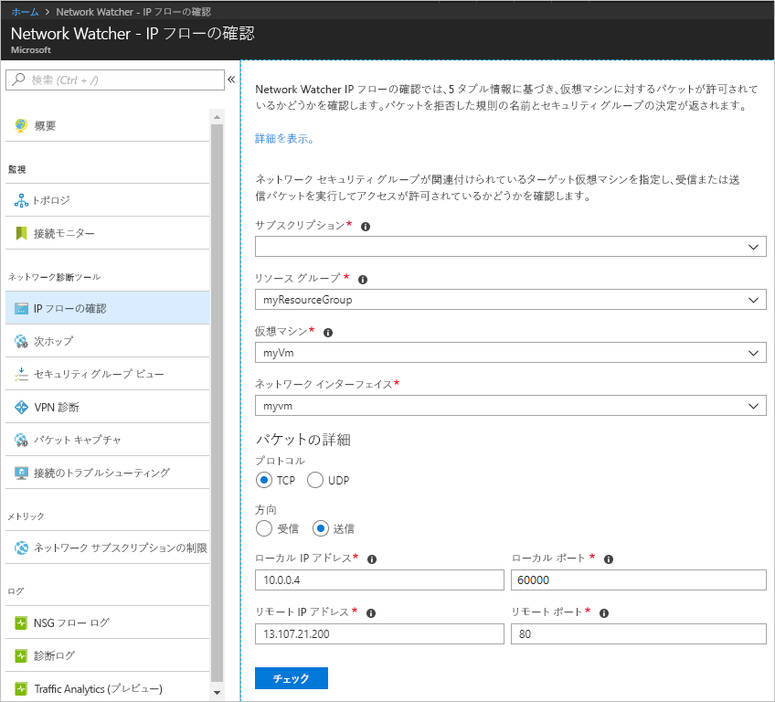
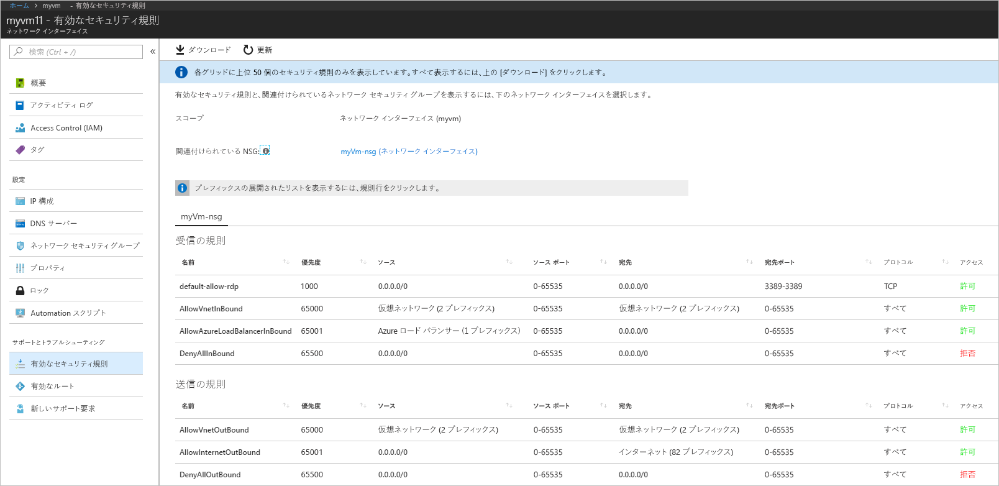
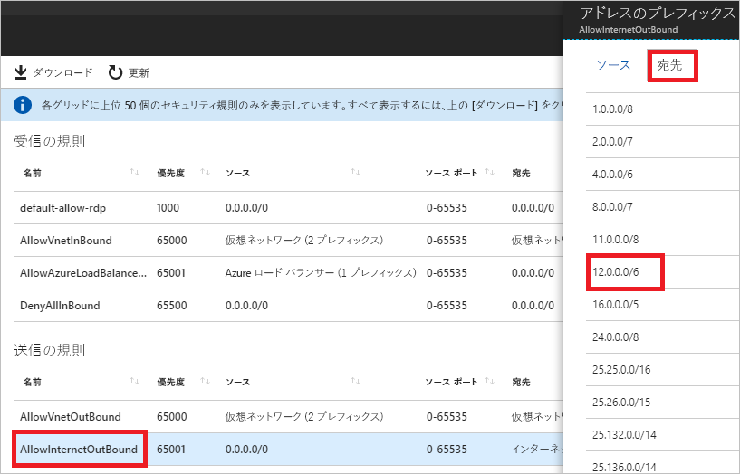

# クイック スタート:Azure portal を使用して仮想マシン ネットワーク トラフィック フィルターの問題を診断する

このクイック スタートでは、仮想マシン (VM) を展開してから、IP アドレスと URL への通信および IP アドレスからの通信をチェックします。 通信障害の原因と解決方法を特定します。

Azure サブスクリプションをお持ちでない場合は、開始する前に [無料アカウント](https://azure.microsoft.com/free/?WT.mc_id=A261C142F) を作成してください。

## Azure にログインする

Azure Portal (https://portal.azure.com ) にログインします。

## VM の作成

1. Azure Portal の左上隅にある **[+ リソースの作成]** を選択します。
2. **[Compute]** を選択し、 **[Windows Server 2016 Datacenter]** またはいずれかのバージョンの **Ubuntu Server** を選択します。
3. 次の情報を入力するか選択し、それ以外の設定では既定値をそのまま使用して、 **[OK]** を選択します。

    |Setting|値|
    |---|---|
    |名前|myVm|
    |ユーザー名| 任意のユーザー名を入力します。|
    |パスワード| 任意のパスワードを入力します。 パスワードは 12 文字以上で、[定義された複雑さの要件](../virtual-machines/windows/faq.md?toc=%2fazure%2fnetwork-watcher%2ftoc.json#what-are-the-password-requirements-when-creating-a-vm)を満たす必要があります。|
    |Subscription| サブスクリプションを選択します。|
    |Resource group| **[新規作成]** を選択し、「**myResourceGroup**と入力します。|
    |Location| **[米国東部]** を選択します。|

4. VM のサイズを選択して、 **[選択]** を選択します。
5. **[設定]** で、すべての既定値をそのままにして、 **[OK]** を選択します。
6. **[概要]** の **[作成]** で **[作成]** を選択して、VM のデプロイを開始します。 VM のデプロイには数分かかります。 残りの手順を続行する前に、VM がデプロイを完了するまで待ちます。

## ネットワーク通信をテストする

Network Watcher を使ってネットワーク通信をテストするには、最初に少なくとも 1 つの Azure リージョンでネットワーク ウォッチャーを有効にしてから、Network Watcher の IP フローの確認機能を使います。

### ネットワーク ウォッチャーを有効にする

既に少なくとも 1 つのリージョンでネットワーク ウォッチャーを有効にしている場合は、この手順をスキップして、「[IP フローの確認を使用する](#use-ip-flow-verify)」へ進んでください。

1. ポータルで **[すべてのサービス]** を選択します。 **[フィルター]** ボックスに、「*Network Watcher*」と入力します。 結果に **[Network Watcher]** が表示されたら、それを選択します。
2. 前の手順で VM を展開した米国東部リージョンにおいてネットワーク ウォッチャーを有効にします。 次の図に示すように、 **[リージョン]** を選択して展開し、 **[米国東部]** の右側の **[...]** を選択します。

    

3. **[Network Watcher の有効化]** を選択します。

### IP フローの確認を使用する

VM を作成すると、Azure は既定に従って、VM との間でやり取りされるネットワーク トラフィックを許可および拒否します。 後で Azure の既定値をオーバーライドして、他の種類のトラフィックを許可または拒否する場合があります。

1. ポータルで **[すべてのサービス]** を選択します。 **[すべてのサービス]** で *[フィルター]* ボックスに、「*Network Watcher*」と入力します。 結果に **[Network Watcher]** が表示されたら、それを選択します。
2. **[ネットワーク診断ツール]** で、 **[IP フローの確認]** を選択します。
3. サブスクリプションを選択して、以下の値を入力または選択して、次の図に示すように **[確認]** を選択します。

    |Setting            |値                                                                                              |
    |---------          |---------                                                                                          |
    | Resource group    | myResourceGroup を選択する                                                                            |
    | 仮想マシン   | myVm を選択する                                                                                       |
    | Linux | myvm - VM を作成したときにポータルが作成したネットワーク インターフェイスの名前は異なります。 |
    | Protocol          | TCP                                                                                               |
    | Direction         | 送信                                                                                          |
    | ローカル IP アドレス  | 10.0.0.4                                                                                          |
    | ローカル ポート      | 60000                                                                                                |
    | リモート IP アドレス | 13.107.21.200 - <www.bing.com> に対するアドレスの 1 つ。                                             |
    | リモート ポート       | 80                                                                                                |

    

    数秒後に、**AllowInternetOutbound** という名前のセキュリティ規則によってアクセスが許可されていることを示す結果が返されます。 確認を実行する前に米国東部リージョン以外のリージョンにネットワーク ウォッチャーが既に存在していた場合は、確認を実行したときに、米国東部リージョンにネットワーク ウォッチャーが自動的に作成されています。
4. 手順 3 をもう一度実行しますが、 **[リモート IP アドレス]** を **172.31.0.100** に変更します。 返される結果では、**DefaultOutboundDenyAll** という名前のセキュリティ規則のためにアクセスが拒否されることが示されています。
5. 手順 3 をもう一度実行しますが、 **[方向]** を **[受信]** に、 **[ローカル ポート]** を「**80**」に、 **[リモート ポート]** を「**60000**」にそれぞれ変更します。 返される結果では、**DefaultInboundDenyAll** という名前のセキュリティ規則のためにアクセスが拒否されることが示されています。

VM へのトラフィックまたは VM からのトラフィックを許可または拒否しているセキュリティ規則がわかったので、問題を解決する方法を決定できます。

## セキュリティ規則の詳細を表示する

1. 「[IP フローの確認を使用する](#use-ip-flow-verify)」の手順 3 ～ 5 の規則によって通信が許可または拒否された理由を特定するには、VM においてネットワーク インターフェイスに対して有効なセキュリティ規則を確認します。 ポータルの上部にある検索ボックスに、「*myvm*」と入力します。 **myvm** ネットワーク インターフェイス (実際にお使いのネットワーク インターフェイスの名前) が検索結果に表示されたら、それを選びます。
2. 次の図に示すように、 **[サポート + トラブルシューティング]** で **[有効なセキュリティ規則]** を選択します。

    

    「[IP フローの確認を使用する](#use-ip-flow-verify)」の手順 3 では、通信が許可された理由が **AllowInternetOutbound** 規則であることを確認しました。 前に図を見ると、規則の **[送信先]** が **[インターネット]** であることがわかります。 しかし、「[IP フローの確認を使用する](#use-ip-flow-verify)」の点順 3 でテストしたアドレス 13.107.21.200 が **Internet** にどのように関連するのかはっきりしません。
3. **AllowInternetOutBound** 規則を選び、次の図のように **[送信先]** を選びます。

    

    リストのプレフィックスの 1 つは **12.0.0.0/6** であり、これは 12.0.0.1-15.255.255.254 の IP アドレス範囲を包含します。 13.107.21.200 はそのアドレス範囲内にあるため、**AllowInternetOutBound** 規則は送信トラフィックを許可します。 さらに、手順 2 の画像で示されている規則の中には、この規則をオーバーライドする優先順位の高い (小さい値の) 規則はありません。 **[アドレスのプレフィックス]** ボックスを閉じます。 13.107.21.200 への送信通信を拒否するには、その IP アドレスへのポート 80 での送信を拒否する、優先順位の高いセキュリティ規則を追加します。
4. 「[IP フローの確認を使用する](#use-ip-flow-verify)」の手順 4 で 172.131.0.100 への送信チェックを実行したときに、**DefaultOutboundDenyAll** という規則が通信を拒否したことがわかりました。 その規則は、手順 2 の画像に示されている **[送信先]** として **0.0.0.0/0** が指定されている **DenyAllOutBound** 規則と同じです。 この規則は、172.131.0.100 が画像で示されている他のどの **[送信規則]** の **[送信先]** にも含まれないので、このアドレスへの送信通信を拒否します。 この送信通信を許可するには、アドレス 172.131.0.100 に対するポート 80 への送信トラフィックを許可する、優先順位の高いセキュリティ規則を追加します。
5. 「[IP フローの確認を使用する](#use-ip-flow-verify)」の手順 5 で 172.131.0.100 からの受信チェックを実行したときに、**DefaultInboundDenyAll** という規則が通信を拒否したことがわかりました。 その規則は、手順 2 の画像で示されている **DenyAllInBound** 規則と同じです。 **DenyAllInBound** 規則は、172.31.0.100 から VM へのポート 80 での受信を許可する、優先順位がさらに高い規則が存在しないために、適用されました。 この受信通信を許可するには、ポート 80 での 172.31.0.100 からの受信を許可する優先順位の高いセキュリティ規則を追加します。

このクイック スタートのチェックでは、Azure の構成をテストしました。 チェックから予想どおりの結果が返ったにもかかわらず、まだネットワークの問題がある場合は、VM と通信対象のエンドポイントとの間にファイアウォールが存在しないこと、および VM のオペレーティング システムに通信を許可または拒否するファイアウォールが含まれないことを確認します。

## リソースのクリーンアップ

リソース グループとそれに含まれるすべてのリソースが不要になったら、それらを削除します。

1. ポータル上部の **[検索]** ボックスに「*myResourceGroup*」と入力します。 検索結果に **[myResourceGroup]** が表示されたら、それを選択します。
2. **[リソース グループの削除]** を選択します。
3. **[TYPE THE RESOURCE GROUP NAME:]\(リソース グループ名を入力してください:\)** に「*myResourceGroup*」と入力し、 **[削除]** を選択します。

## 次の手順

このクイック スタートでは、VM を作成し、受信および送信ネットワーク トラフィック フィルターを診断しました。 ネットワーク セキュリティ グループの規則が、VM との間でやり取りされるトラフィックを許可または拒否することを学習しました。 [セキュリティ規則](../virtual-network/security-overview.md?toc=%2fazure%2fnetwork-watcher%2ftoc.json)および[セキュリティ規則を作成する](../virtual-network/manage-network-security-group.md?toc=%2fazure%2fnetwork-watcher%2ftoc.json#create-a-security-rule)方法について、さらに詳しく学習してください。

適切なネットワーク トラフィック フィルターを適用してもまだ、ルーティングの構成のために VM への通信が失敗する可能性があります。 VM ネットワークのルーティングの問題を診断する方法については、「[VM のルーティングに関する問題を診断する](diagnose-vm-network-routing-problem.md)」をご覧ください。送信ルーティング、待機時間、およびトラフィック フィルター処理の問題を 1 つのツールで診断する方法については、[接続のトラブルシューティング](network-watcher-connectivity-portal.md)に関するページをご覧ください。
