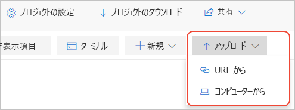

# クイック スタート:ローカルの Jupyter ノートブックを Azure Notebooks プレビューに移行する

このクイックスタートでは、ローカル コンピューターまたは別のアクセス可能なファイルの URL から Jupyter ノートブックを Azure Notebooks に移行します。 

自分のコンピューター上の Jupyter ノートブックには、自分しかアクセスできません。 ファイルを共有することはできますが、共有を受けた側にあるのは、そのユーザーが所有する、ノートブックのローカル コピーであるため、その変更を組み込むのは困難です。 GitHub など、共有オンライン リポジトリにノートブックを格納したとしても、各コラボレーターには、共有元と同様にローカル Jupyter 環境が構成されている必要があります。

ローカルまたはリポジトリベースのノートブックを Azure Notebooks に移行することによって、コラボレーターとの間でそれらを即座に共有することができます。必要なのは、ノートブックを表示して実行するためのブラウザーだけです。 Azure Notebooks にサインインすれば、変更を加えることもできます。

## 前提条件

- ローカル コンピューター上または別のアクセス可能なファイルの URL にある [Jupyter ノートブック](https://jupyter-notebook.readthedocs.io)。 

## Azure Notebooks でプロジェクトを作成する

このクイックスタートでは、ローカル コンピューターまたは別のアクセス可能なファイルの URL からノートブックを移行する方法を紹介します。 GitHub リポジトリからノートブックを移行するには、「[クイック スタート:ノートブックの複製](quickstart-clone-jupyter-notebook.md)」をご覧ください。

[!INCLUDE [notebooks-status](../../includes/notebooks-status.md)]

1. [Azure Notebooks](https://notebooks.azure.com) に移動してサインインします (詳しくは、「[Quickstart - Sign in to Azure Notebooks](quickstart-sign-in-azure-notebooks.md)」(クイック スタート - Azure Notebook にサインインする) をご覧ください)。

1. パブリック プロファイル ページから、ページの上部にある **[マイ プロジェクト]** を選択します。

    ![ブラウザー ウィンドウの上部にある [マイ プロジェクト] リンク](media/quickstarts/my-projects-link.png)

1. **[マイ プロジェクト]** ページで **[新しいプロジェクト]** を選択します (キーボード ショートカット: N)。 ブラウザー ウィンドウが狭い場合、ボタンに **[+]** だけが表示されることがあります。

    ![[マイ プロジェクト] ページの [新しいプロジェクト] コマンド](media/quickstarts/new-project-command.png)

1. 表示される **[新しいプロジェクトの作成]** ポップアップで、 **[プロジェクト名]** フィールドと **[プロジェクト ID]** フィールドに移行しているノートブックの適切な値を入力し、 **[パブリック プロジェクト]** オプションと **[Create a README.md]\(README.md を作成する\)** オプションをオフにして、 **[作成]** を選択します。

## ローカルのノートブックをアップロードする

1. プロジェクトのページで、 **[アップロード]** を選択し (ブラウザー ウィンドウが小さい場合、上向きの矢印のみが表示される場合があります)、1 を選択します。 表示されるポップアップで、ノートブックがローカル ファイル システム上にある場合は **[From computer]\(コンピューターから\)** を選択し、ノートブックがオンラインにある場合は **[From URL]\(URL から\)** を選択します。

    

   ノートブックが GitHub リポジトリにある場合も、「[クイック スタート: ノートブックの複製](quickstart-clone-jupyter-notebook.md)」の手順を代わりにご覧ください。

   - **[From Computer]\(コンピューターから\)** を使用している場合は、 *.ipynb* ファイルをドラッグしてポップアップにドロップするか、 **[ファイルの選択]** を選択し、インポートするデータ ファイルを参照して選択します。 **[アップロード]** を選択します。 アップロードされたファイルには、ローカル ファイルと同じ名前が与えられます *.ipynb_checkpoints* フォルダーの内容をアップロードする必要はありません。

     

   - **[From URL]\(URL から\)** を使用している場合は、 **[ファイル URL]** フィールドに送信元アドレスを入力し、 **[ファイル名]** フィールドにプロジェクトのノートブックに割り当てるファイル名を入力します。 **[アップロード]** を選択します。 URL が異なる複数のファイルがある場合は、 **[ファイルの追加]** コマンドを使用して、入力した最初の URL をオンにすると、ポップアップに別のファイルを指定する新しいフィールドが表示されます。

     

1. 新しくアップロードしたノートブックを開いて実行し、内容と操作を確認します。 完了したら、 **[ファイル]**  >  **[Halt and close]\(停止して閉じる\)** を選択してノートブックを閉じます。

1. アップロードしたノートブックへのリンクを共有するには、プロジェクトでファイルを右クリックし、 **[リンクのコピー]** (キーボード ショートカット: Y) を選択して、適切なメッセージにそのリンクを貼り付けます。 または、プロジェクト ページの **[共有]** コントロールを使用して、プロジェクト全体を共有することもできます。

1. ノートブック以外のファイルを編集するには、プロジェクトのファイルを右クリックして、 **[ファイルの編集]** (キーボード ショートカット: I) を選択します。 既定のアクションである **[実行]** (キーボード ショートカット: R) ではファイルの内容が表示されるだけであり、編集は許可されません。

## 次のステップ

> [!div class="nextstepaction"]
> [チュートリアル:線形回帰を行う Jupyter ノートブックを作成して実行する](tutorial-create-run-jupyter-notebook.md)
