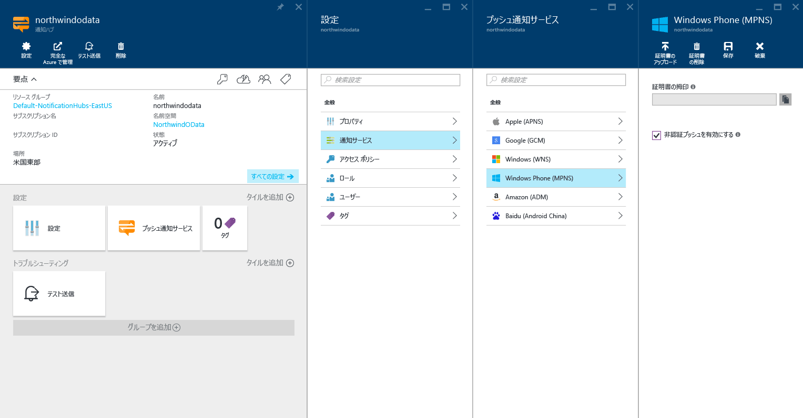

# Azure portal で Microsoft プッシュ通知サービス (MPNS) の設定を構成する

この記事では、Azure portal を使用して Azure 通知ハブ用に Microsoft プッシュ通知サービス (MPNS) の設定を構成する方法について説明します。 

## 前提条件
通知ハブを作成していない場合は、ここで作成します。 詳細については、「[Azure portal 内で Azure 通知ハブを作成する](create-notification-hub-portal.md)」を参照してください。 

## Microsoft プッシュ通知サービス (MPNS) の構成

次の手順は、通知ハブ用に Microsoft プッシュ通知サービス (MPNS) の設定を構成する手順を示しています。 

1. Azure portal の **[通知ハブ]** ページで、左側のメニューの **[Windows Phone (MPNS)]** を選択します。
1. 非認証プッシュ通知または認証済みプッシュ通知を有効にします。

   a. 非認証プッシュ通知を有効にするには、 **[非認証プッシュを有効にする]**  >  **[保存]** の順に選択します。

      

   b. 認証済みプッシュ通知を有効にするには、次の手順に従います。
      * ツール バーの **[証明書のアップロード]** を選択します。
      * ファイル アイコンを選択し、証明書ファイルを選択します。
      * 証明書のパスワードを入力します。
      * **[OK]** を選択します。
      * **[Windows Phone(MPNS)]** ページで、 **[保存]** を選択します。

## 次のステップ
Azure Notification Hubs と Microsoft プッシュ通知サービス (MPNS) を使用して、Windows Phone デバイスにプッシュ通知を送信する詳細な手順については、「[Azure Notification Hubs を使用して Windows Phone アプリにプッシュ通知を送信する](notification-hubs-windows-mobile-push-notifications-mpns.md)」を参照してください。

