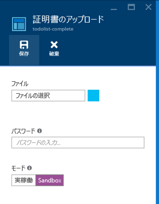
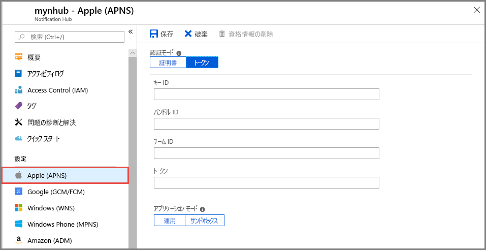
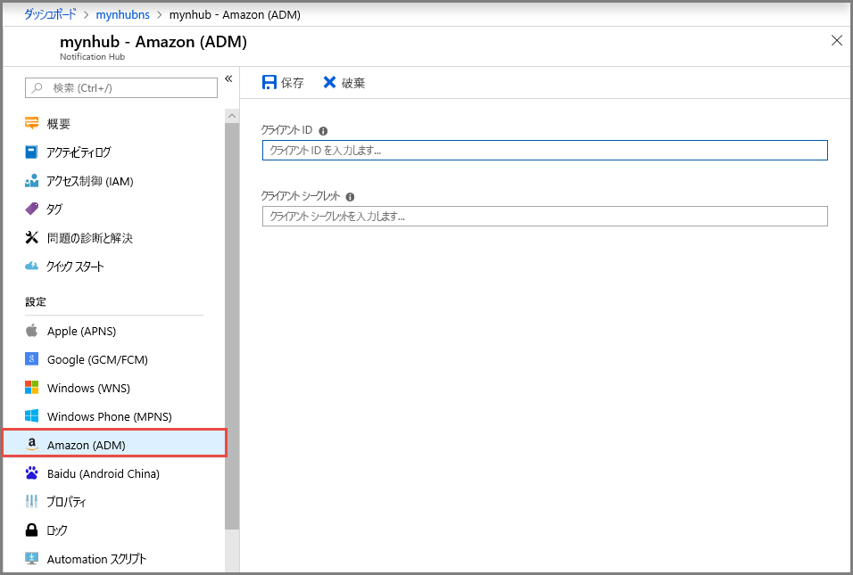

# Azure portal で通知ハブのプッシュ通知を設定する

Azure Notification Hubs には、使いやすくスケールアウトにも対応したプッシュ エンジンが用意されています。Notification Hubs を使用すると、あらゆるプラットフォーム (iOS、Android、Windows、Kindle、Baidu) にあらゆるバックエンド (クラウドまたはオンプレミス) から通知を送信することができます。 詳細については、「[Azure Notification Hubs とは](notification-hubs-push-notification-overview.md)」を参照してください。

このクイック スタートでは、Notification Hubs におけるプラットフォーム通知システム (PNS) の設定を使用して、複数のプラットフォームに対するプッシュ通知を設定します。 このクイック スタートでは、Azure portal での手順を紹介します。

まだ通知ハブを作成していない場合は、新たに作成してください。 詳細については、「[Azure portal 内で Azure 通知ハブを作成する](create-notification-hub-portal.md)」を参照してください。 

## Apple Push Notification Service

Apple Push Notification Service (APNS) を設定するには、次の手順に従います。

1. Azure portal の **[通知ハブ]** ページで、左側のメニューの **[Apple (APNS)]** を選択します。

1. **[認証モード]** で **[証明書]** または **[トークン]** を選択します。

   a. **[証明書]** を選択した場合:
   * ファイル アイコンを選択し、アップロードする *.p12* ファイルを選びます。
   * パスワードを入力します。
   * **[サンドボックス]** モードを選択します。 または、ストアからアプリを購入したユーザーにプッシュ通知を送信する場合は、**[Production]\(運用\)** モードを選択します。

     

   b. **[トークン]** を選択した場合:

   * **[キー ID]**、**[バンドル ID]**、**[チーム ID]**、**[トークン]** に値を入力します。
   * **[サンドボックス]** モードを選択します。 または、ストアからアプリを購入したユーザーにプッシュ通知を送信する場合は、**[Production]\(運用\)** モードを選択します。

     

詳細については、[Azure Notification Hubs を使用して iOS アプリにプッシュ通知を送信する](notification-hubs-ios-apple-push-notification-apns-get-started.md)方法に関するページを参照してください。

## Google Firebase Cloud Messaging

Google Firebase Cloud Messaging (FCM) のプッシュ通知を設定するには、次の手順に従います。

1. Azure portal の **[通知ハブ]** ページで、左側のメニューの **[Google (GCM/FCM)]** を選択します。 
2. 前に保存した FCM プロジェクトの **API キー**を貼り付けます。 
3. **[保存]** を選択します。 

   

これらの手順が完了すると、通知ハブが正常に更新されたことをアラートで確認できます。 **[Save]\(保存\)** ボタンが無効になります。 

詳細については、[Notification Hubs と Google FCM を使用して Android デバイスにプッシュ通知を送信する](notification-hubs-android-push-notification-google-fcm-get-started.md)方法に関するページを参照してください。

## Windows プッシュ通知サービス

Windows プッシュ通知サービス (WNS) を設定するには、次の手順に従います。

1. Azure portal の **[通知ハブ]** ページで、左側のメニューの **[Windows (WNS)]** を選択します。
2. **[パッケージ SID]** と **[セキュリティ キー]** に値を入力します。
3. **[保存]** を選択します。

   ![[パッケージ SID] ボックスと [セキュリティ キー] ボックスを示すスクリーンショット](./media/notification-hubs-windows-store-dotnet-get-started/notification-hub-configure-wns.png)

詳細については、[Azure Notification Hubs を使用して UWP アプリに通知を送信する](notification-hubs-windows-store-dotnet-get-started-wns-push-notification.md)方法に関するページを参照してください。

## Windows Phone 用 Microsoft プッシュ通知サービス

Windows Phone 用 Microsoft プッシュ通知サービス (MPNS) を設定するには、次の手順に従います。 

1. Azure portal の **[通知ハブ]** ページで、左側のメニューの **[Windows Phone (MPNS)]** を選択します。
1. 非認証プッシュ通知または認証済みプッシュ通知を有効にします。

   a. 非認証プッシュ通知を有効にするには、**[非認証プッシュを有効にする]** > **[保存]** の順に選択します。

      

   b. 認証済みプッシュ通知を有効にするには、次の手順に従います。
      * ツール バーの **[証明書のアップロード]** を選択します。
      * ファイル アイコンを選択し、証明書ファイルを選択します。
      * 証明書のパスワードを入力します。
      * **[OK]** を選択します。
      * **[Windows Phone(MPNS)]** ページで、**[保存]** を選択します。

詳細については、[Notification Hubs を使用して Windows Phone アプリにプッシュ通知を送信する](notification-hubs-windows-mobile-push-notifications-mpns.md)方法に関するページを参照してください。
      
## Amazon Device Messaging

Amazon Device Messaging (ADM) のプッシュ通知を設定するには、次の手順に従います。

1. Azure portal の **[通知ハブ]** ページで、左側のメニューの **[Amazon (ADM)]** を選択します。
2. **[クライアント ID]** と **[クライアント シークレット]** に値を入力します。
3. **[保存]** を選択します。
    
   

詳細については、「[Notification Hubs の使用 (Kindle アプリ)](notification-hubs-kindle-amazon-adm-push-notification.md)」を参照してください。

## Baidu (Android China)

Baidu のプッシュ通知を設定するには、次の手順に従います。

1. Azure portal の **[通知ハブ]** ページで、左側のメニューの **[Baidu (Android China)]** を選択します。 
2. Baidu コンソールから取得した、Baidu クラウド プッシュ プロジェクトの **API キー**を入力します。 
3. Baidu コンソールから取得した、Baidu クラウド プッシュ プロジェクトの**秘密鍵**を入力します。 
4. **[保存]** を選択します。 

    

これらの手順が完了すると、通知ハブが正常に更新されたことをアラートで確認できます。 **[Save]\(保存\)** ボタンが無効になります。 

詳細については、[Baidu での Notification Hubs の使用](notification-hubs-baidu-china-android-notifications-get-started.md)に関するページを参照してください。

## 次の手順
このクイック スタートでは、Azure portal 内で通知ハブに対してプラットフォーム通知システムの設定を構成する方法について説明しました。 

さまざまなプラットフォームに対してプッシュ通知を送信する方法について詳しくは、以下のチュートリアルを参照してください。

- [Notification Hubs と APNS を使用して iOS デバイスにプッシュ通知を送信する](notification-hubs-ios-apple-push-notification-apns-get-started.md)
- [Notification Hubs と Google FCM を使用して Android デバイスにプッシュ通知を送信する](notification-hubs-android-push-notification-google-fcm-get-started.md)
- [Windows デバイス上で動作する UWP アプリにプッシュ通知を送信する](notification-hubs-windows-store-dotnet-get-started-wns-push-notification.md)
- [MPNS を使用して Windows Phone 8 アプリにプッシュ通知を送信する](notification-hubs-windows-mobile-push-notifications-mpns.md)
- [Kindle アプリケーションにプッシュ通知を送信する](notification-hubs-kindle-amazon-adm-push-notification.md)
- [Notification Hubs と Baidu クラウド プッシュを使用してプッシュ通知を送信する](notification-hubs-baidu-china-android-notifications-get-started.md)
