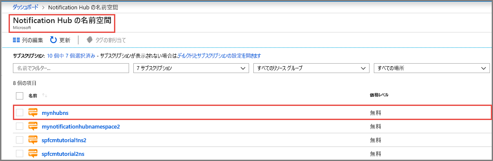
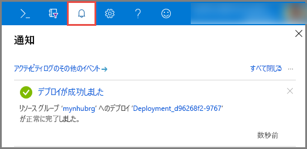

# Azure portal 内で Azure 通知ハブを作成する 
Azure Notification Hubs は、任意のバックエンド (クラウドまたはオンプレミス) から任意のプラットフォーム (iOS、Android、Windows、Kindle、Baidu など) に通知を送信できる、使いやすく、かつスケールアウトされたプッシュ エンジンを提供します。 このサービスの詳細については、「[Azure Notification Hubs とは](notification-hubs-push-notification-overview.md)」を参照してください。

このクイック スタートでは、Azure portal 内で通知ハブを作成します。 最初のセクションでは、Notification Hubs 名前空間を作成し、その名前空間の中にハブを作成する手順を示します。 2 つ目のセクションでは、既存の Notification Hubs 名前空間の中に通知ハブを作成する手順を示します。 

## 名前空間と通知ハブを作成する
このセクションでは、名前空間を作成し、その名前空間の中にハブを作成します。 

[!INCLUDE [notification-hubs-portal-create-new-hub](../../includes/notification-hubs-portal-create-new-hub.md)]

## 既存の名前空間の中に通知ハブを作成する
このセクションでは、既存の名前空間の中に通知ハブを作成します。 

1. [Azure portal](https://portal.azure.com) にサインインする
2. 左側のメニューで **[すべてのサービス]** を選択し、「**通知ハブ**」を検索します。 **[Notification Hub の名前空間]** の横にある`*`星印 **(** ) を選択して、左側のメニューの **[お気に入り]** セクションに追加します。 **[Notification Hub の名前空間]** を選択します。 

      ![Azure portal - [Notification Hub の名前空間] を選択する](./media/create-notification-hub-portal/select-notification-hub-namespaces-all-services.png)
3. **[Notification Hub の名前空間]** ページで、一覧から目的の名前空間を選択します。 

      
1. **[Notification Hub の名前空間]** ページで、ツール バーの **[ハブの追加]** を選択します。 

      ![[Notification Hub の名前空間] - [ハブの追加] ボタン](./media/create-notification-hub-portal/add-hub-button.png)
4. **[新しい Notification Hub]** ページで、通知ハブの名前を入力し、 **[OK]** を選択します。

      ![[新しい Notification Hub] ページ -> ハブの名前を入力する](./media/create-notification-hub-portal/new-notification-hub-page.png)
4. 上部にある **[通知]** (ベルのアイコン) を選択して、新しいハブのデプロイの状態を確認します。 右隅にある **[X]** を選択して、通知ウィンドウを閉じます。 

      
5. **[Notification Hub の名前空間]** Web ページを最新の情報に更新して、一覧にある新しいハブを確認します。 

      ![Azure Portal > [通知] > [リソースに移動]](./media/create-notification-hub-portal/new-hub-in-list.png)
6. 自分の**通知ハブ**を選択して、通知ハブのホーム ページを確認します。 

      ![Azure Portal > [通知] > [リソースに移動]](./media/create-notification-hub-portal/hub-home-page.png)

## 次のステップ
このクイック スタートでは、通知ハブを作成します。 プラットフォーム通知システム (PNS) 設定を使用してハブを構成する方法については、[PNS 設定を使用した通知ハブの構成](configure-notification-hub-portal-pns-settings.md)に関するページを参照してください。 