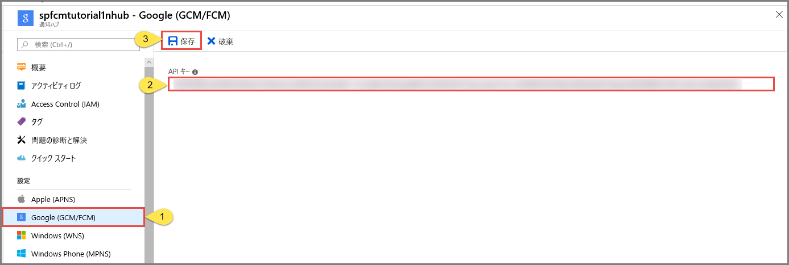

# <a name="tutorial-push-notifications-to-android-devices-by-using-azure-notification-hubs-and-google-firebase-cloud-messaging"></a>チュートリアル:Azure Notification Hubs と Google Firebase Cloud Messaging を使用して Android デバイスにプッシュ通知を送信する

[!INCLUDE [notification-hubs-selector-get-started](../../includes/notification-hubs-selector-get-started.md)]

このチュートリアルでは、Azure Notification Hubs と Firebase Cloud Messaging (FCM) を使用して Android アプリケーションにプッシュ通知を送信する方法を示します。 このチュートリアルでは、Firebase Cloud Messaging (FCM) を使用してプッシュ通知を受信する空の Android アプリケーションを作成します。

このチュートリアルの完成したコードは、[GitHub から](https://github.com/Azure/azure-notificationhubs-android/tree/master/samples/FCMTutorialApp)ダウンロードできます。

このチュートリアルでは、次の手順を実行します。

> [!div class="checklist"]
> * Android Studio プロジェクトを作成します。
> * Firebase Cloud Messaging をサポートする Firebase プロジェクトを作成します。
> * ハブを作成します。
> * そのハブにアプリを接続します。
> * アプリをテストします。

## <a name="prerequisites"></a>前提条件

このチュートリアルを完了するには、アクティブな Azure アカウントが必要です。 アカウントがない場合は、無料試用アカウントを数分で作成することができます。 詳細については、 [Azure の無料試用版サイト](https://azure.microsoft.com/free/)を参照してください。 

次のものも必要です。 

* 最新バージョンの [Android Studio](https://go.microsoft.com/fwlink/?LinkId=389797)
* Android 2.3 以上 (Firebase Cloud Messaging 対応)
* Google Repository リビジョン 27 以上 (Firebase Cloud Messaging 対応)
* Google Play 開発者サービス 9.0.2 以上 (Firebase Cloud Messaging 対応)

このチュートリアルを完了することは、Android アプリの他のすべての Notification Hubs チュートリアルを行うための前提条件です。

## <a name="create-an-android-studio-project"></a>Android Studio プロジェクトを作成する

1. Android Studio を起動します。
2. **[File]\(ファイル\)** を選択し、 **[New]\(新規\)** をポイントして、 **[New Project]\(新しいプロジェクト\)** を選択します。 
2. **[Choose your project]\(プロジェクトの選択\)** ページで、 **[Empty Activity]\(空のアクティビティ\)** を選択してから、 **[Next]\(次へ\)** を選択します。 
3. **[Configure your project]\(プロジェクトの構成\)** ページで、次の手順を実行します。 
    1. アプリケーションの名前を入力します。
    2. プロジェクト ファイルを保存する場所を指定します。 
    3. **[完了]** を選択します。 

        

## <a name="create-a-firebase-project-that-supports-fcm"></a>FCM をサポートする Firebase プロジェクトを作成する

[!INCLUDE [notification-hubs-enable-firebase-cloud-messaging](../../includes/notification-hubs-enable-firebase-cloud-messaging.md)]

## <a name="configure-a-hub"></a>ハブの構成

[!INCLUDE [notification-hubs-portal-create-new-hub](../../includes/notification-hubs-portal-create-new-hub.md)]

### <a name="configure-firebase-cloud-messaging-settings-for-the-hub"></a>Firebase Cloud Messaging の設定をハブ用に構成する

1. 左側のウィンドウの **[Settings]\(設定\)** で、 **[Google (GCM/FCM)]** を選択します。 
2. 前に保存した FCM プロジェクトの**サーバー キー**を入力します。 
3. ツールバーで、 **[Save]\(保存\)** をクリックします。 

    
4. Azure portal に、ハブが正常に更新されたことを示すアラートのメッセージが表示されます。 **[Save]\(保存\)** ボタンが無効になります。 

これで、Firebase Cloud Messaging と連携するようにハブが構成されました。 また、デバイスに通知を送信したり、通知を受信するアプリを登録したりするために必要な接続文字列も取得されました。

## <a id="connecting-app"></a>通知ハブにアプリを接続する

### <a name="add-google-play-services-to-the-project"></a>プロジェクトへの Google Play Services の追加

1. Android Studio で、メニューから **[ツール]** を選択し、 **[SDK Manager]** を選択します。 
2. 自分のプロジェクトで使用される Android SDK のターゲット バージョンを選択します。 次に、 **[パッケージの詳細ページの表示]** を選択します。 

    
3. まだインストールされていない場合は、 **[Google API]** を選択します。

    
4. **[SDK Tools]\(SDK ツール\)** タブに切り替えます。Google Play 開発者サービスをまだインストールしていない場合は、次の図に示すように **[Google Play 開発者サービス]** を選択します。 次に、 **[適用]** をクリックしてインストールします。 SDK のパスは後の手順で使用するので、メモしておいてください。

    
3. **[Confirm Change]\(変更の確認\)** ダイアログ ボックスが表示される場合は、 **[OK]** を選択します。 コンポーネント インストーラーによって、要求したコンポーネントがインストールされます。 コンポーネントがインストールされた後、 **[Finish]\(完了\)** を選択します。
4. **[OK]** を選択して、 **[Settings for New Projects]\(新しいプロジェクトの設定\)** ダイアログ ボックスを閉じます。  
1. AndroidManifest.xml ファイルを開き、次のタグを *application* タグに追加します。

    ```xml
    <meta-data android:name="com.google.android.gms.version"
         android:value="@integer/google_play_services_version" />
    ```


### <a name="add-azure-notification-hubs-libraries"></a>Azure Notification Hubs ライブラリの追加

1. アプリの Build.Gradle ファイルで、dependencies セクションに次の行を追加します。

    ```gradle
    implementation 'com.microsoft.azure:notification-hubs-android-sdk:0.6@aar'
    ```

2. dependencies セクションの後に次のリポジトリを追加します。

    ```gradle
    repositories {
        maven {
            url "https://dl.bintray.com/microsoftazuremobile/SDK"
        }
    }
    ```

### <a name="add-google-firebase-support"></a>Google Firebase のサポートを追加する

1. アプリの Build.Gradle ファイルで、**dependencies** セクションに次の行を追加します (まだ存在しない場合)。 

    ```gradle
    implementation 'com.google.firebase:firebase-core:16.0.8'
    implementation 'com.google.firebase:firebase-messaging:17.3.4'
    ```

2. ファイルの最後に次のプラグインを追加します (まだそこにない場合)。 

    ```gradle
    apply plugin: 'com.google.gms.google-services'
    ```
3. ツール バーの **[Sync Now]\(今すぐ同期\)** を選択します。

### <a name="update-the-androidmanifestxml-file"></a>AndroidManifest.xml ファイルの更新

1. FCM 登録トークンを受信したら、それを使用して [Azure Notification Hubs に登録します](notification-hubs-push-notification-registration-management.md)。 この登録は、`RegistrationIntentService` という名前の `IntentService` を使用してバックグラウンドでサポートします。 また、このサービスは FCM 登録トークンを更新します。 さらに、通知の受信と処理のために、`FirebaseMessagingService` のサブクラスとして `FirebaseService` という名前のクラスを作成し、`onMessageReceived` メソッドをオーバーライドします。 

    次のサービス定義を AndroidManifest.xml ファイルの `<application>` タグ内に追加します。

    ```xml
    <service
        android:name=".RegistrationIntentService"
        android:exported="false">
    </service>
    <service
        android:name=".FirebaseService"
        android:exported="false">
        <intent-filter>
            <action android:name="com.google.firebase.MESSAGING_EVENT" />
        </intent-filter>
    </service>
    ```
3. 次の必要な FCM 関連のアクセス許可を `</application>` タグの下に追加します。

    ```xml
    <uses-permission android:name="android.permission.INTERNET"/>
    <uses-permission android:name="android.permission.GET_ACCOUNTS"/>
    <uses-permission android:name="com.google.android.c2dm.permission.RECEIVE" />
    ```

### <a name="add-code"></a>コードの追加

1. [Project (プロジェクト)] ビューで、 **[app]**  >  **[src]**  >  **[main]**  >  **[java]** の順に展開します。 **[java]** のパッケージ フォルダーを右クリックして、 **[New]\(新規\)** 、 **[Java Class]\(Java クラス\)** の順に選択します。 名前に「**NotificationSettings**」と入力して、 **[OK]** を選択します。

    以下の `NotificationSettings` クラスのコード内にある次の 3 つのプレースホルダーを忘れずに更新してください。

   * **HubListenConnectionString**: ハブの **DefaultListenAccessSignature** 接続文字列。 接続文字列をコピーするには、[Azure portal] のハブにある **[アクセス ポリシー]** をクリックします。
   * **HubName**: [Azure portal] のハブ ページに表示されるハブの名前を使用します。

     `NotificationSettings` のコードは次のとおりです。

        ```java
        public class NotificationSettings {
            public static String HubName = "<Your HubName>";
            public static String HubListenConnectionString = "<Enter your DefaultListenSharedAccessSignature connection string>";
        }
        ```

     > [!IMPORTANT]
     > 先に進む前に、ハブの**名前**と **DefaultListenSharedAccessSignature** を入力します。 

3. `RegistrationIntentService`という名前の別の新しいクラスをプロジェクトに追加します。 このクラスによって、`IntentService` インターフェイスが実装されます。 また、[FCM トークンの更新](https://developers.google.com/instance-id/guides/android-implementation#refresh_tokens)と[通知ハブへの登録](notification-hubs-push-notification-registration-management.md)も処理されます。

    次のコードをこのクラスに使用します。

    ```java
    import android.app.IntentService;
    import android.content.Intent;
    import android.content.SharedPreferences;
    import android.preference.PreferenceManager;
    import android.util.Log;
    import com.google.android.gms.tasks.OnSuccessListener;
    import com.google.firebase.iid.FirebaseInstanceId;
    import com.google.firebase.iid.InstanceIdResult;
    import com.microsoft.windowsazure.messaging.NotificationHub;
    import java.util.concurrent.TimeUnit;

    public class RegistrationIntentService extends IntentService {

        private static final String TAG = "RegIntentService";
        String FCM_token = null;

        private NotificationHub hub;

        public RegistrationIntentService() {
            super(TAG);
        }

        @Override
        protected void onHandleIntent(Intent intent) {

            SharedPreferences sharedPreferences = PreferenceManager.getDefaultSharedPreferences(this);
            String resultString = null;
            String regID = null;
            String storedToken = null;

            try {
                FirebaseInstanceId.getInstance().getInstanceId().addOnSuccessListener(new OnSuccessListener<InstanceIdResult>() { 
                    @Override 
                    public void onSuccess(InstanceIdResult instanceIdResult) { 
                        FCM_token = instanceIdResult.getToken(); 
                        Log.d(TAG, "FCM Registration Token: " + FCM_token); 
                    } 
                }); 
                TimeUnit.SECONDS.sleep(1);

                // Storing the registration ID that indicates whether the generated token has been
                // sent to your server. If it is not stored, send the token to your server.
                // Otherwise, your server should have already received the token.
                if (((regID=sharedPreferences.getString("registrationID", null)) == null)){

                    NotificationHub hub = new NotificationHub(NotificationSettings.HubName,
                            NotificationSettings.HubListenConnectionString, this);
                    Log.d(TAG, "Attempting a new registration with NH using FCM token : " + FCM_token);
                    regID = hub.register(FCM_token).getRegistrationId();

                    // If you want to use tags...
                    // Refer to : https://azure.microsoft.com/documentation/articles/notification-hubs-routing-tag-expressions/
                    // regID = hub.register(token, "tag1,tag2").getRegistrationId();

                    resultString = "New NH Registration Successfully - RegId : " + regID;
                    Log.d(TAG, resultString);

                    sharedPreferences.edit().putString("registrationID", regID ).apply();
                    sharedPreferences.edit().putString("FCMtoken", FCM_token ).apply();
                }

                // Check to see if the token has been compromised and needs refreshing.
                else if ((storedToken=sharedPreferences.getString("FCMtoken", "")) != FCM_token) {

                    NotificationHub hub = new NotificationHub(NotificationSettings.HubName,
                            NotificationSettings.HubListenConnectionString, this);
                    Log.d(TAG, "NH Registration refreshing with token : " + FCM_token);
                    regID = hub.register(FCM_token).getRegistrationId();

                    // If you want to use tags...
                    // Refer to : https://azure.microsoft.com/documentation/articles/notification-hubs-routing-tag-expressions/
                    // regID = hub.register(token, "tag1,tag2").getRegistrationId();

                    resultString = "New NH Registration Successfully - RegId : " + regID;
                    Log.d(TAG, resultString);

                    sharedPreferences.edit().putString("registrationID", regID ).apply();
                    sharedPreferences.edit().putString("FCMtoken", FCM_token ).apply();
                }

                else {
                    resultString = "Previously Registered Successfully - RegId : " + regID;
                }
            } catch (Exception e) {
                Log.e(TAG, resultString="Failed to complete registration", e);
                // If an exception happens while fetching the new token or updating registration data
                // on a third-party server, this ensures that we'll attempt the update at a later time.
            }

            // Notify UI that registration has completed.
            if (MainActivity.isVisible) {
                MainActivity.mainActivity.ToastNotify(resultString);
            }
        }
    }
    ```

4. `MainActivity` クラスで、クラス宣言の上に次の `import` ステートメントを追加します。

    ```java
    import com.google.android.gms.common.ConnectionResult;
    import com.google.android.gms.common.GoogleApiAvailability;
    import android.content.Intent;
    import android.util.Log;
    import android.widget.TextView;
    import android.widget.Toast;
    ```

5. クラスの先頭に次のメンバーを追加します。 これらのフィールドは、[Google の推奨に従って Google Play 開発者サービスの可用性をチェックする](https://developers.google.com/android/guides/setup#ensure_devices_have_the_google_play_services_apk)ために使用します。

    ```java
    public static MainActivity mainActivity;
    public static Boolean isVisible = false;
    private static final String TAG = "MainActivity";
    private static final int PLAY_SERVICES_RESOLUTION_REQUEST = 9000;
    ```

6. `MainActivity` クラスに、Google Play 開発者サービスが利用可能かどうかを確認する次のメソッドを追加します。

    ```java
    /**
    * Check the device to make sure it has the Google Play Services APK. If
    * it doesn't, display a dialog box that enables  users to download the APK from
    * the Google Play Store or enable it in the device's system settings.
    */

    private boolean checkPlayServices() {
        GoogleApiAvailability apiAvailability = GoogleApiAvailability.getInstance();
        int resultCode = apiAvailability.isGooglePlayServicesAvailable(this);
        if (resultCode != ConnectionResult.SUCCESS) {
            if (apiAvailability.isUserResolvableError(resultCode)) {
                apiAvailability.getErrorDialog(this, resultCode, PLAY_SERVICES_RESOLUTION_REQUEST)
                        .show();
            } else {
                Log.i(TAG, "This device is not supported by Google Play Services.");
                ToastNotify("This device is not supported by Google Play Services.");
                finish();
            }
            return false;
        }
        return true;
    }
    ```

7. `MainActivity` クラスに次のコードを追加します。このコードは、Google Play 開発者サービスを確認してから、`IntentService` を呼び出して FCM 登録トークンを取得し、ハブに登録します。

    ```java
    public void registerWithNotificationHubs()
    {
        if (checkPlayServices()) {
            // Start IntentService to register this application with FCM.
            Intent intent = new Intent(this, RegistrationIntentService.class);
            startService(intent);
        }
    }
    ```

8. `MainActivity` クラスの `OnCreate` メソッドで、アクティビティの作成時に登録プロセスを開始するために次のコードを追加します。

    ```java
    @Override
    protected void onCreate(Bundle savedInstanceState) {
        super.onCreate(savedInstanceState);
        setContentView(R.layout.activity_main);

        mainActivity = this;
        registerWithNotificationHubs();
        FirebaseService.createChannelAndHandleNotifications(getApplicationContext());
    }
    ```

9. アプリの状態を確認してアプリ内で報告するには、次の追加メソッドを `MainActivity` に追加します。

    ```java
    @Override
    protected void onStart() {
        super.onStart();
        isVisible = true;
    }

    @Override
    protected void onPause() {
        super.onPause();
        isVisible = false;
    }

    @Override
    protected void onResume() {
        super.onResume();
        isVisible = true;
    }

    @Override
    protected void onStop() {
        super.onStop();
        isVisible = false;
    }

    public void ToastNotify(final String notificationMessage) {
        runOnUiThread(new Runnable() {
            @Override
            public void run() {
                Toast.makeText(MainActivity.this, notificationMessage, Toast.LENGTH_LONG).show();
                TextView helloText = (TextView) findViewById(R.id.text_hello);
                helloText.setText(notificationMessage);
            }
        });
    }
    ```

10. `ToastNotify` メソッドでは "*Hello World*" `TextView` コントロールを使用し、アプリで状態と通知を継続的に報告します。 **res** > **layout** > **activity_main.xml** レイアウトで、そのコントロールに次の ID を追加します。

    ```java
    android:id="@+id/text_hello"
    ```

11. 次に、AndroidManifest.xml で定義したレシーバーのサブクラスを追加します。 `FirebaseService`という名前の別の新しいクラスをプロジェクトに追加します。

12. 次の import ステートメントを `FirebaseService.java` の先頭に追加します。

    ```java
    import com.google.firebase.messaging.FirebaseMessagingService;
    import com.google.firebase.messaging.RemoteMessage;
    import android.util.Log;
    import android.app.NotificationChannel;
    import android.app.NotificationManager;
    import android.app.PendingIntent;
    import android.content.Context;
    import android.content.Intent;
    import android.media.RingtoneManager;
    import android.net.Uri;
    import android.os.Build;
    import android.os.Bundle;
    import android.support.v4.app.NotificationCompat;
    ```

13. `FirebaseService` クラス用に次のコードを追加して、`FirebaseMessagingService` のサブクラスにします。

    このコードでは `onMessageReceived` メソッドをオーバーライドし、受信した通知をレポートします。 また、`sendNotification()` メソッドを使用して Android の通知マネージャーにプッシュ通知を送信します。 アプリが動作していないときに通知を受信した場合は、`sendNotification()` メソッドを呼び出します。

    ```java
    public class FirebaseService extends FirebaseMessagingService
    {
        private String TAG = "FirebaseService";
    
        public static final String NOTIFICATION_CHANNEL_ID = "nh-demo-channel-id";
        public static final String NOTIFICATION_CHANNEL_NAME = "Notification Hubs Demo Channel";
        public static final String NOTIFICATION_CHANNEL_DESCRIPTION = "Notification Hubs Demo Channel";
    
        public static final int NOTIFICATION_ID = 1;
        private NotificationManager mNotificationManager;
        NotificationCompat.Builder builder;
        static Context ctx;
    
        @Override
        public void onMessageReceived(RemoteMessage remoteMessage) {
            // ...
    
            // TODO(developer): Handle FCM messages here.
            // Not getting messages here? See why this may be: https://goo.gl/39bRNJ
            Log.d(TAG, "From: " + remoteMessage.getFrom());
    
            String nhMessage;
            // Check if message contains a notification payload.
            if (remoteMessage.getNotification() != null) {
                Log.d(TAG, "Message Notification Body: " + remoteMessage.getNotification().getBody());
    
                nhMessage = remoteMessage.getNotification().getBody();
            }
            else {
                nhMessage = remoteMessage.getData().values().iterator().next();
            }
    
            // Also if you intend on generating your own notifications as a result of a received FCM
            // message, here is where that should be initiated. See sendNotification method below.
            if (MainActivity.isVisible) {
                MainActivity.mainActivity.ToastNotify(nhMessage);
            }
            sendNotification(nhMessage);
        }
    
        private void sendNotification(String msg) {
    
            Intent intent = new Intent(ctx, MainActivity.class);
            intent.addFlags(Intent.FLAG_ACTIVITY_CLEAR_TOP);
    
            mNotificationManager = (NotificationManager)
                    ctx.getSystemService(Context.NOTIFICATION_SERVICE);
    
            PendingIntent contentIntent = PendingIntent.getActivity(ctx, 0,
                    intent, PendingIntent.FLAG_ONE_SHOT);
    
            Uri defaultSoundUri = RingtoneManager.getDefaultUri(RingtoneManager.TYPE_NOTIFICATION);
            NotificationCompat.Builder notificationBuilder = new NotificationCompat.Builder(
                    ctx,
                    NOTIFICATION_CHANNEL_ID)
                    .setContentText(msg)
                    .setPriority(NotificationCompat.PRIORITY_HIGH)
                    .setSmallIcon(android.R.drawable.ic_popup_reminder)
                    .setBadgeIconType(NotificationCompat.BADGE_ICON_SMALL);
    
            notificationBuilder.setContentIntent(contentIntent);
            mNotificationManager.notify(NOTIFICATION_ID, notificationBuilder.build());
        }
    
        public static void createChannelAndHandleNotifications(Context context) {
            ctx = context;
    
            if (Build.VERSION.SDK_INT >= Build.VERSION_CODES.O) {
                NotificationChannel channel = new NotificationChannel(
                        NOTIFICATION_CHANNEL_ID,
                        NOTIFICATION_CHANNEL_NAME,
                        NotificationManager.IMPORTANCE_HIGH);
                channel.setDescription(NOTIFICATION_CHANNEL_DESCRIPTION);
                channel.setShowBadge(true);
    
                NotificationManager notificationManager = context.getSystemService(NotificationManager.class);
                notificationManager.createNotificationChannel(channel);
             }
        }
    }
    ```

14. Android Studio のメニュー バーで、 **[Build]\(ビルド\)**  >  **[Rebuild Project]\(プロジェクトのリビルド\)** の順に選択し、コードにエラーがないことを確認します。 `ic_launcher` アイコンに関するエラーが発生する場合は、AndroidManifest.xml ファイルから次のステートメントを削除します。 

    ```
        android:icon="@mipmap/ic_launcher"
    ```
15. お使いのデバイスでアプリを実行し、そのアプリがハブに正常に登録されることを確認します。

    > [!NOTE]
    > インスタンス ID サービスの `onTokenRefresh()` メソッドが呼び出されるまでは、初期起動時に登録が失敗する場合があります。 更新すると、通知ハブに正常に登録されるようになります。

    

## <a name="test-send-notification-from-the-notification-hub"></a>通知ハブから通知をテスト送信する

次の手順を実行することで、[Azure portal] からプッシュ通知を送信できます。

1. Azure portal 内のお使いのハブの [Notification Hub] ページで、 **[トラブルシューティング]** セクションの **[テスト送信]** を選択します。
3. **[プラットフォーム]** として、 **[Android]** を選択します。
4. **[送信]** を選択します。  Android デバイス上でモバイル アプリを実行していないため、まだそのデバイスに通知は表示されません。 モバイル アプリを実行したら、再度 **[送信]** ボタンを選択して通知メッセージを表示します。
5. 一番下の一覧にある操作の結果を確認します。

    
6. デバイスに通知メッセージが表示されます。 

    
    

[!INCLUDE [notification-hubs-sending-notifications-from-the-portal](../../includes/notification-hubs-sending-notifications-from-the-portal.md)]

### <a name="run-the-mobile-app-on-emulator"></a>エミュレーターでモバイル アプリを実行する
エミュレーターの内部でプッシュ通知をテストする前に、エミュレーター イメージがアプリ用に選択した Google API レベルをサポートしていることを確認してください。 イメージでネイティブの Google API がサポートされていない場合、**SERVICE\_NOT\_AVAILABLE** 例外を受け取ることがあります。

また、 **[設定]**  >  **[アカウント]** で、実行中のエミュレーターに Google アカウントを追加したことを確認してください。 そうでない場合、FCM で登録しようとすると、**AUTHENTICATION\_FAILED** 例外が発生する可能性があります。

## <a name="next-steps"></a>次の手順
このチュートリアルでは、Firebase Cloud Messaging を使用して、このサービスに登録されたすべての Android デバイスに通知をブロードキャストしました。 特定のデバイスにプッシュ通知を送信する方法を学習するには、次のチュートリアルに進んでください。

> [!div class="nextstepaction"]
>[チュートリアル:特定の Android デバイスにプッシュ通知を送信する](push-notifications-android-specific-devices-firebase-cloud-messaging.md)

<!-- Images. -->

<!-- URLs. -->
[Get started with push notifications in Mobile Services]: ../mobile-services-javascript-backend-android-get-started-push.md  
[Mobile Services Android SDK]: https://go.microsoft.com/fwLink/?LinkID=280126&clcid=0x409
[Referencing a library project]: https://go.microsoft.com/fwlink/?LinkId=389800
[Notification Hubs Guidance]: notification-hubs-push-notification-overview.md
[Azure Portal]: https://portal.azure.com
