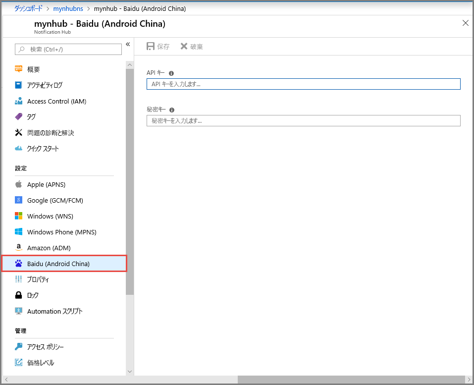
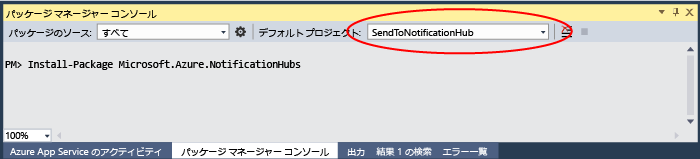

# <a name="get-started-with-notification-hubs-using-baidu"></a>Baidu での Notification Hubs の使用
[!INCLUDE [notification-hubs-selector-get-started](../../includes/notification-hubs-selector-get-started.md)]

Baidu クラウド プッシュは、プッシュ通知をモバイル デバイスに送信するために使用することのできる中国のクラウド サービスです。 

Google Play と FCM (Firebase Cloud Messaging) は中国では利用できないため、別のアプリ ストアとプッシュ サービスを使用する必要があります。 Baidu はその 1 つで、現在 Notification Hub で使用されています。

## <a name="prerequisites"></a>前提条件
このチュートリアルには、次のものが必要です。

* Android SDK (Android Studio を使用することが前提)。<a href="http://go.microsoft.com/fwlink/?LinkId=389797">Android サイト</a>からダウンロードできます。
* [Baidu Push Android SDK]

> [!NOTE]
> このチュートリアルを完了するには、アクティブな Azure アカウントが必要です。 アカウントがない場合は、無料試用アカウントを数分で作成することができます。 詳細については、 [Azure の無料試用版サイト](https://azure.microsoft.com/pricing/free-trial/?WT.mc_id=A0E0E5C02&amp;returnurl=http%3A%2F%2Fazure.microsoft.com%2Fen-us%2Fdocumentation%2Farticles%2Fnotification-hubs-baidu-get-started%2F)を参照してください。
> 
> 

## <a name="create-a-baidu-account"></a>Baidu アカウントを作成する
Baidu を使用するには、Baidu アカウントが必要です。 既にアカウントを持っている場合は、 [Baidu ポータル] にログインし、次の手順にスキップします。 アカウントを持っていない場合は、Baidu アカウントの作成方法に関する次の手順を参照してください。  

1. [Baidu ポータル]で **[登录]** (**ログイン**) のリンクをクリックします。 **[立即注册]** \(**今すぐ登録する**\) をクリックしてアカウントの登録プロセスを開始します。
   
    

2. 電話番号/電子メール アドレス、パスワード、認証コードなどの必要情報を入力し、[注册]\(**サインアップ**\) をクリックします。
   
    

3. 入力した電子メール アドレスに、Baidu アカウントをアクティブ化するためのリンクが記載された電子メールが届きます。
   
    

4. 電子メール アカウントにログインし、Baidu のアクティブ化メールを開き、リンクをクリックして Baidu アカウントをアクティブ化します。
   
    

アクティブ化した Baidu アカウントを取得したら、 [Baidu ポータル]にログインします。

## <a name="create-a-baidu-cloud-push-project"></a>Baidu クラウド プッシュ プロジェクトを作成する
Baidu クラウド プッシュ プロジェクトを作成すると、アプリケーション ID、API キー、およびシークレット キーが届きます。

1. [Baidu ポータル]にログインしたら、**[更多>>]** (**詳細**) をクリックします。
   
    

2. **[站长与开发者服务]** \(**Web 管理者および開発者向けサービス**\) セクションを下へスクロールし、**[百度云推送]** \(**Baidu クラウド プッシュ**\) をクリックします。
   
    

3. 次のページで、右上隅にある **[登录]** \(**ログイン**\) をクリックします。
   
    

4. 次に、このページの **[创建应用]** \(**アプリケーションの作成**\) をクリックします。

    

5. 次のページで、[创建新应用]\(**新しいアプリケーションの作成**\) をクリックします。
   
    

6. アプリケーション名を入力し、[创建]\(**作成**\) をクリックします。
   
    

7. Baidu クラウド プッシュ プロジェクトが正常に作成されると、**AppID**、**API キー**、**シークレット キー**を含むページが表示されます。 API キーとシークレット キーは後で使用するので書き留めておきます。
   
    

8. 左側のウィンドウで [创建通知]\(**通知の作成**\) をクリックし、プッシュ通知用のプロジェクトを構成します。
   
    


## <a name="configure-a-new-notification-hub"></a>新しい Notification Hub を構成する
[!INCLUDE [notification-hubs-portal-create-new-hub](../../includes/notification-hubs-portal-create-new-hub.md)]


&emsp;&emsp;6. 通知ハブで **[Notification Services]** を選択し、**[Baidu (Android China)]** を選択します。

&emsp;&emsp;

&emsp;&emsp;7. 下へスクロールして Baidu 通知設定セクションに移動します。 Baidu コンソールから取得した API キーとシークレット キーを Baidu クラウド プッシュ プロジェクトに入力します。 その後、[保存] をクリックします。

&emsp;&emsp;

これで、通知ハブが Baidu と連携するように構成されました。 また、アプリを登録してプッシュ通知を送受信するための**接続文字列**も得られました。

[接続情報へのアクセス] ウィンドウの `DefaultListenSharedAccessSignature` と `DefaultFullSharedAccessSignature` を書き留めておいてください。

## <a name="connect-your-app-to-the-notification-hub"></a>通知ハブにアプリケーションを接続する
1. Android Studio で新しい Android プロジェクトを作成 ([File]\(ファイル\)、[New]\(新規\)、[New Project]\(新しいプロジェクト\) の順に選択) します。

    

2.  アプリケーション名を入力し、最小必須 SDK のバージョンが API 16: Android 4.1 に設定されていることを確認します。 **また、パッケージ名 (应用包名) が Baidu クラウド プッシュ ポータルでの名前と一致していることも確認してください。**

    
    

3.  [Next]\(次へ\) をクリックし、[Create Activity]\(アクティビティの作成\) ウィンドウが表示されるまでウィザードに従います。 [Empty Activity]\(空のアクティビティ\) が選択されていることを確認し、最後に [Finish]\(完了\) を選択して新しい Android アプリケーションを作成します。

    

4.  プロジェクト ビルド ターゲットが正しく設定されていることを確認します。

5.  次に、Azure Notification Hubs ライブラリを追加します。 アプリの `Build.Gradle` ファイルの dependencies セクションに次の行を追加します。

    ```javascript
    compile 'com.microsoft.azure:notification-hubs-android-sdk:0.4@aar'
    compile 'com.microsoft.azure:azure-notifications-handler:1.0.1@aar'
    ```

    dependencies セクションの後に次のリポジトリを追加します。

    ```javascript
    repositories {
        maven {
            url "http://dl.bintray.com/microsoftazuremobile/SDK"
        }
    }
    ```

    リストの競合を防ぐために、**Manifest.xml** に次のコードを追加する必要があります。

    ```xml
    <manifest package="YOUR.PACKAGE.NAME"
    xmlns:tools="http://schemas.android.com/tools"
    xmlns:android="http://schemas.android.com/apk/res/android">
    ```

    また、`<application/>` タグには、次のコードを追加します。

    ```xml
    <application
        tools:replace="android:allowBackup,icon,theme,label">
    ```

6.  [Baidu Push Android SDK] をダウンロードして解凍します。 libs フォルダー内の `pushservice-x.y.z jar` ファイルをコピーします。 さらに、`.so` ファイルを Android アプリケーションの `src/main/jniLibs` フォルダー (新しいフォルダーを作成してください) にコピーします。

    

7. libs フォルダー内の pushervice-x.y.z.jar ファイルを右クリックし、[Add as Library]\(ライブラリとして追加\) をクリックしてこのライブラリをプロジェクトに追加します。

    

8. Android プロジェクトの **AndroidManifest.xml** ファイルを開き、Baidu SDK に必要なアクセス許可を追加します。 **`YOURPACKAGENAME` は実際のパッケージ名に置き換えてください**。

    ```xml
    <uses-permission android:name="android.permission.INTERNET" />
    <uses-permission android:name="android.permission.READ_PHONE_STATE" />
    <uses-permission android:name="android.permission.ACCESS_NETWORK_STATE" />
    <uses-permission android:name="android.permission.RECEIVE_BOOT_COMPLETED" />
    <uses-permission android:name="android.permission.WRITE_SETTINGS" />
    <uses-permission android:name="android.permission.VIBRATE" />
    <uses-permission android:name="android.permission.WRITE_EXTERNAL_STORAGE" />
    <uses-permission android:name="android.permission.DISABLE_KEYGUARD" />
    <uses-permission android:name="android.permission.ACCESS_COARSE_LOCATION" />
    <uses-permission android:name="android.permission.ACCESS_WIFI_STATE" />
    <uses-permission android:name="android.permission.ACCESS_DOWNLOAD_MANAGER" />
    <uses-permission android:name="android.permission.DOWNLOAD_WITHOUT_NOTIFICATION" />
    <uses-permission android:name="android.permission.EXPAND_STATUS_BAR" />
    !! <uses-permission android:name="baidu.push.permission.WRITE_PUSHINFOPROVIDER.YOURPACKAGENAME" />
    !!<permission android:name="baidu.push.permission.WRITE_PUSHINFOPROVIDER.YOURPACKAGENAME"android:protectionLevel="normal" />

    ```

9. application 要素内で、`.MainActivity` アクティビティ要素の後に次の構成を追加し、*yourprojectname* を置き換えます (例: `com.example.BaiduTest`)。

    ```xml
    <activity
        android:name="com.baidu.android.pushservice.richmedia.MediaViewActivity"
        android:configChanges="orientation|keyboardHidden"
        android:label="MediaViewActivity" />
    <activity
        android:name="com.baidu.android.pushservice.richmedia.MediaListActivity"
        android:configChanges="orientation|keyboardHidden"
        android:label="MediaListActivity"
        android:launchMode="singleTask" />
 
    <!-- Push application definition message -->
    <receiver android:name=".MyPushMessageReceiver">
        <intent-filter>

            <!-- receive push message-->
            <action android:name="com.baidu.android.pushservice.action.MESSAGE" />
            <!-- receive bind,unbind,fetch,delete.. message-->
            <action android:name="com.baidu.android.pushservice.action.RECEIVE" />
            <action android:name="com.baidu.android.pushservice.action.notification.CLICK" />
        </intent-filter>
    </receiver>

    <receiver
        android:name="com.baidu.android.pushservice.PushServiceReceiver"
        android:process=":bdservice_v1">
        <intent-filter>
            <action android:name="android.intent.action.BOOT_COMPLETED" />
            <action android:name="android.net.conn.CONNECTIVITY_CHANGE" />
            <action android:name="com.baidu.android.pushservice.action.notification.SHOW" />
            <action android:name="com.baidu.android.pushservice.action.media.CLICK" />
            <action android:name="android.intent.action.MEDIA_MOUNTED" />
            <action android:name="android.intent.action.USER_PRESENT" />
            <action android:name="android.intent.action.ACTION_POWER_CONNECTED" />
            <action android:name="android.intent.action.ACTION_POWER_DISCONNECTED" />
        </intent-filter>
    </receiver>

    <receiver
        android:name="com.baidu.android.pushservice.RegistrationReceiver"
        android:process=":bdservice_v1">
        <intent-filter>
            <action android:name="com.baidu.android.pushservice.action.METHOD" />
            <action android:name="com.baidu.android.pushservice.action.BIND_SYNC" />
        </intent-filter>
        <intent-filter>
            <action android:name="android.intent.action.PACKAGE_REMOVED" />

            <data android:scheme="package" />
        </intent-filter>
    </receiver>

    <service
        android:name="com.baidu.android.pushservice.PushService"
        android:exported="true"
        android:process=":bdservice_v1">
        <intent-filter>
            <action android:name="com.baidu.android.pushservice.action.PUSH_SERVICE" />
        </intent-filter>
    </service>

    <service
        android:name="com.baidu.android.pushservice.CommandService"
        android:exported="true" />

    <!-- Adapt the ContentProvider declaration required for the Android N system, and the write permissions include the application package name-->
    <provider
        android:name="com.baidu.android.pushservice.PushInfoProvider"
        android:authorities="com.baidu.push.example.bdpush"
        android:exported="true"
        android:protectionLevel="signature"
        android:writePermission="baidu.push.permission.WRITE_PUSHINFOPROVIDER. yourprojectname  " />

    <!-- API Key of the Baidu application -->
    <meta-data
        android:name="api_key"
        !!   android:value="api_key" />
    </application>
    ```

10. `ConfigurationSettings.java` という新しいクラスをプロジェクトに追加します。

    ```java
    public class ConfigurationSettings {
        public static String API_KEY = "...";
        public static String NotificationHubName = "...";
        public static String NotificationHubConnectionString = "...";
    }
    ```
    
    Baidu クラウド プロジェクトからの API_KEY を使用して `API_KEY` 文字列の値を設定します。
    
    [Azure Portal] から得られる実際の通知ハブ名を使用して `NotificationHubName` 文字列の値を設定します。次に、[Azure Portal] から得られる `DefaultListenSharedAccessSignature` を使用して `NotificationHubConnectionString` を設定してください。

11. MainActivity.java を開き、onCreate メソッドに次のコードを追加します。

    ```java
    PushManager.startWork(this, PushConstants.LOGIN_TYPE_API_KEY,  API_KEY );
    ```

12. `MyPushMessageReceiver.java` という名前の新しいクラスを追加し、それに次のコードを追加します。 これは、Baidu プッシュ サーバーから受信したプッシュ通知を処理するクラスです。

    ```java
    package your.package.name;

    import android.content.Context;
    import android.content.Intent;
    import android.os.AsyncTask;
    import android.text.TextUtils;
    import android.util.Log;

    import com.baidu.android.pushservice.PushMessageReceiver;
    import com.microsoft.windowsazure.messaging.NotificationHub;
    import org.json.JSONException;
    import org.json.JSONObject;

    import java.util.List;

    public class MyPushMessageReceiver extends PushMessageReceiver {

        public static final String TAG = MyPushMessageReceiver.class
                .getSimpleName();
        public static NotificationHub hub = null;
        public static String mChannelId, mUserId;

        @Override
        public void onBind(Context context, int errorCode, String appid,
                        String userId, String channelId, String requestId) {
            String responseString = "onBind errorCode=" + errorCode + " appid="
                    + appid + " userId=" + userId + " channelId=" + channelId
                    + " requestId=" + requestId;
            Log.d(TAG, responseString);

            if (errorCode == 0) {
                // Binding successful
                Log.d(TAG, " Binding successful");
            }
            try {
                if (hub == null) {
                    hub = new NotificationHub(
                            ConfigurationSettings.NotificationHubName,
                            ConfigurationSettings.NotificationHubConnectionString,
                            context);
                    Log.i(TAG, "Notification hub initialized");
                }
            } catch (Exception e) {
                Log.e(TAG, e.getMessage());
            }
            mChannelId = channelId;
            mUserId = userId;

            registerWithNotificationHubs();
        }
        private void registerWithNotificationHubs() {

            new AsyncTask<Void, Void, Void>() {
                @Override
                protected Void doInBackground(Void... params) {
                    try {
                        hub.registerBaidu(mUserId, mChannelId);
                        Log.i(TAG, "Registered with Notification Hub - '"
                                + ConfigurationSettings.NotificationHubName + "'"
                                + " with UserId - '"
                                + mUserId + "' and Channel Id - '"
                                + mChannelId + "'");
                    } catch (Exception e) {
                        Log.e(TAG, e.getMessage());
                    }
                    return null;
                }
            }.execute(null, null, null);
        }

        @Override
        public void onMessage(Context context, String message,
                            String customContentString) {
            String messageString = " onMessage=\"" + message
                    + "\" customContentString=" + customContentString;
            Log.d(TAG, messageString);
            if (!TextUtils.isEmpty(customContentString)) {
                JSONObject customJson = null;
                try {
                    customJson = new JSONObject(customContentString);
                    String myvalue = null;
                    if (!customJson.isNull("mykey")) {
                        myvalue = customJson.getString("mykey");
                    }
                } catch (JSONException e) {
                    e.printStackTrace();
                }
            }

        }

        @Override
        public void onNotificationArrived(Context context, String title, String description, String customContentString) {
            String notifyString = " Notice Arrives onNotificationArrived  title=\"" + title
                    + "\" description=\"" + description + "\" customContent="
                    + customContentString;
            Log.d(TAG, notifyString);
            if (!TextUtils.isEmpty(customContentString)) {
                JSONObject customJson = null;
                try {
                    customJson = new JSONObject(customContentString);
                    String myvalue = null;
                    if (!customJson.isNull("mykey")) {
                        myvalue = customJson.getString("mykey");
                    }
                } catch (JSONException e) {
                    // TODO Auto-generated catch block
                    e.printStackTrace();
                }
            }
        }

        @Override
        public void onNotificationClicked(Context context, String title, String description, String customContentString) {
            String notifyString = " onNotificationClicked title=\"" + title + "\" description=\""
                    + description + "\" customContent=" + customContentString;
            Log.d(TAG, notifyString);
            Intent intent = new Intent(context.getApplicationContext(),MainActivity.class);
            intent.putExtra("title",title);
            intent.putExtra("description",description);
            intent.putExtra("isFromNotify",true);
            intent.addFlags(Intent.FLAG_ACTIVITY_NEW_TASK);
            context.getApplicationContext().startActivity(intent);

        }

        @Override
        public void onSetTags(Context context, int errorCode,
                            List<String> successTags, List<String> failTags, String requestId) {
            String responseString = "onSetTags errorCode=" + errorCode
                    + " successTags=" + successTags + " failTags=" + failTags
                    + " requestId=" + requestId;
            Log.d(TAG, responseString);

        }

        @Override
        public void onDelTags(Context context, int errorCode,
                            List<String> successTags, List<String> failTags, String requestId) {
            String responseString = "onDelTags errorCode=" + errorCode
                    + " successTags=" + successTags + " failTags=" + failTags
                    + " requestId=" + requestId;
            Log.d(TAG, responseString);

        }

        @Override
        public void onListTags(Context context, int errorCode, List<String> tags,
                            String requestId) {
            String responseString = "onListTags errorCode=" + errorCode + " tags="
                    + tags;
            Log.d(TAG, responseString);

        }

        @Override
        public void onUnbind(Context context, int errorCode, String requestId) {
            String responseString = "onUnbind errorCode=" + errorCode
                    + " requestId = " + requestId;
            Log.d(TAG, responseString);

            if (errorCode == 0) {
                // Unbinding is successful
                Log.d(TAG, " Unbinding is successful ");
            }
        }
    }
    ```

## <a name="send-notifications-to-your-app"></a>アプリケーションに通知を送信する

以下の画面に示すように、通知ハブの構成画面にある **[送信]** ボタンを使用して、[Azure Portal] から通知の受信テストをすばやく行うことができます。


プッシュ通知は通常、互換性のあるライブラリを使用して Mobile Services などのバックエンド サービスや ASP.NET に送信されます。 バックエンドでライブラリを利用できない場合、REST API を直接使用して通知メッセージを送信できます。

このチュートリアルでは、単純化するために、.NET SDK で通知を送信する方法のデモンストレーションとしてコンソール アプリを使用しています。 ただし、ASP.NET バックエンドから通知を送信するには、次のステップとして [Notification Hubs を使用したユーザーへのプッシュ通知](notification-hubs-aspnet-backend-windows-dotnet-wns-notification.md)に関するページを参照することをお勧めします。 

通知を送信するためのさまざまな手法を次に示します。
* **REST インターフェイス**: [REST インターフェイス](http://msdn.microsoft.com/library/windowsazure/dn223264.aspx)を使用すると、任意のバックエンド プラットフォームの通知をサポートできます。
* **Microsoft Azure Notification Hubs .NET SDK**: Nuget Package Manager for Visual Studio で、 [Install-Package Microsoft.Azure.NotificationHubs](https://www.nuget.org/packages/Microsoft.Azure.NotificationHubs/)を実行します。
* **Node.js**: [Node.js から Notification Hubs を使用する方法](notification-hubs-nodejs-push-notification-tutorial.md)。
* **Mobile Apps**: Notification Hubs に統合されている Azure App Service Mobile Apps のバックエンドから通知を送信する方法の例については、[モバイル アプリにプッシュ通知を追加](../app-service-mobile/app-service-mobile-windows-store-dotnet-get-started-push.md)する方法を説明したページを参照してください。
* **Java / PHP**: REST API を使用した通知の送信方法の例については、「Java/PHP から Notification Hubs を使用する方法」([Java](notification-hubs-java-push-notification-tutorial.md)  |  [PHP](notification-hubs-php-push-notification-tutorial.md)) を参照してください。

## <a name="optional-send-notifications-from-a-net-console-app"></a>(省略可能) .NET コンソール アプリケーションから通知を送信する
このセクションでは、.NET コンソール アプリケーションを使用した通知の送信方法について説明します。

1. Visual C# の新しいコンソール アプリケーションを作成します。
   
    

2. パッケージ マネージャー コンソール ウィンドウで **[既定のプロジェクト]** に新しいコンソール アプリケーション プロジェクトを設定した後、そのコンソール ウィンドウから次のコマンドを実行します。
   
        Install-Package Microsoft.Azure.NotificationHubs
   
    この手順により、<a href="http://www.nuget.org/packages/Microsoft.Azure.NotificationHubs/">Microsoft.Azure.Notification Hubs NuGet パッケージ</a>を利用して Azure Notification Hubs SDK に参照が追加されます。
   
    

3. `Program.cs` ファイルを開き、次の using ステートメントを追加します。
   
    ```csharp
    using Microsoft.Azure.NotificationHubs;
    ```

4. `Program` クラスに次のメソッドを追加し、`DefaultFullSharedAccessSignatureSASConnectionString` と `NotificationHubName` を実際の値に置き換えます。
   
    ```csharp
    private static async void SendNotificationAsync()
    {
        NotificationHubClient hub = NotificationHubClient.CreateClientFromConnectionString("DefaultFullSharedAccessSignatureSASConnectionString", "NotificationHubName");
        string message = "{\"title\":\"((Notification title))\",\"description\":\"Hello from Azure\"}";
        var result = await hub.SendBaiduNativeNotificationAsync(message);
    }
    ```

5. `Main` メソッド内に次の行を追加します。

    ```csharp
    SendNotificationAsync();
    Console.ReadLine();
    ```

## <a name="test-your-app"></a>アプリをテストする

実際の電話でこのアプリケーションをテストする場合は、USB ケーブルを使用してコンピューターに電話を接続するだけです。 この操作によって、接続した電話にアプリケーションが読み込まれます。

エミュレーターでこのアプリをテストするには、上部の Android Studio ツール バーで **[Run]\(実行\)** をクリックし、アプリを選択します。エミュレーターが起動され、アプリが読み込まれて実行されます。

アプリが Baidu プッシュ通知サービスから `userId` と `channelId` を取得し、通知ハブに登録します。

テスト通知は、[Azure Portal] の [デバッグ] タブを使用して送信できます。 Visual Studio で .Net コンソール アプリケーションを作成する場合、Visual Studio で F5 キーを押してアプリケーションを実行します。 アプリケーションから通知が送信され、デバイスまたはエミュレーターの上部の通知領域に表示されます。

<!-- URLs. -->
[Mobile Services Android SDK]: https://go.microsoft.com/fwLink/?LinkID=280126&clcid=0x409
[Baidu Push Android SDK]: http://push.baidu.com/sdk/push_client_sdk_for_android
[Azure Portal]: https://portal.azure.com/
[Baidu ポータル]: http://www.baidu.com/
